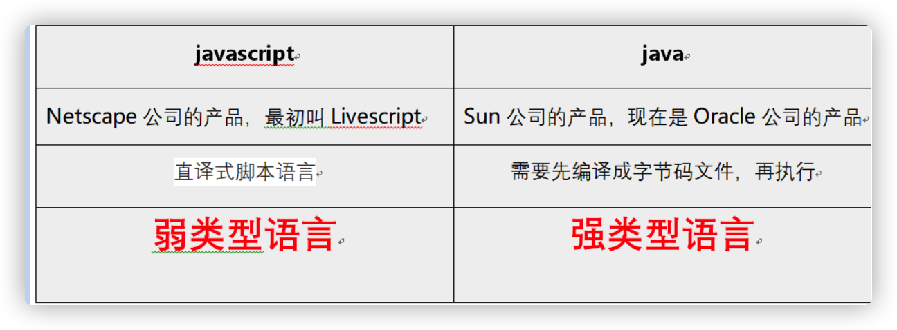
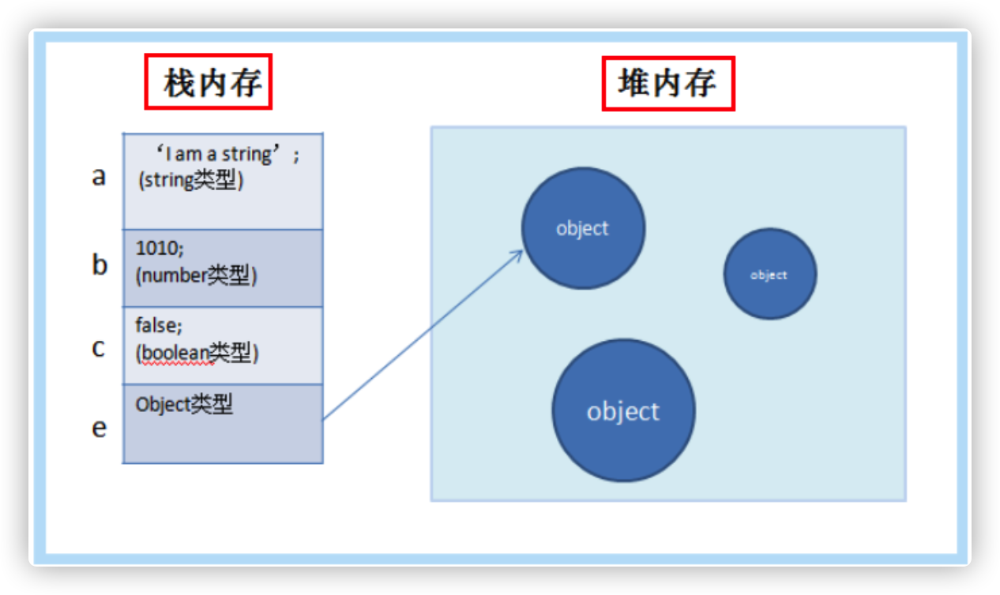
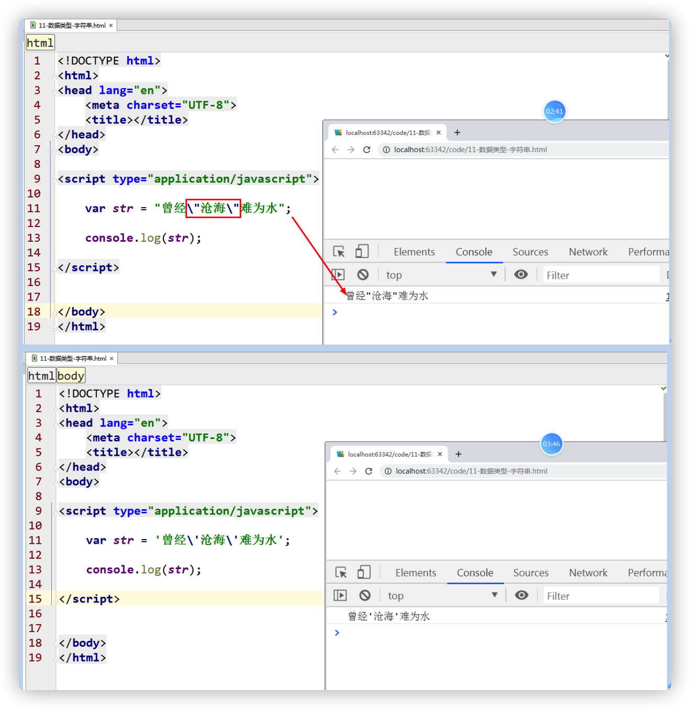

<div align="center"><h1>初识javascript
## 引导

### 主要内容：


### 学习目标：

| 节数                                     | 知识点               | 要求 |
| ---------------------------------------- | -------------------- | ---- |
| 第一节（js的前世今生）             | js简介               | 了解 |
| 第二节（js的语法结构）            | 页面引入js的几种方式 | 了解 |
|                                          | js输出的几种方式     | 了解 |
|                                          | js的语法规则         | 了解 |
| 第三节（Javascript名词解释）             | 数字字面量           | 掌握 |
|                                          | 字符串字面量         | 掌握 |
|                                          | 常量                 | 理解 |
| 第四节（Javascript变量命名规则(重点)） | 声明变量             | 掌握 |
|                                          | 变量提升             | 掌握 |
|                                          | 变量的命名规则       | 了解 |
| 第五节（Javascript数据类型（重点））     | 基本数据类型         | 掌握 |
| 第六节（Javascript运算符(重点)）         | 逻辑运算符           | 掌握 |

 

### 什么是语言？

### 什么是计算机语言？

机器语言，汇编语言，高级语言。

少儿编程语言

###  计算机存储单位

**计算机数据存储是以“字节”（Byte）为单位**，数据传输是以大多是以“位”（bit，又名“比特”）为单位，一个位就代表一个0或1（即二进制），每8个位（bit，简写为b）组成一个字节（Byte，简写为B），是最小一级的信息单位。

1B（Byte字节）=8bit，

1KB (Kilobyte 千字节)=1024B，

1MB (Mega byte 兆字节 简称“兆”)=1024KB，

1GB (Giga byte 吉字节 又称“千兆”)=1024MB，

1TB (Tera byte 万亿字节 太字节)=1024GB，其中1024=2^10 ( 2 的10次方)，

1PB（Peta byte 千万亿字节 拍字节）=1024TB，

1EB（Exa byte 百亿亿字节 艾字节）=1024PB，

1ZB (Zetta byte 十万亿亿字节 泽字节)= 1024 EB，

1YB (Yotta byte 一亿亿亿字节 尧字节)= 1024 ZB，

1BB (Bronto byte 一千亿亿亿字节)= 1024 YB，

## Javascript简介 

### js的前世今生

JavaScript一种直译式**脚本语言，是一种动态类型、弱类型、基于原型的语言**，最早是在HTML网页上使用，用来给HTML网页增加动态功能。

**动态：**在运行时确定数据类型。变量使用之前不需要类型声明，通常变量的类型是被赋值的那个值的类型。

**弱类：**计算时可以不同类型之间对使用者透明地隐式转换，即使类型不正确，也能通过隐式转换来得到正确的类型。

**原型：**新对象继承对象（作为模版），将自身的属性共享给新对象，模版对象称为原型。这样新对象实例化后不但可以享有自己创建时和运行时定义的属性，而且可以享有原型对象的属性。

**脚本语言：不需要编译器编译。**


在1995年时，由Netscape公司的**布兰登·艾奇（Brendan Eich，1961年～），JavaScript的发明人**，在网景导航者浏览器（Navigator）上首次设计实现而成。

由于网景公司希望能在静态HTML页面上添加一些动态效果，于是叫Brendan Eich这哥们在两周之内设计出了JavaScript语言。你没看错，这哥们只用了10天时间。

为什么起名叫JavaScript？原因是当时Java语言非常红火，所以网景公司希望借Java的名气来推广，但事实上JavaScript除了语法上有点像Java，其他部分基本上没啥关系。 

Netscape在最初将其脚本语言命名为LiveScript，后来Netscape在与Sun合作之后将其改名为JavaScript。

Javascript的三个主要组成部分是：ECMAScript(核心)，DOM（文档对象模型），BOM（浏览器对象模型）。


和Java区别



### js的特点

1、是一种解释性脚本语言（代码不进行预编译）。 

2、主要用来向HTML（标准通用标记语言下的一个应用）页面添加交互行为。 

3、可以直接嵌入HTML页面，但写成单独的js文件有利于结构和行为的分离。 

4、跨平台特性，在绝大多数浏览器的支持下，可以在多种平台下运行（如Windows、Linux、Mac、Android、iOS等

5、它是**单线程编程语言**。

### js在网页中的应用

表单的验证，放大镜，添加购物车等

### ECMAScript 和 JavaScript 的关系

​		1996 年 11 月，JavaScript 的创造者Netscape公司，决定将 JavaScript 提交给标准化组织 ECMA，希望这种语言能够成为国际标准。

​		因为网景开发了JavaScript，一年后**微软模仿JavaScript开发了JScript**，为了让JavaScript成为全球标准，**几个公司联合ECMA**（European Computer Manufacturers Association）组织定制了JavaScript语言的标准，**被称为ECMAScript标准**。

　　所以简单说来就是，ECMAScript是一种语言标准，而JavaScript是网景公司对ECMAScript标准的一种实现。那为什么不直接把JavaScript定为标准呢？因为JavaScript是网景的注册商标。不过大多数时候，我们还是用JavaScript这个词。如果你遇到ECMAScript这个词，简单把它替换为JavaScript就行了。

　　由于JavaScript的标准——ECMAScript在不断发展，最新版ECMAScript 6标准（简称ES6，有时也被称为ES2015）已经在2015年6月正式发布了，所以，讲到JavaScript的版本，实际上就是说它实现了ECMAScript标准的哪个版本。

### Javascript发展历史

1995年12月4日    Netscape公司与Sun公司联合发布了JavaScript语言。

1996年03月       Navigator 2.0浏览器正式内置了JavaScript脚本语言。

1997年07月       ECMAScript 1.0发布。

1998年06月       ECMAScript 2.0版发布。

1999年12月       ECMAScript 3.0版发布，成为JavaScript的通行标准，得到了广泛支持。

2007年10月       ECMAScript 4.0版草案发布

2009年12月       ECMAScript 5.0版正式发布

2015年06月       ECMAScript 6正式发布

### 各个主要浏览器内核和引擎

​		一个完整的浏览器包含浏览器内核和浏览器的外壳(shell)。浏览器核心——内核分成两部分：渲染引擎和js引擎。

​		浏览器内核主要指的是浏览器的渲染引擎，2013 年以前，代表有 Trident（IE），Gecko（firefox），Webkit（Safari chrome 等）以及 Presto（opera)。2013 年以后，谷歌开始研发 blink 引擎，chrome 28 以后开始使用，而 opera 则放弃了自主研发的 Presto 引擎，投入谷歌怀抱，和谷歌一起研发 blink 引擎，国内各种 chrome系的浏览器（360、UC、QQ、2345 等等）也纷纷放弃 webkit，投入 blink 的怀抱。


​		2015年微软推出自己新的浏览器，原名叫斯巴达，后改名edge,使用edge引擎

edge浏览器仍然使用Chakra引擎

1、IE浏览器内核：Trident内核，也是俗称的IE内核；

2、Chrome浏览器内核：统称为Chromium内核或Chrome内核，以前是Webkit内核，现在是Blink内核；

3、Firefox浏览器内核：Gecko内核，俗称Firefox内核；

4、Safari浏览器内核：Webkit内核；

5、Opera浏览器内核：最初是自己的Presto内核，后来是Webkit，现在是Blink内核；

6、360浏览器、猎豹浏览器内核：IE+Chrome双内核；

7、搜狗、遨游、QQ浏览器内核：Trident（兼容模式）+Webkit（高速模式）；

8、百度浏览器、世界之窗内核：IE内核；

9、2345浏览器内核：以前是IE内核，现在也是IE+Chrome双内核；

 

### 常用的IDE介绍

IDE:集成开发环境（Integrated Development Environment ）

Webstorm,visual studio code,sublime,atom,hbuilder,editplus,nodepad等

### vscode的使用


## js的语法结构

### 页面引入js的几种方式

第一种方式：**内部方式**


第二种方式：**外部结构**


第三种方式：**行内方式**


###  js输出的几种方式

1、使用 window.alert() 弹出警告框。

2、使用 document.write() 方法将内容写到 HTML 文档中。


3、使用 innerHTML 写入到 HTML 元素。


4、使用 console.log() 写入到浏览器的控制台。

###  js的语法规则

1、分号是语句结束的标志，分号不是必须的,我们不建议这样做，严格来说，**语句要加上分号。**

2、 js会忽略多个空格和换行。

3、字符集

​	utf-8:统一国际编码，**兼容各个国家的语言** 

​	gb2312/gbk:简体中文编码

​	big5:繁体中文编码

4、变量区分大小写


5、注释

回顾一下html注释：

<!--注释内容-->

回顾一下css的注释：

/\* 内容 \*/

**js的注释语句**

**单行注释：//内容**

**多行注释：/\*内容\*/**

**问：为什么要加注释？**

**答：为了方便别人也是为了方便自己。**

## Javascript名词解释

**在编程语言中，一般固定值称为字面量，如 3.14。**给变量赋值时，等号右边都可以认为是字面量。英语叫做literals，有些书上叫做直接量。

### 数字字面量

`25,98.23`
`var num = 92;`

### 字符串字面量

`‘123’，“Hello”`

`[12,2,3]`

### 常量

什么是常量？

常量：就是其值不能改变的。

怎样定义一个常量？

`const   HOST = “localhost”;`


const也是块级作用域

const声明的常量必须初识化，而let声明的变量不用

const实际上保证的，并不是变量的值不得改动，而是变量指向的那个内存地址所保存的数据不得改动。对于简单类型的数据（数值、字符串、布尔值），值就保存在变量指向的那个内存地址，因此等同于常量。但对于复合类型的数据（主要是对象和数组），变量指向的内存地址，保存的只是一个指向实际数据的指针，const只能保证这个指针是固定的（即总是指向另一个固定的地址），至于它指向的数据结构是不是可变的，就完全不能控制了

 

## Javascript变量命名规则（重点）

###  声明变量

变量是干什么的，是**存储数据的**，那存储什么种类数据呢？

声明变量使用关键字：var(variable)

你给它赋什么类型的值，那么这个变量就是什么数据类型。

**内存中堆区和栈区**



### 单独声明


### 多个变量声明，中间用逗号隔开


### 重复声明


### 遗漏声明


### 显式声明与隐式声明区别

**JS中变量声明分显式声明和隐式声明。**

`var name = 'muzidigbig';//显式声明`

`name = 'muzidigbig';//隐式声明（为全局对象（window）的一个属性）`


###  JavaScript 严格模式(use strict)


### 变量提升

**变量一定要先声明后使用**，如果先使用后声明，js的内部机制自然使变量提升。


### let 和var 的区别

**var:** **variable,它是可变的。**

**let:** **块作用域。**


### 变量名的命名规则

变量的命名：变量是由字母、数字、下划线、`$` 组成，但**第一个字符必须是字母或者是下划线、`$`开头。**

**`$`不建议使用，它可能会和其他的框架语法冲突，或者是函数的名字冲突**

1、JavaScript语言的标识符对大小写敏感，所以a和A是两个不同的标识符。

2、首字母可以是任意字母以及美元符号和下划线。剩余可以是任意字母，美元符号，下划线和数字

3、不能使用javascript中的关键字(保留字)来命名变量

4、中文也可以声明变量，不建议使用它。


 

### 变量的命名方式

**第一种命名**：帕斯卡命名（**大驼峰式命名**）

每个单词的**首字符大写**。

例如：**U**ser**N**ame。

**第二种命名**：**小驼峰式命名**

首个单词的**首字母小写**，**其他后面单词的首字母大写**。

例如：

**例如：u**ser**N**ame

**第三种命名**：**匈牙利式命名**

**数据类型+单词（变量名）**

**Integer+age**

```js
var Iage = 25;
```

**String+address**

```js
var Saddress = “西安”;
```

## Javascript数据类型（重点）

数据类型分类：


在此基本的数据类型的基础上**又增加了一个基本数据类型：Symbol，Symbol 是 ES6 引入了一种新的原始数据类型，表示独一无二的值。**

###  打印变量的数据类型：typeof


请注意：

NaN 的数据类型是 number

数组(Array)的数据类型是 object

日期(Date)的数据类型为 object

null 的数据类型是 object

未定义变量的数据类型为 undefined

###  基本数据类型

#### 数字类型(number)

**c** **语言中：**

int(整数),float(单精度浮点型),double(双精度浮点型)，char(字符)

string(字符串)。

二进制(binary)：0b101010101

八进制：0o2535

十六进制：0x69852

进制转换：

toString():十进制转换其他的进制


parseInt():其他的进制转换十进制


最大值：MAX_VALUE

最小值：MIN_VALUE


浮点数不能比较


NaN:**N**ot **a** **N**umber：不是一个数值


一些特殊情况（除数为0，最大值变化）


#### 布尔类型（boolean）

true(真),false（假），都是**小写**的。

TRUE,FALSE,True,False:这些都不正确。


#### 字符串类型(string)

字符串：加单引号或者是双引号



字符串连接：使用的是+


模板字符串：


####  undefined

`typeof undefined`


#### null

`typeof null`

`null == undefined`


#### null和undefined的区别

1、类型不相等

2、强制类型转换值不一样

```js
var re1 = Number(undefined);//NaN
var re2 = Number(null);//0
```

3、比较

```js
null == undefined;//true
null === undefined;//false
```

### 引用类型（object）


 

## Javascript运算符(重点)

### 算术运算符

+，-，*，/，%（求余数），++，--，**（求幂数-es7新增）


### 实例练习：


 

### 一元运算符

+（正），-（负数），++，--


两数交换


### 比较（关系）运算符

\>,<,>=,<=,!=,!== （不全等），== ,===(全等：值和类型都相等)


### 逻辑运算符

1、&&：逻辑与，所有运算操作数都为真，运算结果才为真

```js
true && true;//true
false && true;//false
true && false;//false
false && false;//false
```


**总结说明：**

**如果前面的表达式是true,就取后面的值，如果前面的表达式为false,就取前面的值。**

2、||：逻辑或，只要运算操作数其中一个为真结果就为真。

```js
true || true;//true
false || true;//true
true || false;//true
false || false;//false
```


**总结说明：**

**如果前面的表达式是true,就取前面的值，如果前面的表达式为false,就取后面的值。**

3、！：逻辑非,取反运算


例题：

```js
console.log(10 && 'js');//js
console.log(0 && 'abc');//0 
console.log(10 || 'js');//10   
console.log(0 || 'abc');//abc  
```

**怎样输出：true和false**

```js
console.log(Boolean(0) && Boolean('abc'));
```

短路问题：输出结果是？


### 赋值运算符

=,+=,-=,*=,/=,%=

=：赋值

==：比较（等于）

===：比较（全等）


### 条件运算符?:（三目运算符）

表达式1?表达式2:表达式3

如果表达式1为真(true),计算表达式2的值，如果为假(false),计算表达式3的值。


### 等性运算符

```js
Null==undefined;//true
Null===undefined;//false
true == 1;
false ==0;
NaN == NaN;//false
NaN !== NaN;//true
```


### 运算符的优先级


### 隐式类型转换：在运算过程中系统自动进行的类型转换

1、字符串+数值------->把数值自动转换成字符串，然后进行字符串拼接操作

2、字符串(减、乘、除、%)数值时，会把字符串按Number方式自动转换成数值

Number方式：只有纯数字组成的字符串，才能转换成数值，否则转换成NaN

### 强制类型转换

Number():转化成数值

只有纯数字的才能转换得到真实数字。

**布尔类型**转换为Number：**true** **转换为1、false转换为0。**

**未定义类型**转换为Number：**underfind** **转换为NaN**。

**空类型**转换为Number：**null** **转换为0**。


 

String()：转化成字符串


Boolean()：转化成布尔


**总结说明：**

**1.** **NaN ,0 ,"", '' ,underfind, null** **转换为：false。**

**2.** **正数，负数都是:true**

**3.** **只要不是空字符串都是：true**

parseInt()：将**字符串**转化为**整数**

parseFloat()：将**字符串**转化为**浮点数**


## 作业：

**1、变量加var和不加var的区别**

**2、变量的提升**

**3、短路的应用**

 

 

 

 

 

 

 

 

 

 