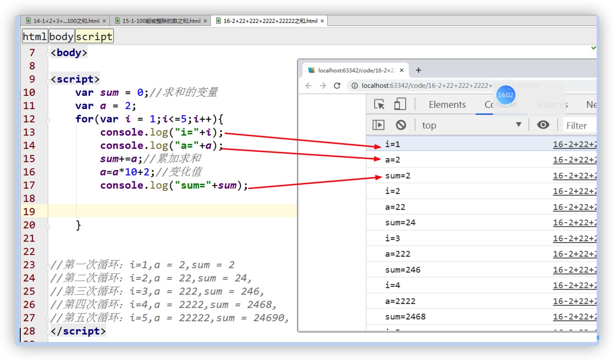
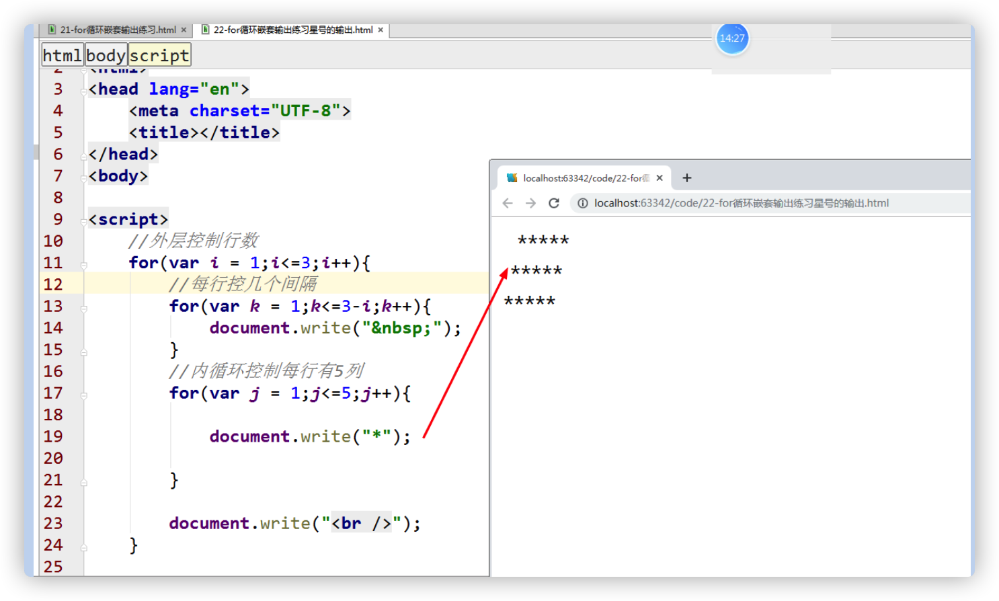

<h1>分支语句和循环语句</h1>

## 引导

### 主要内容：

### 学习目标：

| 节数                 | 知识点     | 要求 |
| -------------------- | ---------- | ---- |
| 第一节（什么是语句） | 语句是什么 | 了解 |
| 第二节（顺序语句）   | 顺序语句   | 了解 |
| 第三节（分支语句）   | 单分支语句 | 掌握 |
| 多分支语句           | 掌握       |      |
| switch语句           | 理解       |      |
| 第四节（循环语句）   | while语句  | 掌握 |
| for循环              | 掌握       |      |
| do-while循环         | 了解       |      |
| 第五节（嵌套语句）   | if嵌套     | 掌握 |
| 循环嵌套             | 掌握       |      |
| 第六节（跳转语句）   | break语句  | 掌握 |
| continue语句         | 掌握       |      |

 

 

## 什么是语句

语句：就是由一些表达式组成的，结尾要加分号。

 

## 顺序语句

**var aa = ”world”;**

**document.write(“Hello！”+aa);**

**alert();**

**console.log();**

## 分支语句

### 单分支语句

1)   单分支语句

**方式1：**

if(条件判断){

语句；

}

**作用：如果条件判断为真（true）,就执行大括号内的语句。如果为假（false）,什么都不执行。**

**If语句注意事项：**

**if语句后面不要加分号（;）**

**If(x>0);**

**{**

**语句；**

**}**

**条件为true的情况**

**方式2：**

if(条件判断){

语句1；

}

else{

语句2；

}

**作用：如果条件判断为真（true）,就执行大括号内的语句1，如果为假（false）,就执行else中的语句2。**

流程图如下：

if-else语句流程图。

 

### 多分支语句

语法结构总结说明：

if(条件判断1){

语句1；

}

else if(条件判断2){

语句2;

}

else if(条件判断3){

语句3;

}

else{

语句n;

}

执行过程：满足相应的条件判断，就执行相应的语句，如果以上条件都不满足，就执行最后的else语句。

具体实例：输入一个学生的成绩，判断优良中差不及格

if-else多分枝语句流程图

### switch语句

**isNaN函数的总结说明：**

**isNaN(‘内容’)：判断你输入的内容是否是一个数字**

如果是数字或者是一个数字字符串，它返回的结果是false,如果不是一个数字或者不是一个数字字符串，它返回的结果是true.

我们先看语法结构：

switch(表达式){

case 表达式1：

语句1；break;

case 表达式2：

语句2；break;

case 表达式3：

语句3；break;

case 表达式4：

语句4；break;

default:

语句n;

}

解释说明：

执行过程：先计算switch(表达式)中的值，满足哪个case语句，就执行相应的语句，前提case语句后面要加上break语句。**break:强制终止语句。case里面的表达式，一般我们用一个常量表达式。**

switch 流程图：

### **实例：求奇偶数（利用表单）**

求圆的面积：

### **实例：求三个数（98,23,58）中最大数或者是最小数**

### **实例：我的加班费**

小贺刚上班，按工作时间小时制领取周工资，工资标准是，每小时rate元RMB。每周工作时间40小时，如果要加班，超出部分按正常工资的1.5倍计。这周小贺上班的时间为hour小时，请编程序，输入rate和hour，输出小贺本周的薪水。

### **实例：输入一个商品的价格，根据相应的折扣，计算实际花了多少钱。**

\>1000 5折

\>=800 <1000 6折

\>=500 <800 7折

\>=200 <500 8折

<200 9折

### 实例：根据学生分数，输出优良中差

### 实例：使用switch语句，根据学生分数，输出优良中差

### 实例：使用switch语句，根据星期，输出菜单

 

## 循环语句

生活我们有的时候经常重复做一件事情。计算机中我们也会重复的做一件事件，那么我们可以使用循环来实现。

### while循环

while循环的流程图：

语法总结说明：

循环初始值

while(条件判断表达式){

语句；

循环变化值

}

当条件判断表达式为真，执行循环内的语句，为假要退出循环。

 

### for循环

1-100即能被3整除也能被五整除的数有哪些？

语法总结说明：

for(表达式1;表达式2;表达式3){

语句；

}

表达式1：初始值

表达式2:条件判断

表达式3:变化值

先计算表达式1的值，然后在进行条件判断，然后在执行for循环内的语句，最后在执行表达式3。

for循环语句的流程图：

**for循环的其他表示方法：**

 

###  do-while循环

语法格式说明：

do{

语句；

}

while(条件判断);

 

**while** **和 do-while的区别是：**

**while：先判断后执行，条件为假一次都不执行。**

**do-while:先执行后判断，条件为假也至少执行一次。**

###  for-in循环

for-in:主要是**遍历数组和对象**的。

数组的使用：

对象的使用

### 实例：求1+2+3+...100之和。

### 实例：求1-100能被3整除的数之和。

### 实例：求2+22+222+2222+22222之和。

乘以10+2

## 嵌套语句

###  if 嵌套

### 循环嵌套

循环之中还有循环

循环的嵌套

￥￥￥￥￥

￥￥￥￥￥

￥￥￥￥￥

**具体的实现思路：**

**第一层循环：控制有几行**

**第二层循环：控制每行有几列**

**每当外层循环，循环一次，内循环，循环5次？**

### 实例：求乘法口诀表

 

### 实例： 输出如下图形

1

12

123

1234

12345

 

9

999

99999

 

分析一下：

分成两部分

 

## 跳转语句

### break语句:在循环中，执行break则提前终止整个循环。

### continue语句：在循环中，执行continue则提前结束本次循环，开始下一次循环。

## 作业

### 作业1：买可乐

你有20元，每瓶可乐3元，一个空瓶1元，最后买几瓶可乐。

20/ 3 =6,2

6+2 =8/3 =2 ,2

2+2 =4/3=1 ，1

1+1=2   0

9

循环的条件：总的金额>每瓶可乐的单价

### 作业2：输出1-100之间所有的质数。

什么是质数？

只能够被1还有自身整除的数就是质数，没有其他的因数。

2,3，5,7，11

怎样判断质数：

### 作业3：打印如下图形

