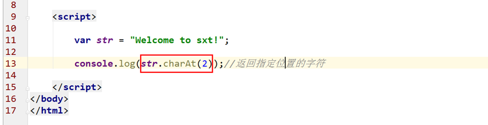
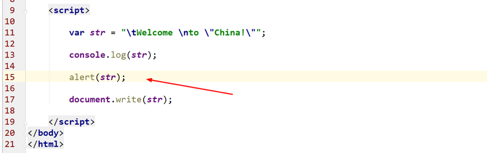
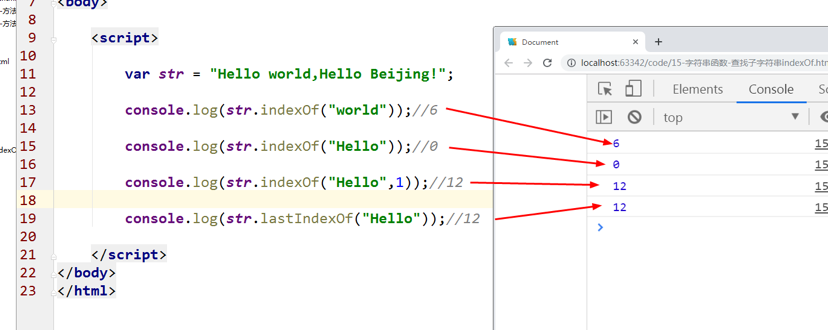
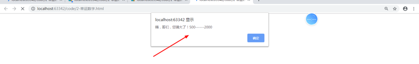
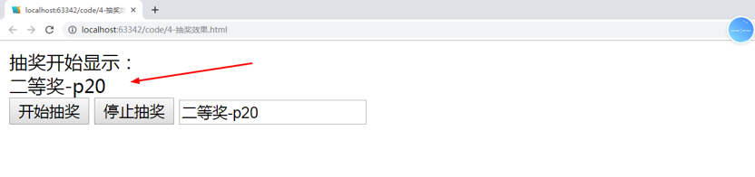

<h1>JS字符串

### 主要内容：

### 学习目标：

| 节数                       | 知识点             | 要求 |
| -------------------------- | ------------------ | ---- |
| 第一节（字符串概述）       | 字符串介绍         | 了解 |
| 第二节（字符串的使用）     | length属性         | 了解 |
|                            | 字符索引           | 了解 |
|                            | 获取指定位置的字符 | 了解 |
|                            | 字符串连接         | 了解 |
| 第三节（转义字符）         | 常见转义字符       | 掌握 |
| 第四节（字符串对象）       | 创建字符串对象     | 掌握 |
| 第五节（字符串方法(重点)） | 字符串方法         | 掌握 |
| 第六节（字符串实例）       | 字符串的使用       | 掌握 |

 

## 字符串概述

定义：**字符串就是用单引号或者双引号包裹起来的**，零个或多个排列在一起的字符。

例如：’javascript‘, “”, “345” , ’9-11a$‘, “xiao_yuanLian”

**嵌套：字符串可以嵌套。**

在单引号包裹的字符串内部，应该使用双引号进行嵌套。

在双引号包裹的字符串内部，应该使用单引号进行嵌套。

例如：“I am ‘coolMan’”, ’are u “kidding” me’

## 字符串的使用

### 字符串换行

var x =
 "Hello World!";

var x = "Hello
 World!";

**字符串断行需要使用反斜杠(\)**

var x = "Hello \
 World!";

###  length属性

length:返回的是字符串的长度

### 字符索引

[ ]方法：**在字符串后面接中括号，中括号中写数字**。能够访问到字符串中的每个字符。

ps:索引一次只能索引一个字符，如果需要多个则需要用+连接符。

pss:索引**从0开始，0表示第一个字符**。

 

### 获取指定位置字符

1.**charAt(index)**:返回的是**具体的字符**

Index:就是字符串的位置（它是一个数字）

**2.charCodeAt（index）**返回的是字符对应的**Unicode编码（ascii编码值）**

**A:65 a:97 0:48**

Index:就是字符串的位置（它是一个数字）

索引从0开始

字符编码需要记得的两个。A—65，a—97。其他符号累加即可。

\3.  fromCharCode将指定的数字(ascii码值)转为对应的字符

### 字符串连接

**concat()方法能够将两个字符串拼接起来**，合成一个新的字符串。

可以认为concat和+作用相同。至少在现阶段我们可以认为他们是没有区别的

### 模板字符串

模板字符串（template string）是增强版的字符串，用**反引号（`）标识。**

模板字符串中嵌入变量，需要将**变量名**写在**${}**之中。

 

## 转义字符

常见转义字符

**\'**   **单引号**

**\"**   **双引号**

**\\**   **反斜杠**

**\n**   **换行**

**\r**   **光标到首行**

**\t  tab(制表符)**

 

## 字符串对象

javascript中有字符串类型string类型，我们也知道这种基本类型的变量的创建方式。

但javascript中还提供了另外一种字符串的声明方式，这种方式叫字符串对象。使用 new 关键字将字符串定义为一个对象

New String();

## 字符串方法(重点)

### 字符串方法

​    (2).charAt（number）：返回当前指定位置的字符

​    (3).charCodeAt(number)：返回当前指定位置的字符ascii码值

​    (4).concat:连接字符串

​    (5).substring(start,end):截取字符串(从哪里开始到哪里结束,end：不包含end))

​    (6).substr(start,length):截取字符串（从哪里开始取多长的字符）

​    (7).slice(start,end):截取字符串(end：不包含end)

(8)  .indexOf(str,offst)：返回当前查找字符串在整个字符串中的首次位置，如果没有返回-1

Str:字符串

Offset:从哪里开始查找

(9)  .lastIndexOf:倒过来查找

(10)     .trim():去掉字符串两端的空格

(11)     .toUpperCase和toLowerCase:大小写转换

​    (13).match:返回一个指定字符串的数组

(14).search:返回位置

(15).replace:替换字符串

(16)     .split:字符串切割，返回数组

Es6新增的方法

·  **includes()**：返回布尔值，表示是否找到了参数字符串。

·  **startsWith()**：返回布尔值，表示参数字符串是否在原字符串的头部。

·  **endsWith()**：返回布尔值，表示参数字符串是否在原字符串的尾部。

·  这三个方法都支持第二个参数，表示开始搜索的位置。

 

·  `repeat`方法返回一个新字符串，表示将原字符串重复`n`次。

 

ES2017 引入了字符串补全长度的功能。如果某个字符串不够指定长度，会在头部或尾部补全。`padStart()`用于头部补全，`padEnd()`用于尾部补全。

`padStart()`和`padEnd()`一共接受两个参数，第一个参数是字符串补全生效的最大长度，第二个参数是用来补全的字符串。

### 字符串Base64编码

​    **Base64本身是一种加密方式**，可以将任意字符转成可打印字符。

  有时需要以文本格式传递二进制数据，那么也可以使用 Base64 编码。

而我们使用这种编码方法，主要不是为了加密，而是为了不出现特殊字符，简化程序的处理。

  javascript中字符串提供了两个有关Base64编码的方法：

​    **btoa()**：字符串或二进制值转为Base64编码

​    **atob()**：Base64编码转为原来的编码

  **encodeURIComponent()**：要将非 ASCII 码字符转为 Base64 编码

  **decodeURIComponent()**：将转码后的内容转为非ASCII内容

### 作业1：统计字符串中字母出现的次数

“ababcdeeeffhhljlkom”,统计这个字符串中每个字母出现的次数。

利用字符串的函数：

charCodeAt(i):返回指定位置的字符的ascii码值 a:97,A：65

fromCharCode(97,98,99):返回指定ascii码值的所指定的字符

charAt():返回指定位置的字符

第一种方法：

方法2：创建一个新的字符串，这个新的字符串是不重复的每个字符，然后和老的字符串中有重复的字符进行比较，如果相等就累加。

indexOf():查找子字符串在整个字符串中首次出现的位置。（从前往后）

lastIndexOf():查找子字符串在整个字符串中最后一次出现的位置。（从后往前）

方法3：利用对象的方式进行字符串的累加

 

## 字符串实例

### 定时器的简单使用

setInterval():定时器，

按照指定的时间，重复的执行函数表达式

setInterval(function(){},毫秒数)

### 实例：打字机效果（动画）

setTimeout():延时器

方法1：通过substring()或者substr()或者是slice()这三个函数截取字符串

方法2:通过数组的方式来访问字符串中字符

### 实例：幸运数字（0-10000）,800

### 实例：金字塔

Str = “abcdefg”;

A

Ab

Abc

Abcd

 

### 实例：抽奖效果(动画)

分析一下：How to create your code?

setInterval():

奖品存放在数组中，随机抽奖（Math.random()）

将结果存放到文本框中

 

