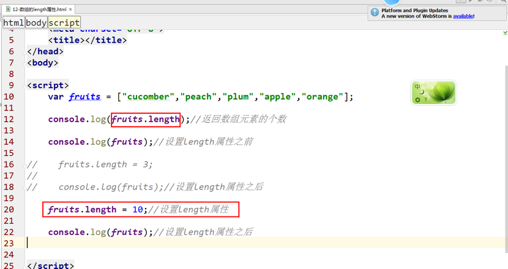
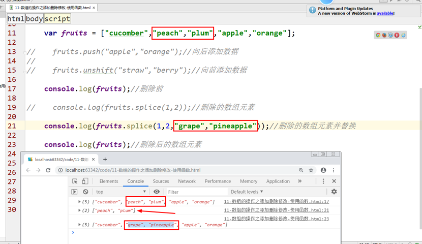
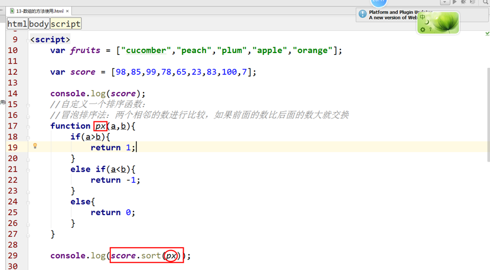

<div align="center"><h1>JS数组</h1></div>

### 主要内容：


### 学习目标：

| 节数                 | 知识点                        | 要求 |
| -------------------- | ----------------------------- | ---- |
| 第一节（数组的概念） | 数组介绍                      | 了解 |
| 第二节（数组的特点） | length属性                    | 了解 |
|                      | 数组元素索引                  | 了解 |
|                      | 获取指定位置的数组元素        | 了解 |
| 第三节（数组调用）   | 使用数组及数组元素            | 掌握 |
| 第四节（数组的方法） | 获取数组元素、拼接数组元素... | 掌握 |
| 第五节（二维数组）   | 二维数组的使用方法            | 掌握 |
| 第六节（数组的实例） | 数组排序、抽奖....            | 掌握 |

 


## 数组的概念

### 什么是数组

**数组**就是按照**一定的顺序排列的一组值**，每个值都有自己的编号，**编号(下标)从0**开始，整个数组可以用[]表示。


### 数组的定义

定义数组的方式：

**方式1：中括号[]**

var arr = [数组的值1，数组的值2，数组的值3,....];

**方式2：使用new Array()**

本质上，数组是对象类型的一种特殊表现形式。因此创建的时候我们可以使用new方式来创建。

typeof运算符会返回数组的类型是object。

arr = new **A**rray(数组的值1，数组的值2，数组的值3,....);

### 数组的访问

数组的下标是从0开始，

arr[0]:第一个数组元素

arr[1]:第二个数组元素

arr[2]:第三个数组元素


### 数组的操作

可以是不同的数据类型

添加，修改，删除，查看操作


### 数组的分类

按维度分：分一维数组，二维数组等。

按类型分：索引数组和关联数组。

**索引数组**：下标是**阿拉伯数字的（0,1,2等）**

**关联数组**：下标是一个**字符串**


 

### 数组的特点

数组就是一组数据（数字，字符串，对象）类型的集合，简单来说数组就是一种容器

1. 数组内的数据可以是**任意的类型**

2. 数组下标**从0开始**

3. 数组的长度就是数组**元素的个数(length)**

4. 数组**下标的范围是0~length-1**

 

## 数组的使用（重点）

1、值传递

普通变量是**值传递,其中的一个改变不会影响到另外一个值。因为各自都有自己的地址。**


2、地址传递

数组是**地址传递：其中的一个改变，会影响另一个的改变。因为他们共用一个地址。**


**[]:相当于（new Array）开辟了一个内存空间**


**总结说明：**

**一般的数据类型：数字，字符串，布尔是值传递。**

**数组和对象一般是地址传递。**

## 数组的遍历

### 普通循环遍历

什么是遍历：循环输出数组元素的值。


###  for...in的使用


###  for...of的使用


## 数组的方法（重点）

###  数组的属性length的使用

**length:数组的长度**

**length是一个可写属性。**

​    如果设置length长度小于数组本身长度，那么多余元素舍弃。

​    如果设置length长度大于数组本身长度，那么缺少元素用空位补齐。

​    如果设置length长度不是合法数值，那么会报错Invalid array length


### 数组的空位

当数组的某个位置是空元素，即两个逗号之间没有任何值，我们称该数组存在空位(hole)。

var arr1 = [10,,20];//有空位
		console.log(arr1);
		console.log(arr1[1]);

var countryNameArr = ['China','','Japan'];//第2个元素是一个空字符串

countryNameArr.length//3

### 数组的方法

1.concat(arr1,arr2,....):连接多个数组


2.push(若干个新元素)：把若干个新元素添加到数组尾部

3.pop()：删除数组尾部的一个元素

4.shift()：删除数组头部的一个元素

5.unshift(若干个新元素)：把若干个新元素添加到数组头部


6.join():给数组添加一个分隔符并将数组转化为字符串


7. reverse()：倒叙输出数组元素


8. slice(start,end)：数组的截取


9.splice():添加修改删除数组元素

splice(from,howmany,items):添加删除数据。

From:从哪个下标开始添加还是删除

Howmany:删除或者添加几个数组元素

Items:添加的数据或者是修改的数据。

1）删除数组元素：


2）删除数组元素并替换数组元素



3）添加数组元素


10.sort()：数组的排序

按照字符（a-z）的顺序排序


数字的排序方法：




11. map()：循环遍历数组，有返回值


12. forEach()：循环遍历数组，没有返回值

forEach(function(val,index,arr){

})

val:数组元素的值

index:下标

arr:数组本身


13.filter():找到符合条件的所有元素

14.find():找到符合条件的第一个元素


15.findIndex():找到符合条件的第一个元素的下标


16.some()：只要有一个符合条件的就返回true

17.every()：只要有一个不符合条件的就返回false


18.includes():判断是否包含指定的数组元素，有就是true,没有就是false


19.reduce():数组元素的计算（从左到右）

20.reduceRight():数组元素的计算（从右到左）


21.indexOf()：返回指定数组元素的首次出现的下标

22.lastIndexOf()：返回指定数组元素的最后一次出现的下标


 23、keys()：返回由所有数组元素的下标组成的特殊对象


24、values()：返回由所有数组元素的值组成的特殊对象


25、entries()：返回所有数组元素的键名和键值共同组成的特殊对象


## 二维数组

### 二维数组的定义

**如果数组的元素还是数组**，那么我们就称外层数组是一个二维数组。

语法：

```javascript
var arr = [[item1,item2],[item3,item4]];
var arr = [[1,2],[3,4]];
arr[0][1] = 2;
arr[1][0] = 3;
```

### 二维数组的访问


### 二维数组的遍历

## 数组的实例

### 求最大值或者最小值

### 数组排序（选择排序）

选择排序法：

从数组中选择第一个数组元素a[0]，然后第一个数组与后面的所有数组元素依次比较，如果前一个大于后一个，那么就交换数据，最终找到一个最小的数组元素排在最前面，然后再一次循环找（从第二个数组元素开始与后面的所有数组元素依次比较。）

**$arr=[100,90,98,70,85,60,87]从小到大排序**

60 100 98 90 85 70 87

第1次排序：60,100,98,90,85,70,87

第2次排序：60,70,100,98,90,85,87

第3次排序：60,70,85,100,98,90,87

第4次排序：60,70,85,87,100,98,90

第5次排序：60,70,85,87,90,100,98

第6次排序：60,70,85,87,90,98,100

### 返回90-100范围的随机数（Math.random()）

### 验证码的实现(随机的5位验证码-字母加数字)

大写字母26，小写26，数字10，共62个

用循环产生62个字符放入数组中


### 抽奖

分析一下：How to create your code?

setInterval():

奖品存放在数组中，随机抽奖（Math.random()）

将结果存放到文本框中


 