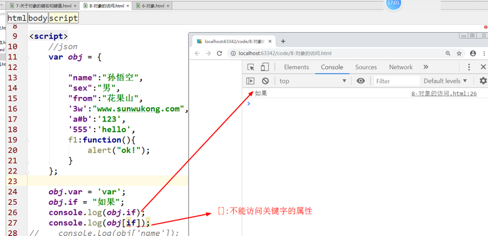
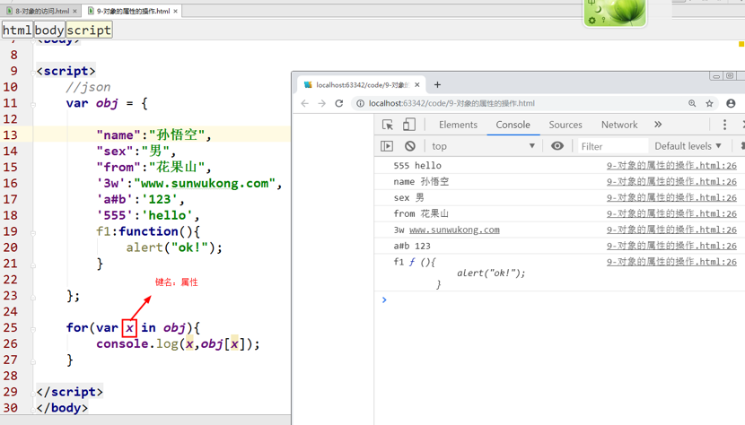
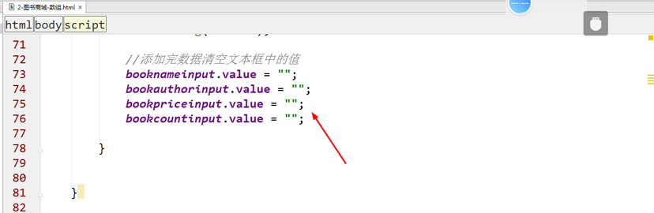

<div align="center"><h1>JS对象</div>

## 引入

### 主要内容：


### 学习目标：

| 节数                   | 知识点               | 要求 |
| ---------------------- | -------------------- | ---- |
| 第一节（对象概述）     | 什么是对象           | 了解 |
| 第二节（对象的创建）   | 怎样创建对象         | 了解 |
|                        | 对象的构成           | 了解 |
|                        | 创建对象             | 了解 |
| 第三节（键名和键值  ） | 关于键名             | 掌握 |
|                        | 关于键值             | 掌握 |
| 第四节（Math对象）     | Math对象的介绍       | 了解 |
|                        | Math对象的属性和方法 | 掌握 |
| 第五节（Date对象）     | Date对象的介绍       | 了解 |
|                        | Date的方法           | 掌握 |

### 为什么要使用对象？

**因为对象能帮我们解决一些复杂的问题**

## 对象概述

**在JavaScript 中的所有事物都是对象**：字符串（new String）、布尔(new Boolean())、数值(Number)、数组(Array)、函数(Function)等。

### 什么是类

**类**：就是具有**相同的属性和方法的集合**。人类，动物类，家电类等。

### 什么是对象

**对象**：类中的一个具体的实物。人类-具体某一个人（张三丰）。

动物类-(一个具体的动物-东北虎)，家电类-（具体一个比如说电视。）

js 中我们包含哪些对象呢？

1)   **内置对象（本地对象）：**Math对象，Number对象，Date对象等，系统给我们提供好的，我们拿过来用就可以了。

2)   **宿主对象：**dom（文档对象模型）,bom(浏览器对象)。

3)   **自定义对象：**我们自己定义和开发的对象。

 

## 对象的创建（重点）

### 怎样创建对象   

**语法：var obj = { key : value,key : value };**

上面代码定义了一个对象，它被赋值给变量obj。

​    key是“键名”

​    value是“键值”

ps:如果对象内部包含多个键值对，每个键值对之间用逗号分隔。最后一个键值对末尾不用加逗号

​    var obj = {key1:value1,key2:value2};

### 对象的构成

对象是JavaScript的核心概念，也是最重要的数据类型。JavaScript的所有数据都可以被视为对象。此外，JavaScript 允许自定义对象。 

对象（object）是大括号定义的无序的数据集合，**由键值对构成**，键名，键名与键值之间用冒号分隔，大括号末尾要使用分号表示对象定义结束。 

### 创建对象

a.直接使用大括号创建对象

b.使用new命令生成一个Object对象的实例

c.使用Object.create方法创建对象

**var obj1 = {};**

**var obj2 = new Object();**

**var obj3 = Object.create(null);**

Object是在javascript中一个被我们经常使用的类型，而且**JS中的所有对象都是继承自Object对象的**


## 对象的键名和键值（重点）

### 关于键名

**键名也被称为属性(property)**，对象的所有属性都是字符串，所以加不加引号都可以。

因此上面的代码也可以写成下面这样：

var obj = { 'key': value };

但是，如果**属性不符合标识符的条件**(比如第一个字符为数字，或者含有空格或运算符)，则**必须加上引号**。

var obj = {

​                    '1p': "Hello World",

​                    'h w': "Hello World",

​                    'p+q': "Hello World"

};

上面对象的三个属性，都不符合标识名的条件，所以**必须加上引号**。

ps:JavaScript的保留字可以不加引号直接当作对象的属性。


### 关于键值

键值是属性所对应的具体的值。javascript的对象的键值可以是**任何数据类型。**

var frank = {

​                    name: "Frankenstein Add",

​                    age: 18,

​                    sex: "male"

​                    ability: eat();//eat()表示函数

​            };

ps：如果一个属性的值(ability)为函数，通常把这个**属性称为“方法”**。


## 对象的引用（重点）

### 对象属性的读取和设置

读取对象的属性,有两种方法:

**一种是使用点运算符（.）,还有一种是使用方括号运算符([])。**

需要注意的是，使用**方括号**读取对象属性的时候**需要加引号**

点运算符用来为对象的属性写入值。

[]的使用总结说明：

1. 可以使用**一个变量**存储对象的属性，.是不能使用的


2. 可以使用**纯数字**的方式来访问，.是不能使用的


.的使用的总结说明：

**点（.）**运算符可以将js的**关键字**（var,if等）**作为属性**来访问。



### 对象属性的操作

1、【Object.keys()】获取对象所有属性


2、【Object.values()】获取对象所有的值


3、【Object.entries()】获取对象所有的键值对


4、【delete】删除一个属性


5、【in】检查对象是否包含一个属性（true，false）


### 对象的遍历

1、【for in】遍历对象所有属性



2、【for of】遍历对象所有属性


### 实例：对象排序

回想一下，数组的排序用什么方法。

sort(function(a,b){

return a - b;

});


按年龄进行排序：


如果年龄相等，按薪水进行排序


### 对象中求工资的最大值

## Math对象

### Math对象的介绍

Math对象是数学对象

### Math对象的属性和方法

Math对象的属性：PI（圆周率）

Math对象的方法：

**random():随机函数([0,1))**

**floor():向下取整**

**ceil():向上取整**

**round():四省五入取整**


**pow():求一个数的幂数**

max():求最大值

min():求最小值

abs():绝对值

sqrt()：求平方根


### 实例：获取一个范围的随机数

Math.random():返回0-1之间的随机数

公式：求一个数的范围

max:最大数

min:最小数

随机产生[min,max]范围的整数：

```
parseInt((max-min+1)*Math.random()+min)
```

例如：随机产生[60,100] 的整数

parseInt(41*Math.random()+60)


### 实例：单击随机生成四位数字验证码

## Date对象

### Date对象的介绍

​    **Date对象是JavaScript提供的日期和时间的操作接口。**

​    在JavaScript内部，所有日期和时间都储存为一个整数。

​    这个整数是当前时间距离1970年1月1日00:00:00的毫秒数，正负的范围为基准时间前后各1亿天

​    同Math对象一样，javascript也为Date对象提供了很多内置的方法。


### Date函数

​    Date对象是一个构造函数，对它使用new命令，会返回一个Date对象的实例。

一些其他合法的日期字符串写法

 

new Date(datestring)

new Date("2013-2-15")

new Date('2013/2/15')

new Date("2013-FEB-15")

new Date("FEB, 15, 2013")

new Date("FEB 15, 2013")

new Date("Feberuary, 15, 2013")

new Date("Feberuary 15, 2013")

new Date("15, Feberuary, 2013")

Sun Jan 06 2013 00:00:00 GMT+0800 (中国标准时间)


### Date的方法

getTime():获取距离1970年1月1日的毫秒数

getYear():获取年份（距离1900的年数）

getFullYear()：获取全年（4位数）

getMonth()：获取月份（0-11）

getDate()：获取日期

getDay()：获取星期几（0-6）,0：星期日，6：星期六

getHours()：获取小时（0-23）

getMinutes()：获取分钟（0-59）

getSeconds()：获取秒数（0-59）

toLocaleString()：获取当地的日期和时间

toLocaleDateString()：获取当地的日期

toLocaleTimeString():获取当地的时间


### 显示当前的日期时间和星期


### 显示新中国成立了多少年


### 实例：产品过期剩余几天几小时几分几秒--倒计时

分析一下：

setInterval(),Date(),innerHTML

Var date = new date();

Var fdate = new date(“2019-9-13”);

Time = fdate - date;//获取的毫秒数


### 实例：图书商城展示（数组和对象）

1、图书商城展示（数组）

分析一下：

获取相应的元素的值，通过添加按钮的单击事件，将文本框元素的值添加到数组中。





2、图书商城展示（对象）


 