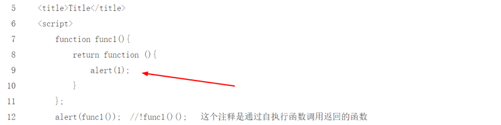
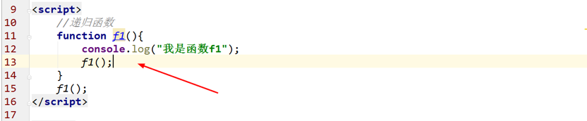

<div align="center"><h1>函数（上）</div>

### 主要内容：


### 学习目标：

| 节数                          | 知识点     | 要求 |
| ----------------------------- | ---------- | ---- |
| 第一节 函数的初识             | 什么是函数 | 了解 |
| 第二节 函数的分类             | 系统函数   | 了解 |
|                               | 自定义函数 | 了解 |
|                               | 函数的使用 | 了解 |
| 第三节 函数的类型             | 函数类型   | 掌握 |
| 第四节 函数的作用域和作用域链 | 函数作用域 | 掌握 |

 

**思考：为什么使用函数？使用函数能解决什么问题？**

您能够对代码进行复用：只要定义一次代码，就可以多次使用它。

您能够多次向同一函数传递不同的参数，以产生不同的结果。

## 什么是函数

 

函数：是一般是**由事件驱动**的，为了**实现特定功能**的，可以**重复调用**的**一段可以执行的代码块**。

 

## 函数的分类---按函数是否由开发者编写

### 系统函数

字符串，数学函数，数组函数等，js系统给我们提供好的函数。

### 自定义函数

自己定义的函数：函数的声明

function 函数名(形式参数1，形式参数2...){

语句。

}

### 函数的使用

1、函数调用

2、函数和事件绑定

## 函数的类型--按有无参数，有无返回值

### 无参无返回值类型函数（函数声明）


### 无参有返回值类型函数

### return的使用

1、**return，从字面意思来看就是返回，官方定义return语句将终止当前函数并返回当前函数的值，return后面的语句不执行。**

2、官方定义**return后面**可以跟一个value，也就是说可以跟javascript中的任何数据类型，数字，字符串，对象等，当然也可是再**返回一个函数**

3、return 返回基本数据类型

4、return 返回对象


5、return 返回函数



总之：return false 只在当前函数有效，不会影响其他外部函数的执行。(也就是其中断的只是一个函数，对于其外部函数没影响)

6、return 注意事项

retrun true； 返回正确的处理结果。

return false；返回错误的处理结果，终止处理。


return；把控制权返回给页面。

function myFunction(a) {
   var
   power = 10; 
   return a * power;
 }

function myFunction(a) {
   var
   power = 10; 
   return
   a * power;
 }

返回 **undefined**

function foo1() {

  return {

​    bar:'hello'

  }

}

function foo2() {

  return

  {

​    bar:'hello'

  }

}

//第一个返回一个对象

//第二个返回undefine 因为第二个 return 后面没内容，分号自动加在 return 后面

### void的使用

javascript:void(0) 该操作符指定要计算一个表达式但是不返回值。

**void()仅仅是代表不返回任何值**，但是括号内的表达式还是要运行void(alert("running!"))


href="#"与href="javascript:void(0)"的区别

\# 包含了一个位置信息，默认的锚是#top 也就是网页的上端。

而javascript:void(0), 仅仅表示一个死链接。

 


### 有参无返回值类型函数


### 有参有返回值类型函数


### 匿名函数（函数声明）

匿名函数：在JavaScript中，当把函数当做数据使用时，可以不设置名字


函数必须要先声明后使用


函数声明的提升：

**如果函数先使用了，后声明，函数自动提升到使用之前。**


### 回调函数（learn,study）

什么是回调函数？

当一个函数作为另一个函数的参数时，作为参数的函数被称之为回调函数。


### 函数的自调用(沙箱)

**function前面加上一些操作符，这样js引擎在解析的时候就不会把它当成是函数声明了**


什么是沙箱？

**沙箱：就是与外界隔绝的一个环境，外界无法修改该环境内的任何信息（沙箱内的东西单独属于一个世界）**

JS中的沙箱模式：还是通过函数来实现的

   <1>沙箱模式的基本模型：自调用函数

​     (function(){

​       var a = 123; //外面并不能访问到这个a

​     })();

  <2>沙箱里面的变量对外面没有影响

  <3>为什么要使用立即执行函数表达式IIFE（其实就是匿名函数）来写沙箱：因为立即IIFE不会在外界暴露任何的全局变量，但是又可以形成一个封闭的空间，刚好可以实现沙箱模式

  <4>在沙箱中将所有变量的定义放在最上面，然后中间就放一些逻辑代码

   <5>js中沙箱模式的实现原理：函数可以构建作用域，上级作用域不能直接访问下级作用域中的数据


### Function构造函数（函数声明）

**Function** **是一个构造器，能创建Function对象，即JavaScript中每个函数实际上都是Function 对象。**

函数构造器的语法：

new Function ([arg1[, arg2[, ...argN]],] functionBody)

说明：

arg1、arg2等为构造器的参数，functionBody为方法体。注意：参数必须用引号包围！

实例：

var plus=new Function("a","b","return a+b");

var result=plus(1,2);//调用，返回3

上述方法创建function等同于普通函数声明方法：

function plus(a,b){return a+b;};

```
var add = new Function(
  'x',
  'y',
  'return x + y');
// 等同于function add(x, y) {
  return x + y;}
```


### Function与function的区别  

Function是一个功能完整的对象，作为JS的内置对象之一。而function只是一个关键字，用来创建一个普通函数或对象的构造函数。JS的普通函数都是Function对象的实例，所以函数本身也是一个对象，就像var一样，只不过这个对象具有可调用特征而已

### 递归函数

递归函数：函数自己调用自己




### 默认值和函数参数

ES6的参数默认值


Es5的参数默认值


参数是一个函数


###  高阶函数

高阶函数

高阶函数英文叫Higher-order function。那么什么是高阶函数？

JavaScript的函数其实都指向某个变量。既然变量可以指向函数，函数的参数能接收变量，那么一个函数就可以接收另一个函数作为参数，这种函数就称之为高阶函数。

### 函数之中包含一个函数

### 作业：创建一个简易计算器

### 作业：使用递归函数计算1+2+3+4+5之和。


 

## 函数的作用域和作用域链

### 什么是作用域

**作用域（scope）**就是变量或函数的可访问范围，或者说**变量或函数起作用的区域**


 

### 作用域分类

Javascript只有两种作用域

1、全局作用域

全局作用域：变量和函数在整个程序中一直存在，所有地方都可以读取。

全局变量(global variable)：在函数外部声明的变量，它可以在函数内部读取。

那么什么情况下声明为全局变量呢，多个函数共同使用。

2、局部作用域

局部作用域：变量和函数只在函数内部存在。在函数外部变量失效。

和作用域与之对应的，javascript中有两种变量：

局部变量(local variable)：在函数内部定义的变量，外部无法读取。

在函数中，**参数也是局部变量**。

函数也有作用域，声明在外部的函数，可以任意位置调用，声明在函数内部的函数，一般只能在内部调用。

**局部变量会在函数运行以后被删除。**

**全局变量会在页面关闭后被删除。**

### 变量加var和不加var的区别

1.在函数作用域内 加var定义的变量是局部变量，不加var定义的就成了"全局变量"

2.在全局作用域下，使用var定义的变量不可以delete,没有var定义的变量可以delete.也就说明隐式全局变量严格来说不是真正的变量，而是全局对象(window)的属性，因为属性可以通过delete删除，而变量不可以

3.使用var定义的变量不赋值时会有一个默认初始值：undefined，而不使用var定义的变量在alert()时浏览器会给出错误信息：a is not defined

4.在ECMASceipt5的'use strict'模式下，如果变量没有使用var定义，会报错

### 实例：计数器的累加

### 作用域链


### 实例：变量作用域的具体应用

 

 