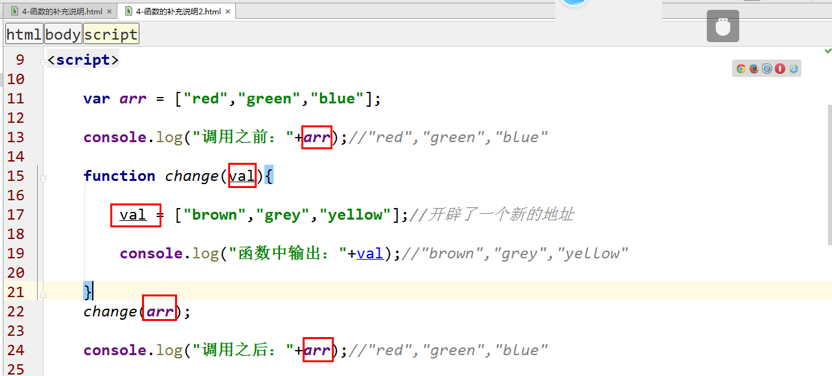

<h1>函数（下）

### 主要内容：

### 学习目标：

| 节数                   | 知识点       | 要求 |
| ---------------------- | ------------ | ---- |
| 第一节（函数总结说明） | 函数总结说明 | 掌握 |
| 第二节（闭包）         | 闭包         | 掌握 |

 

## 函数总结说明

### 不能在非函数的代码块中声明函数

不要在代码块中定义一个函数，这样造成假的情况下不执行

### name属性和length属性

### 变量和函数的提升

函数的提升

### 超一等公民

在很多传统语言（C/C++/Java/C#等）中，**函数都是作为一个二等公民**存在，你只能用语言的关键字声明一个函数然后调用它，如果需要把函数作为参数传给另一个函数，或是赋值给一个本地变量，又或是作为返回值，就需要通过函数指针(function pointer)、代理(delegate)等特殊的方式周折一番。
    **但是在JavaScript世界中函数却是超一等公民**，它不仅拥有一切传统函数的使用方式（声明和调用），而且可以做到像简单值一样赋值、传参、返回，这样的函数也称之为第一级函数（First-class Function）或一等公民。不仅如此，**JavaScript中的函数还充当了类的构造函数的作用**，同时又是一个Function类的实例(instance)。这样的多重身份让JavaScript的函数变得非常重要。 

### 函数自定义声明

### 将函数赋值给变量

### 将函数作为参数

### 将函数自调用

### 将函数作为对象的方法

### arguments对象

**Arguments对象是js给我们提供的一个形式参数，它是一个数组。**

### 值传递和地址传递

值传递：

地址传递：

### 函数的同名参数

### eval函数

eval(“字符串”):可以计算字符串的值

### instanceof类型检测

instanceof 用于判断一个变量是否是某个对象的实例

### javascript垃圾回收机制

对于其他语言来说，如C,C++,需要开发者手动的来跟踪并管理内存。

Javascript 具有自动垃圾回收机制，会定期对那些我们**不再使用的变量、对象所占用的内存进行释放**

其原理就是找出那些不在被使用的变量，然后释放其所占有的内存。**回收器一般是按照固定的时间间隔或者预设的时间进行处理的。** 

### 作业：统计字符串中字母出现最多的字符（不区分大小写）

## 闭包（重点难点）

### 为什么要使用闭包

闭包是解决什么问题的？

**如何在函数外部访问函数内部局部变量的问题。**

怎样解决这个问题？

**可以使用return语句返回一个值，但这个不是闭包。**

### 什么是闭包

闭包：能够读取其他函数（外部函数）变量的函数（内部函数）就是闭包。

### 闭包的分类

1、函数闭包

2、对象闭包

### 闭包的特点和作用

闭包的特点：

**特点1：函数内部包含一个函数**

**特点2：内部函数可以使用外部函数的变量**

闭包的作用：

1.一个就是可以读取函数内部的变量。

2.另一个就是让这些变量的值始终保持在内存中。

### 计数器的累加

### 闭包的问题

内存泄漏

内存泄漏（Memory Leak）是指程序中己动态分配的堆内存由于某种原因程序未释放或无法释放，造成系统内存的浪费，导致程序运行速度减慢甚至系统崩溃等严重后果。

多次调用

### 闭包的实际应用

没有使用闭包

使用了闭包

 

 

 