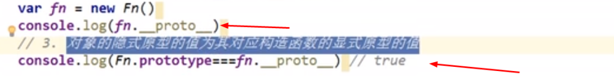
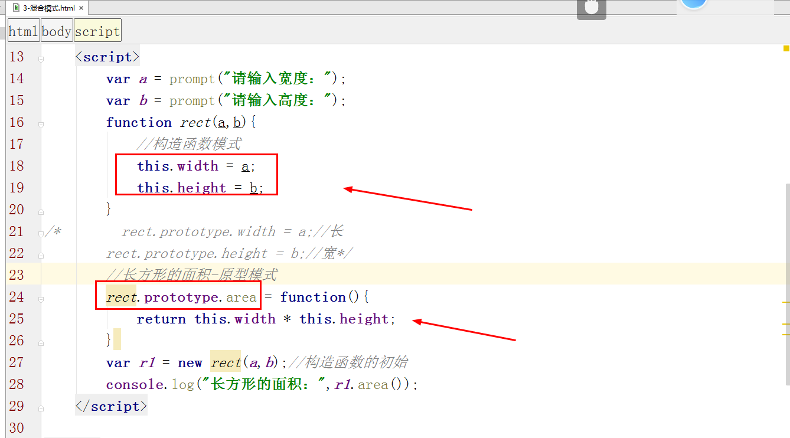

<div align="center"><h1>类、对象、原型与设计模式</div>

### 本节主要内容：


### 学习目标：

| 节数                      | 知识点         | 要求 |
| ------------------------- | -------------- | ---- |
| 第一节 面向对象的思想概述 | 什么类和对象   | 了解 |
| 第二节 类和对象           | 什么是类和对象 | 了解 |
|                           | 创建对象       | 了解 |
|                           | 属性和方法     | 了解 |
| 第三节 原型               | 什么是原型     | 掌握 |
| 第四节 原型链             | 原型链         | 掌握 |
| 第五节 原型继承           | 原型继承       | 掌握 |
| 第六节 设计模式           | 设计模式       | 掌握 |
| 第七节 this总结           | this问题总结   | 掌握 |

**问题思考：求两个数的和**

方案：

1、pop：需要两个变量保存两个数，

​             需要一个算式计算求和，

​             需要一个变量保存结果

​             需要一个打印语句输出结果。

var a=1;

var b=2;

var sum = a+b;

console.log(sum);

2、利用函数求两数之和：

function sum(x,y){

return x + y;

}

3、oop：继承，封装，多态

private(私有的),public（公有的）,protected（受保护的）

4、需要两个变量保存两个数

​             需要创建一个对象

​             对象中需要一个能计算加和的方法

​             对象中这个方法需要能打印计算结果

​             调用对象执行这个方法

```javascript
var obj = {
    sum:function(num1,num2){
   			console.log(num1+num2);
    }
}

obj.sum(10,20);
```


 

## 面向对象思想概述

面向对象程序设计（Object-oriented programming，缩写：OOP）是种具有对象概念的程序编程典范，同时也是一种程序开发的抽象方针。它可能包含数据、属性、与方法。对象则指的是类的实例。它将对象作为程序的基本单元，将程序和数据封装其中，以提高软件的重用性、灵活性和扩展性，对象里的程序可以访问经常修改对象相关连的数据。

举个最简单点的例子来区分 面向过程和面向对象

有一天你想吃鱼香肉丝了，怎么办呢？你有两个选择

1、自己买材料，肉，鱼香肉丝调料，蒜苔，胡萝卜等等然后切菜切肉，开炒，盛到盘子里。

2、去饭店，张开嘴：老板！来一份鱼香肉丝！

看出来区别了吗？这就是1是面向过程，2是面向对象。

面向对象有什么优势呢？首先你不需要知道鱼香肉丝是怎么做的，降低了耦合性。如果你突然不想吃鱼香肉丝了，想吃洛阳白菜，对于1你可能不太容易了，还需要重新买菜，买调料什么的。对于2，太容易了，大喊：老板！那个鱼香肉丝换成洛阳白菜吧，提高了可维护性。总的来说就是降低耦合，提高维护性！

 

**oop：则会创建一个对象，让对象拥有做某件事情的能力（给对象属性和方法）。**

然后命令对象做某件事。（封装、继承、多态）

**面向过程——步骤化**

面向过程就是分析出实现需求所需要的步骤，通过函数一步一步实现这些步骤，接着依次调用即可

**面向对象——行为化**

面向对象是把整个需求按照特点、功能划分，将这些存在共性的部分封装成对象，创建了对象不是为了完成某一个步骤，而是描述某个事物在解决问题的步骤中的行为。

 

面向过程：

优点：性能比面向对象好，因为类调用时需要实例化，开销比较大，比较消耗资源。
 缺点：不易维护、不易复用、不易扩展.

面向对象：

优点：易维护、易复用、易扩展，由于面向对象有封装、继承、多态性的特性，可以设计出低耦合的系统，使系统 更加灵活、更加易于维护 .
 缺点：性能比面向过程差

## 类和对象

**JavaScript** **中的所有事物都是对象**：字符串（new String）、布尔(new Boolean())、数值(Number)、数组(Array)、函数(Function)等。

**类**：就是具有**相同的属性和方法的集合**。人类，动物类，家电类等。

**对象**：就类中的一个具体的实物。人类-具体某一个人（张三丰）。

动物类-(一个具体的动物-东北虎)，家电类-（具体一个比如说电视。）

js 中我们包含哪些对象呢？

1)   **内置对象（本地对象）：**Math对象，Number对象，Date对象等，系统给我们提供好的，我们拿过来用就可以了。

2)   **宿主对象：**dom（文档对象模型）,bom(浏览器对象)。

3)   **自定义对象：**我们自己定义和开发的对象。

对象（object）是大括号定义的无序的数据集合，**由键值对构成**，键与值之间用冒号分隔，大括号末尾要使用分号表示对象定义结束。 

 

### 什么是类和对象

1.类是具有相同的**属性和方法的集合**。

2.对象是类中具体一个实例。

类是一种抽象的，并不实际存在的，表示一种事物共有特征的描述。

对象是一种具体的，实际存在的，类中的某一个个体。

### 创建对象

### 字面式对象

1、声明字面式对象

语法： var 对象={};


2、调用对象的成员:属性和方法

（1）对象.属性，对象.方法()

（2）对象[‘属性’]，对象\[‘方法’\]()


3、给对象添加属性和方法

对象.属性，对象.方法()


### 通过Object类创建对象

**Object类是所有类的父类。**

**总结说明:Object,O要大写**

语法：var obj=new Object();


 

## 属性和方法

### 私有属性和私有方法

**私有属性 : 在对象的定义中定义的非全局变量**

```
构造函数:能够实例化对象的函数，就是构造函数
```

**私有的属性，对象不能直接访问，必须通过公有的方法才可以访问私有的属性。**

  ```javascript
function Person(firstName,lastName){

    var name=firstName+" "+lastName;//私有属性-private

    this.getFullName =function(){//公有方法-public

      return name;

    }

}

  var person=new Person("Si" ,"Li");//**实例化一个对象**

  alert(person.getFullName());

  alert(person.name); //undefined
  ```


 

### 公有属性和公有方法

**实例（公有）属性 : 使用this为对象附加实例属性/对象名称.属性名**

 

  function Person(name,sex,num){

​    this.name=name;

​    this["sex"]=sex;

​    this[‘50’]=num;

  }

  var person1=new Person("lisi","男",11);

  person1.age=22;

  alert(person1.name);//lisi

  alert(person1["sex"]);//男

  alert(person1[‘50’]);//11

alert(person1.age);//22


### 类的属性和方法

**类属性  : "类"名.属性名/类名.prototype.属性名**

  function Person (){};

  Person.name="lisi";//这种方式定义的属性,类的实例不能访问;只能通过 类名.属性名访问

alert(Person.name)


## 实例：使用字面量对象创建一个div元素并添加样式


 

## 原型（重点）

任何对象都是默认存在构造器的，此时我们的Person（）只是普通函数，它其实是js内置方法Function（）构造出来的，而p此时是Person（） new出来的，只有new 过了，才叫构造函数


### 原型引入：不使用原型，

 


解决办法：


**任何一个函数都有一个原型的属性。**

在js中任何一个函数都有一个prototype属性，原型(prototype)就是函数的一个属性，它指向一个对象。

**原型的作用其实就是为类(函数)提供了一个【公共区域】**，在这个公共区域中声明的属性和方法能够被所有通过这个类所创建的对象所访问到。**减少内存消耗。**

ps：在原型中声明的属性和方法，有时也被称为是类的公有属性和公有方法

**原型是一个对象，在原型中通常拥有两个属性：**

 (1)构造器constructor：该属性指向了这个**类（函数）本身**

 (2)原型指向\_\_proto\_\_:该属性指向原型本身，提供给通过**类创建的对象使用**。

**原型分为隐式原型和显式原型**

所有引用类型（函数，数组，对象）的实例对象都拥有**\_\_proto\_\_属性（隐式原型）**

**所有函数都拥有prototype属性（显式原型）（仅限函数）**

**也就是说每个函数都有一个prototype属性，每个对象都有一个\_\_proto\_\_属性。**


### 原型的使用

原型对象（p1.\_\_proto\_\_）就是构造函数的原型(person.prototype)




### 实例：使用原型来求圆的面积

### 实例：利用原型给数组对象添加一个方法，这个方法实现给成绩从小到大排序。


### 什么是原型链

**由【对象的__proto__属性】和【对象的构造函数的原型的__proto__属性】构成的链式结构称为原型链。**

ps：**原型链的顶端是Object对象。**

pss：Object对象没有__proto__属性，或者说Object对象的__proto__属性指向了自身。


```
  function Person(userName, sex) {

      this.userName = userName;

      this.sex = sex;

  }

  var df = new Person('杜甫','男');
  Object.prototype.show = '呵呵';

  console.log(df.show);

  //对象构造函数的原型

  console.log(df.__proto__);

  //对象构造函数原型的原型 --->Object的原型

  console.log(df.__proto__.__proto__);

  //Object已经到达 顶层 没有比他更高的类

  console.log(df.__proto__.__proto__.__proto__);

//  console.log(df.__proto__.__proto__==Object.prototype);
```

  

### 构造函数继承


### 原型继承（重点）

函数.prototype.成员名称=值        //继承的单一成员

函数.prototype=对象         //继承的是对象


### 组合继承

组合继承：指的就是构造函数继承和原型继承的组合。


## 设计模式（重点）

### 工厂模式


### 原型模式(prototype)


### 构造函数模式

构造函数 ，是一种特殊的方法。**主要用来在创建对象时初始化对象， 即为对象**[**成员变量**](https://baike.baidu.com/item/成员变量)**赋初始值**，总与new[运算符](https://baike.baidu.com/item/运算符)一起使用在创建对象的语句中。

可以**通过new命令，生成对象的函数称为构造函数**。构造函数一般**首字母大写**。

例如：

function Car(lun1,lun2,lun3,lun4,abiliity){

​            this.lun1 = lun1;

​            this.lun2 = lun2;

​            this.lun3 = lun3;

​            this.lun4 = lun4;

​            this.ability = ability;

​        } 

var myCar1 = new Car('左前轮1', '右前轮1', '左后轮1', '右后轮1', '会跑1');

var myCar2 = new Car('左前轮2', '右前轮2', '左后轮2', '右后轮2', '会跑2');

ps：new命令在这里的作用是先创建一个对象，然后让对象调用构造函数。

所以构造函数中的**this指的是new创建的这个对象**。

简单地说[构造函数](https://www.baidu.com/s?wd=构造函数&tn=SE_PcZhidaonwhc_ngpagmjz&rsv_dl=gh_pc_zhidao)是类函数，函数名与类名完全相同

用new操作符创建对象时发生的事情：

 **（1）创建一个新对象；**

**（2）将构造函数的作用域赋给新对象（因此this就指向了这个新对象）；**

**（3）执行构造函数中的代码（为这个新对象添加属性和方法）；**

**（4）返回 this**


通过new操作符后跟构造函数的方式创建的对象（实例），这个对象有一个constructor（构造函数）属性，该属性指向构造函数Person。

创建的对象，毫无疑问是Person的实例，同时也是Object的实例；所有对象皆继承自Object。

**注意：**原本的构造函数是window对象的方法，如果不用new操作符而直接调用，那么构造函数的执行对象就 是window，即this指向了window。现在用new操作符后，this就指向了新生成的对象。理解这一步至关重要。

**如果被调用的函数没有显式的 return 表达式（仅限于返回对象），则隐式的会返回 this 对象 - 也就是新创建的对象。**

**function** *Person*(username,age){
   **this**.**username** = username;
   **this**.**age** = age;
   console.log(**this**.username,**this**.age,**this**);
 }

Person(“peter”,25);
 一个对象就这么被创建出来了。
 实际上，

var p = new Person();

和
 var p = new Object();
 Person.apply(p);
 是一样的效果。

构造函数也是函数

任何函数，只要通过new操作符来调用，那么它就可以作为构造函数；任何函数，如果不通过new操作符来调用，那它与普通函数并无区别。

（1）当做构造函数调用

var person = new Person("CC",23);

（2）当做普通函数使用

Person("CC",23);  //添加到window对象

console.log(window.name);  //"CC"

console.log(window.age);  //23

（3）在另一个对象的作用域中调用

var person = new Object();

Person.call(person,"CC",23);

console.log(person.name);  //"CC"

console.log(person.age);  //23

 

**1.构造函数有什么用？**

当你需要大批量的写对象的时候，就需要用到构造函数，它可以方便创建多个对象的实例，并且创建的对象可以被标识为特定的类型，可以通过继承扩展代码

**2.构造函数的特点**

a:构造函数的首字母必须大写，用来区分于普通函数

b:内部使用的this对象，来指向即将要生成的实例对象

c:使用New来生成实例对象

**语法：函数类(构造函数)**

function Person(){

This.name=”贾诩”;

This.sex=”男”;

}

**普通函数：**

function person(){

var name=”贾诩”;

var sex=”男”;

}

3、通过构造函数创建元素并添加样式

```
function Dom(){
    this.odiv = document.createElement("div");
    this.show = function(){
        this.odiv.style.width = "200px";
        this.odiv.style.height = "200px";
        this.odiv.style.background = "red";
        document.body.appendChild(this.odiv);
    }
}
var d1 = new Dom();
d1.show();
```

### 实例：小女孩走动


小女孩的运动-对象版


### 混合模式

混合模式：是构造函数模式和原型模式的混合



 

## this总结

​    this代表【函数运行时】【自动生成的】一个【用来指代函数调用者】的对象，this只能在函数内部使用。

**根本原则：函数的调用者是谁，this就是谁**

 

​    this关键字可以说在js中使用频率是一个较高的东西，而this的使用场景更是复杂多样。

​    因此对于this，我们需要更好的掌握

​    下面是对于this的使用场景，我们都逐一学习和使用过。那么下面我们就来看一下this关键字在如下场景中都发挥了什么样子的作用。

​    (1)this在正常函数中：          谁调用了函数，this指向谁

​    (2)this在闭包中：               闭包中的this指向window


   (3)间隔调用和延迟调用：间隔调用和延迟调用中的**this指向window**

​    (4)事件中的this

​        HTML：this指向window

   DOM0：this指向绑定该事件的元素

   DOM2级：IE指向window **非IE中指向指向绑定该事件的元素**


(5)自执行函数：             this指向window


(6)call和apply函数：           第一个参数是谁，this指向谁


 

this归纳：

1.在文档中直接使用this，this代表window对象
2.html事件处理程序中将this放在事件处理函数的实参位置，这个this代表window对象
3.DOM0级事件处理程序、DOM2级事件处理程序的事件函数中使用this，代表当前事件所处的元素
4.字面量形式创建的对象中，如果在函数内部使用this，这个this代表当前对象，如果不是在函数内部使用，则this代表window对象
5.构造方法中使用this（属性名称前面的this），代表构造方法创建出来的对象。如果是在函数中使用this，this代表调用该函数的实例
6.定时器中的this代表window对象
7.如果在原型的某个属性或方法中使用，这个this代表调用该方法的对象
8.借用构造方法继承时，在call和apply中使用this，这个this代表当前构造方法创建的实例
9.如果在闭包中使用this，this代表window对象