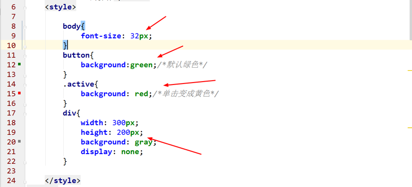
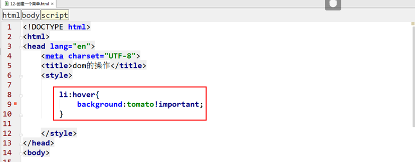
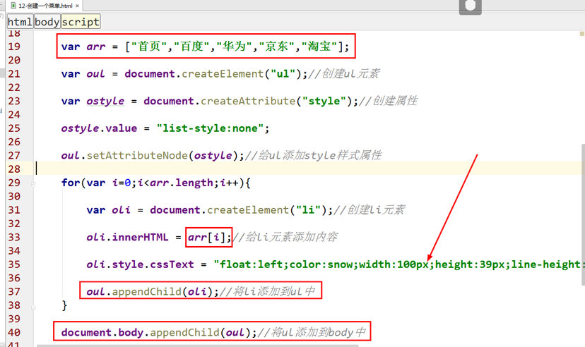

<h1>DOM初识

### 本节主要内容：

### 学习目标：

| 节数                    | 知识点           | 要求 |
| ----------------------- | ---------------- | ---- |
| 第一节 什么是DOM?       | DOM的介绍        | 了解 |
| 第二节 Document对象     | Document对象介绍 | 了解 |
| 第三节 Dom节点分类      | Dom节点分类      | 掌握 |
| 第四节 Document节点属性 | Document节点属性 | 掌握 |
| 第五节 获取页面元素节点 | 获取页面元素节点 | 掌握 |
| 第六节 创建页面元素     | 创建页面元素     | 掌握 |
| 第七节 操作页面元素属性 | 操作页面元素属性 | 掌握 |

 

## 什么是DOM?

DOM **D**ocument **O**bject **M**odel，[文档对象模型](http://baike.baidu.com/view/758570.htm)，DOM可以以一种独立于平台和语言的方式**访问和修改html文档的内容和结构。**

## Document对象

**Document** **对象是 HTML 文档的根节点。**

Document 对象使我们可以从脚本中对 HTML 页面中的所有元素进行访问。

Document 对象是 Window 对象的一部分，可通过 window.document 属性对其进行访问

 

## DOM节点分类

在 HTML DOM (Document Object Model) 中 , 每一个元素都是 节点:

文档是一个文档节点。

所有的HTML元素都是元素节点。

所有 HTML 属性都是属性节点。

文本插入到 HTML 元素是文本节点。are text nodes。

注释是注释节点。

## Document节点属性

### 返回文档内部的某个节点doctype,documentElement,body,head

1. doctype

2. documentElement

3. Body

4. Head

### 返回文档指定信息

documentURI，URL，domain，lastModified，location，title，readyState属性

1. documentURI:返回当前的网址（url）

2. URL

3. domain:返回当前的域名

lastModified

Location:

location.assign('传递一个url');

window.location = '传递一个url';

location.href = '传递一个url'; 

Title:

readyState

**readyState属性返回当前文档的状态。**

共有三种可能值：

加载HTML代码阶段（尚未完成解析）是“loading”，

加载外部资源阶段是“interactive”，

全部加载完成是“complete”。

### 返回文档内部特定节点的集合

anchors,forms,images,links,scripts

 

## 获取元素节点（重点）

### getElementById()

getElementById():通过标签的**id属性**获取元素

### getElementsByTagName()

getElementsByTagName():通过**标签名**来获取元素。**（数组）**

### getElementsByName()

getElementsByName():通过标签的**name属性**获取元素。（**数组**），

 

### getElementsByClassName()

getElementsByClassName():通过标签的**class属性**来获取元素。**（数组）**，**有浏览器兼容性，主要是ie8以下。**

### querySelector()

querySelector():通过css选择器来获取元素

### querySelectorAll()

querySelectorAll():通过css选择器来获取元素(数组)

### getElement和querySelector的区别

**query**选择符选出来的元素及元素数组是**静态的**，而**getElement**这种方法选出的元素是**动态的**。静态的就是说选出的所有元素的数组，不会随着文档操作而改变． 在使用的时候getElement这种方法性能比较好，query选择符则比较方便．

1.得到的元素不是需要很麻烦的多次getElementBy..的话，尽量使用getElementBy..,因为他快些。

2.得到的元素需要很麻烦的多次getElementBy..组合才能得到的话使用querySelector，方便。

3.看实际情况，你决定方便优先还是性能优先。

创建li元素，getElement创建元素，会造成死循环，而使用querySelecotor创建的li元素是可以的

### 实例：通过单击修改一个div块的内容

### 实例：选项卡的制作

普通实现：

使用let实现

### 作业：闭包实现选项卡

## 创建页面元素（重点）

### createElement()：创建元素节点

### createTextNode()：创建文本节点

### createAttribute()：创建属性节点

### className的使用

### 实例：创建一个菜单

创建哪些元素

Ul ,li,

设置属性：样式

## 操作页面元素属性

### 元素属性节点的操作

语法：

setAttribute('属性名','属性值')：给节点元素设置属性

getAttribute('属性名')：获取属性的值

removeAttribute('属性名')：删除属性

### style属性的操作

style对象的cssText属性

 

 

### style属性其他方法的操作

​    style对象提供了三个方法来读写行内css规则：

​    setProperty(propertyName,value)：设置某个CSS属性。

​    getPropertyValue(propertyName)：读取某个CSS属性的值。

​    removeProperty(propertyName)：删除某个CSS属性。

### setAttribute和setAttributeNode的区别

### 作业：使用DOM操作，在页面空白处单击，创建并显示一个宽度500，高度300，背景蓝色的div块元素。

### 作业：使用DOM操作，创建一张图片，并添加属性，给图片添加边框样式

 

 