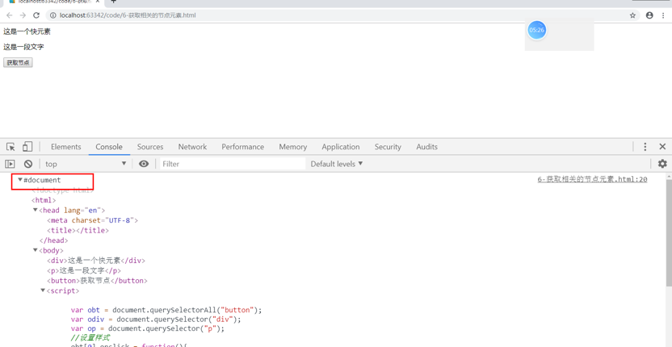
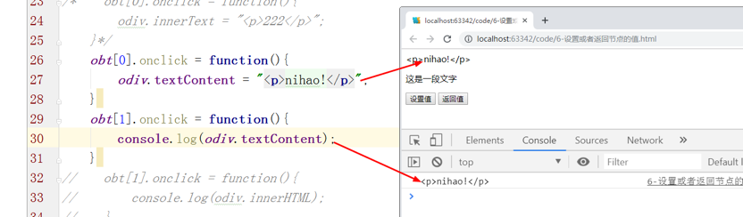
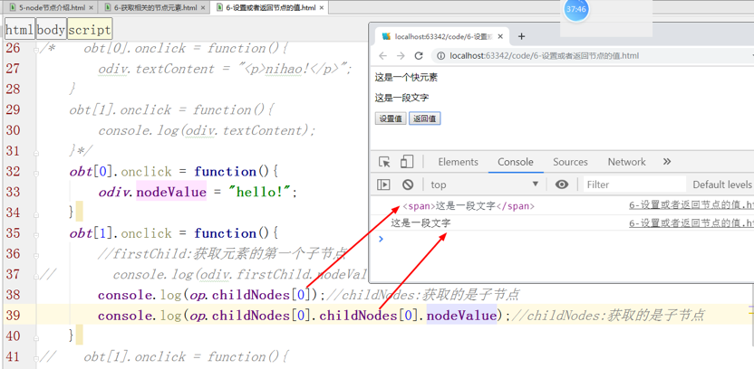
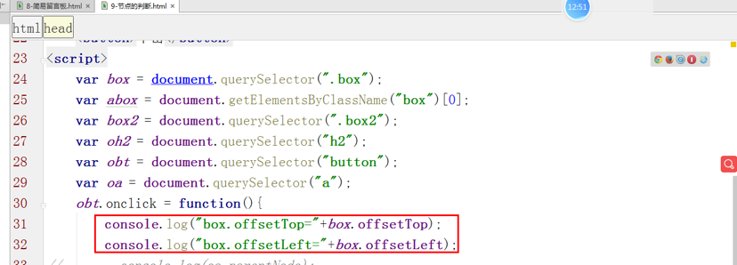
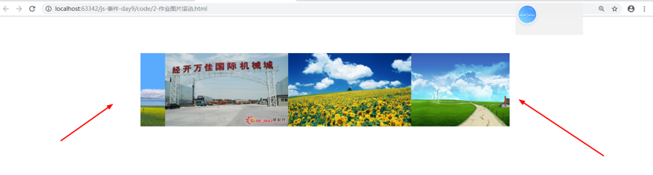

<h1>DOM深入

### 本节内容：

### 学习目标：

| 节数                      | 知识点             | 要求 |
| ------------------------- | ------------------ | ---- |
| 第一节 Node节点概述       | Node节点概述       | 了解 |
|                           | 事件分类           | 了解 |
| 第二节 Node属性           | 通用属性           | 了解 |
|                           | 相关节点属性       | 了解 |
|                           | Node内容属性       | 了解 |
|                           | Node子节点属性     | 了解 |
| 第三节 Node的方法         | Node的方法         | 掌握 |
| 第四节 html元素的操作方法 | html元素的操作方法 | 掌握 |
| 第五节 DOM的具体应用      | DOM的具体应用      | 掌握 |

 

## Node(节点)概述

DOM是文档对象模型的简称。它的基本思想是：

​    把结构化文档解析成一系列的节点，再由这些节点组成一个树状结构（DOM Tree）。

​    所有的节点和最终的树状结构，都有规范的对外接口，以达到使用编程语言操作文档的目的（比如增删内容）。

**node是DOM的最小组成单位，一个文档的树形结构就是由各种不同类型的节点组成。**

​    对于HTML文档，node主要有以下六种类型：

 

## Node的属性（重点）

### 通用属性

1、nodeName：获取节点名称

2、nodeType：获取节点类型

### 返回当前node的相关节点属性

1、ownerDocument

ownerDocument：返回当前节点元素的顶层对象-document

2、nextSibling和nextElementSibling

nextSibling:获取下一个兄弟节点元素

3、previousSibling

previousSibling:获取上一个兄弟节点元素

**nextSibling和previousSibling有空格和换行节点**

4、parentNode

parentNode：获取父节点元素

parentElement：获取父节点元素

parentElement

### 返回node内容属性

1、innerHTML

innerHTML：设置或者是返回html标签直接的内容

2、innerText

innerText：设置或者返回文本内容

HTML标签不能解析，会原样输出。

3、textContent

textContent：设置或者返回文本内容。

nodeValue：返回文本节点的值，只对文本节点有用。别的类型节点返回值为null。

### 返回当前node子节点相关属性

1、firstChild和firstElementChild

firstChild:获取第一个子节点

2、lastChild

lastChild：获取最后一个子节点

3、childNodes

childNodes：获取子节点（数组）

**总结说明：childNodes可以获取元素节点和文本节点。**

 

4、Children

Children：获取子节点（数组）

**总结说明：children只能获取元素节点，不能获取文本节点。**

### 实例：隐藏元素

分析一下，实现思路：display:none;

### 实例：全选和取消全选

**通过checked属性来设置，值是true和false**

## Node的方法(重点)

### 节点的增删改查

1、appendChild

appendChild()：向后添加（追加）子节点

2、cloneNode

cloneNode()：克隆子节点

3、insertBefore

insertBefore()：向前添加子节点

4、removeChild

removeChild()：删除子节点

5、replaceChild 

replaceChild()：修改子节点

### 节点的判断

hasChildNodes():判断是否有子节点（true,false）

**空白节点也是子节点**

contains()：判断是否包含指定的子节点（true,false）

isEqualNode():判断两个节点是否相等

### 实例：制作简易留言板

分析一下，实现的思路：通话获取的文本框的值，添加到元素中，在元素中显示。

**1.向后添加内容**

**2.** **向前添加内容**

## HTML元素操作方法

### 元素位置相关属性

offsetParent属性：获取当前节点的css是position的值是absolute(绝对),relative(相对的)的父元素节点。获取有定位的父元素。

### offsetTop属性和offsetLeft属性

offsetTop属性：获取当前节点距离父元素的顶部距离。

offsetLeft属性：获取当前节点距离父元素的左侧距离。

### 元素的高度和宽度

offsetWidth    //返回元素的宽度（包括元素宽度、内边距和边框，不包括外边距）

offsetHeight    //返回元素的高度（包括元素高度、内边距和边框，不包括外边距）

clientWidth     //返回元素的宽度（包括元素宽度、内边距，不包括边框和外边距）

clientHeight    //返回元素的高度（包括元素高度、内边距，不包括边框和外边距）

### 实例：块运动

## Dom的具体实例

### 案例：全选和取消全选

### 案例：图片的滚动

分析一下，实现思路：

实现动画效果，使用setInterval(),图片个数变成2倍，从4张变成8张，目的就是让图片实现无缝滚动，图片向左一直滚动，当图片滚动到将近一半的时候，从头开始滚动。

图片向左向右运动

###  案例：日历的制作

 

 