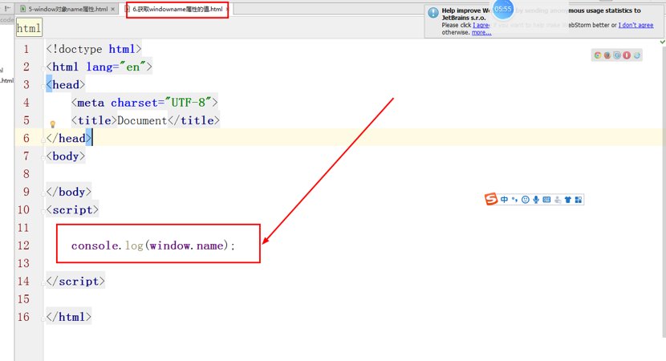
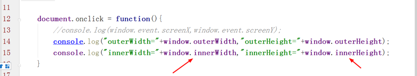
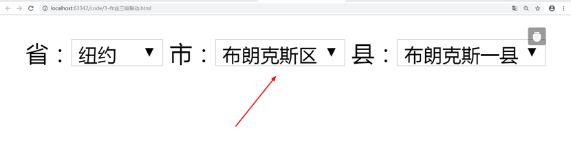
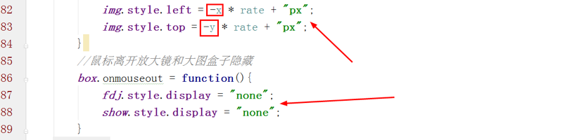
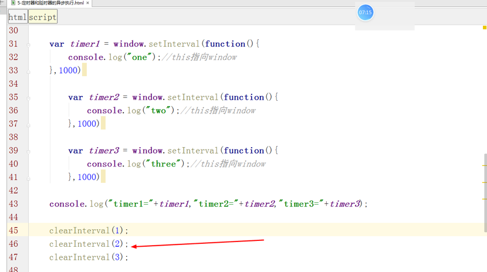
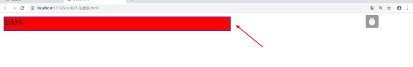

<div align="center"><h1>window对象（上）


### 本节主要内容：


### 学习目标：

| 节数                      | 知识点               | 要求 |
| ------------------------- | -------------------- | ---- |
| 第一节 BOM的概念          | 什么是BOM            | 了解 |
|                           | BOM包含哪些内容      | 了解 |
| 第二节 window对象         | 关于window对象       | 了解 |
|                           | window对象常用的属性 | 了解 |
|                           | window对象常用的方法 | 了解 |
| 第三节 提示框             | 提示框               | 掌握 |
| 第四节 间隔调用和延迟调用 | 间隔调用和延迟调用   | 掌握 |

 

## BOM的概念

### 什么是BOM?

BOM：**Browser Object Model** **是浏览器对象模型**，BOM由多个对象构成，其中代表浏览器窗口的**window对象是BOM的顶层对象也是核心对象**，其他对象都是该对象的子对象。

### BOM包含哪些内容？

1、浏览器介绍

2、BOM对象包含

(1)  **window** **对象，是 JS 的最顶层对象**，其他的 BOM 对象都是 window 对象的属性。

(2)  document 对象，文档对象；

(3)  location 对象，浏览器当前URL信息；

(4)  navigator 对象，浏览器本身信息；

(5)  screen 对象，客户端屏幕信息；

(6)  history 对象，浏览器访问历史信息；

在浏览器中，window对象有双重角色，它既是通过javascript访问浏览器窗口的一个接口，又是ECMAScript规定的Global对象。 

所有 JavaScript 全局对象、函数以及变量均自动成为 window 对象的成员。

**全局变量是 window 对象的属性。**

**全局函数是 window 对象的方法。**


### BOM和DOM的关系

(1)DOM通过document对象来访问、控制、修改html和xhtml等文档中的内容 

(2)BOM通过 window 对象来访问、控制、修改浏览器中的内容

联系：BOM包含DOM。
 区别：DOM描述了处理网页内容的方法和接口，即操作页面内部

BOM描述了与浏览器进行交互的方法和接口，即操作页面之间 


 

## window对象

所有浏览器都支持 window 对象。它表示浏览器窗口。

所有 JavaScript 全局对象、函数以及变量均自动成为 window 对象的成员。

**全局变量是 window 对象的属性。**

**全局函数是 window 对象的方法。**

### window对象

因为window对象是js中的顶级对象，因此所有定义在全局作用域中的变量、函数都会变成window对象的属性和方法，在调用的时候可以**省略window**。

例如：

打开窗口 window.open(url); 【等价于open(url);】

关闭窗口 window.close();     【等价于close();】

获取事件 window.event   【等价于event;】

获取文档 window.document 【等价于document】


### window对象中常用的属性

1、window.name 

属性：

window.name是window对象的一个属性，默认值为空。

特性：

window.name值在不同的页面（甚至不同域名）加载后依旧存在,

并且可以支持非常长的name值（2MB左右）




### 浏览器距离屏幕的距离

window.screenX

window.screenY


### window尺寸属性

**outerHeight属性**设置或返回一个窗口的外部高度，包括所有界面元素（如工具栏/滚动条）。

**outerWidth属性**设置或返回窗口的外部宽度，包括所有的界面元素（如工具栏/滚动条）。

**innerheight** 返回窗口的文档显示区的高度。

**innerwidth** 返回窗口的文档显示区的宽度。




### document对象

### window.navigator对象

window.navigator对象包含大量有关Web浏览器的信息，在检测浏览器及操作系统上非常有用。（这个对象和event一样是一个全局变量，并且是唯一的）

navigator.appCodeName     //浏览器代码名的字符串表示 

navigator.appName          //官方浏览器名的字符串表示 

navigator.appVersion            //浏览器版本信息的字符串表示 

navigator.userAgent          //返回和浏览器内核相关的信息

navigator.cookieEnabled         //如果启用cookie返回true，否则返回false 

navigator.javaEnabled()      //如果启用java返回true，否则返回false 

navigator.platform           //浏览器所在计算机平台的字符串表示 

navigator.plugins                 //安装在浏览器中的插件数组 

ps:如果window.navigator.userAgent出现了Mobile，可以确定用户使用的是移动设备。


### Location 对象

·    location.hostname 返回 web 主机的域名

·    location.pathname 返回当前页面的路径和文件名

·    location.port 返回 web 主机的端口 （80 或 443）

·    location.protocol 返回所使用的 web 协议（http: 或 https:）


search 属性是一个可读可写的字符串，可设置或返回当前 URL 的查询部分（问号 **?** **之后**的部分）


### screen对象

 

### window对象中常用的方法


 

### 实例：三级联动菜单




 

## 提示框

### 警告框


### 输入框

prompt(alertMsg,defaultMsg);   

表示警示框，作用是提示用户信息，该方法执行后根据情况不同返回值略有不同。

a)点击取消,返回值为null

b)没有默认值

​            如果用户没有输入内容，返回一个空字符串

​            如果用户输入了内容，返回值为用户输入的内容

c)有默认值

​            如果用户没有输入内容，返回默认值

​            如果用户修改了默认，返回值为用户输入的内容


 

### 确认框


### 实例：自定义右键菜单


### 实例：放大镜效果





## 间隔调用和延迟调用

### 定时器

**setInterval(表达式，毫秒数)**

**语法：var timer = null；**

**timer = setInterval(需要执行的函数，执行间隔时间ms)；**

例如：

```javascript
var timer = setInterval(function(){
     console.log('hello world!');
},2000);
```


**总结说明：**

1、要把定时器下边的任务执行完毕后 才会去执行定时器的内容
2、定时执行中**this指向window**
3、每创建一个定时器 就会有一个**唯一的id被返回** id从开始 之后累加


4、清除定时器时 不仅**可以使用变量 也可以使用唯一Id清除**



5、当定时执行的**函数是包含参数时 则应该 将函数和参数 使用引号**包裹起来


首先明确两点：

1.JS 执行机制是单线程。

2.JS的Event loop是JS的执行机制

按照这种的分类方式JS的执行机制是：

**异步的编程思想：**

首先，判断JS是同步还是异步，同步进入主线程，异步进入Event table

其次，异步任务在Event table中注册函数，当满足特定的条件，被推入Event queue（消息队列）最后，同步任务进入主线程后一直执行，直到主线程空闲后，才会去Event queue中查看是否有可执行的异步任务，如果有就推入主线程中执行。

**清除间隔调用**

​    既然间隔调用每隔一段时间就会自动执行一次，那么清除间隔调用就势必存在。

​    语法：clearInterval(变量标识)

​    例如：clearInterval(timer);

​    上述代码就能够将刚刚创建的定时器移除掉，令其不在间隔一段时间后自动再次执行。

注意：

​    (1)间隔调用的返回值是一个数字队列，因此通过访问数字队列来清除间隔调用也被允许。


注意：

​    (2) 如果间隔调用的函数需要传入参数，则间隔调用需要使用如下的方式声明

​    语法：var timer = null;

​          timer = setInterval(字符串,执行间隔事件ms)；

​    例如：var timer = null;

​          function show(words){console.log(words);} 

​          timer = setInterval('show("hello world!")',2000);

​    (3) 间隔调用不是立即执行，而是在【任务队列中的任务完成后】才执行间隔调用

​    (4) 因为间隔调用函数的实际执行者是window，因此间隔调用内部的this指向window

### 延时器

延迟调用又叫延迟调用函数。是一种能够等待一定时间后在执行的函数。

​    语法：var timer = null;

​          timer = setTimeout(需要执行的函数，等待的时间);

​    例如：var wait = null；

​          wait = setTimeout(function(){

​                console.log('hello world!');

​          },2000);

​    根据语法所述，上述代码所表示的含义为：等待2s后打印一句【hello world！】

注意：延迟调用除了在语法上和间隔调用略有不同外，其余语法均相同。


(1)阅读下列代码，口算打印结果

**setInterval(function () {console.log(1111);},0);
 setTimeout(function () {console.log(2222);},0);**
 (2)阅读下列代码，口算打印结果

​    var div = document.getElementsByTagName("div").item(0);
​    div.onclick = function () {
​        setTimeout(function () {console.log(this);}, 1000);
​    };

### 实例：时间走动


 

### 实例：倒计时


### 实例：进度条的加载


