<div align="center"><h1>window对象(下) </div>


### 本节主要内容：

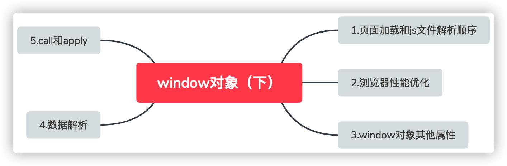

### 学习目标：

| 节数                            | 知识点               | 要求 |
| ------------------------------- | -------------------- | ---- |
| 第一节 页面加载和js文件解析顺序 | 一个页面的加载过程   | 了解 |
|                                 | defer和async         | 了解 |
| 第二节 浏览器性能优化           | 回流和重绘           | 了解 |
|                                 | documentFragment概述 | 了解 |
| 第三节 window对象其他属性       | history对象          | 掌握 |
| 第四节 数据解析                 | 数据解析             | 掌握 |
| 第五节 call和apply              | call的使用           | 掌握 |
|                                 | apply的使用          | 掌握 |
|                                 | call和apply的区别    | 掌握 |

 

## 页面加载和js文件解析顺序

### 服务器端和客户端

 

### 一个页面的加载过程

1.用户输入网址（假设是个html页面，并且是第一次访问），浏览器向服务器发出请求，服务器返回html文件；

2.浏览器开始载入html代码，发现＜head＞标签内有一个＜link＞标签引用外部CSS文件；

3.浏览器又发出CSS文件的请求，服务器返回这个CSS文件；

4.浏览器继续载入html中＜body＞部分的代码，并且CSS文件已经拿到手了，可以开始渲染页面了；

5.浏览器在代码中发现一个＜img＞标签引用了一张图片，向服务器发出请求。此时浏览器不会等到图片下载完，而是继续渲染后面的代码；

6.服务器返回图片文件，由于图片占用了一定面积，影响了后面段落的排布，因此浏览器需要回过头来重新渲染这部分代码；

7.浏览器发现了一个包含一行Javascript代码的＜script＞标签，赶快运行它；

Javascript脚本执行了这条语句，它命令浏览器隐藏掉代码中的某个＜div＞ （style.display=”none”）。杯具啊，突然就少了这么一个元素，浏览器不得不重新渲染这部分代码；

8.终于等到了＜/html＞的到来，浏览器泪流满面……

9.等等，还没完，用户点了一下界面中的“换肤”按钮，Javascript让浏览器换了一下＜link＞标签的CSS路径；

10.浏览器召集了在座的各位＜div＞＜span＞＜ul＞＜li＞们，“大伙儿收拾收拾行李，咱得重新来过……”，浏览器向服务器请求了新的CSS文件，重新渲染页面。

### defer

defer属性：等待DOM加载完成后才去加载JS脚本

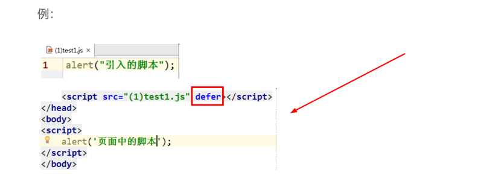

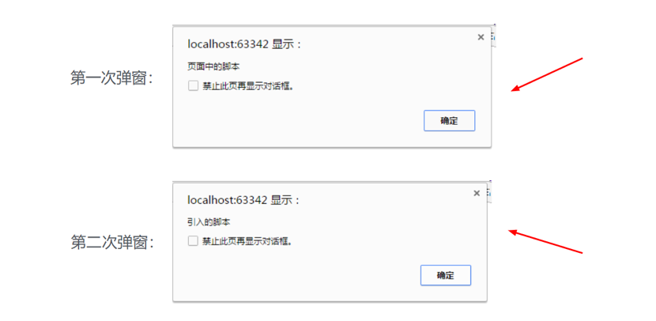

### async

​    async属性：DOM加载和js脚本加载异步执行，同时进行。

​    async优势：避免了因DOM文件过大导致的【文件加载阻塞】

​    async缺陷：无法确定js脚本到底何时执行，并仅对外部js脚本生效

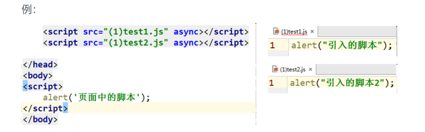

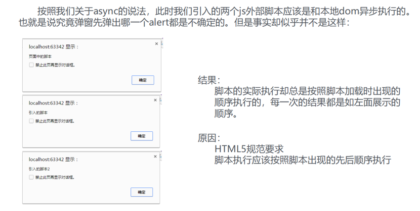

### 不添加任何属性的js脚本

​    js脚本在不受任何外界因素影响的时候，实际上就是按照html代码的加载顺序执行的。因此【不添加任何属性的js脚本】总是会在【引入脚本的节点】加载完毕之前执行。

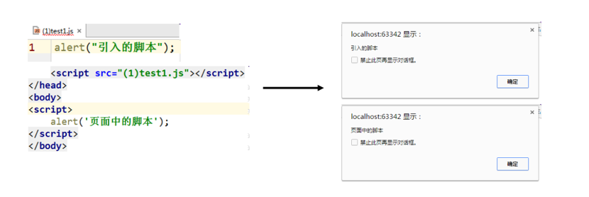

 

## 浏览器性能优化

### 什么是回流

当render tree中的一部分(或全部)因为元素的规模尺寸，布局，隐藏等改变而需要重新构建。**这就称为回流**。每个页面至少需要一次回流，就是在页面第一次加载的时候。

### 什么是重绘

当render tree中的一些元素需要更新属性，而这些属性只是影响元素的外观，风格，而不会影响布局的，比如background-color。则**就叫称为重绘**。

**注：回流必将引起重绘，而重绘不一定会引起回流。**

### 引起重绘和回流的原因

1.页面初始渲染

2.改变字体，改变元素尺寸（宽、高、内外边距、边框，改变元素位置等）

（注意：如果修改属性不影响布局则不会发生重排）

3..改变元素内容（文本或图片等或比如用户在input框中输入文字）

4.添加/删除可见DOM元素（注意：如果是删除本身就display:none的元素不会发生重排；visibility:hidden的元素显示或隐藏不影响重排）

5.fixed定位的元素,在拖动滚动条的时候会一直回流

6.调整窗口大小（Resizing the window）

7.计算 offsetWidth 和 offsetHeight 属性

### 如何从重绘和回流方面提高浏览器性能

1.不要一项一项的去改变样式，尽可能一口气写完。(可以写在一起，不要被打断就行)最好使用.style.cssText

2.读写DOM也尽量也放在一起

3.使用文档碎片 var linshi = document.createDocumentFragment();

4.使用fixed或者absolute可以减少回流和重绘

### DocumentFragment简单描述

documentFragment是nodeType值为11，nodeName的值为#document-fragment.

1) documentFragment是一个文档片段，一种‘轻量级节点’

2) 通常作为仓库来使用，不存在DOM树上，是一种游离态

DocumentFragment的用途

当我们用JS的DOM创建很多节点时，在加入节点到DOM树上时，节点需要一个个渲染，这样节点数较多时就会影响浏览器的渲染效率，**这个时候我们将创建的节点都放在DocumentFragment这样的节点上** ，然后把DocumentFragment加入至DOM，只需要完成一次渲染就可以达到之前很多次渲染的效果！！！

举个栗子（创建100个li元素内容为1-100）：

 var ul = document.createElement('ul');

 var flag = document.createDocumentFragment();

 for(var i=1; i<101;i++){

   var li = document.createElement('li')

   var liText = document.createTextNode(i);

   li.appendChild(liText);

   flag.appendChild(li);

 }

 ul.appendChild(flag);

 document.body.appendChild(ul);

### 实例：带有提示的滑动条

分析一下：

主要有三个事件：onmousedown,onmousemove,onmouseup

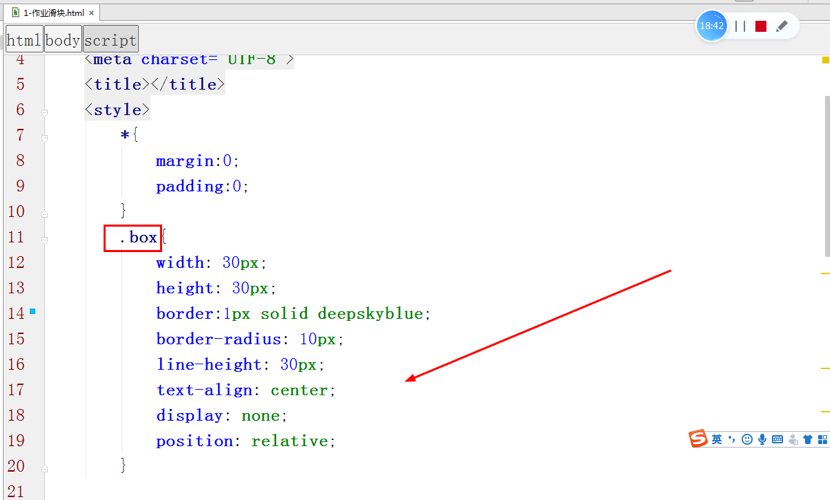

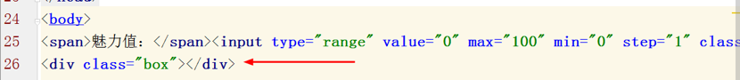

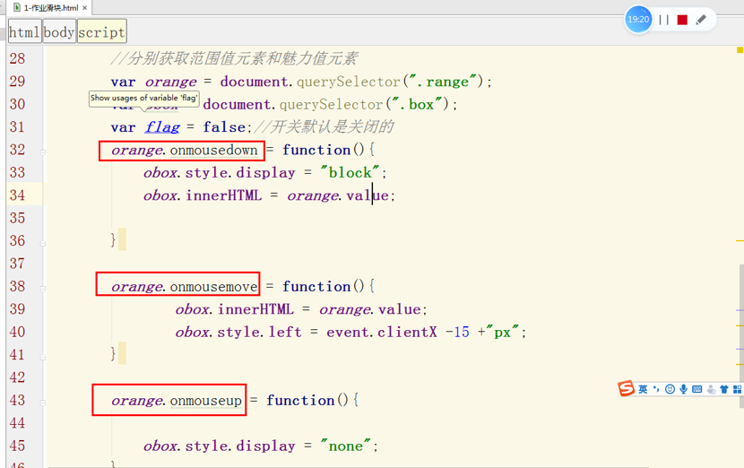

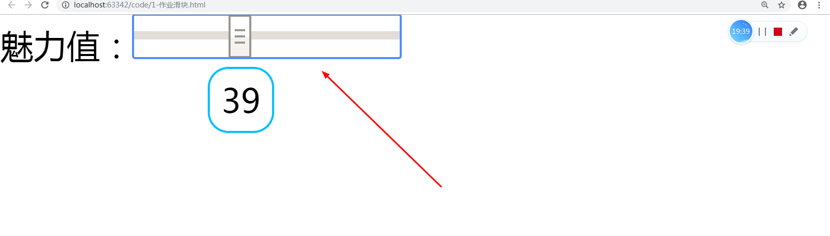

### 实例：改变字体大小和颜色

1、获取select中option中的值

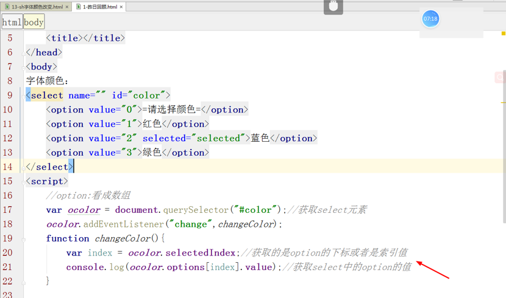

2、改变字体大小和颜色

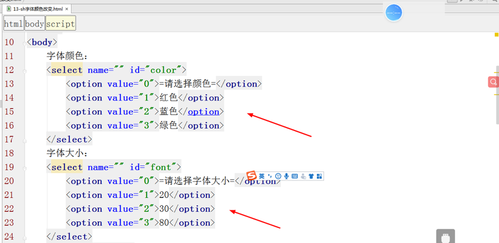

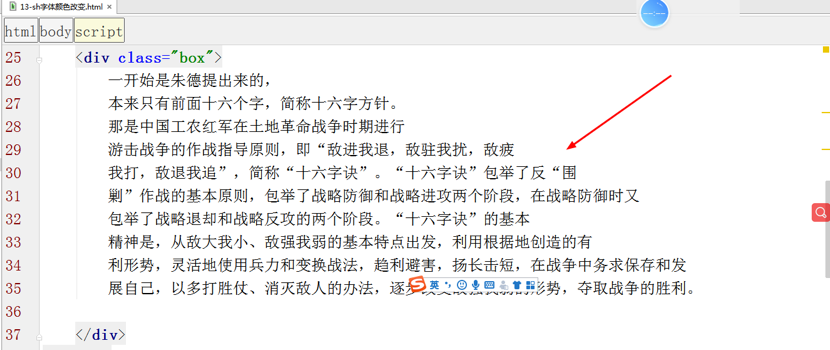

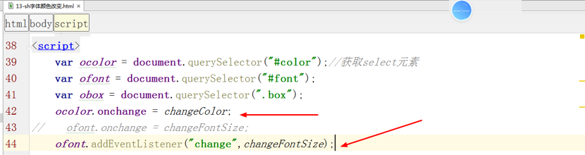

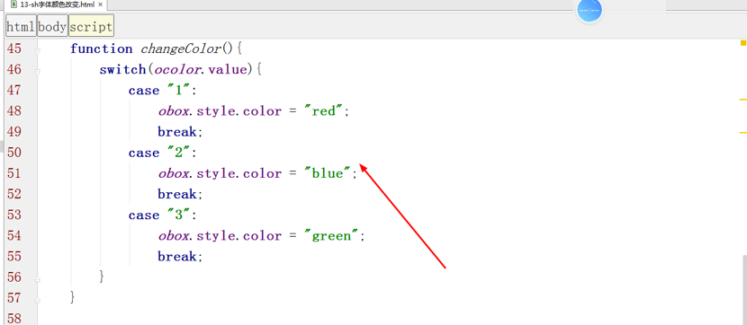

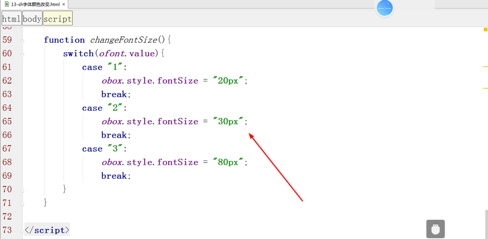

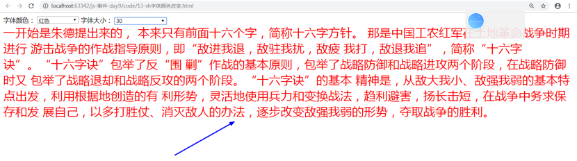

## window对象其他属性

### history对象

window.history对象表示整个浏览器的页面栈对象。在对象中提供了一些属性和方法来帮助更好的控制整个浏览器中页面的访问。

​    (1)window.history.back()     跳转到栈中的上一个页面

​    (2)window.history.forward()  跳转到栈中的下一个页面

​    (3)window.history.go(num)   跳转到栈中的指定页面

### 存储对象

JavaScript 存储对象

Web 存储 API 提供了 sessionStorage （会话存储） 和 localStorage（本地存储）两个存储对象来对网页的数据进行添加、删除、修改、查询操作。

sessionStorage：用于临时保存同一窗口(或标签页)的数据，在关闭窗口或标签页之后将会删除这些数据。

localStorage：用于长久保存整个网站的数据，保存的数据没有过期时间，直到手动去除。

保存数据：setItem(key,value)

读取数据：getItem(key)

删除单个数据：removeItem(key)

删除所有数据：clear()

得到某个索引的key(index)

```js
		localStorage.setItem('username','xiaoming');
		localStorage.password = '123456';
		
		document.body.innerHTML = "username:" + localStorage.getItem('username');
		document.body.innerHTML += "<br>password:" + localStorage.password
		
```

```js
		sessionStorage.username = "xiaoming123";
		sessionStorage.password = "123456123";
		document.body.innerHTML = "username:" + 			   	     sessionStorage.getItem('username');
		document.body.innerHTML += "<br>password:" + sessionStorage.password
```


## 数据解析

数据解析：将【不能被直接使用的数据】通过某种方法转变为【能够被直接使用的数据】的过程称为数据解析。

​    而对于开发者来说最常见的数据解析就是将【字符串数据】解析为【对象数据】

例如：

假设我们得到了一个字符串数据为：

var data ="?name=frank&age=18&sex=male";

很显然这样一个字符串是没有办法直接为我们所用，因此我们可以通过如下的手段将这个字符串变更为一个对象。

​        var infoArr = window.location.search.slice(1).split("&");
​        var obj = {};
​        for(var i=0;i<infoArr.length;i++){
​              var temp = infoArr[i].split("=");
​            if(temp[0]){obj[temp[0]] = temp[1];}
​        }

 

表单数据解析

将表单中的数据先转换成数组，再转换成对象，最后将数据添加到对象中

## call和apply

**调用方法，替换对象。**

1、**每个函数都包含两个非继承而来的方法**：call()方法和apply()方法。

2、call()、apply()都是用来**重定义 this 这个对象的**

3、相同点：这两个方法的作用是一样的。

**都是在特定的作用域中调用函数，等于设置函数体内this对象的值，以扩充函数赖以运行的作用域。**

一般来说，this总是指向调用某个方法的对象，但是使用call()和apply()方法时，就会改变this的指向。

### call的使用

这两个方法就是用来调用函数的。语法如下：

call(对象,[形参, 形参])

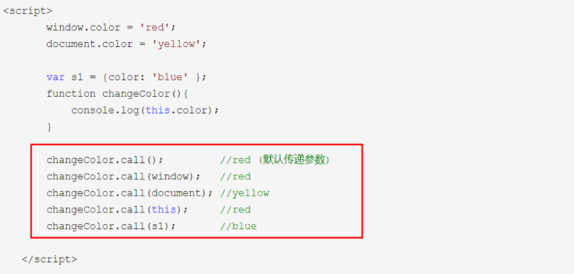

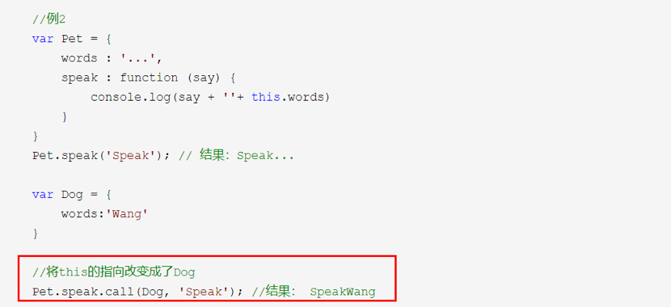

### apply的使用

apply(对象,[array(形参数组)])

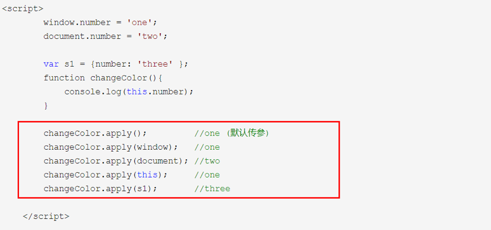

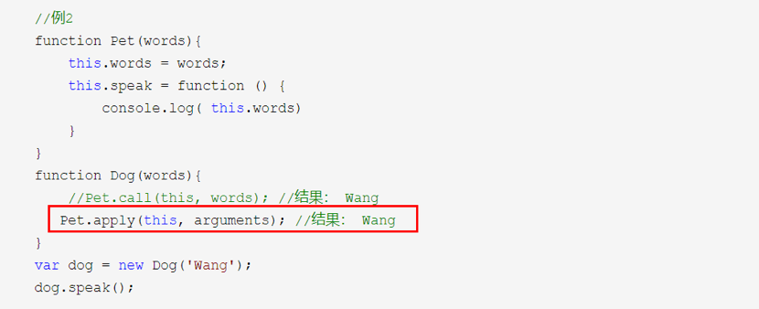

### call和apply的区别

从定义中可以看出，call和apply都是调用一个对象的一个方法，用另一个对象替换当前对象。而不同之处在于传递的参数，apply最多只能有两个参数——新this对象和一个数组argArray，如果arg不是数组则会报错TypeError；

call则可以传递多个参数，第一个参数和apply一样，是用来替换的对象，后边是参数列表。

实例：

1、防抖:高频事件触发时防止高频次执行特定程序

当高频事件触发时，只有在两次高频事件间隔一定时间后才会执行特定程序。

如果n秒内高频事件再次发生，则重新计时。

思路：每次事件触发时，都取消上次等待执行的特定程序，重新等待。需要使用延时函数。

```HTML
<body>
		<input type="text" name="" id="" value="" />
</body>
```

```js
<script type="text/javascript">
		var ipt = document.querySelector("input");
		ipt.oninput = pr(work,500);
		
		function pr(fn,delay){
			var timer = null;
			return function(){
				clearTimeout(timer);
				timer = setTimeout(function(){
					// fn();
					// fn.apply(this,[11,22,33])
					fn.call(this,11,22,33);
				},delay)
			}
		}
		function work(a,b,c){
			console.log(a,b,c);
			console.log(ipt.value);
		}
	</script>
```


 2、节流

当高频事件触发时，在n秒内只会执行特定程序一次，本次不执行完成，不会执行下一次。

节流会稀释特定程序被执行的次数。

思路：每次触发执行特定程序前，都先判断一下是否有等待执行的特定程序，如果有，则本次不执行特定程序。需要使用延时函数。

```javascript
function pr(fn){
			var isRunnging = false;
			return function(){
				if (isRunnging) {
					return;
				}
				isRunnging = true;
				setTimeout(()=>{
					// fn();
					fn.apply(this);
					isRunnging = false;
				},3000);
			}
		}
		window.onresize = pr(work);
		
		function work(){
			console.log(window.outerWidth)
			console.log(window.outerHeight)
		}
```


 

 