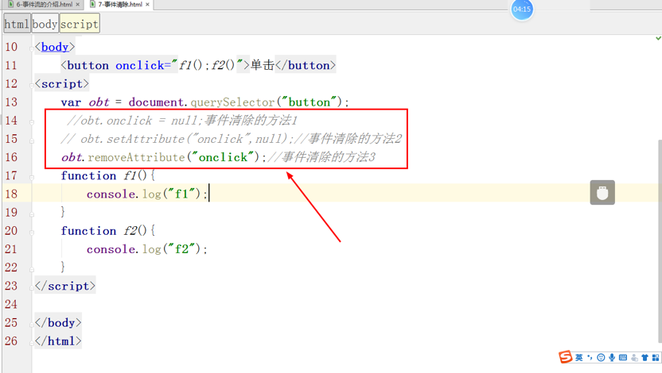
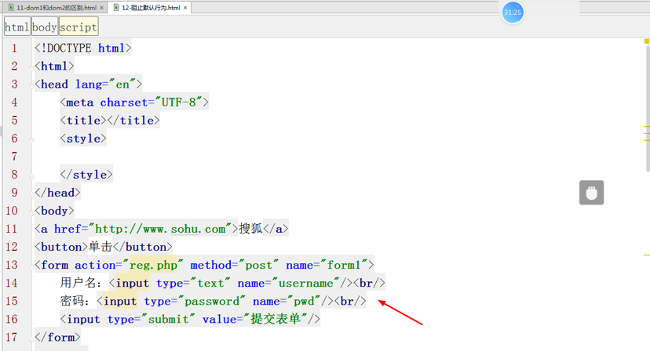
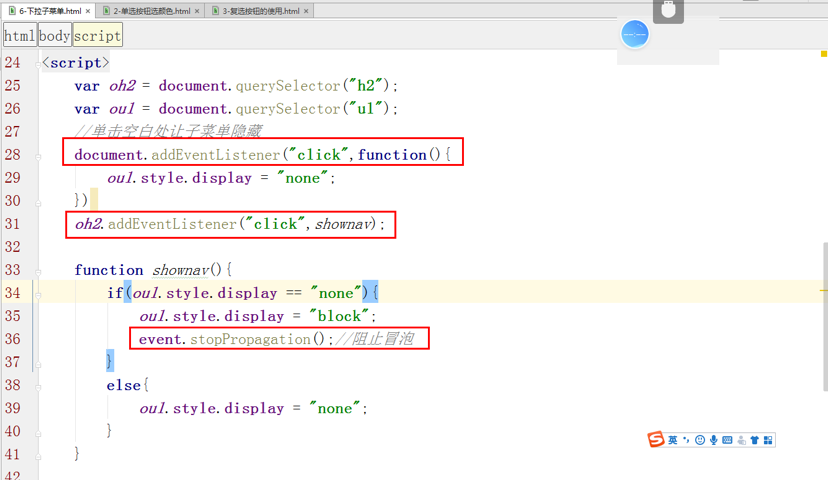

<h1>JS事件初识

### 主要内容：

### 学习目标：

| 节数                  | 知识点       | 要求 |
| --------------------- | ------------ | ---- |
| 第一节 事件概述       | 什么是事件   | 了解 |
|                       | 事件分类了解 | 了解 |
| 第二节 浏览器中的事件 | HTML事件     | 了解 |
|                       | DOM0级事件   | 了解 |
|                       | DOM2级事件   | 了解 |
|                       | 事件流       | 了解 |
| 第三节 ie浏览器事件   | ie浏览器事件 | 掌握 |
| 第四节 事件的兼容性   | 事件的兼容性 | 掌握 |
| 第五节 鼠标事件       | 事件分类     | 掌握 |

 

## 关于事件

### 什么是事件

**事件就是在文档中或者在浏览器窗口中触发的某些动作**。比如，单击，鼠标经过，键盘按下等。事件**通常和函数结合**使用。

事件的作用：

(1)各个元素之间可以借助事件来进行交互      

(2)用户和页面之间也可以通过事件来交互

(3)后端和页面之间也可以通过事件来交互（减缓服务器的压力）

onsubmit(提交事件和表单一起使用)

### 事件分类

1、鼠标事件
 onclick、ondblclick、onmouseover、onmouseout、onmousedown、onmouseup、onmousemove

 2、HTML事件
 onload、onscroll、onsubmit、onchange、oninput、onfoucs(获取焦点)、onblur(失去焦点)

 3、键盘事件
 onkeydown: 键盘按下时触发
 onkeypress:键盘按下并松开的瞬间触发
 onkeyup: 键盘抬起时触发

## 事件的使用（重点）

### HTML事件

绑定操作发生在HTML代码中的事件，称为HTML事件。

语法：on+事件=‘函数();函数();函数();……‘

**HTML事件的移除方式：**

**元素.setAttribute('on+事件名'，null);**

HTML事件缺陷：耦合性太强了，修改一处另一处也要修改。

当函数没有加载成功时，用户去触发事件，则会报错。

### DOM0级事件

DOM0事件调用函数的几种方式：

（1）节点.事件=function(){}

（2）节点.事件=函数名

（3）<input type="button" onclick="函数名">

 

在js脚本中，直接通过【on+事件名】方式绑定的事件称为是DOM0级事件。

语法：

元素.on+事件名 = function(){需要执行的语句;}

元素[on+事件名] = function(){需要执行的语句;}

DOM0级事件的移除方式：

元素. on+事件名=null;

### DOM2级事件

#### 冒泡

什么是事件冒泡?

事件由具体某个元素（子节点）逐级向上传播（父节点，比如html）

#### 捕捉

什么是事件捕捉？

事件由某个具体的元素（父节点）逐级向下传播（子节点）。

#### 事件流

**事件流：**多个**嵌套的标记**或者包含的标记**拥有相同的事件**，**其中一个元素的事件触发**，同时影响其他元素同类型的事件的触发，我们称之为“事件流”。

#### 事件流语法

方式1：对象.addEventListener(“事件类型”,”函数”,“事件流”);**针对非ie浏览器的，事件类型：不加on**

方式2：对象.attachEvent(“事件类型”,”函数”);**针对ie浏览器的,事件类型：加on**

事件流有两种：

1、**冒泡型**（事件**由内到外**），默认值：false

2、**捕捉型**（事件**由外到内**）值：true

在js脚本中，通过addEventListener函数绑定的事件称为是DOM2级事件。

语法：元素.addEventListener(type,listener,useCapture)

type:事件类型。【没有on！没有on！没有on！】
 listener:监听函数，绑定的函数
 useCapture:是否使用捕获机制。如果不写，默认值为false
 false:冒泡机制
 true：捕获机制
 注意:DOM2级事件可以绑定多个函数，执行顺序按照函数书写的顺序。

DOM2级事件的移除方式：

node.removeEventListener(type,外部函数名,useCapture)

#### Dom2事件的传参数

### DOM0和DOM2的区别

#### DOM0如果你写了多个事件，只应用最后一个！

#### Dom2如果您写了多个事件，它会都应用

实例：单击按钮，给div标签添加样式，**宽，高，背影颜色分别定义三个函数**，分别使用DOM0和dom2的方式来做。

### 怎样阻止冒泡

**stopPropagation()：针对非ie浏览器阻止冒泡,阻止事件的派发**

**cancelBubble=true：针对ie浏览器**

### 怎样阻止默认行为

**preventDefault()**

**returnValue = false**

### 实例：单选按钮选颜色

### 实例：多选按钮选颜色

### 实例：树形菜单阻止冒泡

 

## IE浏览器中的事件

### 事件绑定

在js脚本中，通过attachEvent函数绑定事件

语法：元素.attachEvent(type,listener)

**type:事件类型。【有on！有on！有on！】**
 listener:监听函数，绑定的函数
 注意:如果绑定多个函数，按照函数书写的**倒叙**执行。

### 事件解除

IE下DOM2级事件的移除方式：

元素.detachEvent(type,listener)

ps：匿名函数无法被移除。

 

## 事件兼容性问题

### 兼容性问题

由于【IE浏览器中的事件绑定】和【非IE浏览器中的事件绑定】方式方法都有所不同。所以单一的某种函数都不能完美解决不同浏览器下的方法绑定问题。

### 兼容性封装

 

## 鼠标事件

### 关于鼠标事件

鼠标单击是触发：click 
 鼠标双击是触发：dbclick

鼠标按下时触发：mousedown 
 鼠标抬起时触发：mouseup

鼠标移动时触发：mousemove 
 **鼠标移入时触发(不冒泡)： mouseenter**

鼠标移出时触发(不冒泡)： mouseleave 
 **鼠标移入时触发(冒泡)： mouseover**

鼠标移出时触发(冒泡)： mouseout

语法：元素.on+鼠标事件名称 = 调用函数

例如：d1.ondblclick = function () { console.log('这是d1');}

### mouseover和mouseenter的区别

### 实例：调色板

### 实例：div跟随鼠标移动

