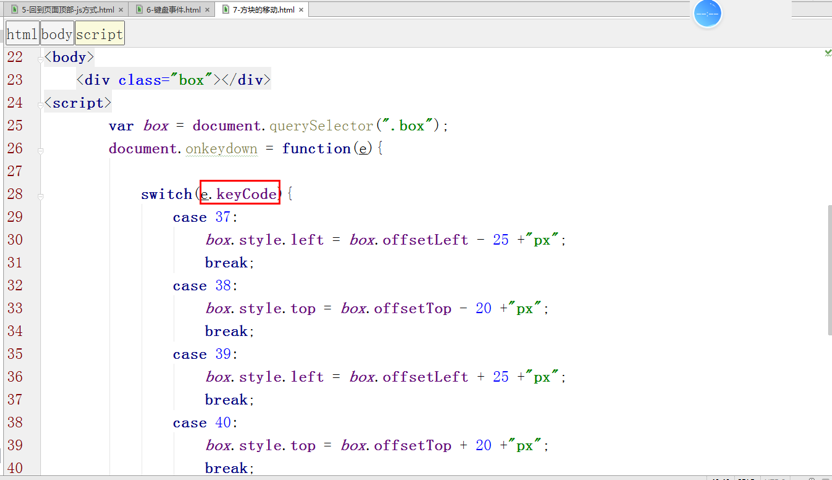
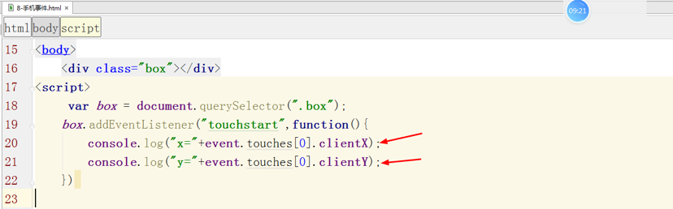

<h1>JS事件深入

### 本节主要内容：

### 学习目标：

| 节数                | 知识点         | 要求 |
| ------------------- | -------------- | ---- |
| 第一节 表单文档事件 | 获取焦点事件   | 了解 |
|                     | 失去焦点事件   | 了解 |
| 第二节 键盘事件     | 键盘事件的种类 | 了解 |
|                     | 键盘属性       | 了解 |
| 第三节 滚动事件     | 回到页面顶部   | 掌握 |
|                     | 滚动事件       | 掌握 |
|                     | 滚动事件的属性 | 掌握 |
| 第四节 手机触摸事件 | 手机触摸事件   | 掌握 |
| 第五节 表单注册案例 | 表单注册案例   | 掌握 |

## 表单元素事件

​    **焦点**：js当前正在和用户发生交互的节点称为焦点。可以类比为人类目光汇聚的地方。

​    语法：获得焦点和失去焦点事件既可以使用DOM0绑定也可以使用DOM2绑定

**总结说明：**

**这两个事件均不支持事件冒泡。**

### 获得焦点事件

**i2.onfocus** = function () {console.log("i2获得了焦点")};

i1.addEventListener('**focus**', function () {console.log('i1获得焦点');}, true);

### 失去焦点事件

i1.addEventListener('**blur**', function () {console.log('i1失去焦点');}, true);

i2.**onblur** = function () {console.log("i2失去了焦点")};

### oninput事件和onchange事件

onchange:元素发生变化的时候，就会触发。

oninput:当给元素输入内容的时候，就会触发。

**区别：**

**onchange:当失去焦点的时候才会触发此事件。**

**oninput:当输入内容的时候，会立即触发。**

 

## 键盘事件

### 键盘事件种类

​    键盘事件是指当用户在操作键盘的时候会自动被触发的事件，通常有以下三种：

(1) onkeydown:用户按下任意键都可以触发这个事件。如果按住不放，事件会被连续触发。
 (2) onkeypress:用户按下任意键松开后都可以触发这个事件(功能键除外)。
 (3) onkeyup: 用户释放按键时触发

ps：**键盘事件一般绑定在需要用户输入的元素上(例如input)**，但是由于键盘事件默认采用事件冒泡机制，因此将键盘事件直接**绑定在body之上也是允许的**。

### 键盘属性

key和keyCode属性

Key:具体是哪一个键
 keyCode:返回keydown何keyup事件发生的时候按键的代码，以及keypress 事件的Unicode字符(ascii码值)。

A:65,a:97,0:48,空格键：32.

### 实例：键盘控制物体移动

## 滚动事件

### 回到页面顶部

#### 锚点方式

<body style="height:2000px;"> 

 <a href="#topAnchor" style="position:fixed;right:0;bottom:0">回到顶部</a>

 </body>

#### scrollTop属性

scrollTop属性表示被隐藏在内容区域上方的像素数（文档距离顶部的距离）。元素未滚动时，**scrollTop的值为0**，如果元素被垂直滚动了，scrollTop的值大于0，且表示元素上方不可见内容的像素宽度

**由于scrollTop是可写的，可以利用scrollTop来实现回到顶部的功能**

<body style="height:2000px;">

<button id="test" style="position:fixed;right:0;bottom:0">回到顶部</button>

</body>

### 滚动事件

**onscroll：滚动事件**

**onscroll事件会在【文档】或【元素】发生滚动操作时触发。**

window.onscroll = function(){

}

元素中添加滚动事件：

### 滚动事件的属性

【文档发生滚动时】

属性scrollTop\scrollLeft表示文档滚动的距离:(没有单位)

**scrollTop：文档滚动距离顶部的距离。**

**scrollLeft：文档滚动距离左侧的距离。**

**非IE：document.documentElement.scrollTop\Left
 IE：document.body.scrollTop\Left**

（可以使用document.body.scrollTop||document.documentElement.scrollTop来解决兼容性）

例：

window.onscroll = function () {
            var top = document.body.scrollTop||document.documentElement.scrollTop;
            var left = document.body.scrollLeft||document.documentElement.scrollLeft;
            console.log('top:'+top+'left:'+left);
        };

#### 获取scrollLeft和scrollTop的值

#### 设置scrollLeft和scrollTop的值

 

## 手机触摸事件

### 手机触摸事件

​    (1)touchstart:**当手指触摸屏幕时触发**；即使已经有一个手指放在了屏幕上也会触发。
​    (2)touchmove:当手指在**屏幕上滑动时**连续的触发。

​    (3)touchend:当**手指从屏幕上移开时触发**。
​    (4)touchcancel:当系统停止跟踪触摸时触发。(如电话接入或者弹出信息,一般在这个操作中来做一些暂停游戏类的操作 或者点击通知)

### 事件对象的属性

​    (1)touches:表示当前跟踪的触摸操作的**Touch对象的数组**(当前屏幕上所有的触摸点列表)。

 

​    (2)targetTouches:特定于事件目标的Touch对象的数组(当前对象上所有的触摸点列表)。
​    (3)changeTouches:表示自上次触摸以来发生了什么改变的Touch对象的数组（涉及当前事件的触摸点列表）。

1. 用一个手指接触屏幕，触发事件，此时这三个属性有相同的值。

2. 用第二个手指接触屏幕，此时，touches有两个元素，每个手指触摸点为一个值。当两个手指触摸相同元素时， targetTouches和touches的值相同，否则targetTouches 只有一个值，changedTouches此时只有一个值，为第二个手指的触摸点，因为第二个手指是引发事件的原因

​        clientX:触摸目标在视口中的X坐标。
​        clientY:触摸目标在视口中的Y坐标。
​        identifier：表示触摸的唯一ID。
​        target:触摸的DOM节点坐标

###  实例：小盒子在大盒子中移动

## 表单注册案例

onsubmit：表单提交事件

### 表单注册实例

### 作业-用户手机注册页面

## 实例：新闻滚动

使用javascript开发可拖动组件时，往往需要对鼠标事件进行**阻止默认行为**操作。对于普通的节点对象，这个一般没什么问题（没有选择文字复制粘贴等需求），但是如果被拖动对象里包含了一些input、select等对象时，如果从一而终（mousestart ，mousemove，mouseend, click）全部preventDefault默认行为，则会使这些节点无法响应用户操作，比如聚焦input输入或者改变select的值。某些特殊情况下的需求（比如拖动是纵向单方向的，而另一方向横向上则需要可以用鼠标选择文字）更是一个不可能的任务。

 

 

 

 