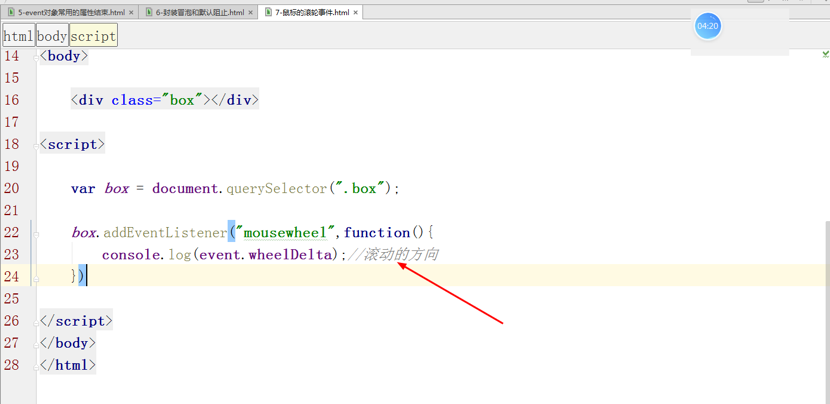
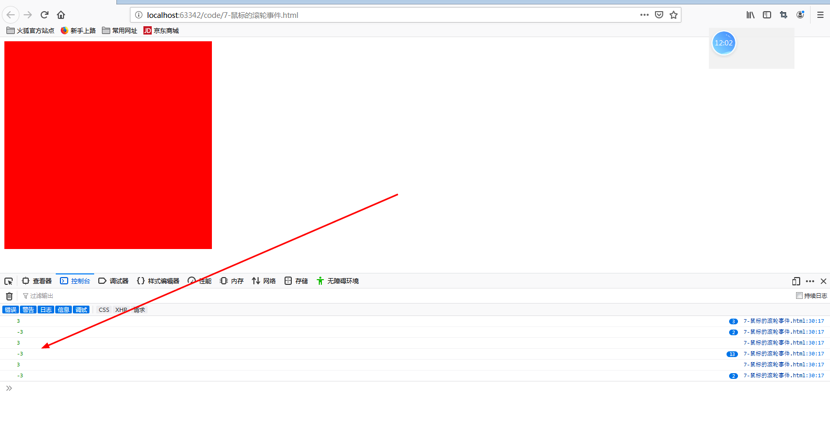

<h1>Event事件对象

### 本节主要内容：

### 学习目标：

| 节数                           | 知识点                   | 要求 |
| ------------------------------ | ------------------------ | ---- |
| 第一节 event对象               | 关于event对象            | 了解 |
|                                | event对象的使用          | 了解 |
| 第二节 event中常用的属性和方法 | event中常用属性          | 了解 |
|                                | event中常用的方法        | 了解 |
| 第三节 ie中常用的属性和方法    | ie浏览器常用的属性和方法 | 掌握 |
| 第四节 鼠标滚轮事件            | 鼠标滚轮事件             | 掌握 |
| 第五节 文档事件                | 文档事件                 | 掌握 |
| 第六节 事件委托                | 事件委托                 | 掌握 |

## event对象

### 关于event对象

概念： Event 对象代表事件的状态，当dom tree中某个事件被触发的时候，会同时自动产生一个用来描述事件所有的相关信息（**比如事件在其中发生的元素、键盘按键的状态、鼠标的位置、鼠标按钮的状态。**）的对象，这个对象就是event（事件对象）。

### Event事件对象的使用

直接通过event来获取

通过函数传参数的形式  还可以**通过函数传参数的形式来使用**，一般而言我们使用【形参e或event】来代替。

1.document.querySelector("#d1").onclick = function(**e**){

​    console.log(e);

};
 2.document.querySelector("#d1").onmousemove = function(**eve**){

​    console.log(eve);

}

3.document.querySelector("#d1").onkeyup = function(){

​    console.log(**event**);

};

 

因为event对象是用来描述【发生的事件的信息】的，而event对象当中所提供的一系列属性和方法正是用来获取这些信息的途径。

 

## event中常用的属性和方法

###  event中常用的属性

因为event对象是用来描述【发生的事件的信息】的，而event对象当中所提供的一系列属性和方法正是用来获取这些信息的途径。

### type 属性

**type属性**用来获得**【当前触发事件】的类型**，此属性只读。

document.getElementById(“d1”).onclick = function () {
          console.log(event);
 console.log(event.type); //依赖于事件的触发而存在，只读属性
    };

### bubbles属性

**bubbles属性用来获得【当前触发事件的类型】是否冒泡**，如果当前事件类型支持冒泡则返回true，否则返回false。

​    必须注意的是：bubbles属性指的是该事件是否冒泡。和事件处理机制无关！！！！

​    document.getElementById(“d1”).onclick = function () {
​          console.log(event.bubbles);
​    };

​    document.getElementById(“d1”).addEventListener('mouseenter',function (e) {
​          console.log(e.bubbles);
​    });

​    因为鼠标【点击事件】这个事件本身支持冒泡。

​    因此当存在点击事件被触发后，**event对象的bubbles属性返回的就是true，表示当前事件支持冒泡。**

### eventPhase 属性

**eventPhase：事件传导至【当前节点】时处于什么的状态**。

​        1：事件处于捕获状态

​        2：事件处于真正的触发者

​        3：事件处于冒泡状态

​    d1.onclick = function (e) {console.log(this, e.eventPhase);};
​    d2.onclick = function (e) {console.log(this, e.eventPhase);};
​    document.onclick = function (e) {console.log(this, e.eventPhase);};

​    d1.addEventListener('click', function (e) {console.log(this, e.eventPhase)}, true);
​    d2.addEventListener('click', function (e) {console.log(this, e.eventPhase)}, true);
​    document.addEventListener('click', function (e) {console.log(this, e.eventPhase)}, true);

### target 属性和 currentTarget 属性

​    target：返回事件**真正的触发者**

​    currentTarget：返回**事件的监听者**(触发的事件绑定到了哪个节点，就返回谁)

       
d1                  
d2
         

​    document.getElementById("d1").onclick = function (e) {
​        console.log(e.target);
​        console.log(e.currentTarget);
​    };

### button属性

button 返回当事件被触发时，哪个鼠标按钮被点击。

event.button=0|1|2

参数   描述

**0**  指定鼠标**左键**。

**1**  指定鼠标**中键**。

**2**  指定鼠标**右键**。

注意： Internet Explorer 8 及更早IE版本有不同的参数：

参数   描述

1   指定鼠标左键。 (IE8及更早IE版本)

4   指定鼠标中键。 (IE8及更早IE版本)

2   指定鼠标右键。

### key和keyCode属性

**key是哪个键**

**keyCode返回**keydown何keyup事件发生的时候按键的代码，以及keypress 事件的**Unicode字符(ASCII码值)**；(firefox2不支持 event.keycode，可以用 event.which替代 )

### 获取当前坐标的属性

| clientX | 得到当前屏幕可视区域x坐标的值(不包含滚动条) |
| ------- | ------------------------------------------- |
| clientY | 得到当前屏幕可视区域y坐标的值(不包含滚动条) |
| screenX | 得到当前屏幕x坐标的值                       |
| screenY | 得到当前屏幕y坐标的值                       |
| pageX   | 得到当前屏幕可视区域x坐标的值(包含滚动条)   |
| pageY   | 得到当前屏幕可视区域y坐标的值(包含滚动条)   |

### event中常用的方法

event.stopPropgation()：阻止冒泡。event.cancelBubble=true阻止冒泡

event.preventDefault()：默认阻止事件。return false默认阻止事件event.returnValue=false默认阻止事件

## IE中的event对象的常用属性和方法

1、srcElement （target）属性：返回的是目标对象

2、cancelBubble 属性:取消冒泡

3、returnValue属性：默认阻止事件

4、兼容性问题

通过对IE下event的方法和非IE的方法的介绍，能够感觉到两种情况的很多属性和方法大致都相同，只不过会在某些特殊方法上面存在不同的兼容性写法。因此我们可以提出一些同时满足不同浏览器兼容性的写法。

属性的兼容性写法我们已经说过：

​        var target = eve.target || eve.srcElement;

​        var eve = eve || window.event   

方法的兼容性写法我们也可以仿照这个来进行编写。思路如下：

(1)因为两种情况下的event对象获取方式并不同，所以希望能够自定义一个对象来替代event对象的使用。

(2)因为想要自定义对象在功能上和系统event对象的方法相同，所以需要给自定义对象添加方法

参考代码:

var Event = {

​    **stop**:function () {
​      if(event.stopPropagation){
​               event.stopPropagation();
​      }else {
​               event.cancelBubble = true;
​            }
​      },

event.stopPropagation?event.stopPropagation():(event.cancelBubble = true)

​    **cancelDefault**:function () {
​        if(event.preventDefault){
​            event.preventDefault();
​        }else {
​            event.returnValue = false;
​        }
​    }
 };

## 鼠标滚轮事件

滚轮就是鼠标上的滚轮，它滚动的时候触发事件

### 滚轮事件

**onmousewheel就是鼠标滚动事件**，mouse鼠标，wheel就是轮子。

event参数最最重要的事就**event.wheelDelta**属性，**表示滚动的方向**。这是浏览器的规定：

鼠标往**上滚， 120**

鼠标往**下滚， -120**

### 火狐浏览器滚轮事件

火狐浏览器不兼容，**火狐使用自己的专用事件DOMMouseScroll** ，并且这个事件只能通过标准的**DOM2级**的事件绑定方式添加。

火狐添加的事件，是它自己的专门事件DOMMouseScroll，

**表示滚动方向的事件的属性叫做event.detail。**

detail就是细节的意思。反着的，**滚动方向往上，-3；滚动方向往下，3。**

### 封装浏览器兼容性

## 文档事件

### 加载成功\失败事件：load\error

load事件指的是：节点加载成功时自动发生回调事件

error事件值得是：节点加载失败时自动发生的回调事件

### 当DOM加载完成时触发事件：DOMContentLoaded

DOMContentLoaded事件和load事件的区别是触发的时机不一样，**先触发DOMContentLoaded事件，后触发load事件。**

DOM文档加载的步骤为:
        解析HTML结构。
        加载外部脚本和样式表文件。
        解析并执行脚本代码。
        DOM树构建完成。  //DOMContentLoaded执行
        加载图片等外部文件。
        页面加载完毕。 //load执行

 

### 文档加载状态判断事件：readystatechange

众所周知，document节点中拥有一个属性叫做readyState。其拥有三个可能值：

​    **loading：加载DOM中** 

​    **interactive：加载外部资源** 

​    **complete：加载完成**

​    而readystatechange事件正是在这个状态发生改变时调用的事件。

## Event案例

### 二级联动

### 三级联动

### 放大镜案例

## 事件委托

###  什么是事件委托

事件委托/事件代理：**事件委托就是利用【事件冒泡】，自己本身做不了这个事，让上一级来做这个事**，只指定一个事件处理程序，就可以管理某一类型的所有事件。

### 具体实例：

**Li委托ul来做这个事**

 