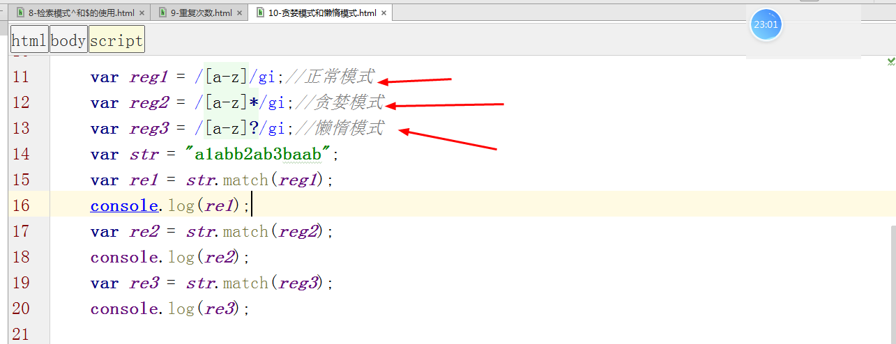

<div align="center"><h1>JS正则表达式</div>


### 本节主要内容：


### 学习目标：

| 节数                    | 知识点           | 要求 |
| ----------------------- | ---------------- | ---- |
| 第一节 什么是正则表达式 | 什么是正则表达式 | 了解 |
|                         | 正则表达式语法   | 了解 |
| 第二节 正则表达式进阶   | 修饰符           | 掌握 |
|                         | 检索模式         | 掌握 |
|                         | RegExp对象       | 掌握 |
| 第三节 正则表达式高级   | 正则表达式高级   | 掌握 |

 

## 正则表达式

### 正则表达式概述

按照一定的规则，查找和替换字符串。

**正则表达式概念：**

正则表达式(英文为regular Expression)是一种【字符串检索模式】

正则表达式具体表现为一个字符串的样子。     

**正则表达式执行原理是：**

通过【参数字符串】设置检索规则，在【指定字符串】中检索符合规则的字符串。

**正则表达式的作用是：**

可以用来进行**文本搜索和文本替换**。

### 正则表达式基本语法

正则表达式的基本语法

**语法：/正则表达式主体/修饰符(可选)**

**例如：var frk_reg = /frank/gi;**   ===>Frank,FRank

其中

(1)/frank/i是一个正则表达式

(2)frank是这个正则表达式的主体，表示想要检索的内容是frank

(3)i 是一个正则表达式的修饰符，表示检索内容时不区分大小写

### 正则表达式常见用法

正则表达式在实际开发中一般不会单独使用，而是会配合一些方法来完成某种功能。

因为正则表达式的作用是对字符串进行操作，所以一般在实际开发中正则表达式会配合字符串的search和replace方法来使用。

#### search方法

search方法用于检索与正则表达式相匹配的子字符串，并**返回子字符串**的**起始位置**。**找不到是-1**

例如：

在指定字符串中，通过正则表达式搜索目标子字符串。并且不区分大小写。

**var str = 'Hello Frank! GoodBye Frank!';**

**var first_index = str.search(/frank/i);**

**console.log(first_index);**


#### match方法

match() 方法可在字符串内检索指定的值，或找到一个或多个正则表达式的匹配。

**返回值存放匹配结果的数组**

**var str = 'Hello Frank! GoodBye Frank!';
 var first_index = str.match(/frank/gi);
 console.log(first_index);**


#### replace方法

replace方法：用于在指定字符串中**用一个字符串替换一个与正则表达式相匹配的子字符串**

例如：

  在指定字符串中，通过正则表达式替换指定字符串中的目标字符串

 **var str = 'Hello Frank! GoodBye Frank!';**

**var newStr = str.replace(/frank/i,'frankenStein');**

 **console.log(newStr);**


 很显然replace方法的作用是替换第一个匹配到的字符串，所以我们仅替换了第一个符合规则的Frank。

## 正则表达式进阶

### 修饰符 

修饰符是正则表达式进行字符串检索时【检索规则】的制定者之一。

修饰符规定了正则应按照何种方式进行检索。

**常见的修饰符类型有两种：i 、g**

**i修饰符，表示正则检索内容时不区分大小写**

例如：

使用i修饰符，在str中检索frank出现的第一次下标

​            var str = 'Hello Frank! GoodBye Frank!';

​            var first_index = str.search(/frank/i);

​     console.log(first_index);

​        代码的执行结果是：6

​     不使用i修饰符，在str中检索frank出现的第一次下标

​        var str = 'Hello Frank! GoodBye Frank!';

   var first_index = str.search(/frank/);

   console.log(first_index);

​        代码的执行结果是：-1

**g修饰符，表示正则检索内容时采用全局匹配，而不是找到第一个就停止。**

例如：

使用g修饰符，在str中替换所有的Frank为frankenStein

var str = 'Hello Frank! GoodBye Frank!';

var newStr = str.replace(/frank/gi,'frankenStein');

console.log(newStr);

代码的执行结果是：Hello frankenStein! GoodBye frankenStein!

不使用g修饰符，在str中替换所有的Frank为frankenStein

​         var str = 'Hello Frank! GoodBye Frank!';

​         var newStr = str.replace(/frank/i,'frankenStein');

​         console.log(newStr);

​    代码的执行结果是：Hello frankenStein! GoodBye Frank!

### 检索模式

正则表达式的检索模式，用于指定正则采用何种方式进行内容的检索。

常见的检索模式有**表达式模式、元字符模式和量词模式三种**。

他们并不互相独立而是相辅相成的关系，就像修饰符可以多个一起使用一样。

#### 表达式模式

正则表达式的书写方式是通过表达式编写的模式称为表达式模式。

**常见的表达式模式有以下三种:**

​    **a) [abc]**

​    **b) [0-9]**

​    **c) [m|n]**

每一种模式中的内容都是表示一类值，而不是字面的含义。

一个方括号代表一个字符。

**[abc]：在指定字符串中检索，查找任何满足【存在于方括号中】规则的字符或字符串。**

例如：

在str中替换所有:只要满足【是a、b当中之一】的字符为(frank)

**var str = '12abc12ABC';**

**var newStr = str.replace(/[ab]/gi,'(frank)');**

**console.log(newStr);//12(frank)(frank)c12(frank)(frank)C**


正则不只是能替换英文，对于中文正则仍然生效

var str = '你好，弗兰克！再见，弗兰克！';

var newStr = str.replace(/[弗兰克]/g,'(frank)');

console.log(newStr);//你好，(frank)(frank)(frank)！再见，(frank)(frank)(frank)！


正则匹配字符串时采用多个方括号即可
```

 var str = '你好，弗兰克！再见，弗兰克！';

 var newStr = str.replace(/[弗][兰][克]/g,'(frank)');

console.log(newStr);//你好，(frank)！再见，(frank)！
```


**[0-9]:在指定字符串中检索，查找任何满足【0至9之间】规则的的字符或字符串。该模式对字母也适用。**

例如：在str中替换所有：【任意是0-9之间之一】的字符为(frank)

**var str = '12abc12ABC';**

**var newStr = str.replace(/[0-9]/gi,'(frank)');**

**console.log(newStr);//(frank)(frank)abc(frank)(frank)ABC**


在str中替换所有：【任意是a-z之间之一】的字符为(frank)

 var str = '12abc12ABC';

 var newStr = str.replace(/**[a-z]**/g,'(frank)');

 console.log(newStr);//12(frank)(frank)(frank)12ABC

在str中替换所有：【任意是A-Z之间之一】的字符为(frank)

​         var str = '12abc12ABC';

​         var newStr = str.replace(/[A-Z]/g,'(frank)');

console.log(newStr);//12abc12(frank)(frank)(frank)


**(x|y)：在指定字符串中检索，查找任何满足【以|分隔的选项之一】的字符或字符串。**

例如：

在str中替换所有：【ab或者是ABC字符串】为'(frank)'
```
var str = '12abc12abABC';
var newStr = str.replace(/(ab|ABC)/g,'(frank)');
console.log(newStr);//12(frank)c12(frank)(frank)
```


ps:需要注意的是，如果使用|进行正则查找，则使用的是小括号。而不是中括号

#### 元字符模式

​    元字符：具有特殊含义的字符称为元字符。

​    通过元字符来进行正则检索的模式，称为元字符模式。

  **常见的元字符模式有以下三种:**

**a)** **\w**

**b)** **\d**

**c)  \s**

**d) \b**

一个元字符代表一个字符。

 

**\w** **元字符用于查找字母，数字，下划线。**

**a-z、A-Z、0-9，以及下划线。**

**var** **str = '$12abc12a@@\^*(\*\^bABC'**;
 var re = str.match(/\w/g);
 console.log(re);


**\W:除了字母，数字，下划线**


**\d：在指定字符串中检索，查找任何【是数字】规则的字符或字符串。**

 例如：

var str = '12abc12abABC';

var newStr = str.replace(/\d/g,'(frank)');

console.log(newStr);//(frank)(frank)abc(frank)(frank)abABC

var str = '12abc12abABC';

var newStr = str.replace(/\d\d/g,'(frank)');

console.log(newStr);//(frank)abc(frank)abABC


**\D：除了数字的**


**\s:** **在指定字符串中检索，查找任何【是空白】规则的字符或字符串**

例如：

**var str = ' 12abc 12ab ABC ';**

**var newStr = str.replace(/\s/g,'(frank)');**

**console.log(newStr);//(frank)12abc(frank)12ab(frank)ABC(frank)**

var str = ' 12abc 12ab ABC ';

var newStr = str.replace(/\s\s/g,'(frank)');

console.log(newStr);// 12abc 12ab ABC

**\S:除了空白的字符**


**\b:** **在指定字符串中检索，查找任何【是单词边界】规则的字符或字符串**

**也就是说匹配单词的开头和结尾。**

**1.匹配结尾是abc的替换**


2**.匹配开头是abc的替换**


3.**\B:除了开头是abc的单词，查找结尾是abc的或者是中间是abc的**


例如：

**var str = '12abc 12ab ABC';**

**var newStr = str.replace(/\b/g,'(frank)');**

**console.log(newStr);**

//(frank)12abc(frank) (frank)12ab(frank) (frank)ABC(frank)


var str = '12abc 12abAbc';

var newStr = str.replace(/\b/g,'(frank)');

console.log(newStr);//(frank)12abc(frank) (frank)12abABC(frank)

####  量词模式

量词：表示要检索的字符或字符串出现的次数的词组称为量词。

如果用n表示要检索的字符或字符串，

**那么常见的量词模式有以下三种：**

​    **a) n+**

​    **b) n\***

​    **c) n?**

ps：n除了是具体的字符或字符串外，还可以是表达式或者元字符

**n+：在原字符串中检索任何【包含一个或多个n】的子字符串。**


例如：

 var str = 'a1abb2ab3baab';

 var newStr = str.match(/a/g);

 console.log(newStr);//["a", "a", "a", "a", "a"]

  

 **var str = 'a1abb2ab3baab';**

 **var newStr = str.match(/ab/g);**

​        **console.log(newStr);//["ab","ab","ab"]**

  

​         var str = 'a1abb2ab3baab';

​         var newStr = str.match(/a+/g);

​         console.log(newStr);//["a", "a", "a", "aa"]

  

​          var str = 'a1abb2ab3baab';

​         var newStr = str.match(/ab+/g);

​         console.log(newStr);//["abb", "ab", "ab"]

**n\*：在原字符串中检索任何【包含0个或多个n】的子字符串。**


例如：

var str = 'a1abb2ab3baab';

var newStr = str.match(/a*/g);

console.log(newStr);//["a", "", "a", "", "", "", "a", "", "", "", "aa", "", ""]

var str = 'a1abb2ab3baab ';

var newStr = str.match(/ab*/g);

console.log(newStr);//["a", "abb", "ab", "a", "ab"]

ps：为什么匹配单个字符的时候结果中有空字符串，而匹配多个字符构成的字符串时结果中就没有空字符串？

**n?:** **在原字符串中检索任何包含0个或1个n的子字符串**


例如：

   var str = 'a1abb2ab3baab';

   var newStr = str.match(/a?/g);

   console.log(newStr);//["a", "", "a", "", "", "", "a", "", "", "", "a", "a", "", ""]

   var str = 'a1abb2ab3baab';

   var newStr = str.match(/ab?/g);

   console.log(newStr);//["a", "ab", "ab", "a", "ab"]

2.2.4 作业：

表单的验证

用户名：(长度5~10个字母)   / ^[a-zA-Z]{5,10}$/

密码：(总长度5~10个,必须同时包含字母和数字)

```JS
/^(?=.*[0-9])(?=.*[a-zA-Z])(.{5,10})$/;
/^(?=.*[0-9])(?=.*[a-zA-Z])([0-9A-Za-z]{5,10})$/;
/^(?!\d+$)(?![a-zA-Z]+$)[0-9A-Za-z]{5,10}$/;
```

邮箱：

手机号：

### RegExp对象

**上面我们提到过正则表达式的基本语法是：/正则表达式主体/修饰符(可选)**，这种创建正则的方法我们称之为【字面量创建正则表达式】。

​    而实际上在js中已经为正则表达式提供了一个构造函数RegExp，我们可以通过这个构造函数来生成一个正则表达式的实例，而这种创建正则的方法我们称之为【构造函数创建正则表达式】。

​    对于通过RegExp构造函数生成的正则实例来说，我们既能够和之前使用正则表达式一样将这个正则实例直接使用，还能够通过这个实例来调用一些RegExp所独有的方法

语法：

**var regExp = new RegExp(正则表达式内容,修饰符);**

ps：通过构造函数方式创建正则，参数均采用字符串来声明

例如：

**var regExp = new RegExp('ab','g');//【等价于正则表达式：/ab/g】**

**var str = '12abc12abABC';**

**var newStr = str.replace(regExp,'(frank)');**

**console.log(newStr);//12(frank)c12(frank)ABC**


#### RegExp对象的test()方法

本方法是RegExp对象中提供的一个方法，用来判断在【指定字符串中】是否存在【满足正则表达式规则】的子字符串。**存在就返回true，反之返回false。**

语法：

**正则表达式.test(指定字符串)**

**Str.match(正则表达式);**


例如：

**var regExp = new RegExp('abcd','g');**

**console.log(regExp.test('12abc12abABC'));//false**

**var regExp = new RegExp('abc','g');**

**console.log(regExp.test('12abc12abABC'));//true**

ps:其实RegExp中提供的方法对于正则表达式都是通用的，也就意味着下面的代码也是合法的：

#### RegExp对象的exec()方法

本方法是RegExp对象中提供的一个方法，用来查找在【指定字符串中】**【第一个】【满足正则表达式规则】的子字符串出现的【下标和内容】。**

**exec()** **的工作原理如下：**

**·**    **找到第一个子字符串，并存储其位置** 

**·**    **如果再次运行 exec()，则从存储的位置开始检索，并找到下一个子字符串，并存储其位置** 

语法：

正则表达式.exec(指定字符串)

例如：

var regExp = new RegExp('abc','gi');

var result = regExp.exec('12abc12abABC');

console.log(result);//["abc", index: 2, input: "12abc12abABC"]

console.log(result.length);//1

result = regExp.exec('12abc12abABC');

console.log(result);//["ABC", index: 9, input: "12abc12abABC"]

console.log(result.length);//1

result = regExp.exec('12abc12abABC');

console.log(result);//null


例2：

```js
var patt1=new RegExp("e","gi");
 do{
   var re = patt1.exec("The best things in life are free");
   console.log(re);
 }
 while(re!=null);
```


## 正则表达式高级

###  检索模式的^和$字符

**^初位字符**：表示判断字符串以某个内容开始(**匹配开头是什么内容**)

**$末位字符**：表示判断字符串以某个内容结束(**匹配结尾是什么内容**的)


​    var regExp = new RegExp('^abc','gi');//表示【判断是否以abc字符串开始】的正则

​    var regExp = new RegExp('$abc','gi');//表示【判断是否以abc字符串结尾】的正则

 

###  重复类

重复类其实是正则表达式中使用{}进行检索的的一种模式的称谓，{}用来匹配符合正则要求的字符连续出现的次数。

其常见用法是配合表达式模式进行一起使用。重复类常见写法有一下三种：

**subStr{n}:想要检索的内容恰好出现n次**

**subStr{n,}:想要检索的内容至少出现n次**

**subStr{n,m}:想要检索的内容至少出现n次,至多出现m次**

语法：

var regExp = new RegExp('正则表达式主体 重复类','修饰符');

var regExp = new RegExp('[a-z]{2}','g');

表示创建了一个【全局中检索连续出现的两个小写字母】的正则

例如：

​    **var regExp = new RegExp('[a-z]{2}','g');**

​    **var string = '12abcabc12abccab';**

​    **console.log(string.match(regExp));//["ab", "ca", "bc", "ab", "cc", "ab"]**


###  贪婪模式、懒惰模式

**正则表达式--贪婪模式(greed)、懒惰模式(lazy)**

其实对于正则来说，贪婪与懒惰两种模式都是被固化至表达式内的两种隐形的检索模式。他们并不归属于任何一种我们之前所说的检索模式，而是在此之外隐形生效的。

贪婪模式(greed)：123ababab456

只要符合正则要求就一直向下匹配，直到无法再匹配为止的行为模式（例如n*）

​    懒惰模式：

一旦匹配到符合正则要求的内容就立即结束的行为模式。（例如n？）

在正则中，不同的符号能够隐式说明当前的正则是采用贪婪模式还是懒惰模式。

常见符号有以下这些：

**贪婪模式的标示符：+，\*，{n},{n,},{n,m}.**

**懒惰模式：+?，?，\*?，{n}?，{n,}?,{n,m}?;**

通过一个简单的例子我们看一下贪婪模式和懒惰模式在正则中是如何发挥作用的：

**//普通正则**

var str = 'a1abb2ab3baab';

var newStr = str.match(/[a-z]/g);

console.log(newStr);//["a", "a", "b", "b", "a", "b", "b", "a", "a", "b"]

**//贪婪模式**

var str = 'a1abb2ab3baab';

var newStr = str.match(/[a-z]* /g);

console.log(newStr);//["a", "", "abb", "", "ab", "", "baab", ""]

**//懒惰模式**

​        var str = 'a1abb2ab3baab';

​        var newStr = str.match(/[a-z]***?**/g);

​        console.log(newStr);//["a", "", "a", "b", "b", "", "a", "b", "", "b", "a", "a", "b", ""]




**效果非常明显，逻辑也非常简单。**

  **所谓的贪婪模式无非就是令匹配结果尽可能的长，直到不满足为止。**

  **而懒惰模式则是令匹配结果尽可能的短，匹配到此就结束。**

###  脱字符**[^]**

**脱字符用在正则表达式的中括号里，这是一种特殊表达方式，**表示【不是...】的意思。**当且仅当\^符号出现在中括号的首位时，我们称^符号为脱字符。

**如果不写在中括号中表示初位字符，如果写在中括号中却没写在首位，则表示普通字符。**

例如：

​    var regExp = new RegExp(‘\[^abc]’,‘gi’);     \=\=\=\=> /\[^abc]/ig

​    //表示出现不是abc中的任意一个就符合该正则

​    var string = '12abcabc12abccabk';

​    var result = string.match(regExp);

​    console.log(result);//["1", "2", "1", "2",''k''] 


​    var regExp = new RegExp('\[^abc]{2}','gi'); 

​    //表示连续两个出现的字符【不是abc中的任意一个】就符合该正则

​    var string = '12\^abcabc12^abccab';

​    var result = string.match(regExp);

​    console.log(result);//["12", "12"]

### 年龄，手机，邮箱的正则表达式

年龄正则：0~199岁 

```javascript
/^(([0-9]{1})|([1-9][0-9])|(1[0-9][0-9]))$/
```

手机号：

```js
/^1[345789][0-9]{9}$/   不精确手机号正则
```

邮箱正则：

```js
/^\w+@\w+(\.\w+)+$/  不精确邮箱正则
```


### 作业：多个小女孩的运动

**构造函数实例化对象的时候自动调用**


 

Es6的写法


Es5利用构造函数创建对象

 


小女孩运动的原型版


小女孩运动的继承版


### 作业：轮播图 


 

 

 

 