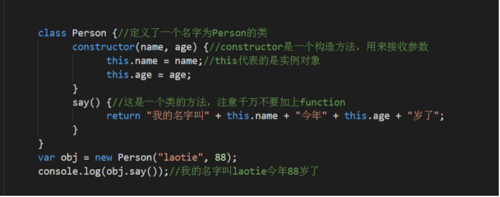
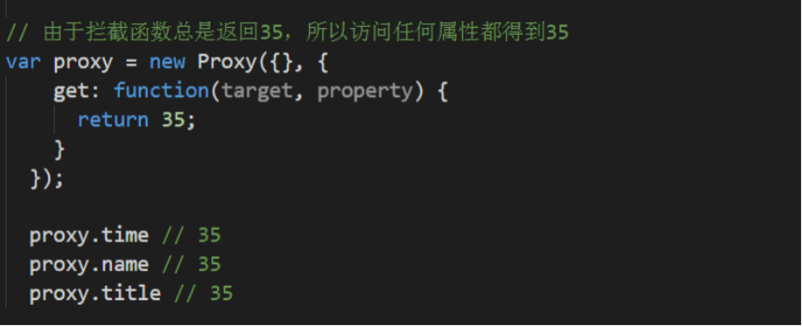
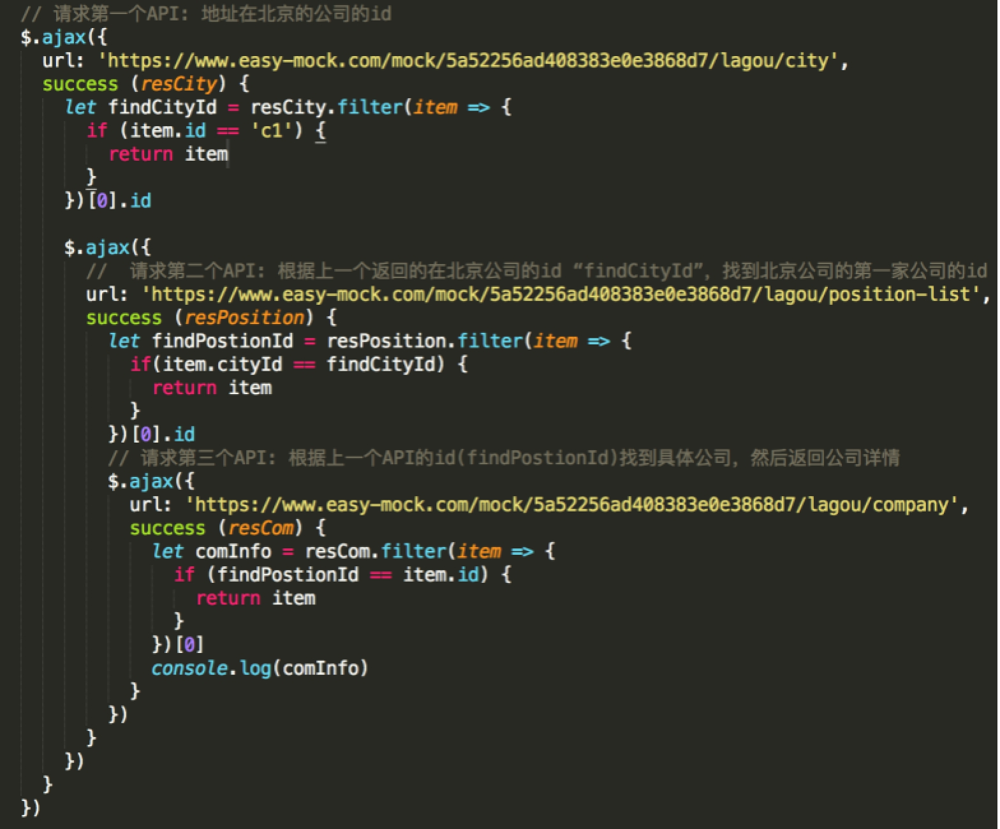

# ES6新特性

## ECMAScript 6 简介


ECMAScript是javascript标准

ES6就是ECMAScript的第6个版本

ECMAScript 6.0（以下简称 ES6）是 JavaScript 语言的下一代标准，已经在 2015 年 6 月正式发布了。它的目标，是使得 JavaScript 语言可以用来编写复杂的大型应用程序，成为企业级开发语言。


### ECMAScript 和 JavaScript 的关系

ECMAScript是JavaScript的规格，JavaScript是ECMAScript的一种实现，在日常场合，这两个词是可以互换的。

JavaScript的创造者Netscape公司，将JavaScript提交给国际标准化组织ECMA，希望这种语言能够成为国际标准，后来ECMA发布标准文件的第一版（ECMA-262），规定了浏览器脚本语言的标准，并将这种语言称为ECMAScript

该标准从一开始就是针对JavaScript语言制定的，之所以不叫JavaScript，有两个原因：一是商标，Java是Sun公司的商标，根据授权协议，只有Netscape公司可以合法地使用JavaScript这个名字，且JavaScript本身也已经被Netscape公司注册为商标；二是想体现这门语言的制定者是ECMA，不是Netscape，有利于保证这门语言的开放性和中立性。

但事实上，JavaScript比ECMA-262的含义多得多，一个完整的JavaScript实现应该由以下三个部分组成：

1) ECMAScript：核心

2) DOM：文档对象模型

3) BOM：浏览器对象模型

### ES6 与 ECMAScript 2015 的关系

2011 年，ECMAScript 5.1 版发布后，就开始制定 6.0 版了。因此，ES6 这个词的原意，就是指 JavaScript 语言的下一个版本

标准委员会最终决定，标准在每年的 6 月份正式发布一次，作为当年的正式版本。接下来的时间，就在这个版本的基础上做改动，直到下一年的 6 月份，草案就自然变成了新一年的版本

### 语法提案的批准流程

任何人都可以向标准委员会（又称 TC39 委员会）提案，要求修改语言标准。

一种新的语法从提案到变成正式标准，需要经历五个阶段。每个阶段的变动都需要由 TC39 委员会批准。

· Stage 0 - Strawman（展示阶段）

· Stage 1 - Proposal（征求意见阶段）

**·** **Stage 2 - Draft（草案阶段）**

· Stage 3 - Candidate（候选人阶段）

· Stage 4 - Finished（定案阶段）

 

一个提案只要能进入 Stage 2，就差不多肯定会包括在以后的正式标准里面

###  Babel转码器

[Babel](https://babeljs.io/) 是一个广泛使用的 ES6 转码器，可以将 ES6 代码转为 ES5 代码，从而在现有环境执行。这意味着，你可以用 ES6 的方式编写程序，又不用担心现有环境是否支持 

### let 和const 声明

ES6 新增了`let`命令，用来声明变量。它的用法类似于`var`，但是所声明的变量，只在`let`命令所在的代码块内有效。

####  let块级作用域

```js
{
    var num=10;
    let count=10;
}
console.log(num)
console.log(count);//: count is not defined

var arr=[10,20,30,40];
for(var i=0;i<arr.length;i++){
   arr[i]=function(){
      console.log(i)
   }
}
arr[2]();//4

//闭包

var arr=[10,20,30,40];
for(var i=0;i<arr.length;i++){
   arr[i]=(function(i){
      return function(){
         console.log(i)
      }
   })(i);
}
arr[2]();//2
var arr=[10,20,30,40];
for(let i=0;i<arr.length;i++){//{let i=0} {let i=1} ...
   arr[i]=function(){
      console.log(i)
   }
}

arr[2]();//4
```

 

#### 不存在变量提升

`var`命令会发生“变量提升”现象，即变量可以在声明之前使用，值为`undefined`。这种现象多多少少是有些奇怪的，按照一般的逻辑，变量应该在声明语句之后才可以使用。

为了纠正这种现象，let命令改变了语法行为，它所声明的变量一定要在声明后使用，否则报错

```js
// var 的情况
console.log(foo); // 输出undefined
var foo = 2;

// let 的情况
console.log(bar); // 报错ReferenceError
let bar = 2;
```

上面代码中，变量foo用var命令声明，会发生变量提升，即脚本开始运行时，变量foo已经存在了，但是没有值，所以会输出undefined。变量bar用let命令声明，不会发生变量提升。这表示在声明它之前，变量bar是不存在的，这时如果用到它，就会抛出一个错误。

#### 不允许重复声明

let不允许在相同作用域内，重复声明同一个变量。

```js
// 报错
function func() {
 let a = 10;
 var a = 1;
}

// 报错
 function func() {
 	let a = 10;
 	let a = 1;
 } 
```

#### 为什么需要块级作用域

ES5 只有全局作用域和函数作用域，没有块级作用域，这带来很多不合理的场景。

第一种场景，内层变量可能会覆盖外层变量

```js
var uname='jack';
function change(){
   console.log(uname);//undefined
   var uname='rose';
   console.log(uname);//rose
}
change(); 
```

原因在于变量提升，导致内层的uname变量覆盖了外层的uname变量。

第二种场景，用来计数的循环变量泄露为全局变量。

```js
var s;
s = 'hello';
for (var i = 0; i < s.length; i++) {
	console.log(s[i]);
}
console.log(i); // 5
```

上面代码中，变量i只用来控制循环，但是循环结束后，它并没有消失，泄露成了全局变量。

### const 命令

基本用法

`const`声明一个只读的常量。一旦声明，常量的值就不能改变。

```js
const PI = 3.1415;

PI // 3.1415

PI = 3;

// TypeError: Assignment to constant variable.
```

上面代码表明改变常量的值会报错。

`const`声明的变量不得改变值，这意味着，`const`一旦声明变量，就必须立即初始化，不能留到以后赋值。

```js
const foo;
// SyntaxError: Missing initializer in const declaration
```

上面代码表示，对于const来说，只声明不赋值，就会报错。

固定方法

```js
const setName = function(){}
```

常量写法：`const`声明字符串常量的时候 一般字符串全部大写

```js
const NAME='hello'
```

什么时候使用`const`? 什么时候使用`let`

<font color="blue">只要你所声明的值不发生改变，使用常量，其他使用let</font>

```js
const setName=function(){}
const obj={}
```

后面会慢慢接触到 更多的使用场景

总结：`let`具有块级作用域 不允许重复声明 不允许变量提升 这个`var`不具备的

### 本章作业

ES6与javascript区别

Let var const区别


## ES6基本语法

### 变量的解构赋值

#### 数组的解构赋值

ES6 允许按照一定模式，从数组和对象中提取值，对变量进行赋值，这被称为解构（DEStructuring）。

以前，为变量赋值，只能直接指定值。

```js
let a = 1;let b = 2;let c = 3;
```

ES6 允许写成下面这样。

```js
let [a, b, c] = [1, 2, 3];
```

上面代码表示，可以从数组中提取值，按照对应位置，对变量赋值。

本质上，这种写法属于“模式匹配”，只要等号两边的模式相同，左边的变量就会被赋予对应的值。下面是一些使用嵌套数组进行解构的例子。

```js
let [foo, [[bar], baz]] = [1, [[2], 3]];
```

 

```js
let [ , , third] = ["foo", "bar", "baz"];

third // "baz"
let [x, , y] = [1, 2, 3]; 
```


```js
var [x,y]=[1,2];

console.log(x);

var [x,y,m]=[3,4];

console.log(m);//undefind

var [x,y]=[80,90,100];//100获取不到

var [m,,,n]=[11,22,33,44];

console.log(m)

var [x,y,[m,n]]=[10,20,[30,40]]

console.log(m)
```

默认值

解构赋值允许指定默认值。

```js
let [foo = true] = [];
foo // true
let [x, y = 'b'] = ['a']; // x='a', y='b'
let [x, y = 'b'] = ['a', undefined]; // x='a', y='b'
```


#### 对象的解构赋值

```js
let { foo, bar } = { foo: 'aaa', bar: 'bbb' };

foo // "aaa"

bar // "bbb"
```

对象的解构与数组有一个重要的不同。数组的元素是按次序排列的，变量的取值由它的位置决定；而对象的属性没有次序，变量必须与属性同名，才能取到正确的值。

```js
let { bar, foo } = { foo: 'aaa', bar: 'bbb' };
foo // "aaa"
bar // "bbb"
let { baz } = { foo: 'aaa', bar: 'bbb' };
baz // undefined
```

上面代码的第一个例子，等号左边的两个变量的次序，与等号右边两个同名属性的次序不一致，但是对取值完全没有影响。第二个例子的变量没有对应的同名属性，导致取不到值，最后等于undefined。

如果解构失败，变量的值等于`undefined`。

```js
let {foo} = {bar: 'baz'};

foo // undefined
```

上面代码中，等号右边的对象没有foo属性，所以变量foo取不到值，所以等于undefined。

对象的解构赋值，可以很方便地将现有对象的方法，赋值到某个变量

默认值

对象的解构也可以指定默认值。

```js
var {x = 3} = {};
x // 3

var {x, y = 5} = {x: 1};
x // 1
y // 5
```

 

#### 字符串的解构赋值

字符串也可以解构赋值。这是因为此时，字符串被转换成了一个类似数组的对象。

```js
const [a, b, c, d, e] = 'hello';
a // "h"
b // "e"
c // "l"
d // "l"
e // "o"
```

类似数组的对象都有一个length属性，因此还可以对这个属性解构赋值。

```js
let {length : len} = 'hello';
len // 5
```

函数参数的解构赋值

#### 函数的参数也可以使用解构赋值。

```js
function add([x, y]){

 return x + y;}

add([1, 2]); // 3
```


上面代码中，函数add的参数表面上是一个数组，但在传入参数的那一刻，数组参数就被解构成变量x和y。对于函数内部的代码来说，它们能感受到的参数就是x和y

```js
function demo([x,y]){
   return x+y;
}
console.log(demo([10,20]));

function demo([x,y=30]){
   return x+y;
}
console.log(demo([10]));

function demo(x,y=20){
   return x+y;
}

console.log(demo(10)) 
```

 

#### 解构赋值用途

**（1）交换变量的值**

```js
let x = 1;let y = 2;
[x, y] = [y, x];
x,y;//2,1
```

上面代码交换变量x和y的值，这样的写法不仅简洁，而且易读，语义非常清晰

面试题：

请用一句代码，实现两个数据值互换？

**（2）提取 JSON 数据**

解构赋值对提取 JSON 对象中的数据，尤其有用。

```js
let jsonData = {
 id: 42,
 status: "OK",
 data: [867, 5309]};
let { id, status, data:number } = jsonData;
console.log(id, status, number);

// 42, "OK", [867, 5309]
```


**（3）函数参数的默认值**

```js
jQuery.ajax = function (url, {
 async = true,
 beforESend = function () {},
 cache = true,
 complete = function () {},
 crossDomain = false,
 global = true,
 // ... more config
} = {}) {
 // ... do stuff
}; 
```

解构赋值：

后面使用`react`使用方便：

比如想获取 `state`里面的数据 普通写法：`this.data.state`

```js
var state={
   flag:true,
   msg:'ok'
}
var {flag,msg}=state;
console.log(flag,msg)
```

ES6 加强了对 Unicode 的支持，允许采用\uxxxx形式表示一个字符，其中xxxx表示字符的 Unicode 编码。


### 字符串的扩展

#### 字符的 Unicode 表示法

```js
"\u0061"
// "a"
```

但是，这种表示法只限于码点在\u0000~\uFFFF之间的字符。超出这个范围的字符，必须用两个双字节的形式表示。

```js
"\uD842\uDFB7"
// ""\u20BB7"
// " 7"
```

 

#### 字符串的遍历器接口

ES6 为字符串添加了遍历器接口（详见《Iterator》一章），使得字符串可以被`for...of`循环遍历。

```js
for (let codePoint of 'foo') {

 console.log(codePoint)}

// "f"// "o"// "o"
```

除了遍历字符串，这个遍历器最大的优点是可以识别大于0xFFFF的码点，传统的`for`循环无法识别这样的码点。

#### 模板字符串（重点）

传统的 JavaScript 语言，输出模板通常是这样写的（下面使用了 jQuery 的方法）。

```js
$('#rESult').append(
 'There are <b>' + basket.count + '</b> ' +
 'items in your basket, ' +
 '<em>' + basket.onSale +
 '</em> are on sale!');
```


上面这种写法相当繁琐不方便，ES6 引入了模板字符串解决这个问题。

```js
$('#rESult').append(`
 There are <b>${basket.count}</b> items
  in your basket, <em>${basket.onSale}</em>
 are on sale!
`);
```


### 字符串的新增方法

**实例方法：includES(), startsWith(), endsWith()**

**实例方法：repeat()**

**实例方法：padStart()，padEnd()**

**实例方法：trimStart()，trimEnd()**

 

#### includES(), startsWith(), endsWith()

传统上，JavaScript 只有indexOf方法，可以用来确定一个字符串是否包含在另一个字符串中。ES6 又提供了三种新方法。

**·** includES()：返回布尔值，表示是否找到了参数字符串。

**·** startsWith()：返回布尔值，表示参数字符串是否在原字符串的头部。

**·** endsWith()：返回布尔值，表示参数字符串是否在原字符串的尾部。

```js
let s = 'Hello world!';
s.startsWith('Hello') // true
s.endsWith('!') // true
s.includES('o') // true
```


这三个方法都支持第二个参数，表示开始搜索的位置。

```js
let s = 'Hello world!';
s.startsWith('world', 6) // true
s.endsWith('Hello', 5) // true
s.includES('Hello', 6) // false
```


上面代码表示，使用第二个参数n时，endsWith的行为与其他两个方法有所不同。它针对前n个字符，而其他两个方法针对从第n个位置直到字符串结束。

####  实例方法：repeat()

repeat方法返回一个新字符串，表示将原字符串重复n次。

```js
'x'.repeat(3) // "xxx"
'hello'.repeat(2) // "hellohello"
'na'.repeat(0) // ""
```

参数如果是小数，会被取整。

```js
'na'.repeat(2.9) // "nana"
```

 

####  padStart()，padEnd()

ES2017 引入了字符串补全长度的功能。如果某个字符串不够指定长度，会在头部或尾部补全。padStart()用于头部补全，padEnd()用于尾部补全。

```js
'x'.padStart(5, 'ab') // 'ababx'
'x'.padStart(4, 'ab') // 'abax'
'x'.padEnd(5, 'ab') // 'xabab'
'x'.padEnd(4, 'ab') // 'xaba'
```


上面代码中，padStart()和padEnd()一共接受两个参数，第一个参数是字符串补全生效的最大长度，第二个参数是用来补全的字符串。

如果原字符串的长度，等于或大于最大长度，则字符串补全不生效，返回原字符串。

####  trimStart()，trimEnd()

[ES2019](https://github.com/tc39/proposal-string-left-right-trim) 对字符串实例新增了trimStart()和trimEnd()这两个方法。它们的行为与trim()一致，trimStart()消除字符串头部的空格，trimEnd()消除尾部的空格。它们返回的都是新字符串，不会修改原始字符串。

```js
const s = '  abc  ';
s.trim() // "abc"
s.trimStart() // "abc  "
s.trimEnd() // "  abc"
```

上面代码中，trimStart()只消除头部的空格，保留尾部的空格。trimEnd()也是类似行为。


##  数组扩展

 

​    扩展运算符

​     1.合并数组:concat

​    2.求数组中最大值

​    Array.from() : 将类数组转化为真实的数组

​    arguments、nodelist

### 数组扩展

 ```js
var arr = [10,20,30]

var arr1 = [40,50,60];

console.log([...arr,...arr1]);

var arr2 = [23,235,2,3,52,35];

console.log(Math.max.apply(null,arr2));

console.log(Math.max(...arr2))
 ```


### Array.from() : 将类数组转化为真实的数组

Array.from方法用于将两类对象转为真正的数组：类似数组的对象（array-like object）和可遍历（iterable）的对象（包括 ES6 新增的数据结构 Set 和 Map）。

下面是一个类似数组的对象，`Array.from`将它转为真正的数组。 

```js
function hello(){

  arguments = Array.from(arguments);

  console.log(Array.isArray(arguments));

}

hello(1,2,3,4);

var lists = document.getElementsByTagName("li");

lists = Array.from(lists);

console.log(lists);

// push

// arr.push

// Array.isArray(arr);
```


###  Array.of()

`Array.of`方法用于将一组值，转换为数组。

```js
Array.of(3, 11, 8) // [3,11,8]
Array.of(3) // [3]
Array.of(3).length // 1
```

这个方法的主要目的，是弥补数组构造函数`Array()`的不足。因为参数个数的不同，会导致`Array()`的行为有差异。

```js
new Array() // []
new Array(3) // [, , ,]
new Array(3, 11, 8) // [3, 11, 8]
```

上面代码中，Array方法没有参数、一个参数、三个参数时，返回结果都不一样。只有当参数个数不少于 2 个时，`Array()`才会返回由参数组成的新数组

 

### 数组实例的 copyWithin()

数组实例的`copyWithin()`方法，在当前数组内部，将指定位置的成员复制到其他位置（会覆盖原有成员），然后返回当前数组。也就是说，使用这个方法，会修改当前数组。

```js
Array.prototype.copyWithin(target, start = 0, end = this.length)
```

它接受三个参数。

· target（必需）：从该位置开始替换数据。如果为负值，表示倒数。

· start（可选）：从该位置开始读取数据，默认为 0。如果为负值，表示从末尾开始计算。

· end（可选）：到该位置前停止读取数据，默认等于数组长度。如果为负值，表示从末尾开始计算。

这三个参数都应该是数值，如果不是，会自动转为数值。

```js
[1, 2, 3, 4, 5].copyWithin(0, 3)
// [4, 5, 3, 4, 5]
```


```js
// 将3号位复制到0号位
[1, 2, 3, 4, 5].copyWithin(0, 3, 4)
// [4, 2, 3, 4, 5]

// -2相当于3号位，-1相当于4号位
[1, 2, 3, 4, 5].copyWithin(0, -2, -1)
// [4, 2, 3, 4, 5]
```


 

### 数组实例的 find() 和 findIndex()，高阶函数

数组实例的find方法，用于找出第一个符合条件的数组成员。它的参数是一个回调函数，所有数组成员依次执行该回调函数，直到找出第一个返回值为true的成员，然后返回该成员。如果没有符合条件的成员，则返回`undefined`。

```js
[1, 4, -5, 10].find((n) => n < 0)

// -5
```

## 数组实例的 fill()

fill方法使用给定值，填充一个数组。

```js
['a', 'b', 'c'].fill(7)
// [7, 7, 7]
new Array(3).fill(7)
// [7, 7, 7]
```

上面代码表明，fill方法用于空数组的初始化非常方便。数组中已有的元素，会被全部抹去。

fill方法还可以接受第二个和第三个参数，用于指定填充的起始位置和结束位置。

```js
['a', 'b', 'c'].fill(7, 1, 2)

// ['a', 7, 'c']
```

上面代码表示，fill方法从 1 号位开始，向原数组填充 7，到 2 号位之前结束。

注意，如果填充的类型为对象，那么被赋值的是同一个内存地址的对象，而不是深拷贝对象。

```js
for (let index of ['a', 'b'].keys()) {
 console.log(index);
}
// 0// 1

for (let elem of ['a', 'b'].valuES()) {
 console.log(elem);
}
// 'a'// 'b'

for (let [index, elem] of ['a', 'b'].entriES()) {
 console.log(index, elem);
}
// 0 "a"
```


## 对象的扩展

### 属性的简洁表示法 

```js
var name = "iwen";
var age = 20;
const ADD = "add";
var obj = {
  name, // name:name
  age,
[ADD]: function(){
    console.log("add");
  },
  fn1:function(){
  },
  fn2(){
    console.log("fn2");
  }
}
```


属性名表达式

JavaScript 定义对象的属性，有两种方法。

```js
// 方法一
obj.foo = true;
obj['foo']=true;

// 方法二
obj['a' + 'bc'] = 123;
```

上面代码的方法一是直接用标识符作为属性名，方法二是用表达式作为属性名，这时要将表达式放在方括号之内。

ES6 允许字面量定义对象时，用方法二（表达式）作为对象的属性名，即把表达式放在方括号内。

```js
let propKey = 'foo';
let obj = {
  [propKey]: true,
  ['a' + 'bc']: 123
};
```

下面是另一个例子。

```js
let lastWord = 'last word';

const a = {
  'first word': 'hello',
  [lastWord]: 'world'
};

a['first word'] // "hello"
a[lastWord] // "world"
a['last word'] // "world"
```

表达式还可以用于定义方法名。


###  对象新增方法

Object.is()

ES5 比较两个值是否相等，只有两个运算符：相等运算符（\=\=）和严格相等运算符（===）。它们都有缺点，前者会自动转换数据类型，后者的NaN不等于自身，以及+0等于-0。JavaScript 缺乏一种运算，在所有环境中，只要两个值是一样的，它们就应该相等。

ES6 提出“Same-value equality”（同值相等）算法，用来解决这个问题。Object.is就是部署这个算法的新方法。它用来比较两个值是否严格相等，与严格比较运算符（===）的行为基本一致。

```js
Object.is('foo', 'foo')
// true

Object.is({}, {})
// false
```


不同之处只有两个：一是`+0`不等于`-0`，二是`NaN`等于自身。

```js
+0 === -0 //true
NaN === NaN // false

Object.is(+0, -0) // false
Object.is(NaN, NaN) // true
```

## Set：集合，类似于数组，但是集合的元素(成员)都是唯一的，没有重复的值

new Set()创建一个set对象，通过add()方法添加成员........

## Map：类似于对象，也是键值对的集合，但是键名不仅限于字符串


##  模块的导入导出

在ES5中，用module.exports和exports导出模块，用require引入模块。

ES6新增export和export default导出模块，import导入模块。

### 名字导出（name export）

名字导出可以在模块中导出多个声明。

export后必须跟语句, 何为语句, 如声明, for, if 等都是语句, export 不能导出匿名函数, 也不能导出某个已经声明的变量, 如:

```js
export const bar = function() {}; // 合法 
export bar; // 非法
export 1; // 非法
export function foo () {}; // 合法, 后跟的是声明语句 
export { foo }; // 合法, 后面跟的{}理解为语句, 就像if后面的{}一样 
export { foo as bar }; // 合法export { foo: foo }; // 非法, 后面的{}被解析成对象
```

###  export default

默认导出（default export）

一个模块只能有一个默认导出，对于默认导出，导入的名称可以和导出的名称不一致，这对于导出匿名函数或类非常有用。

export default在整个模块中只能出现一次, 后只能具体的值, 何为具体的值, 如1, 2, 3, 再比如一个函数声明(非表达式), 或者是一个类声明(与函数声明一个意思), 或者匿名函数, 只要是能用变量接受的都可以, 例子:

 ```js
export default 1; // 合法 
export default function foo() {}; // 合法, 因为function foo() {} 能被变量接受, 如 var bar = function foo() {}
export default const bar = 1; // 非法, 因为var a = const bar = 1 是不合法的 
export default { foo }; // 合法, {} 被理解为一个对象 
export default { foo: foo }; // 合法, 同上
 ```

###  import

import语法为:

```js
import { x, y } from './tESt.js';
import * as some from './tESt.js';  // 命名空间导入
import './tESt.js';
import { default as tESt } from './tESt.js';
```

导入再导出

```js
export { some } from './tESt.js';
export * from './tESt.js';
```

导入后跟需要导入的绑定和模块说明符, 导入绑定的列表并非对象的解构, 二者并无关联, 导入的标识符很像const声明的变量, 不可更改。

## Class类

传统的javascript中只有对象，没有类的概念。它是基于原型的面向对象语言。原型对象特点就是将自身的属性共享给新对象。这样的写法相对于其它传统面向对象语言来讲，很有一种独树一帜的感脚！非常容易让人困惑！
如果要生成一个对象实例，需要先定义一个构造函数，然后通过new操作符来完成。构造函数示例：

 

1. 当使用了构造函数，并且new 构造函数(),后台会隐式执行new Object()创建对象;

2. 将构造函数的作用域给新对象，（即new Object()创建出的对象），而函数体内的this就代表new Object()出来的对象

3. 执行构造函数的代码。

4. 返回新对象（后台直接返回）;

###  类的定义

ES6引入了Class（类）这个概念，通过class关键字可以定义类。该关键字的出现使得其在对象写法上更加清晰，更像是一种面向对象的语言。如果将之前的代码改为ES6的写法就会是这个样子：

 

注意项

1.在类中声明方法的时候，千万不要给该方法加上function关键字

2.方法之间不要用逗号分隔，否则会报错

由下面代码可以看出类实质上就是一个函数。类自身指向的就是构造函数。所以可以认为ES6中的类其实就是构造函数的另外一种写法！

```js
console.log(typeof Person);//function

console.log(Person===Person.prototype.constructor);//true
```

以下代码说明构造函数的prototype属性，在ES6的类中依然存在着。
console.log(Person.prototype);//输出的结果是一个对象
实际上类的所有方法都定义在类的prototype属性上。代码证明下：

 

当然也可以通过prototype属性对类添加方法。如下：

 

还可以通过Object.assign方法来为对象动态增加方法

 

 

constructor方法是类的构造函数的默认方法，通过new命令生成对象实例时，自动调用该方法。

 

constructor方法如果没有显式定义，会隐式生成一个constructor方法。所以即使你没有添加构造函数，构造函数也是存在的。constructor方法默认返回实例对象this，但是也可以指定constructor方法返回一个全新的对象，让返回的实例对象不是该类的实例。

 

constructor中定义的属性可以称为实例属性（即定义在this对象上），constructor外声明的属性都是定义在原型上的，可以称为原型属性（即定义在class上)。hasOwnProperty()函数用于判断属性是否是实例属性。其结果是一个布尔值， true说明是实例属性，false说明不是实例属性。in操作符会在通过对象能够访问给定属性时返回true,无论该属性存在于实例中还是原型中。


类的所有实例共享一个原型对象，它们的原型都是Person.prototype，所以proto属性是相等的

 

由此，也可以通过proto来为类增加方法。使用实例的proto属性改写原型，会改变Class的原始定义，影响到所有实例，所以不推荐使用！

 

 

class不存在变量提升，所以需要先定义再使用。因为ES6不会把类的声明提升到代码头部，但是ES5就不一样,ES5存在变量提升,可以先使用，然后再定义。

 

###  Class 的继承

Class 可以通过extends关键字实现继承，这比 ES5 的通过修改原型链实现继承，要清晰和方便很多。

 

##  proxy

proxy在目标对象的外层搭建了一层拦截，外界对目标对象的某些操作，必须通过这层拦截

```js
var proxy = new Proxy(target, handler); 
```

new Proxy()表示生成一个Proxy实例，target参数表示所要拦截的目标对象，handler参数也是一个对象，用来定制拦截行为

 

·  targetWithLog 读取属性的值时，实际上执行的是 logHandler.get ：在控制台输出信息，并且读取被代理对象 target 的属性。

·  在 targetWithLog 设置属性值时，实际上执行的是 logHandler.set ：在控制台输出信息，并且设置被代理对象 target 的属性的值

 

Proxy的作用

对于代理模式 Proxy 的作用主要体现在三个方面

· 拦截和监视外部对对象的访问

· 降低函数或类的复杂度

· 在复杂操作前对操作进行校验或对所需资源进行管理

代码演示：

 

  

##  Promise

###  Promise是什么？

Promise 是异步编程的一种解决方案，比传统的解决方案——回调函数和事件——更合理和更强大

有了Promise对象，就可以将异步操作以同步操作的流程表达出来，避免了层层嵌套的回调函数


###  Promise产生的原因

在JavaScript的世界中，所有代码都是单线程执行的。

由于这个“缺陷”，导致JavaScript的所有网络操作，浏览器事件，都必须是异步执行。异步执行可以用回调函数实现：

```js
function callback() {
  console.log('Done');
}

console.log('before setTimeout()');
setTimeout(callback, 1000); **// 1秒钟后调用callback函数**
console.log('after setTimeout()');
```

观察上述代码执行，在Chrome的控制台输出可以看到：

```js
before setTimeout()

after setTimeout()

(等待1秒后)

Done
```


可见，异步操作会在将来的某个时间点触发一个函数调用。

 

#### 异步回调的问题：

· 之前处理异步是通过纯粹的回调函数的形式进行处理

· 很容易进入到回调地狱中，剥夺了函数return的能力

· 问题可以解决，但是难以读懂，维护困难

· 稍有不慎就会踏入回调地狱 - 嵌套层次深，不好维护

 

 

回调地狱

一般情况我们一次性调用API就可以完成请求。
有些情况需要多次调用服务器API，就会形成一个链式调用，比如为了完成一个功能，我们需要调用API1、API2、API3，依次按照顺序进行调用，这个时候就会出现回调地狱的问题

###  Promise详解

#### 语法

```js
new Promise(

 function (rESolve, reject) {

  // 一段耗时的异步操作

  rESolve('成功') // 数据处理完成

  // reject('失败') // 数据处理出错

 }).then(

 (rES) => {console.log(rES)}, // 成功

 (err) => {console.log(err)} // 失败
)
```


rESolve作用是，将Promise对象的状态从“未完成”变为“成功”（即从 pending 变为 rESolved），在异步操作成功时调用，并将异步操作的结果，作为参数传递出去；
reject作用是，将Promise对象的状态从“未完成”变为“失败”（即从 pending 变为 rejected），在异步操作失败时调用，并将异步操作报出的错误，作为参数传递出去。

【代码演示】

 

请求网络接口：

 

图片懒加载

 

####  Promise有三个状态：

1、pending[待定]初始状态
2、fulfilled[实现]操作成功
3、rejected[被否决]操作失败

当Promise状态发生改变，就会触发then()里的响应函数处理后续步骤；
Promise状态一经改变，不会再变。

Promise对象的状态改变，只有两种可能：
	1、从pending变为fulfilled
	2、从pending变为rejected。
这两种情况只要发生，状态就凝固了，不会再变了。

###  Promise案例

回调包装成Promise，他有两个显而易见的好处：
1、可读性好
2、返回 的结果可以加入任何Promise队列

实战示例，回调地狱和Promise对比：

#### 传统写法

```js
/***
	第一步：找到所有北京公司的id

  第二步：根据找到所有北京公司的id -> 找到第一个北京公司的id

  第三步：根据第一个北京公司的id -> 找到北京公司的详情

  目的：模拟链式调用、回调地狱
***/
 // 回调地狱
 // 请求第一个API: 地址在北京的公司的id
 $.ajax({
  url: 'https://www.easy-mock.com/mock/5a52256ad408383e0e3868d7/lagou/city',
  succESs (rESCity) {
   let findCityId = rESCity.filter(item => {
    if (item.id == 'c1') {
     return item
    }
   })[0].id
   $.ajax({
    //  请求第二个API: 根据上一个返回的在北京公司的id “findCityId”，找到北京公司的第一家公司的id
    url: 'https://www.easy-mock.com/mock/5a52256ad408383e0e3868d7/lagou/position-list',
    succESs (rESPosition) {
     let findPostionId = rESPosition.filter(item => {
      if(item.cityId == findCityId) {
       return item
      }
     })[0].id
     // 请求第三个API: 根据上一个API的id(findPostionId)找到具体公司，然后返回公司详情
     $.ajax({
      url: 'https://www.easy-mock.com/mock/5a52256ad408383e0e3868d7/lagou/company',
      succESs (rESCom) {
       let comInfo = rESCom.filter(item => {
        if (findPostionId == item.id) {
         return item
        }
       })[0]
       console.log(comInfo)
      }
     })
   }
   })
  }
 })
```


#### Promise

```js
const cityList = new Promise((rESolve, reject) => {
   $.ajax({
    url: 'https://www.easy-mock.com/mock/5a52256ad408383e0e3868d7/lagou/city',
    succESs (rES) {
     rESolve(rES)
    }
   })

  })

  // 第二步：找到城市是北京的id

   cityList.then(rES => {
    let findCityId = rES.filter(item => {
     if (item.id == 'c1') {
      return item
     }
    })[0].id
    findCompanyId().then(rES => {
	    // 第三步（2）：根据北京的id -> 找到北京公司的id
     let findPostionId = rES.filter(item => {
       if(item.cityId == findCityId) {
        return item
       }
     })[0].id
     
     // 第四步（2）：传入公司的id
     companyInfo(findPostionId)
    })
   })

  // 第三步（1）：根据北京的id -> 找到北京公司的id

  function findCompanyId () {

   let aaa = new Promise((rESolve, reject) => {
    $.ajax({
     url: 'https://www.easy-mock.com/mock/5a52256ad408383e0e3868d7/lagou/position-list',
     succESs (rES) {
      rESolve(rES)
     }
    })

   })
   return aaa
  }

 // 第四步：根据上一个API的id(findPostionId)找到具体公司，然后返回公司详情

 function companyInfo (id) {

  let companyList = new Promise((rESolve, reject) => {

   $.ajax({
    url: 'https://www.easy-mock.com/mock/5a52256ad408383e0e3868d7/lagou/company',
    succESs (rES) {
     let comInfo = rES.filter(item => {
       if (id == item.id) {
         return item
       }
     })[0]
     console.log(comInfo)
    }

   })

  })

 }
```


 

### 本章作业

Promise是什么 如何使用


## Generator

Generator 函数是 ES6 提供的一种异步编程解决方案，语法行为与传统函数完全不同

###  Generator语法

形式上，Generator 函数是一个普通函数，但是有两个特征。一是，function关键字与函数名之间有一个星号；二是，函数体内部使用yield表达式，定义不同的内部状态（yield在英语里的意思就是“产出”）。

```js
function* getData() {
  yield http();
  yield getLog();
}

 // Generator函数
 function* generator() {
  yield 'status one'     // yield 表达式是暂停执行的标记  
  return 'hello world'
}

 let iterator = generator()  // 调用 Generator函数，函数并没有执行，返回的是一个Iterator对象
 iterator.next()       // {value: "status one", done: false}，value 表示返回值，done 表示遍历还没有结束
 iterator.next()        // {value: "hello world", done: true}，value 表示返回值，done 表示遍历结束
```


yield 表达式

由于 Generator 函数返回的遍历器对象，只有调用next方法才会遍历下一个内部状态，所以其实提供了一种可以暂停执行的函数。yield表达式就是暂停标志。

遍历器对象的`next`方法的运行逻辑如下。

（1）遇到`yield`表达式，就暂停执行后面的操作，并将紧跟在yield后面的那个表达式的值，作为返回的对象的`value`属性值。

（2）下一次调用`next`方法时，再继续往下执行，直到遇到下一个yield表达式。

（3）如果没有再遇到新的`yield`表达式，就一直运行到函数结束，直到`return`语句为止，并将`return`语句后面的表达式的值，作为返回的对象的`value`属性值。

```js
function* getData() {
  yield http();
  yield getLog();
}

function getLog() {
  console.log("我是网络请求");
}

function http() {
  return $.ajax({
    type: "get",
    url: "http://iwenwiki.com/api/blueberrypai/getIndexChating.php",
    succESs: function (data) {
      console.log(data);
    }
  })
}

var gd = getData();
gd.next();
gd.next();
```


### async

ES2017 标准引入了 async 函数，使得异步操作变得更加方便。

async 函数是什么？一句话，它就是 Generator 函数的语法糖

```js
function getLog(rESult,ms) {
  console.log(rESult);
  // 页面渲染函数
  $("#root").append(``);
  return new Promise((rESolve) => {
    setTimeout(rESolve, ms);
  });
}

function Hello() {
  console.log("我是最后执行");
}

function http() {
  return $.ajax({
    type: "get",
    url: "http://iwenwiki.com/api/blueberrypai/getIndexChating.php",
    succESs: function (data) {
      console.log("网络请求执行完成");
    }
  })
}
 
async function getData() {
  var rESult = await http();
  await getLog(rESult,2000);
  Hello();
}

getData();
```


### 本章作业

Generator 函数


