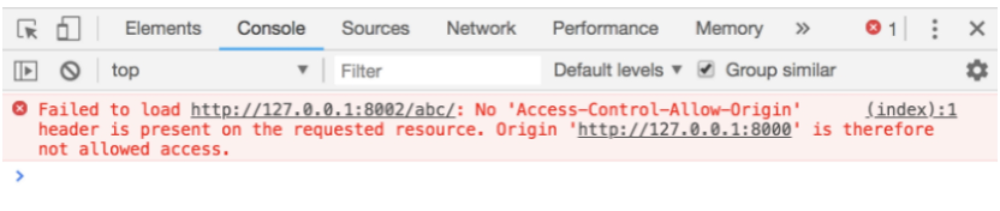

# AJAX

##  Ajax与http

术语ajax最早产生于2005年，Ajax表示Asynchronous JavaScript and XML(异步JavaScript和XML)，但是它不是像HTML、JavaScript或CSS这样的一种“正式的”技术，它是表示一些技术的混合交互的一个术语（JavaScript、Web浏览器和Web服务器），它使我们可以获取和显示新的内容而不必载入一个新的Web页面。增强用户体验，更有桌面程序的感觉。


###  什么是Ajax？

Ajax是一种技术方案，但并不是一种新技术。它依赖现有的CSS/HTML/JavaScript，而其中最核心的依赖是浏览器提供的XMLHttpRequest对象，是这个对象使得浏览器可以发出HTTP请求与接收HTTP响应。实现了在页面不刷新个情况下和服务器进行数据交互。

异步的javascript和xml  AJAX 是一种用于创建快速动态网页的技术。  ajax用来与后台交互


###  Ajax可以做什么？

• 显示新的HTML内容而不用载入整个页面

• 提交一个表单并且立即显示结果

• 登录而不用跳转到新的页面

• 星级评定组件

• 遍历数据库信息加载更多而不刷新页面


###  客户端与服务器

 

### 本章作业

Ajax是什么 有什么用


## Ajax请求步骤

### Ajax请求分4步完成

1. 创建XMLHttpRequest对象

2. 准备发送请求 open()

3. 发送请求数据 send()

4. 请求返回的回调函数 onreadystatechange=function(){}

XMLHttpRequest对象用来在【浏览器】与【服务器】之间传送数据。 通俗上来说将此对象称为request请求对象、请求对象或请求。

#### 创建ajax步骤

**1.创建XMLHttpRequest对象--进行ajax请求**

对象用来在【浏览器】与【服务器】之间传送数据 浏览器提供给我们的对象

```js
var  xhr=new XMLHttpRequest();
```

**2.准备发送数据open()方法**

语法：xhr.open(‘请求类型’，’url地址’，是否异步);

```js
xhr.open('get','02-post.php',true);
```


| 方法                       | 描述                                                         |
| -------------------------- | ------------------------------------------------------------ |
| **open(method,url,async)** | 规定请求的类型、URL 以及是否异步处理请求。*·* **method**：请求的类型；GET 或 POST*·* **url**：文件在服务器上的位置*·* **async**：true（异步）或 false（同步） |

**3.发送 send() 实际发送的数据  get请求为空 null**

<font color="red">xhr.send(null);</font>

**4.回调函数onreadystatechange属性指向一个回调函数。**

当页面的加载状态发生改变的时候readyState属性就会跟随发生变化，而这时readystatechange属性所对应的回调函数就会自动被调用。

 ```js
xhr.onreadystatechange=function(){
  if(xhr.readyState==4){//表示服务器数据已经完全接收
    if(xhr.status==200){//, OK，访问正常
      console.log(xhr.responseText)
    }
  }
}
 ```


onreadystatechange 事件

当请求被发送到服务器时，我们需要执行一些基于响应的任务。

每当 readyState 改变时，就会触发 onreadystatechange 事件。

readyState 属性存有 XMLHttpRequest 的状态信息。

#### readyState状态码

| 属性               | 描述                                                         |
| ------------------ | ------------------------------------------------------------ |
| onreadystatechange | 存储函数（或函数名），每当 readyState 属性改变时，就会调用该函数。 |
| readyState         | 存有 XMLHttpRequest 的状态。从 0 到 4 发生变化。· 0: 请求未初始化· 1: 服务器连接已建立· 2: 请求已接收· 3: 请求处理中· 4: 请求已完成，且响应已就绪 |
| status             | 200: "OK" 404: 未找到页面                                    |

 

#### get有参	

```js
document.querySelector('.btn').onclick=function(){
    var username=document.querySelector('.name').value;
    var password=document.querySelector('.psd').value;
    var xhr=new XMLHttpRequest();
    xhr.open('get','06ajax_get.php?userName='+username+'&passWord='+password,true);
    xhr.send();
    xhr.onreadystatechange=function(){
        if(xhr.readyState==4){
            if(xhr.status==200){
                console.log(xhr.responseText);
            }
        }
    }
}
```


#### post有参

```js
document.querySelector('.btn').onclick=function(){
            var username=document.querySelector('.name').value;
            var password=document.querySelector('.psd').value;
            var xhr=new XMLHttpRequest();//new Date()
            xhr.open('post','06ajax_get.php',true);
            vardata='userName='+username+'&passWord='+password;         xhr.setRequestHeader("Content-type","application/x-www-form-urlencoded; charset=utf-8");
            xhr.send(data);
            xhr.onreadystatechange=function(){
                if(xhr.readyState==4){
                    if(xhr.status==200){
                        console.log(xhr.responseText);
                    }
                }
            }
        }
```


#### 获取json数据

 ```js
document.querySelector('.btn').onclick=function(){
  var xhr=new XMLHttpRequest();//new Date()            
  xhr.open('get','data/data.json',true);            
  xhr.send();
  xhr.onreadystatechange=function(){
    if(xhr.readyState==4){
      if(xhr.status==200){
        var dataJson=JSON.parse(xhr.responseText);
        console.log(dataJson);
        var books=dataJson.data;
        for(var i=0;i<books.length;i++){
          var lis=document.createElement('li');
          lis.innerHTML=books[i].name;
          document.getElementById('ul').appendChild(lis);        
        }
      }
    }
  }
}
 ```

【json数据】

 

#### XMLHttpRequest兼容 

所有现代浏览器（IE7+、Firefox、Chrome、Safari 以及 Opera）均内建 XMLHttpRequest 对象。

创建 XMLHttpRequest 对象的语法：

```js
variable=new XMLHttpRequest();
```

老版本的 Internet Explorer （IE5 和 IE6）使用 ActiveX 对象：

```js
variable=new ActiveXObject("Microsoft.XMLHTTP");
```


 

【代码演示】

```js
var xmlhttp;

 if (window.XMLHttpRequest) { 

// IE7+, Firefox, Chrome, Opera, Safari 浏览器执行代码 

xmlhttp=new XMLHttpRequest(); } 

else {// IE6, IE5 浏览器执行代码

 xmlhttp=new ActiveXObject("Microsoft.XMLHTTP"); }
```


#### timout

 

### 本章作业

1.默写ajax请求步骤

2.get传递参数post传递参数

3.json数据解析


## 原生Ajax封装

### 封装函数

把共同的 同样的功能封装成一个函数 ，使用的时候 直接调用函数名就好了

$() 就是一个函数  带有参数的函数，调用$()获取到当前的数据，return

```html
<div id='div1'></div>
<div id='div2'></div>
<div id='div3'></div>
<div id='div4'></div>
<div id='div5'></div>

<script>
  //JS获取div 
  var div1= document.getElementById('div1');
  var div2= document.getElementById('div2');
  var div3= document.getElementById('div3');
  var div4= document.getElementById('div4');
    function $(id){
        return document.querySelector(id);
    }
		$('#div1');
</script>
```


### Ajax封装

#### 封装思路

1.封装函数 myAjax() 请求参数：请求方式  请求地址 请求数据 回调函数

2.myAjax({type:'',url:'',data:{},success:fun})

3.定义函数 function myAjax(jsonData)  

4.函数 封装ajax  原生ajax：数据拼接 data='uname=qq&upsd=123'

get方式： open('get',url?data) send(null)

post方式：open('post',url)  send(data)

#### 原生的ajax请求

```js
document.getElementById('btn').onclick=function(){
            var name=document.getElementById('name').value;
            var psd=document.getElementById('psd').value;
            if(window.XMLHttpRequest){
                xhr = new XMLHttpRequest();//i7 主流浏览器都支持
            }else if(window.ActiveXObject){
                xhr = new ActiveXObject();//ie5 ie6 
            }
            xhr.open('get','06get_json.php?uname='+name,true);
            xhr.send();
            xhr.onreadystatechange=function(){
                if(xhr.readyState==4 && xhr.status==200){
                    console.log(xhr.responseText);//返回xhr 字符串格式
                    console.log(JSON.parse(xhr.responseText));
                }
            }
        }
```


​      var name=document.getElementById('name').value;

​      var psd=document.getElementById('psd').value;

​      if(window.XMLHttpRequest){

​         xhr = new XMLHttpRequest();//i7 主流浏览器都支持

​       }else if(window.ActiveXObject){

​         xhr = new ActiveXObject();//ie5 ie6 

​       }

​      xhr.open('get','06get_json.php?uname='+name,true);

​      xhr.send();

​      xhr.onreadystatechange=function(){

​        if(xhr.readyState==4 && xhr.status==200){

​          console.log(xhr.responseText);//返回xhr 字符串格式

​          console.log(JSON.parse(xhr.responseText));

​        }

​      }

​    }

#### 封装代码

```js
document.getElementById('btn').onclick=function(){
    var name=document.getElementById('name').value;
    var psd=document.getElementById('psd').value;
                myAjax({
                    type:’ get',
                    url:'05ajax.php',
                    data:{
                        uname:name,
                        upsd:psd
                    },
                    success:function(aa){
                        console.log(aa);
                    }
                })
            }     
   function myAjax(jsonData){
    	var xhr=new XMLHttpRequest();
    	var newData=''; 
    if(jsonData.data){
        var str='';
        var arr=[];
        for(var key in jsonData.data){
            str=key+'='+jsonData.data[key];
            arr.push(str);
        }
        newData=arr.join('&');//最终处理的数据拼接结果
    }
    if(jsonData.type.toLowerCase()=='get'){
        xhr.open('get',jsonData.url+'?'+newData,true);
        xhr.send();
    } else if(jsonData.type.toLowerCase()=='post'){
        xhr.open('post',jsonData.url,true);
        xhr.setRequestHeader('Content-type','application/x-www-form-urlencoded;charset=utf-8');
        xhr.send(newData);
    }  
    xhr.onreadystatechange=function(){
        if(xhr.readyState==4){
            if(xhr.status==200){
               jsonData.success(xhr.responseText);
            }
        }
    }
}
```


### 本章作业

1.封装ajax

2.使用封装好的ajax请求一个本地的json文件，并渲染页面


## 什么是跨域

### 跨域问题产生的原因

浏览器安全问题：浏览器的同源策略是浏览器上为安全性考虑实施的非常重要的安全策略。从一个域上加载的脚本不允许访问另外一个域的文档属性 

当前的地址下去访问浏览器上另外一个地址，不允许我们访问，浏览器阻止我们访问，安全

跨域，指的是从一个域名去请求另外一个域名的资源。即跨域名请求！跨域时，浏览器不能执行其他域名网站的脚本，是由浏览器的同源策略造成的，是浏览器施加的安全限制。

跨域的严格一点来说就是只要协议，域名，端口有任何一个的不同，就被当作是跨域

**访问游侠客旅游 分页网址：**

http://www.youxiake.com/search/line?keyword=&select=1&class_tab=0&area=0&day=1

【代码演示】

```js
<script src='js/myAjax.js'></script>

<script>
  myAjax({
  type:'get',
  url:' http://www.youxiake.com/search/line?keyword=&select=1&class_tab=0&area=0&day=1',
  success:function(res){
    console.log(JSON.parse(res));
  }
}) 
</script>
```


报错

 

### 同源策略

同源策略是由 Netscape 公司提出的一个著名的安全策略，所有支持 JavaScript 的浏览器都会使用这个策略。所谓同源是指，域名，协议，端口相同。当页面在执行一个脚本时会检查访问的资源是否同源，如果非同源，那么在请求数据时，浏览器会在控制台中报一个异常，提示拒绝访问。

 

 

 

 

### 为什么要跨域？

现实工作开发中经常会有跨域的情况，因为公司会有很多项目，也会有很多子域名，各个项目或者网站之间需要相互调用对方的资源，避免不了跨域请求。

 

### 本章作业

1.什么是同源策略

2.什么是跨域

 

## 第三节 跨域解决方案

1、 通过jsonp跨域
2、 document.domain + iframe跨域
3、 location.hash + iframe
4、 window.name + iframe跨域
5、 postMessage跨域
6、 跨域资源共享（CORS）
7、 nginx代理跨域
8、 nodejs中间件代理跨域
9、 WebSocket协议跨域

 

### 后台代理

浏览器阻止跨域请求，利于后台去访问服务器资源，然后本地访问php后台返回的数据。

```js
<script src="https://cdn.bootcss.com/jquery/3.4.1/jquery.min.js"></script>
<script>
  $.ajax({
  type:'get',
  url:'08houtai.php',
  dataType:'json',
  success:function(res){
    console.log(res);
  }
})        
</script>
```


php文件：

```js
$res=file_get_contents('http://www.youxiake.com/xxx ');

echo $res;
```

### iframe跨域 

1.）父窗口：(http://www.domain.com/a.html)

```js
<iframe id="iframe" src="http://child.domain.com/b.html"></iframe>
<script>
    document.domain = 'domain.com';
    var user = 'admin';
</script>
```

2.）子窗口：(http://child.domain.com/b.html)

```js
<script>
    document.domain = 'domain.com';
    // 获取父窗口中变量
    alert('get js data from parent ---> ' + window.parent.user);
</script> 
```

### 跨域资源共享（CORS）

普通跨域请求：只服务端设置Access-Control-Allow-Origin即可，前端无须设置

**CORS是一个W3C标准，全称是“跨域资源共享”（Cross-origin resource sharing）。**

它允许浏览器向跨源服务器发出XMLHttpRequest请求，从而克服了AJAX只能同源发送请求的限制。

实现CORS主要在于服务器的设置，关键在于服务器HTTP响应报文首部的设置。前端部分大致还是跟原来发AJAX请求没什么区别，只是需要对AJAX进行一些相关的设置。

CORS的两种请求

浏览器将CORS分为两种请求，一种是简单请求，另外一种对应的肯定就是非简单请求

阮一峰：http://www.ruanyifeng.com/blog/2016/04/cors.html

 

### porxy代理

原理：让代理服务器请求目标地址，因为请求是在服务端进行的，在服务端不存在跨域，从而解决跨域问题

实现：将原地址绑定在代理服务器下，让代理服务器发送请求。


### jsonp跨域

#### jsonp跨域的原理

动态创建script标签,利用script标签的src属性可以获取任何域下的js脚本,通过这个特性(也可以说漏洞),服务器端不在返回json格式,而是返回一段调用某个函数的js代码，在src中进行了调用，这样实现了跨域

##### 【代码演示】

```js
<!-- script 去请求资源  callback函数   demo函数 回调函数-->
<script>
  function demo(res){//res形参  res后台返回给我的数据
  console.log(res);
}       
</script>
<script src='09jsonp.php?callback=demo'></script>
```


php:

```php
<?php
    //接收函数变量名
    $fun=$_GET['callback'];
    //比如 虚拟数据 创建数组
    $arr=array('msg'=>'ok','info'=>'虚拟后台数据');
    $obj=json_encode($arr);//数组--字符串对象
    // $obj='hello';
    echo "$fun($obj)";
?>
```


##### 【代码演示】

```js
<!-- 百度搜索框：http://suggestion.baidu.com/su?cb=callback&wd=ajax 
        cb后台接收的函数名字
        callback:前端定义的回调函数的名字
    -->
    <script>
        function demo(res){
            console.log(res);
        }
    </script>
     <script src='http://suggestion.baidu.com/su?cb=demo&wd=ajax'></script>
```


#### 不受同源限制的情况

当然也有不受同源限制的情况存在，主要有以下列举的：

1. script标签允许跨域嵌入脚本，稍后介绍的JSONP就是利用这个“漏洞”来实现。

2. img标签、link标签、@font-face不受跨域影响。

3. video和audio嵌入的资源。

4. iframe载入的任何资源。（不是iframe之间的通信）

5. `<object>`、`<embed>`和`<applet>`的插件。

6. WebSocket不受同源策略的限制。

### 本章作业

1.跨域的解决方式有哪几个

2.jsonp解决跨域的原理


## 第四节  jsonp跨域

### 百度jquery跨域请求

【语法】

```js
$.ajax({
  type: "get",
  async: false,
  url: "http://localhost:8080/getdata.php",
  dataType: "jsonp",
  jsonp: "callback",//传递给请求处理程序或页面的，标识jsonp回调函数名(一般为:callback)
  jsonpCallback: "GetData",//callback的function名称
  success: function (data) {
    console.log(data);
  },
  error: function () {
    alert('fail');
  }
});
```


语法解析参数：

`jsonp`：
在一个jsonp请求中重写回调函数的名字。这个值用来替代在"callback=?"这种GET或POST请求中URL参数里的"callback"部分，
比如{jsonp:'onJsonPLoad'}会导致将"onJsonPLoad=?"传给服务器。

`jsonpCallback`：
为jsonp请求指定一个回调函数名。这个值将用来取代jQuery自动生成的随机函数名。
这主要用来让jQuery生成一个独特的函数名，这样管理请求更容易，也能方便地提供回调函数和错误处理

 

#### 【百度代码演示】

```js
<script src="https://cdn.bootcss.com/jquery/3.4.1/jquery.min.js"></script>
<script>
  var val='爱';//input里面获取的
  $.ajax({
      type:'get',
      url:'http://suggestion.baidu.com/su?wd=ajax',
      dataType:'jsonp',//数据类型jsonp格式
      jsonp:'cb',//定义回调函数参数名字 后台接收的函数名  默认callback 如果后台用的默认的 可以省略的
      jsonpCallback:"demo",//可以省略： 默认：jquery随机数字()
      success:function(res){
        console.log(res);
      }
	})
</script>
```


### jsonp优缺点

#### 优点

1.它不像`XMLHttpRequest`对象实现的Ajax请求那样受到同源策略的限制，`JSONP`可以跨越同源策略

2.它的兼容性更好，在更加古老的浏览器中都可以运行，不需要`XMLHttpRequest`或`ActiveX`的支持；  

3.在请求完毕后可以通过调用`callback`的方式回传结果。

将回调方法的权限给了调用方。这个就相当于将`controller`层和view层终于分开了。

我提供的`jsonp`服务只提供纯服务的数据，至于提供服务以 后的页面渲染和后续view操作都由调用者来自己定义就好了。

如果有两个页面需要渲染同一份数据，你们只需要有不同的渲染逻辑就可以了，

逻辑都可以使用同 一个`jsonp`服务。


#### 缺点

1、它只支持GET请求而不支持POST等其它类型的HTTP请求

2、它只支持跨域HTTP请求这种情况，不能解决不同域的两个页面之间如何进行JavaScript调用的问题。

3、jsonp在调用失败的时候不会返回各种HTTP状态码。

4、缺点是安全性。万一假如提供jsonp的服务存在页面注入漏洞，即它返回的javascript的内容被人控制的。

那么结果是什么？所有调用这个 jsonp的网站都会存在漏洞。

于是无法把危险控制在一个域名下…所以在使用jsonp的时候必须要保证使用的jsonp服务必须是安全可信的。

 

### 百度搜索效果

 

### 本章作业

实现百度搜索框


## jquery的ajax

### Ajax步骤

```js
$('#btn').click(function(){
  var name=$(".name").val();
  $.ajax({
    type:'post',//请求方式
    url:'09jquery_ajax.php',
    data:{
      uname:name,
    }, 
    success:function(res){
      console.log(res);
      $(".info").html(res);
    },
    error:function(){
      console.log("请求失败");
    },
    beforeSend:function(){//请求数据之前  执行的内容
      console.log("数据请求中.....");
      $(".info").html('数据请求中.....');
    },
  })
})
```


### 回调函数

如果要处理$.ajax()得到的数据，则需要使用回调函数。beforeSend、error、dataFilter、success、complete。 

beforeSend 在发送请求之前调用，并且传入一个XMLHttpRequest作为参数。 

error 在请求出错时调用。传入XMLHttpRequest对象，描述错误类型的字符串以及一个异常对象 

dataFilter 在请求成功之后调用。传入返回的数据以及"dataType"参数的值。并且必须返回新的数据（可能是处理过的）传递给success回调函数。 

success 当请求之后调用。传入返回后的数据，以及包含成功代码的字符串。 

complete 当请求完成之后调用这个函数，无论成功或失败。传入XMLHttpRequest对象，以及一个包含成功或错误代码的字符串。

#### 防止重复数据

在实际项目开发中，提交表单时常常由于网络或者其原因，用户点击提交按钮误认为自己没有操作成功，进而会重复提交按钮操作次数，如果页面前端代码没有做一些相应的处理，通常会导致多条同样的数据插入数据库，导致脏数据的增加。要避免这种现象，在$.ajax请求中的beforeSend方法中把提交按钮禁用掉，等到Ajax请求执行完毕，在恢复按钮的可用状态。

举个例子：

```js
// 提交表单数据到后台处理
$.ajax({
    type: "post",
    data: studentInfo,
    contentType: "application/json",
    url: "/Home/Submit",
    beforeSend: function () {
        // 禁用按钮防止重复提交
        $("#submit").attr({ disabled: "disabled" });
    },
    success: function (data) {
        if (data == "Success") {
            //清空输入框
            clearBox();
        }
    },
    complete: function () {
        $("#submit").removeAttr("disabled");
    },
    error: function (data) {
        console.info("error: " + data.responseText);
    }
});
```


#### 模拟Toast效果

ajax请求服务器加载数据列表时提示loading(“加载中，请稍后...”),

```js
$.ajax({
    type: "post",
    contentType: "application/json",
    url: "/Home/GetList",
    beforeSend: function () {
        $("loading").show();
    },
    success: function (data) {
        if (data == "Success") {
            // ...
        }
    },
    complete: function () {
        $("loading").hide();
    },
    error: function (data) {
        console.info("error: " + data.responseText);
    }
});
```


### 本章作业

1.jquery的ajax步骤

2.beforeSend() complete()函数使用


## jquery的ajax方法

###  jquery封装的ajax方法

```js
$.get(url, [data], [callback], [type])
```

**url**:待载入页面的URL地址

**data**:待发送 Key/value 参数。

**callback**:载入成功时回调函数。

**type**:返回内容格式，xml, html, script, json, text, _default。

```js
$.get("test.php", {},function(data){
     alert("Data Loaded: " + data);
},’json’);
```

```js
$.getJSON(url, [data], [callback])
```

**url**:发送请求地址。

**data**:待发送 Key/value 参数。

**callback**:载入成功时回调函数。

```js
$.getJSON("test.js", { name: "John", time: "2pm" }, function(json){

	alert("JSON Data: " + json.users[3].name);

});
```

```js
$.post (url, [data], [callback],[type])
```

**url**:发送请求地址。

**data**:待发送 Key/value 参数。

**callback**:发送成功时回调函数。

**type**:返回内容格式，xml, html, script, json, text, _default。

```js
$.post("test.php", { name: "John", time: "2pm" },
	function(data){
		process(data);
}, "xml");
```


 

### 从浏览器输入url地址，到页面最终渲染完成，中间发生了什么

1.DNS解析 将域名地址解析为ip地址

2.TCP连接 - TCP三次握手 

第一次握手：由客户端发起，告诉服务端我将要发送请求了 

第二次握手：由服务端发起，告诉客户端我知道了，你放马过来

第三次握手：由客户端发起，告诉服务端我知道了，我真的要发了，你赶紧准备接受

3. 发送请求 请求报文

4. 接受响应

5. 响应请求 处理数据 

6. 发送数据 响应数据

7. 渲染页面

8. 断开连接 - TCP四次挥手

 第一次挥手：由服务端发起，告诉客户端东西（请求报文）接受完了

 第二次挥手：由客户端发起，告诉服务端，那好，我关闭了发送东西的接口

 

 

 第三次挥手：由客户端发起，告诉服务端东西（响应报文）接受完了 

 第四次挥手：由服务端发起，告诉客户端我准备关闭了，你也准备关闭吧


### 本章作业

1.点击按钮显示数据

 


2.查询物流信息 获取数据 渲染到页面上

 

 

