# css3新特性

## 圆角

使用 CSS3 border-radius 属性，你可以给任何元素制作 "圆角"。


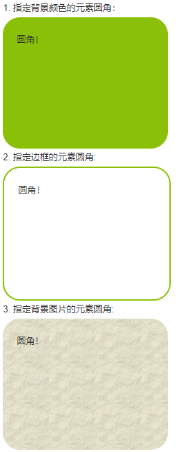

```css
border-top-left-radius:10px;
border-top-right-radius:6px;
border-bottom-left-radius:8px;
border-bottom-right-radius:12px

border-radius:10px 6px 8px 12px;
border-radius:10px 6px 8px;
border-radius:10px 6px;
border-radius:10px;
/*
（1）四个值: 第一个值为左上角，第二个值为右上角，第三个值为右下角，第四个值为左下角。
（2）三个值: 第一个值为左上角, 第二个值为右上角和左下角，第三个值为右下角
（3）两个值: 第一个值为左上角与右下角，第二个值为右上角与左下角
（4）一个值： 四个圆角值相同
*/
```

## 阴影


### 盒阴影

box-shadow 向框添加一个或多个阴影。


```css
box-shadow: 10px 10px 5px green;
/*
语法：box-shadow: h-shadow v-shadow blur spread color inset;

h-shadow:必需，水平阴影的位置，允许负值。
v-shadow:必需，垂直阴影的位置，允许负值。
blur:可选，模糊距离。
spread:可选，阴影的尺寸。
color:可选，阴影的颜色。
inset:可选，设置为内部阴影。
*/
```

### 字阴影

text-shadow 属性向文本设置阴影。

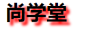

```css
h1{
  font-size: 30px;
  text-shadow: 5px 5px 5px #FF0000;
}

/*
语法：text-shadow: h-shadow v-shadow blur color;

h-shadow:必需，水平阴影的位置，允许负值。
v-shadow:必需，垂直阴影的位置，允许负值。
blur:可选，模糊距离。
color:可选，阴影的颜色。
*/
```


### 省略号

```css
overflow:hidden;
white-space:nowrap;
text-overflow:ellipsis;
```


## 背景渐变

### 定义

CSS3 渐变（gradients）可以让你在两个或多个指定的颜色之间显示平稳的过渡。

以前，你必须使用图像来实现这些效果。但是，通过使用 CSS3 渐变（gradients），你可以减少下载的时间和宽带的使用。此外，渐变效果的元素在放大时看起来效果更好，因为渐变（gradient）是由浏览器生成的。

CSS3 定义了两种类型的渐变（gradients）：

**(1)线性渐变（Linear Gradients）- 向下/向上/向左/向右/对角方向**

**(2)径向渐变（Radial Gradients）- 由它们的中心定义**


### 线性渐变(linear-gradient)

定义:

为了创建一个线性渐变，你必须至少定义两种颜色结点。颜色结点即你想要呈现平稳过渡的颜色。同时，你也可以设置一个起点和一个方向（或一个角度）。

语法:

```css
background: linear-gradient(direction, color-stop1, color-stop2, ...);
```

 

实例1

线性渐变 - 从上到下（默认情况）

下面的实例演示了从顶部开始的线性渐变。起点是红色，慢慢过渡到蓝色：

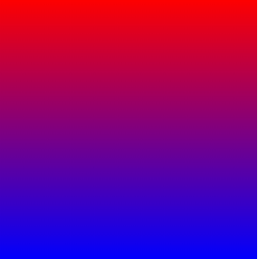

```css
#grad {
  width: 300px;
  height: 300px;
  background: linear-gradient(red, blue);
}
```

实例2

线性渐变 - 从左到右

下面的实例演示了从左边开始的线性渐变。起点是红色，慢慢过渡到蓝色：

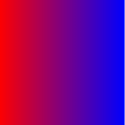

```css
#grad {
  width: 300px;
  height: 300px;
  background:linear-gradient(to right, red , blue);
}
```

实例3

线性渐变 - 对角

你可以通过指定水平和垂直的起始位置来制作一个对角渐变。

下面的实例演示了从左上角开始（到右下角）的线性渐变。起点是红色，慢慢过渡到蓝色：

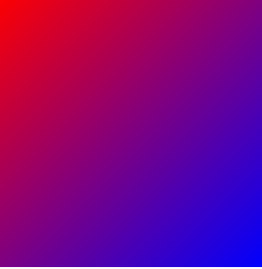

```
#grad {
  width: 300px;
  height: 300px;
  background: linear-gradient(to bottom right, red , blue); 
}
```


### 径向渐变（Radial Gradients）

定义：

为了创建一个径向渐变，你也必须至少定义两种颜色结点。颜色结点即你想要呈现平稳过渡的颜色。同时，你也可以指定渐变的中心、形状（圆形或椭圆形）、大小。默认情况下，渐变的中心是 center（表示在中心点），渐变的形状是 ellipse（表示椭圆形），渐变的大小是 farthest-corner（表示到最远的角落）。

语法：

```css
background: radial-gradient(center, shape size, start-color, ..., last-color);
```

实例1：

径向渐变 - 颜色结点均匀分布（默认情况下）

```css
#grad {
	width: 300px;
	height: 300px;
	background: radial-gradient(red, yellow, green);
}
```


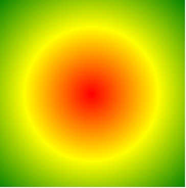

实例2：

径向渐变 - 颜色结点不均匀分布

```css
#grad {
	width: 300px;
	height: 300px;
	background: radial-gradient(red 5%, green 15%, blue 60%); 
}
```

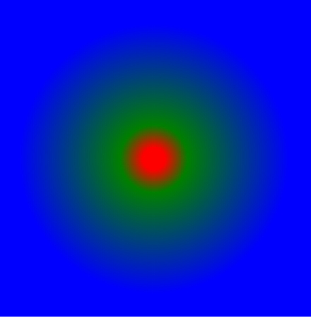

实例3：

shape 参数定义了形状。它可以是值 circle 或 ellipse。其中，circle 表示圆形，ellipse 表示椭圆形。默认值是 ellipse。

```css
#grad {
	width: 500px;
	height: 300px;
	background: radial-gradient(circle, red, yellow, green); 
}
```

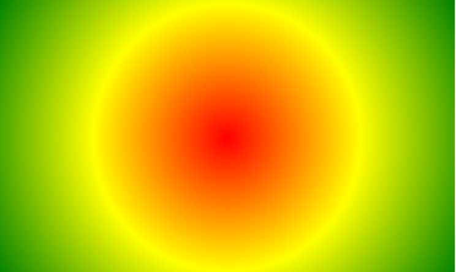


## 转换

定义：

转换的效果是让某个元素改变形状，大小和位置。

transform 属性向元素应用 2D 或 3D 转换。该属性允许我们对元素进行<font color="color">旋转、缩放、移动或倾斜</font>。

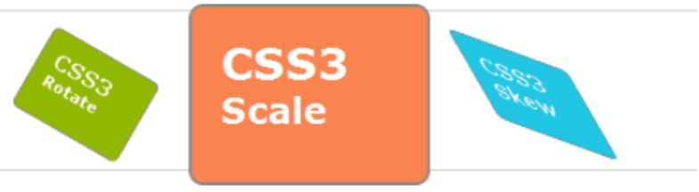

语法：

```css
transform: none|transform-functions;
```

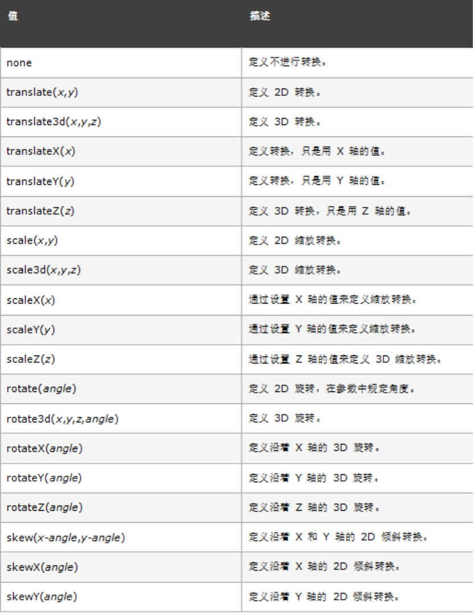


### translate方法

定义：

translate()方法，根据左(X轴)和顶部(Y轴)位置给定的参数，从当前元素位置移动。

实例：

```css
.box {
	width: 100px;
	height: 80px;
	background-color: rgba(255,0,0,.8);
	transform: translate(50px,100px);
}
```

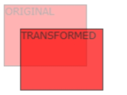

translate值（50px，100px）是从左边元素移动50个像素，并从顶部移动100像素。


### rotate方法

定义：

​	rotate()方法，在一个给定度数顺时针旋转的元素。负值是允许的，这样是元素逆时针旋转。

实例：

```css
.box {
	width: 100px;
	height: 80px;
	background-color: rgba(255,0,0,.8);
	transform: rotate(30deg);
}
```

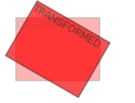

rotate值(30deg)是以元素中心点为旋转点，将元素顺时针旋转30度。


### scale方法

定义：

scale()方法，该元素增加或减少的大小，取决于宽度（X轴）和高度（Y轴）的参数：

实例：

```css
.box {
	width: 100px;
	height: 80px;
	background-color: rgba(255,0,0,.8);
	transform: scale(2,3); 
}
```

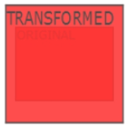

scale（2,3）转变为原来的大小的2倍宽度和3倍高度。

### skew方法

定义：

```css
transform:skew(<angle> [,<angle>]);
```

​		包含两个参数值，分别表示X轴和Y轴倾斜的角度，如果第二个参数为空，则默认为0，参数为负表示向相反方向倾斜。

（1）skewX(<angle>);表示只在X轴(水平方向)倾斜。

（2）skewY(<angle>);表示只在Y轴(垂直方向)倾斜。


实例：

```css
.box {
	width: 100px;
	height: 80px;
	background-color: rgba(255,0,0,.8);
	transform: skew(30deg,20deg);
}
```

### 3D转换

定义：

CSS3 允许您使用 3D 转换来对元素进行格式化。

在本章中，您将学到其中的一些 3D 转换方法：

（1）rotateX()

（2）rotateY()

#### rotateX方法

rotateX()方法，围绕其在一个给定度数X轴旋转的元素。

```css
.box {
  width: 100px;
  height: 80px;
  background-color: rgba(255,0,0,.8);
  transform: rotateX(120deg);
}
```

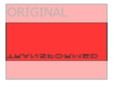

#### rotateY方法

rotateY()方法，围绕其在一个给定度数Y轴旋转的元素。

```css
.box {
  width: 100px;
  height: 80px;
  background-color: rgba(255,0,0,.8);
  transform: rotateY(130deg);
}
```

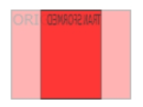


## 过渡

定义：

​		CSS3 过渡是元素<font color="color">从一种样式逐渐改变为另一种</font>的效果。

​		通过过渡transition，可以让web前端开发人员不需要javascript就可以实现简单的动画交互效果。

语法：

​		过渡transition是一个复合属性，包括<font color="color">transition-property、transition-duration、transition-timing-function、transition-delay</font>这四个子属性。通过这四个子属性的配合来完成一个完整的过渡效果。

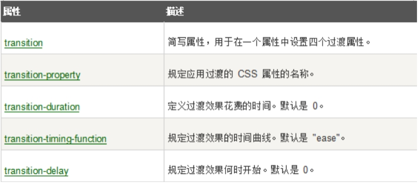

### 过渡属性

1、transition-property

　	值: none | all | `<transition-property>`[,`<transition-property>`]*

　　初始值: all

　　应用于: 所有元素

​		继承性: 无

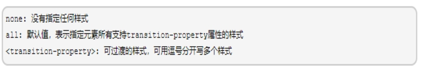

、可过渡的样式

不是所有的CSS样式值都可以过渡，只有具有中间值的属性才具备过渡效果

<font color="color">（1）取值为颜色</font>

<font color="color">（2）取值为数值</font>

<font color="color">（3）阴影（box-shadow,text-shadow）</font>

<font color="color">4）转换（transform）</font>

<font color="color">（5）背景渐变（gradient）</font>

### 过渡持续时间

transition-duration

该属性的单位是秒s或毫秒ms

初始值: 0s

应用于: 所有元素

继承性: 无

[注意]该属性不能为负值

[注意]若该属性为0s则为默认值，若为0则为无效值。所以必须带单位

[注意]该值为单值时，即所有过渡属性都对应同样时间；该值为多值时，过渡属性按照顺序对应持续时间

### 过渡时间函数

transition-timing-function

过渡时间函数用于定义元素过渡属性随时间变化的过渡速度变化效果

值: `<timing-function>`[,`<timing-function>`]*

初始值: ease

应用于: 所有元素

继承性: 无

取值：ease|ease-in|ease-out|ease-in-out

### 过渡延迟时间

transition-delay

该属性定义元素属性延迟多少时间后开始过渡效果，该属性的单位是秒s或毫秒ms

值: `<time>`[,`<time>`]*

初始值: 0s

应用于: 所有元素

继承性: 无

　　[注意]该属性若为负值，无延迟效果，但过渡元素的起始值将从0变成设定值(设定值=延迟时间+持续时间)。若该设定值小于等于0，则无过渡效果；若该设定值大于0，则过渡元素从该设定值开始完成剩余的过渡效果

　　[注意]若该属性为0s则为默认值，若为0则为无效值。所以必须带单位

[注意]该值为单值时，即所有过渡属性都对应同样时间；该值为多值时，过渡属性按照顺序对应持续时间

### 复合属性

​		过渡transition的这四个子属性只有<font color="color">`<transition-duration>`是必需值</font>且不能为0。其中，<transition-duration>和<transition-delay>都是时间。<font color="color">当两个时间同时出现时，第一个是`<transition-duration>`，第二个是`<transition-delay>`</font>；当只有一个时间时，它是<transition-duration>，而<transition-delay>为默认值0

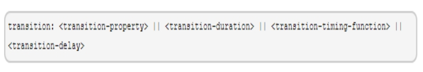

<font color="color">[注意]transition的这四个子属性之间不能用逗号隔开，只能用空格隔开。</font>

实例1：

鼠标移动到元素上，会出现宽度变化效果

```css
.box {
  width: 100px;
  height: 100px;
  background-color: rgba(255,0,0,.8);
  transition-property: all;
  transition-duration: 3s;
}
.box:hover{
	width: 500px;
}
```

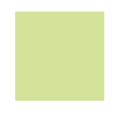


实例2：

```css
.box {
  width: 100px;
  height: 100px;
  border-radius: 5px;
  background-color: #D3E399;
  transition: all 2s;
}
  .box:hover{
  background-color: #1ec7e6;
  transform: rotate(45deg) scale(1.5);
}
```


## 动画

### 概念

动画是使元素从一种样式逐渐变化为另一种样式的效果。

您可以<font color="red">改变任意多的样式任意多的次数</font>。

请用百分比来规定变化发生的时间，或用关键词 <font color="red">"from" 和 "to"</font>，等同于 <font color="red">0% 和 100%</font>。

0% 是动画的开始，100% 是动画的完成。

为了得到最佳的浏览器支持，您应该始终定义 0% 和 100% 选择器。

animation比较<font color="red">类似于 flash 中的逐帧动画</font>，逐帧动画就像电影的播放一样，表现非常细腻并且有非常大的灵活性。然而<font color="red">transition只是指定了开始和结束态</font>，整个动画的过程也是由特定的函数控制。学习过 flash 的同学知道，这种逐帧动画是由关键帧组成，很多个关键帧连续的播放就组成了动画，在 CSS3 中是由属性<font color="red">keyframes来完成逐帧动画</font>的。

### @keyframes

#### 定义：

使用@keyframes规则，你可以创建动画。

创建动画是通过逐步改变从一个CSS样式设定到另一个。

在动画过程中，您可以更改CSS样式的设定多次。

指定的变化时发生时使用％，或关键字"from"和"to"，这是和0％到100％相同。
<font color="red">0％是开头动画，100％是当动画完成</font>。
为了获得最佳的浏览器支持，您应该始终定义为0％和100％的选择器。

#### 语法：

```css
@keyframes name {
  from|0%{
    css样式
  }
  percent{
    css样式
  }
  to|100%{
    css样式
  }
}
```

name：动画名称，开发人员自己命名；

percent：为百分比值，可以添加多个百分比值；

#### animation-name

它是用来设置动画的名称，可以同时赋值多个动画名称，用,隔开：

```css
.animation{
	animation-name: name1,name2,...;
}
```

#### animation-duration

它是用来设置动画的持续时间，单位为s或者ms，默认值为0：

```css
.animation{
	animation-duration: time1,time2,...;
}
```

#### animation-timing-function

它是来设置动画效果的速率

ease：逐渐变慢（默认）

linear：匀速

ease-in：加速

ease-out：减速

ease-in-out：先加速后减速

```css
.animation{
	animation-timing-function: ease | linear | ease-in | ease-out | ease-in-out;
}
```

#### animation-delay

它是来设置动画的开始时间，单位是s或者ms，默认值为0：

```css
.animation{
	animation-delay: time1,time2,...;
}
```

#### animation-iteration-count

它是来设置动画循环的次数，默认为1，<font color='red'>infinite为无限次数的循环</font>

```css
.animation{
	animation-iteration-count:infinite | number;
}
```

#### animation-direction

​		它是来设置动画播放的方向，默认值为normal表示向前播放，alternate代表动画播放在第偶数次向前播放，第奇数次向反方向播放：

```css
.animation{
		animation-direction: normal | alternate;
}
```

#### animation-play-state

它主要是来控制动画的播放状态：<font color='red'>running代表播放，而paused代表停止播放</font>，running为默认值：

```css
.animation{
	animation-play-state:running | paused ;
}
```

#### animation-fill-mode

​		它是规定动画在播放之前或之后，其动画效果是否可见，默认值为none表示不改变默认行为，forwards当动画完成后，保持最后一个属性值（在最后一个关键帧中定义），backwards在 animation-delay 所指定的一段时间内，在动画显示之前，应用开始属性值（在第一个关键帧中定义），both向前和向后填充模式都被应用。

```
.animation{
		animation-fill-mode: none | forwards|backwards|both;
}
```

#### animation

​		是animation-name、animation-duration、animation-timing-function、animation-delay、animation-iteration-count、animation-direction、fill-mode的简写：

```css
animation: name duration timing-function delay iteration-count direction fill-mode;
```

### 实例

#### 切换背景颜色

```css
<div class="animation"></div>
    .animation{
    width: 300px;
    height: 300px;
    background-color: red;
    animation: anima 3s linear infinite;
}
.animation:hover{
		animation-play-state: paused;
}
@keyframes anima {
    0%{
    background-color: red;
    }
    50%{
    background-color: green;
    }
    100%{
    background-color: blueviolet;
    }
}
```


## 绘制特殊图形

#### 绘制圆形

​	利用圆角绘制圆

```css
.box{
    width: 200px;
    height: 200px;
    background-color: #1EC7E6;
    border-radius: 50%;
}
```

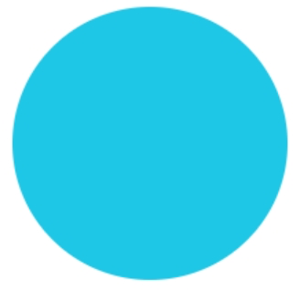

#### 绘制三角形

1. 首先需要有个元素作为三角的容器

```html
<div class="box"></div>
```

2. 制作三角型使用的是border属性，内容区宽高值为0	

```css
.box{
    width:0;
    height: 0;
    border-top:50px solid red;
    border-left:50px solid blue;
    border-right:50px solid orange;
    border-bottom:50px solid green;
}
```

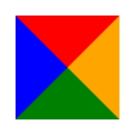

#### 绘制梯形

​		绘制三角型时宽和高都是0像素，给它加100的宽度看看效果。这样
是不是我们只取下面的红色的区域就构成了一个梯形

​		这个红色区域实际上是底部的边border-bottom，所以梯形的高度是

底部边的宽度，梯形也是借助border属性完成的。

```css
.box{
    width: 100px;
    height: 0;
    border-bottom: 80px solid red;
    border-left: 50px solid transparent;
    border-right: 50px solid transparent;
}
```

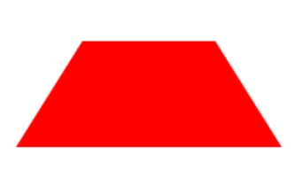

## 作业

#### 照片墙


#### 过渡练习


#### 图片缩放

