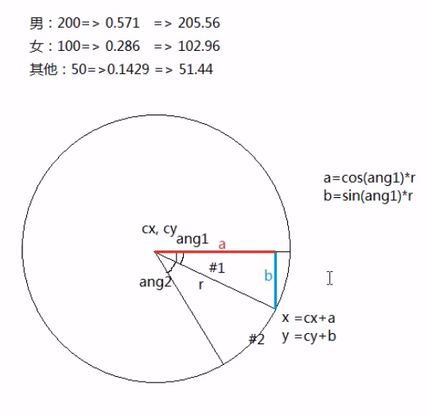

# Canvas标签

canvas是html5版本新增的标签。


```html
<!DOCTYPE html>
<html lang="en">
<head>
    <meta charset="UTF-8">
    <meta name="viewport" content="width=device-width, initial-scale=1.0">
    <title>Document</title>
    <style>
        body{
            display: flex;
            justify-content: center;
            align-items: center;
            background: black;
        }
        canvas{
            background: white;
        }
        
      /*错误写法：不能在css中定义canvas尺寸大小，这只会拉伸画布*/
      #c1{
        width:600px
      }
    </style>
</head>
<body>
   <!-- 在页面中直接写canvas标签 -->
    <canvas width="500px" height="500px" id="c1"></canvas>
</body>
</html>
```


## 路径操作

### moveTo/lineTo：

​		moveTo: 将画笔移动到某个位置

​		lineTo: 让路径描绘到一个指定位置

### beginPath/closePath：

​			beginPath：清除之前的路径操作，重新开始画路径，我们要求在每次路径开始操作之前，都要

​								执行一下这个方法，否则新路径会受到以前路径的影响。

​			closePath：闭合当前的路径，让画笔将路径闭合到起始位置(除此方法外，图形不会真的闭合)


​			从名字上看，beginPath和closePath好像是对应的，实际上并不是。


### stroke/fill:	

​			stroke：让路径操作在画布上体现出来。

​			fill：给绘制的内容区域进行填充。

```html
<!DOCTYPE html>
<html>
  <head>
    <meta charset="utf-8">
    <title></title>
    <style media="screen">
      body {background:black; text-align: center;}
      #c1 {background:#FFF}
    </style>
    <script>
    window.onload=function (){
      //获取canvas的DOM对象
      let oC=document.getElementById('c1');
      //拿到canvas的绘图区(目前只支持2d)
      let gd=oC.getContext('2d');

      //画笔移动到画布的100,100位置
      gd.moveTo(100, 100);
      //画一条线到200,200的位置
      gd.lineTo(200, 200);
      //填充线的颜色为红色
      gd.strokeStyle='red';
      //执行以下
      gd.stroke();

      //清除之前的一切路径，重新开始
      gd.beginPath();         
      gd.moveTo(300, 100);
      gd.lineTo(400, 200);
      gd.strokeStyle='yellow';
      gd.stroke();
    };
    </script>
  </head>
  <body>
    <canvas id="c1" width="800" height="600"></canvas>
  </body>
</html>
```


## 矩形

画矩形一共有以下三种操作

### rect() 

路径操作

```html
<!DOCTYPE html>
<html>
  <head>
    <meta charset="utf-8">
    <title></title>
    <style media="screen">
    body {background:black; text-align: center;}
    #c1 {background:#FFF}
    </style>
    <script>
    window.onload=function (){
      let oC=document.getElementById('c1');
      let gd=oC.getContext('2d');

      //路径
      gd.rect(100, 100, 400, 300);
      gd.fill();
    };
    </script>
  </head>
  <body>
    <canvas id="c1" width="800" height="600"></canvas>
  </body>
</html>
```

### strokeRect

图形操作

```html
<!DOCTYPE html>
<html>
  <head>
    <meta charset="utf-8">
    <title></title>
    <style media="screen">
    body {background:black; text-align: center;}
    #c1 {background:#FFF}
    </style>
    <script>
    window.onload=function (){
      let oC=document.getElementById('c1');
      let gd=oC.getContext('2d');

      //路径
      gd.lineWidth=50;
      gd.strokeStyle='yellow';
      gd.strokeRect(100, 100, 400, 300);
    };
    </script>
  </head>
  <body>
    <canvas id="c1" width="800" height="600"></canvas>
  </body>
</html>
```


### fillRect

图形操作

```html
<!DOCTYPE html>
<html>
  <head>
    <meta charset="utf-8">
    <title></title>
    <style media="screen">
    body {background:black; text-align: center;}
    #c1 {background:#FFF}
    </style>
    <script>
    window.onload=function (){
      let oC=document.getElementById('c1');
      let gd=oC.getContext('2d');

      //路径
      gd.lineWidth=50;
      gd.strokeStyle='yellow';
      gd.strokeRect(100, 100, 400, 300);
			gd.fillStyle="green"
      gd.fillRect(100, 100, 400, 300);
    };
    </script>
  </head>
  <body>
    <canvas id="c1" width="800" height="600"></canvas>
  </body>
</html>
```


### clearRect       

删除一块图形

```html
<!DOCTYPE html>
<html>
  <head>
    <meta charset="utf-8">
    <title></title>
    <style media="screen">
    body {background:black; text-align: center;}
    #c1 {background:#FFF}
    </style>
    <script>
    window.onload=function (){
      let oC=document.getElementById('c1');
      let gd=oC.getContext('2d');
      gd.rect(100, 100, 400, 300);
      gd.strokeStyle="#f00"
      gd.stroke();
//      gd.clearRect(0,0,300,500);
      gd.clearRect(0,0,oC.width,oC.height)
    };
    </script>
  </head>
  <body>
    <canvas id="c1" width="800" height="600"></canvas>
  </body>
</html>
```


canvas不会保存图形，所以速度极快。图形不能修改的，若要改只能删了重画

canvas里的图形也没有事件，但是canvas有事件，因为它在页面中是一个标签


## 动画

通过clearRect方法清除画布中的方块，重新绘画，达到动画效果

```html
<!DOCTYPE html>
<html>
  <head>
    <meta charset="utf-8">
    <title></title>
    <style media="screen">
    body {background:black; text-align: center;}
    #c1 {background:#FFF}
    </style>
    <script>
    window.onload=function (){
      let oC=document.getElementById('c1');
      let gd=oC.getContext('2d');
      let left=100;

      //路径
      setInterval(function (){
        //每次绘画前都要清除一下画布中已有的内容
        gd.clearRect(0,0,oC.width,oC.height);
        left+=5;
        gd.strokeRect(left, 100, 200, 150);
      }, 16);
    };
    </script>
  </head>
  <body>
    <canvas id="c1" width="800" height="600"></canvas>
  </body>
</html>
```

使用`requestAnimationFrame`动态调节帧频

```html
<!DOCTYPE html>
<html>
  <head>
    <meta charset="utf-8">
    <title></title>
    <style media="screen">
    body {background:black; text-align: center;}
    #c1 {background:#FFF}
    </style>
    <script>
    window.onload=function (){
      let oC=document.getElementById('c1');
      let gd=oC.getContext('2d');
      let left=100;

      requestAnimationFrame(next);

      function next(){
        gd.clearRect(0,0,oC.width,oC.height);
        left+=5;
        gd.strokeRect(left, 100, 200, 150);
        //
        requestAnimationFrame(next);
      }
    };
    </script>
  </head>
  <body>
    <canvas id="c1" width="800" height="600"></canvas>
  </body>
</html>
```


## 事件

案例1：鼠标移动事件

```html
<!DOCTYPE html>
<html>
  <head>
    <meta charset="utf-8">
    <title></title>
    <style media="screen">
      body {background:black; text-align: center;}
      #c1 {background:#FFF}
    </style>
    <script>
    window.onload=function (){
      let oC=document.getElementById('c1');
      let gd=oC.getContext('2d');

      gd.strokeRect(100, 100, 200, 150);

      //当鼠标箭头在矩形区域内，就改变矩形边框
      oC.onmousemove=function (ev){
        let l=100,t=100,r=l+200,b=t+150;
        let x=ev.clientX-oC.offsetLeft,y=ev.clientY-oC.offsetTop;
//        也可使用offsetX,offsetY来获取鼠标偏移量
//        let x=ev.offsetX,y=ev.offsetY;
        
				//清除矩形
        gd.clearRect(0,0,oC.width,oC.height);

        if(l<=x && x<=r && t<=y && y<=b){
          gd.strokeStyle='red';
        }else{
          gd.strokeStyle='black';
        }
				//重新绘制
        gd.strokeRect(100, 100, 200, 150);
      };
    };
    </script>
  </head>
  <body>
    <canvas id="c1" width="800" height="600"></canvas>
  </body>
</html>
```

案例2：画弧


在canvas中，角度都是用弧度来计算的，满圆是360°，也就是2π弧度

```html
<!DOCTYPE html>
<html>
  <head>
    <meta charset="utf-8">
    <title></title>
    <style media="screen">
    body {background:black; text-align: center;}
    #c1 {background:#FFF}
    </style>
    <script>
    //角度转弧度
    function d2a(n){
      return n*Math.PI/180;
    }
    //弧度转角度
    function a2d(n){
      return n*180/Math.PI;
    }
    window.onload=function (){
      let oC=document.getElementById('c1');
      let gd=oC.getContext('2d');

      let cx=400,cy=300,r=150;

      //最后一个参数表示画路径是否是逆时针画路径
      gd.arc(cx, cy, r, d2a(0), d2a(60), true);
      gd.stroke();
    };
    </script>
  </head>
  <body>
    <canvas id="c1" width="800" height="600"></canvas>
  </body>
</html>
```

案例3：

```html
<!DOCTYPE html>
<html>
  <head>
    <meta charset="utf-8">
    <title></title>
    <style media="screen">
    body {background:black; text-align: center;}
    #c1 {background:#FFF}
    </style>
    <script>
    function d2a(n){
      return n*Math.PI/180;
    }
    function a2d(n){
      return n*180/Math.PI;
    }
    window.onload=function (){
      let oC=document.getElementById('c1');
      let gd=oC.getContext('2d');

      let cx=400,cy=300,r=150;

      gd.beginPath();
      gd.arc(cx, cy, r, d2a(0), d2a(360), true);
      gd.stroke();

      oC.onmousemove=function (ev){
        let x=ev.offsetX,y=ev.offsetY;
        
        //计算鼠标位置和圆心的距离
        let dis=Math.sqrt(Math.pow(x-cx, 2)+Math.pow(y-cy, 2));
        gd.clearRect(0, 0, oC.width, oC.height);

        if(dis<=r){
          gd.strokeStyle='red';
        }else{
          gd.strokeStyle='black';
        }

        gd.beginPath();
        gd.arc(cx, cy, r, d2a(0), d2a(360), true);
        gd.stroke();
      };
    };
    </script>
  </head>
  <body>
    <canvas id="c1" width="800" height="600"></canvas>
  </body>
</html>
```

## 饼图



```html
<!DOCTYPE html>
<html>
  <head>
    <meta charset="utf-8">
    <title></title>
    <style media="screen">
    body {background:black; text-align: center;}
    #c1 {background:#FFF}
    </style>
    <script>
    function d2a(n){
      return n*Math.PI/180;
    }
    function a2d(){
      return n*180/Math.PI;
    }
    window.onload=function (){
      let oC=document.getElementById('c1');
      let gd=oC.getContext('2d');

      let cx=400,cy=300,r=200;
      let datas=[
        {data: 300, color: '#FC0'},
        {data: 200, color: '#CF0'},
        {data: 20, color: '#0FC'},
      ];

      //
      function pie(startAng, endAng, color){
        let x=cx+Math.cos(d2a(startAng))*r;
        let y=cy+Math.sin(d2a(startAng))*r;

        gd.beginPath();

        //#1 画一条从圆心到指定位置的线
        gd.moveTo(cx, cy);
        gd.lineTo(x, y);

        //#2 画弧线
        gd.arc(cx, cy, r, d2a(startAng), d2a(endAng), false);

        //#3 闭合路径
        gd.closePath();

        gd.fillStyle=color;
        gd.fill();
      }

      //
      let sum=0;
      datas.forEach(data=>{
        sum+=data.data;
      });

      let now=0;
      datas.forEach(data=>{
        let ang=360*data.data/sum;

        pie(now, now+ang, data.color);

        now+=ang;
      });
    };
    </script>
  </head>
  <body>
    <canvas id="c1" width="800" height="600"></canvas>
  </body>
</html>
```

## 文字

```html
<!DOCTYPE html>
<html>
  <head>
    <meta charset="utf-8">
    <title></title>
    <style media="screen">
    body {background:black; text-align: center;}
    #c1 {background:#FFF}
    </style>
    <script>
    window.onload=function (){
      let oC=document.getElementById('c1');
      let gd=oC.getContext('2d');

      //设置文字样式
      gd.font='bold 40px 宋体';
      gd.strokeText("你好啊", 100, 100);
      //gd.fillText("你好啊", 100, 100);
    };
    </script>
  </head>
  <body>
    <canvas id="c1" width="800" height="600"></canvas>
  </body>
</html>
```

## 变换

变换就是transform，我们之前在css3中学过。canvas中也有变换，不过canvas中的变换只有三个，即：

1、rotate

2、translate

3、scale

案例1:旋转

```html
<!DOCTYPE html>
<html>
  <head>
    <meta charset="utf-8">
    <title></title>
    <style media="screen">
    body {background:black; text-align: center;}
    #c1 {background:#FFF}
    </style>
    <script>
    window.onload=function (){
      let oC=document.getElementById('c1');
      let gd=oC.getContext('2d');

      //这里的旋转参数是弧度
      gd.rotate(30*Math.PI/180);
      gd.strokeRect(100, 100, 200, 150);

      gd.fillStyle='rgba(255,0,0,0.3)';
      gd.fillRect(0,0,oC.width,oC.height);
    };
    </script>
  </head>
  <body>
    <canvas id="c1" width="800" height="600"></canvas>
  </body>
</html>
```

案例2：位移

```html
<!DOCTYPE html>
<html>
  <head>
    <meta charset="utf-8">
    <title></title>
    <style media="screen">
    body {background:black; text-align: center;}
    #c1 {background:#FFF}
    </style>
    <script>
    window.onload=function (){
      let oC=document.getElementById('c1');
      let gd=oC.getContext('2d');

      //注意这里的偏移量都不带单位
      gd.translate(200, 175);
      gd.rotate(30*Math.PI/180);
//			缩放，必须2个参数，表示水平缩放和垂直缩放
//      gd.scale(2,2)
      gd.strokeRect(-100, -75, 200, 150);
    };
    </script>
  </head>
  <body>
    <canvas id="c1" width="800" height="600"></canvas>
  </body>
</html>
```

案例3：旋转动画

```html
<!DOCTYPE html>
<html>
  <head>
    <meta charset="utf-8">
    <title></title>
    <style media="screen">
    body {background:black; text-align: center;}
    #c1 {background:#FFF}
    </style>
    <script>
    window.onload=function (){
      let oC=document.getElementById('c1');
      let gd=oC.getContext('2d');
      let r=0;

      requestAnimationFrame(next);

      function next(){
        gd.clearRect(0,0,oC.width,oC.height);

        r++;

        gd.save();                      //保存：canvas的状态（图形并不保存）——颜色、translate、rotate
        gd.translate(200, 175);
        gd.rotate(r*Math.PI/180);

        gd.strokeRect(-100, -75, 200, 150);
        gd.restore();                   //恢复：恢复到上一次保存的状态

        requestAnimationFrame(next);
      }
    };
    </script>
  </head>
  <body>
    <canvas id="c1" width="800" height="600"></canvas>
  </body>
</html>
```

案例4：旋转动画2

```html
<!DOCTYPE html>
<html>
  <head>
    <meta charset="utf-8">
    <title></title>
    <style media="screen">
    body {background:black; text-align: center;}
    #c1 {background:#FFF}
    </style>
    <script>
    window.onload=function (){
      let oC=document.getElementById('c1');
      let gd=oC.getContext('2d');

      let g1={l: 100, t: 100, w: 200, h: 150, r: 0};
      let g2={l: 50, t: 80, w: 100, h: 350, r: 0};

      requestAnimationFrame(next);

      function next(){
        gd.clearRect(0,0,oC.width,oC.height);

        g1.r++;
        gd.save();                      //保存：canvas的状态（图形并不保存）——颜色、translate、rotate
        gd.translate(g1.w/2+g1.l, g1.h/2+g1.t);
        gd.rotate(g1.r*Math.PI/180);

        gd.strokeRect(-g1.w/2, -g1.h/2, g1.w, g1.h);
        gd.restore();                   //恢复：恢复到上一次保存的状态


        g2.r--;
        gd.save();                      //保存：canvas的状态（图形并不保存）——颜色、translate、rotate
        gd.translate(g2.w/2+g2.l, g2.h/2+g2.t);
        gd.rotate(g2.r*Math.PI/180);

        gd.strokeRect(-g2.w/2, -g2.h/2, g2.w, g2.h);
        gd.restore();                   //恢复：恢复到上一次保存的状态
        requestAnimationFrame(next);
      }
    };
    </script>
  </head>
  <body>
    <canvas id="c1" width="800" height="600"></canvas>
  </body>
</html>
```

## 保存为图片

```html
<!DOCTYPE html>
<html>
  <head>
    <meta charset="utf-8">
    <title></title>
    <style media="screen">
    body {background:black; text-align: center;}
    #c1 {background:#FFF}
    </style>
    <script>
    function d2a(n){
      return n*Math.PI/180;
    }
    function a2d(){
      return n*180/Math.PI;
    }
    window.onload=function (){
      let oC=document.getElementById('c1');
      let gd=oC.getContext('2d');

      let cx=400,cy=300,r=200;
      let datas=[
        {data: 300, color: '#FC0'},
        {data: 200, color: '#CF0'},
        {data: 20, color: '#0FC'},
      ];

      //
      function pie(startAng, endAng, color){
        let x=cx+Math.cos(d2a(startAng))*r;
        let y=cy+Math.sin(d2a(startAng))*r;

        gd.beginPath();

        //#1 画一条从圆心到指定位置的线
        gd.moveTo(cx, cy);
        gd.lineTo(x, y);

        //#2 画弧线
        gd.arc(cx, cy, r, d2a(startAng), d2a(endAng), false);

        //#3 闭合路径
        gd.closePath();

        gd.fillStyle=color;
        gd.fill();
      }

      //
      let sum=0;
      datas.forEach(data=>{
        sum+=data.data;
      });

      let now=0;
      datas.forEach(data=>{
        let ang=360*data.data/sum;

        pie(now, now+ang, data.color);

        now+=ang;
      });


      var res=oC.toDataURL();
      var img1=document.getElementById("img1");
      var save_href=document.getElementById("save_href");
      img1.src=res;
      save_href.href=res;
    };
    </script>
  </head>
  <body>
    <canvas id="c1" width="800" height="600"></canvas>
    <a href="" download="canvas_pie.png" id="save_href">
      
    </a>
  </body>
</html>
```

