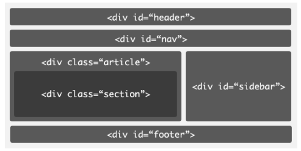
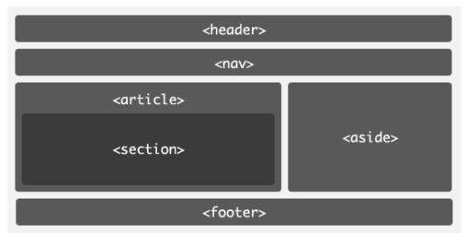
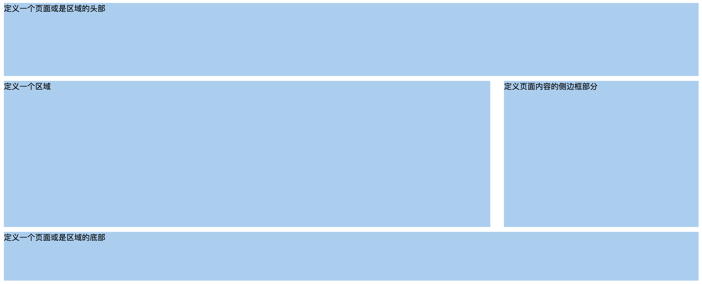
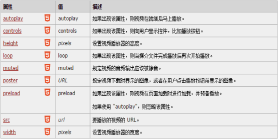
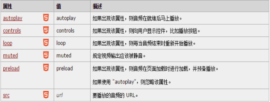
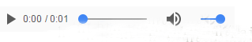
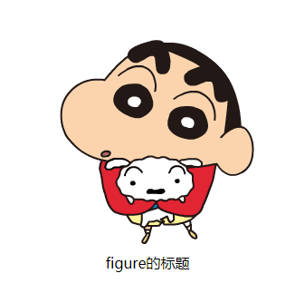
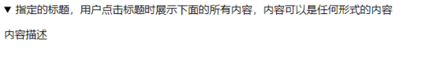
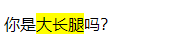
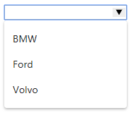

## HTML5新增布局标签

​		HTML5是Web中核心语言HTML的规范，用户使用任何手段进行网页浏览时看到的内容原本都是HTML格式的，在浏览器中通过一些技术处理将其转换成为了可识别的信息。HTML5在从前HTML4.01的基础上进行了一定的改进，虽然技术人员在开发过程中可能不会将这些新技术投入应用，但是对于该种技术的新特性，网站开发技术人员是必须要有所了解的。

​		HTML5是HTML最新的修订版本，2014年10月由万维网联盟（W3C）完成标准制定。

​		1993年HTML的草案发布，在html5版本之前，html共有4个版本.2.0版、3.2版、4.0版，再到1999年的4.01版。

​		在HTML5出现之前，我们一般采用DIV+CSS布局我们的页面。但是这样的布局方式不仅<font color="red">使我们的文档结构不够清晰，而且不利于搜索引擎爬虫对我们页面的爬取</font>。为了解决上述缺点，HTML5新增了很多新的语义化标签。


1、div+css布局



2、html5




```html
<header>...</header>     头部
<nav>...</nav>	          导航
<section>...</section>定义文档中的节。比如章节、页眉、页脚或文档中的其它部分 
<aside>...</aside>        侧边栏
<footer>...</footer>	      页脚
<article>...</article>代表一个独立的、完整的相关内容块，可独立于页面其它内容使用。例如一篇完整的论坛帖子，一篇博客文章，一个用户评论等
```



使用HTML5的新的结构标签，做出上面的布局，代码如下：

```html
<header>定义一个页面或是区域的头部</header>
<div>
     <section>定义一个区域</section>
     <aside>定义页面内容的侧边框部分</aside>
</div>
<footer>定义一个页面或是区域的底部</footer>
```

```css
/*页面顶部 header*/
header{
    height:150px;
    background-color:#abcdef;
}
/*页面中间 div*/
div{
    margin-top:10px;
    height:300px;
}
section{
    height:300px;
    background-color:#abcdef;
    width:70%;
    float:left;
}
article{
    background-color:#F33;
    width:500px;
    text-align:center;
    margin:0px auto;
}
aside{
    height:300px;
    background-color:#abcdef;
    width:28%;
    float:right;
}
/*页面底部*/
footer{
    height:100px;
    background-color:#abcdef;
    clear:both;
    margin-top:10px;
}
```


## 视频和音频

​		HTML5未出来之前，在线的音频和视频都是借助Flash或者第三方工具实现的，现在HTML5也支持了这方面的功能。在一个支持HTML5的浏览器中，不需要安装任何插件就能播放音频和视频。原生的支持音频和视频，为HTML5注入了巨大的发展潜力。

###　视频

Video标签定义视频，比如电影片段或其他视频流。

```html
<video src="movie.mp4" controls>
		您的浏览器不支持 video 标签。
</video>
```



### 音频

audio 标签定义声音，比如音乐或其他音频流。

```html
<audio src="someaudio.mp3">
		您的浏览器不支持 audio 标签。
</audio>
```





### source

`<source>` 标签为媒介元素（比如` <video>` 和`<audio>`）定义媒介资源。

`<source>` 标签允许您规定可替换的视频/音频文件供浏览器根据它对媒体类型或者编解码器的支持进行选择。

```html
<audio controls>
   	<source src="horse.ogg" >
   	<source src="horse.mp3" >
 	Your browser does not support the audio element.
</audio>
```


## HTML5新增标签(了解)

### figure

用于对元素进行组合。多用于图片与图片描述组合。

```html
<figure>
	
	<figcaption>figure的标题</figcaption>
</figure>
```



### details

​		details 用于描述文档或文档的某个部分的细节，类似于下拉列表，兼容性较差，chrome与Safari支持。

```html
<details>
      <summary>指定的标题，用户点击标题时展示下面的所有内容，内容可以是任何形式的内容</summary>
      <div>
          <p>内容描述</p>
      </div>
</details>
当增设open属性时，描述内容默认展示。
<details open>
     <summary>指定的标题，用户点击标题时展示下面的所有内容，内容可以是任何形式的内容</summary>
     <div>
         <p>内容描述</p>
     </div>
</details>
```



### mark

​		主要用来在视觉上向用户呈现那些需要突出的文字。<mark>标签的一个比较典型的应用就是在搜索结果中向用户高亮显示搜索关键词。

```html
<p>你是<mark>大长腿</mark>吗？</p>
```



### meter

​		定义度量衡。仅用于已知最大和最小值的度量

```html
<meter min="0" max="100" value="81" low="20" high="80"></meter>
```

<font color="red">low:最低临界点</font>

<font color="red">high：最高临界点</font>

Min：最小值

Max：最大值

Value：当前值


### progress

​		运行中的进程。可以使用 <progress> 标签来显示 JavaScript 中耗费时间的函数的进程。

```html
<progress max="100" value="20"></progress>
```

max：定义完成值

value：定义当前值


### datalist

定义可选数据的列表。与 input 元素配合使用，就可以制作出输入值的下拉列表。

datalist 及其选项不会被显示出来，它仅仅是合法的输入值列表。

请使用 input 元素的 list 属性来绑定 datalist。

```html
<input id="myCar" list="cars" />
<datalist id="cars">
      <option value="BMW">
      <option value="Ford">
      <option value="Volvo">
</datalist>
```

