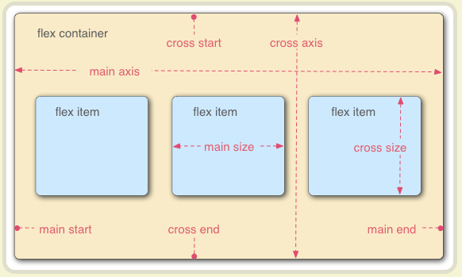

# FLEX布局(弹性布局)

- flexible Box
- flex容器：使用display:flex就是flex容器
- 项目：flex容器中的子元素就是项目，不包括孙子元素
- 默认主轴方向排列，即横向



## Flex-容器的属性

### display属性

- 作用：指定flex属性
- 取值：flex | inline-flex
- flex：将对象作为弹性伸缩盒展示，相当于块级属性，有默认宽度100%
- inline-flex：将对象作为内联块级弹性伸缩盒展示，即行级元素，没有默认宽度


### flex-direction

- 作用：指定容器的主轴方向，主轴默认为水平向右方向，项目排列的方向

- 取值：row | row-reverse | column | column-reverse

- row：默认值，主轴横向往右排列

- row-reverse：主轴横向往左反向排列

- column：垂直方向排列

- column-reverse：垂直方向反向排列

  


### justify-content属性

- 作用：属性定义了项目在主轴上的对齐方式
- 取值：flex-start | flex-end | center | space-between | space-around | space-evenly
- flex-start：默认的是从主轴开始位置对齐
- flex-end：默认的是从主轴结束位置对齐
- center：居中对齐，项目形成的总宽度不变
- space-between：两端对齐，中间间隔宽度一样
- space-around：所有项目的两侧间隔相等，主轴两端会留边
- space-evenly：等分空余空间给每个元素


### align-items属性

- 作用：定义元素交叉轴上的对齐方式
- 取值：flex-start | flex-end | center | baseline | stretch
- flex-start：交叉轴的开始位置对齐
- flex-end：交叉轴的结束位置堆砌
- center：交叉轴居中
- baseline：基线对齐，文字第一行对齐
- stretch：（单词意思是弹性、拉伸）默认值！！如果项目未设置高度或者设置为auto，将沾满整个容器的高度（自动填充）

如果flex-item没有设置高度，那么flex-item的高度不像以前那样他的高度由内容决定，而是他的高度会拉伸和父元素一样。


### flex-wrap

- 作用：描述如果一个轴线排列不下，如何换行
- 取值：nowrap | wrap | wrap-reverse
- nowrap：默认不换行，会压缩子元素
- wrap：换行，第一行在上方
- wrap-reverse：换行，第一行在下方


​	

### flex-flow

- 作用：是flex-direction和flex-wrap和合并缩写形式
- 取值：flex-direction || flex-wrap

```css
 	// 下方写法一和写法二效果一样：
	// 写法一
    .box {
    	flex-flow: row wrap;
    }

    // 写法二
    .box {
    	flex-direction: row;
        flex-wrap: wrap;
    }
```

### align-content

- 作用：定义了交叉轴线上的排列方式
- 说明：如果项目只有一个轴线（一行），该属性不起作用，如果wrap换行了，那么才有作用
- 取值：flex-start | flex-end | center | space-between | space-around | stretch
- flex-start：所有轴线都是从头开始，交叉轴开始位置开始，主轴横轴的话，就是上对齐
- flex-end：从尾开始，交叉轴结束位置开始
- center：所有从中间开始
- space-between：多条轴线上下两端对齐
- space-around：多条轴线上下两端分散对齐，上下两侧留白
- space-evenly：等分空余空间给每个元素
- stretch：默认!高度自动填充拉伸

这里参考justify-content 看看吧，只不过把主轴换成了交叉轴


## Flex-项目的属性

- 项目的属性规定的是项目在flex容器中的属性
- order
- flex-grow
- flex-shrink
- flex-basis
- flex
- align-self

### order

- 作用：定义项目的排列顺序，数值越小，排列越靠前，默认为0。
- 取值：integer


### align-self

- 作用：允许项目有和其他项目不一样的对齐方式，可以覆盖父元素的align-items属性
- 取值：和align-items多了个auto
- 默认值为auto，表示继承align-items属性


### flex-grow

- 作用：定义项目的放大比例，默认是0，即如果存在剩余空间，也不放大。
- 取值：> 0
- 默认值为0，默认不会自动放大
- 如果都设置为1，那么所有项目会平分剩余的空间
- 如果有三个元素，一个设置为2，剩余为1，那么项目2的就会占一半，剩下两个会各占四分之一。
- 如果有三个元素，一个width设置为200，剩余都为1，那么剩余的会平分固定宽度200之外的空间
- 最终尺寸不得大于max-width和max-height


### flex-shrink

- 作用：定义项目的缩小比例，和grow相反
- 取值：>0
- 默认值为1，默认会自动缩小
- 如果所有项目都为1，当空间不足时候，都会等比例缩小
- 如果有一个项目为0，其他都为1，当空间不足时候，0不变，1都缩小
- 最终尺寸不得小于min-width和min-height


### flex-basis

- 用来设置flex items在主轴方向上的base size
- auto 默认值、具体的宽度数值
- 决定flex items最终base size的因素、优先级从高到低
- max-width|max-height|min-width|min-height
- flex-basis
- width|height
- 内容本身的size

### flex

- 作用：flex-grow、flex-shrink、flex-basis的简写
- 默认值：0 1 auto；


单值语法：值必须为以下其中之一：

​	1、一个无单位数：他会被当做`flex-grow`的值。

​	2、一个有效的宽度值:他会被当做flex-basis的值。

​	3、关键字none,auto或initial。

双值语法：第一个值必须为无单位数，并且它会被当做`flex-grow`的值

​		第二个值必须为以下之一：

​		1、一个无单位数：它会被当做flex-shrink的值。

​		2、一个有效的宽度值：它会被当做flex-basis的值。

三值语法：

​	第一个值必须为一个无单位数，并且它会被当作`flex-grow`的值。

​	第二个值必须为一个无单位数，并且它会被当作`flex-shrink`的值。

​	第三个值必须为一个有效的宽度值，并且它会被当作`flex-basis`的值。