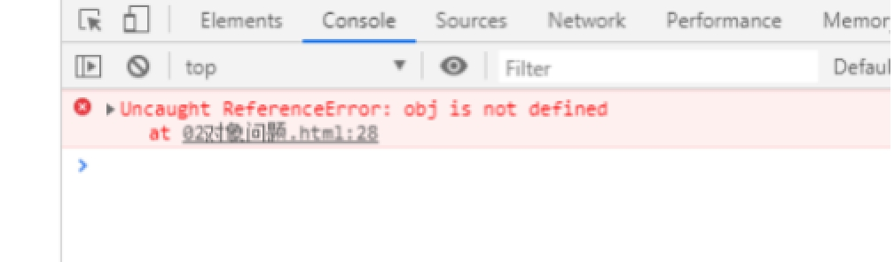

## 什么是模块化

### 模块化产生

模块化发展历程

js一开始并没有模块化的概念，直到ajax被提出，前端能够像后端请求数据，前端逻辑越来越复杂，就出现了许多问题：全局变量，函数名冲突，依赖关系不好处理。

当时使用自执行函数来解决这些问题，比如经典的jquery就使用了匿名自执行函数封装代码，将他们全都挂载到全局变量jquery下边

在js出现的时候，js一般只是用来实现一些简单的交互，后来js开始得到重视，用来<font color="red">实现越来越复杂的功能</font>，而为了<font color="red">维护的方便</font>，我们也把不同功能的js抽取出来当做一个js文件，但是当项目变的复杂的时候，一个html页面可能需要加载好多个js文件，而这个时候就会出现<font color="red">各种命名冲突</font>，如果js也可以像java一样，把不同功能的文件放在不同的package中，需要引用某个函数或功能的时候，import下相关的包，这样可以很好的解决命名冲突等各种问题，但是js中没有模块的概念，又怎么实现模块化呢

　　<font color="red">模块化开发是一种管理方式，是一种生产方式，一种解决问题的方案，一个模块就是实现特定功能的文件，有了模块，我们就可以更方便地使用别人的代码，想要什么功能，就加载什么模块</font>，但是模块开发需要遵循一定的规范，否则就都乱套了，因此，才有了后来大家熟悉的**AMD**规范，**CMD**规范。


### 为什么使用模块化

​	使用模块化可以给我们带来以下好处

- 解决<font color="red">命名冲突</font>
- 提供<font color="red">复用性</font>
- 提高代码<font color="red">可维护</font>性
- 灵活架构，焦点分离，方便<font color="red">模块间组合、分解</font>
- 多人协作<font color="red">互不干扰 </font>


### js作用域

Js的作用域是函数作用域

代码： 

 ```js
var name='zhangsan';//全局
function demo(){
  var name='lisi';//局部
}
for(var i=0;i<100;i++){
  var age=10;//全局
}
//下面代码执行的结果？
var arr=[10,20,30,40,50];
for(var i=0;i<arr.length;i++){
  arr[i]=function(){
    console.log(i);
  }
}
arr[2]();//打印结果5
 ```


结果分析：

怎么获取当前的下标对应的数据

```js
//闭包解决 变量作用域问题---
var arr=[10,20,30,40,50];
for(var i=0;i<arr.length;i++){
  arr[i]=(function(i){
    return function(){
      console.log(i);
    }
  })(i);
}
arr[3]();//打印结果
```


### 本章作业

1.什么是模块化 

2.为什么使用模块化

3.js作用域问题怎么解决


## 模块化实现


### 模块的出现

   ```js
//对象问题
var obj={
  name:'liuneng',
  age:20
}
//需求：我要修改对象的值
obj.name='zhaosi' //思考这样修改方式合理吗？？？
   ```

如果这是一个公共类，公共的属性和方法，大家都去修改，谁想修改就去修改，这样就乱了，这样不合理，我们应该统一修改。

一个公共类我应该是统一修改 或者是统一不修改。


#### 初步优化方案

思路：把这个对象 封装一个方法

```js
//写一个函数 自执行函数 外部不能访问我的内部内容--创建一个自执行函数
(function(){
  var obj={
    name:'lisi',
    age:20
  }
 })();
 console.log(obj);
```


 

这样我们就不能访问了，但是也不可能写了对象却不再外部使用，再次优化，我们给外部提供一个修改方案。


#### 再次优化

 ```js
  //提供外部访问方式
var module=(function(){
  var obj={
    name:"lilei",
    age:20
  }
  function setName(value){
    obj.name=value;
    console.log(obj.name)
  }
  return setName;
})();
//注意：这是自执行函数，进入直接执行，没有办法调用，所以呢我们可以给一个名字
// 然后去调用return的结果
module('zhangsan');
 ```


#### 优化

```js
//提供外部访问方式
var module=(function(){
  var obj={
    name:"lilei",
    age:20
  }
  function setName(value){
    obj.name=value;
    console.log(obj.name)
  }
  return setName;
})();
//注意：这是自执行函数，进入直接执行，没有办法调用，所以呢我们可以给一个名字
// 然后去调用return的结果
module('zhangsan');
```


#### 修改和获取

```js
var module=(function(){
  var obj={
    name:"lilei",
    age:20
  }
  function setName(value){
    obj.name=value;
  }
  function getName(){
    return obj.name;
  }
  return {
    setName:setName,
    getName:getName
  };
})();
console.log(module.getName());
console.log('---------------------');
module.setName('huahua');
console.log(module.getName());
```

<font color="red">这时候就有统一标准，谁调用或者修改这个代码就可以看到，调用这个方法知道那个方法。</font>

总结：这样比随便修改这个值要好很多，我们写的代码就被称为模块

我们通过模块把我们的代码整理和隔离，这样我们以后写的功能 公共的使用的方法或者模块就可以这样写，对代码进行隔离，模块之间这样不能直接互相通信，实现隔离。


#### 模块和模块化区别？

模块 : 是用于在项目中划分相对独立的功能，模块更偏重逻辑上区分

模块化：是从代码逻辑的角度进行划分的，方便代码分层开发，保证每个功能模块的职能单一。


### 模块实现

```js
<!-- 获取元素---设置元素--用模块写 -->
<div id="box"></div>
<script>
    var moduleDOM=(function(){
      //1.获取内容
      function getElement(id){
        return document.getElementById(id);
      }
      //2.设置
      function setElement(id,value){
        getElement(id).innerHTML=value;
      }
      return {
        getElement:getElement,
        setElement:setElement
      }
    })();
//获取元素console.log(moduleDOM.getElement('box'));
moduleDOM.setElement('box','hello');
var content='<h2>我是一个测试数据</h2>';
moduleDOM.setElement('box',content);
</script>
```


### 模块的嵌套

如果一个模块很大，必须分成几个部分，或者一个模块需要继承另一个模块，这时就有必要采用<font color="red">"放大模式"（augmentation）</font>

```js
/*模块的嵌套   模块之前是独立的 不能直接相互访问*/    
var domElement=(function(){
  function getElement(id){
    return document.getElementById(id);
  }
  return {
    getElement:getElement
  }
})();   
var divMoudle=(function(domElement){
  function setName(id,value){
    return domElement.getElement(id).innerHTML=value;
  }
  return {
    setName:setName
  }
})(domElement);
divMoudle.setName('root','hello!!');
```


```js
//模块的嵌套 实现在当前的模块使用其他模块里面的方法---传递进入
//传递一个jquery 比如下面使用jquery对象
var domElement=(function(){
  function getElement(id){
    return document.getElementById(id);
  }
  return {
    getElement:getElement
  }
})();   

var divMoudle=(function(domElement,$){
  function setName(id,value){
    return domElement.getElement(id).innerHTML=value;
  }
  console.log($);
  return {
    setName:setName
  }
})(domElement,$);//jQuery
divMoudle.setName('root','hello!!'); 
```


### 模块的放大模式

在浏览器环境中，模块的各个部分通常都是从网上获取的，有时无法知道哪个部分会先加载。如果采用上一节的写法，第一个执行的部分有可能加载一个不存在空对象，这时就要采用<font color="red">"宽放大模式"</font>，这样一个比较完整的模块也就出来了

如果这时候有个人把 获取元素的模块置空了，domElement=null;

```js
//模块的放大模式 模块的宽大模式  容错处理
var domElement=(function(){
  function getElement(id){
    return document.getElementById(id);
  }
  return {
    getElement:getElement
  }
})();   
domElement=null;

var divMoudle=(function(domElement,$){
  //判断domElement是否存在
  if(domElement){
    function setName(id,value){
      return domElement.getElement(id).innerHTML=value;
    }
    console.log($);
    return {
      setName:setName
    }
  }else{
    console.log('domElement对象不存在')
  }         
})(domElement,$);//jQuery

divMoudle.setName('root','hello!!');
```


## 模块化规范


### 模块化规范的产生


在模块化规范形成之前，JS开发者使用Module设计模式来解决JS全局作用域的污染问题。Module模式最初被定义为一种在传统软件工程中为类提供私有和公有封装的方法。在JavaScript中，Module模式使用匿名函数自调用 (闭包)来封装，通过自定义暴露行为来区分私有成员和公有成员。

```js
var myModule = (function (window) {
  var moduleName = 'module'  // private
  // public
  function setModuleName(name) {
    moduleName = name
  }
  function getModuleName() {
    return moduleName
  }
  return { setModuleName, getModuleName }  // 暴露行为
})(window)
```

 

上面例子是Module模式的一种写法，它通过闭包的特性打开了一个新的作用域，缓解了全局作用域命名冲突和安全性的问题。但是，<font color="red">开发者并不能够用它来组织和拆分代码，于是乎便出现了以此为基石的模块化规范。</font>

### CommonJs规范

#### 服务端目录结构

```js
|-modules
  |-module1.js
  |-module2.js
  |-module3.js
|-app.js
|-package.json
  {
    "name": "commonJS-node",
    "version": "1.0.0"
  }
```

#### 基本语法

**暴露模块**

```js
module.exports=value
exports.xxx=value
```

**引入模块**

```js
require(xxx)
//1.引入第三方模块时，xxx为模块名
//2.引入自定义模块时，xxx为模块文件路径
```


而在浏览器中，commonJs这样实现：

#### 客户端目录结构

```
|-js
  |-dist //打包生成文件的目录
  |-src //源码所在的目录
    |-module1.js
    |-module2.js
    |-module3.js
    |-app.js //应用主源文件
|-index.html
|-package.json
  {
    "name": "browserify-test",
    "version": "1.0.0"
  }
```

#### 客户端打包

```js
npm install browserify
```

```
* 打包处理js:
  * browserify js/src/app.js -o js/dist/bundle.js
  
* 页面使用引入:
  <script type="text/javascript" src="js/dist/bundle.js"></script>
```


### AMD规范

RequireJS是一个JavaScript文件或者模块的加载器。它可以提高JavaScript文件的加载速度，避免不必要的堵塞。它针对于在浏览器环境中使用做过专门的优化，但它也可以在其他的JavaScript环境中使用，像Node.js一样可以在服务器上运行

#### 目录结构

```
|-js
  |-libs
    |-require.js
  |-modules
    |-module1.js
    |-module2.js
  |-main.js
|-index.html
```

#### 基本语法

**暴露模块**

```js
//没有依赖
define(function(){
	return 模块
})

//有依赖
define(['module1','module2'],function(m1,m2){
  return 模块
})
```

**引入模块**

```js
require(['module1','module2'],function(m1,m2){
  使用 m1/m2
})
```

**配置路径**

```js
//主入口文件(main.js)中配置
require.config({
  //基本路径
  baseUrl: "js/",
  //模块标识名与模块路径映射
  paths: {
    "alerter": "modules/alerter",
    "dataService": "modules/dataService",
  }
})
//引入使用模块
require( ['alerter'], function(alerter) {
  alerter.showMsg()
})
```

**页面引入**

```html
<script data-main="js/main" src="js/libs/require.js"></script>
```

### CMD规范

相对于其他三个来说，CMD在市面上用的比较少。

CMD结合了AMD和CommonJS的特点。定义用AMD，暴露用CommonJS。

#### 服务端目录结构

```
|-js
  |-libs
    |-sea.js
  |-modules
    |-module1.js
    |-module2.js
    |-module3.js
    |-module4.js
    |-main.js
|-index.html
```

#### 基本语法

**暴露模块**

```js
//没有依赖
define(function(require,exports,module){
  //暴露模块
  module.exports=value;
  exports.xxx=value;
})

//有依赖
define(function(require,exports,module){
  //引入依赖（同步）
  var module1=require('./module1')
  //引入依赖（异步）
  require.async('./module2',function(m){
    
  })
  //暴露模块
  exports.xxx=value
})
```

**引入模块**

```js
define(function(require){
	var m1=require('./module1');
  var m2=require('./module2');
  m1.show();
  m2.show();
})
```

#### 客户端目录结构

```
|-js
  |-libs
    |-sea.js
  |-modules
    |-module1.js
    |-module2.js
    |-module3.js
    |-module4.js
    |-main.js
|-index.html
```

**sea.js简单使用教程**

```html
1. 下载sea.js, 并引入
  * 官网: http://seajs.org/
  * github : https://github.com/seajs/seajs
2. 将sea.js导入项目: js/libs/sea.js 
	<script type="text/javascript" src="js/libs/sea.js"></script>
  <script type="text/javascript">
    seajs.use('./js/modules/main')
  </script>

```


### ES6规范

#### 初始化项目

```shell
npm init -y
```

#### 安装依赖

```shell
* npm install babel-cli browserify -g
* npm install babel-preset-es2015 --save-dev
```

#### 创建.babelrc文件

```js
//根目录下创建，内容为
{
   "presets": ["es2015"]
}
```

此文件是babel-preset-es2015运行前需要读取的配置文件，当读到es2015后就知道是要去转换ES6的语法。

#### 编写模块代码

```js
//文件名为：module1.js
//分别暴露
export function foo() {
	console.log('foo() module1');
}

export function bar() {
	console.log('bar() module1');
}

export let arr = [1,2,3,4,5];
```

```js
//文件名为：module2.js
//统一暴露
function fn1() {
	console.log('fn1() module2');
}

function fn2() {
	console.log('fn2() module2');
}

export {fn1, fn2};
```

```js
//文件名为：main.js
//引入其他的模块

//语法： import xxx from '路径'
import module1 from './module1';
import module2 from './module2';

console.log(module1, module2);
```

```html
<!DOCTYPE html>
<html>
<head>
    <meta charset="UTF-8">
    <title>Title</title>
</head>
<body>
    <!--此时运行会报错,因为浏览器并不认识import-->
    <script type="text/javascript" src="js/src/main.js"></script>
</body>
</html>
```

#### 转换ES5

```shell
babel js/src -d js/build
# -d左边的js/src是一个文件夹，因为所有文件都是用ES6的语法，需要全部转换为ES5。-d右边的js/build则是输出的目录
```

此时，如果直接在`index.html`中运行`<script type="text/javascript" src="js/build/main.js"></script>`则会报错,因为其中包含require，浏览器不认识。所以我们还需要用browserify给转换一下。

```shell
browserify js/build/main.js -o js/dist/bundle.js
#注意：browserify不会自动创建当前没有的文件夹，需要手动去创建。
```
