## 简介

基于 [Node.js](https://nodejs.org/en/) 平台，快速、开放、极简的 Web 开发框架。

官网：http://www.expressjs.com.cn/


## 快速入门

```shell
npm init -y
npm install express --save
```


```js
//index.js
var express = require('express')
var app=express();

app.get('/',function(req,res){
  res.send('hello world express');
})

app.listen(3000,function(){
  console.log('运行环境---')
})
```

### 路由

```js
//在首页响应hello world
app.get('/', function (req, res) {
	res.send('Hello World!')
})
```

```js
//在根路由响应post请求
app.post('/', function (req, res) {
  res.send('Got a POST request')}
 )
```

```js
//在/user路由响应put请求
app.put('/user', function (req, res) {
  res.send('Got a PUT request at /user')
 })
```

```js
//在/user路由响应delete请求
app.delete('/user', function (req, res) {
	res.send('Got a DELETE request at /user')
})
```

### 请求本地json数据

```js
//路由配置
var express=require('express');
var app=express();
var data=require('./data/data.json');
//get请求
app.get('/hello',function(req,res){
      res.send(data);
})
app.listen(3000,function(){
      console.log('express运行在3000端口上');
})
```

## 路由和接口参数

### 路由应用

```js
var express = require('express');
var router = express.Router()
router.get('/', function (req, res) {
  res.send('Birds home page')
})
router.get('/about', function (req, res) {
  res.send('About birds')
})
module.exports = router;
```

```js
//index.js 使用路由
var express = require('express');
var app=express();
//路由
var router = require('./router.js');
app.use('/',router);
app.listen(3000,function(){
  	console.log('三千')
})
```


### 路由根目录

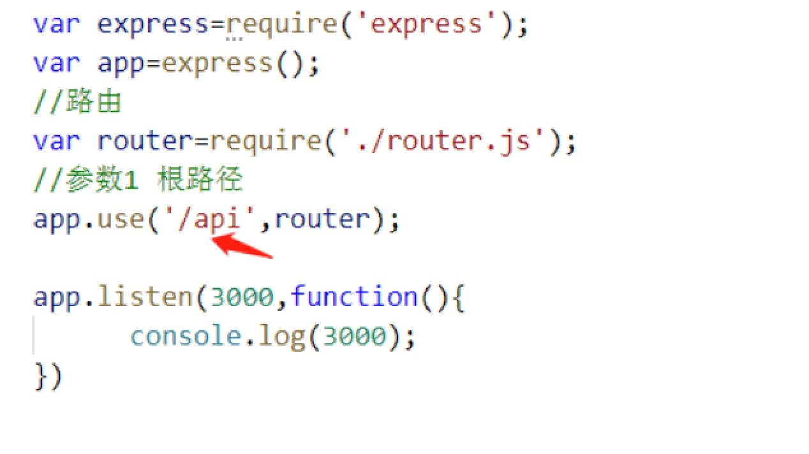

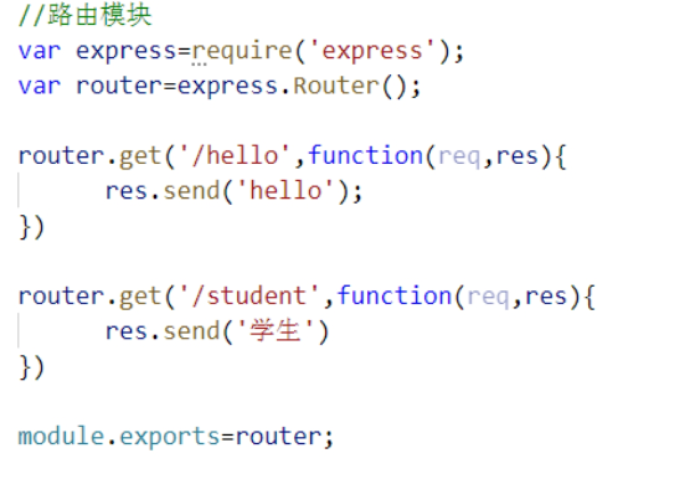

浏览器访问：http://localhost:3000/api/student


### 路由访问本地数据

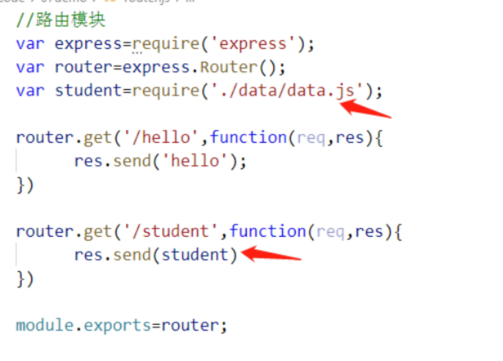

### 接口参数处理

```js
//get请求
var express = require("express");
var app = express();
// url
var url = require("url");
// ?name=hello&age=20
app.get("/class",function(req,res){  
    var path_url = url.parse(req.url,true);
    var query = path_url.query;
    res.send({
        msg:'消息',
        name:query.name,
        age:query.age
    })
})
app.listen(3000);
```

```js
var express = require("express");
var app = express();
// 中间件:
// body-parser:正常情况下可以直接使用，但是如果谁发现这个中间件报错了，需要安装
// npm install --save-dev body-parser
var bodyParser = require("body-parser");
// 应用中间件
app.use(bodyParser.urlencoded({
	extended: true
}));
app.post("/",function(req,res){
    // 接受参数
    var name = req.body.username; //username  password
    var pwd = req.body.password;
    res.send({
        msg:'post',
        name:name,
        pwd:pwd
    })
})
app.listen(3000,function(){
    console.log("服务器运行在3000端口上");
})
```


### 参数传递

传递参数

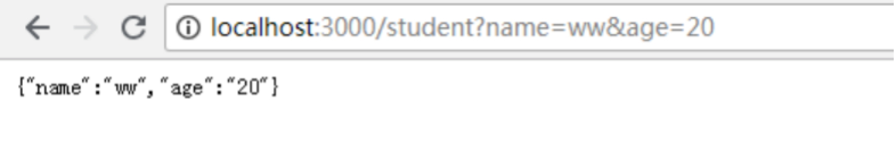  

```js
var express=require('express');
var app=express();
var url=require('url');
//路由 get传递参数
app.get('/student',function(req,res){
	var parames=url.parse(req.url,true).query;
  res.send({
    name:parames.name,
    age:parames.age
  })
})
app.listen(3000,function(){
	console.log(3000)
})
```


### 过滤数据

过滤参数 参数不同返回数据不同

#### get请求

```js
var express=require('express');
var app=express();
var url=require('url');
var news=require('./news/news.js');
//路由 get传递参数
app.get('/student',function(req,res){
	var params=url.parse(req.url,true).query;
  res.send({
    name:params.name,
    age:params.age
  })
})
//get 传递不同参数
app.get('/newslist',function(req,res){
	var id=url.parse(req.url,true).query.id;
  res.send(news.filter(function(item){
    return item&&item.id==id;
  }))
})
app.listen(3000,function(){
	console.log(3000)
})
```


浏览器效果：

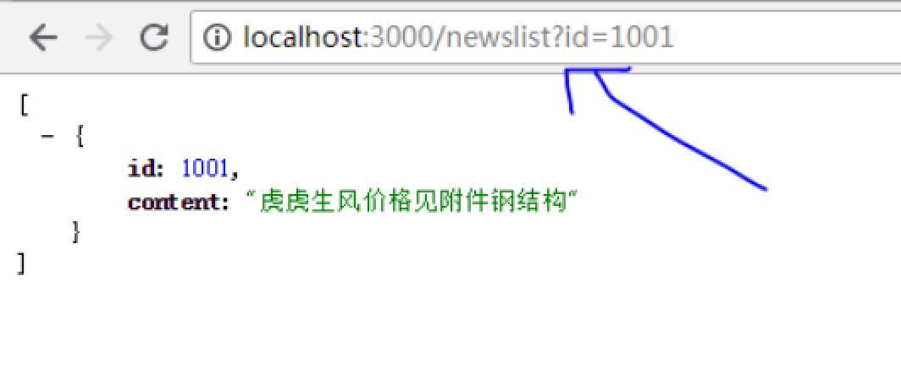 

#### post请求

```js
var express=require('express');
var app=express();
var url=require('url');
var news=require('./news/news.js');
var bodyParser=require('body-parser');
app.use(bodyParser.urlencoded({
	extended:true
}))
//post 传递参数
app.post('/login',function(req,res){
var username=req.body.username;//username:key
var password=req.body.password;//password:key
  if(username=='lilei' && password=='123'){
    res.send({
      msg:'登录成功'
    })
  }else{
    res.send({
      msg:'登录失败'
    }) 
  }
})
app.listen(3000,function(){
	console.log(3000)
})
```


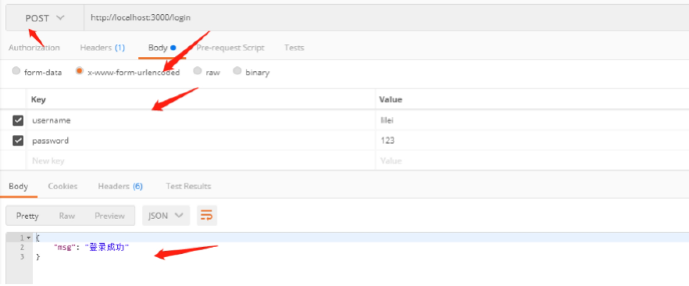 

#### restful API

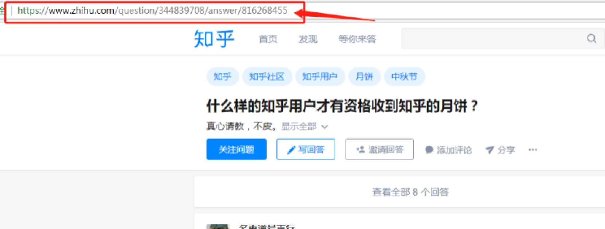 

 

```js
//restful API:get传递方式
//name=lilei&pwd=123 
//name/lilsi/pwd/123
app.get('/zhihu/id/:id/user/:user',function(req,res){
  var id=req.params['id'];
  var user=req.params['user'];
  res.send({
    id:id,
    user:user
  })
})
```


### 本章作业

1. 如何参数传递

2. get请求和post请求以及restful API请求方式

## 前后端交互

### 前后端访问

index.js

```js
var express=require('express')
var app=express();
var router=require('./router.js')
app.use('/',router)
app.listen(3000,function(){
  console.log(3000);
})
```

 

router.js

```js
var express=require('express')
var router=express.Router();
var news=require("./news/news.js")
var config=require("./config.js")
//解决跨域
router.all("*",function(req,res,next){
//设置允许跨域的域名，*代表允许任意域名跨域
res.header("Access-Control-Allow-Origin","*");
//允许的header类型
res.header("Access-Control-Allow-Headers","content-type");
//跨域允许的请求方式 
res.header("Access-Control-Allow-Methods","DELETE,PUT,POST,GET,OPTIONS");
if (req.method.toLowerCase() == 'options')
	res.send(200); //让options尝试请求快速结束
else
	next();
})
router.get(config.list,function(req,res){
	res.send(news);
})
module.exports=router;
```


前端访问：

```js
<!-- 请求资源 -->
<script>
$.ajax({
  type:'get',
  url:'http:localhost:3000/list',
  success:function(res){
    console.log(res)
  }
})
</script>
```


显示结果：

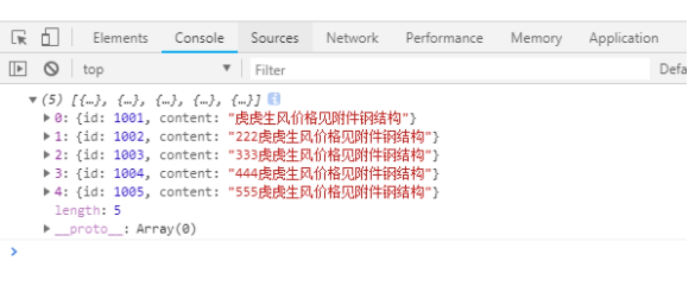 

跨域访问：

```js
//解决跨域
router.all("*",function(req,res,next){
  //设置允许跨域的域名，*代表允许任意域名跨域
  res.header("Access-Control-Allow-Origin","*");
  //允许的header类型
  res.header("Access-Control-Allow-Headers","content-type");
  //跨域允许的请求方式 
  res.header("Access-Control-Allow-Methods","DELETE,PUT,POST,GET,OPTIONS");
  if (req.method.toLowerCase() == 'options')
  res.send(200); //让options尝试请求快速结束
  else
  next();
})
```


### 访问不同的数据

router.js

```js
outer.all("*",function(req,res,next){
  //设置允许跨域的域名，*代表允许任意域名跨域
  res.header("Access-Control-Allow-Origin","*");
  //允许的header类型
  res.header("Access-Control-Allow-Headers","content-type");
  //跨域允许的请求方式 
  res.header("Access-Control-Allow-Methods","DELETE,PUT,POST,GET,OPTIONS");
  if (req.method.toLowerCase() == 'options')
  	res.send(200); //让options尝试请求快速结束
  else
  	next();
  })
  router.get(config.list,function(req,res){
  var id=url.parse(req.url,true).query.id; 
  res.send(news.filter(function(item){
  	return item && item.id==id;
  }));
})
module.exports=router;
```


前端页面

```js
<input type="text" name="" class='val' ><button id="search">搜索</button>

<script>
//搜索不同的内容显示不同的数据
  $("#search").click(function(){
    $.ajax({
      type:'get',
      url:'http:localhost:3000/list?id='+$(".val").val(),
      success:function(res){
      console.log(res)
    }
  }) 
})
<script>
```


### node链接数据库

相对数据的读取和操作就需要操作数据

node操作数据比 php操作更简单 ，我们看下如何操作数据，这时候还是需要apache数据库

#### 链接数据库语法

链接数据库

打开本地xampp启动数据库 创建数据

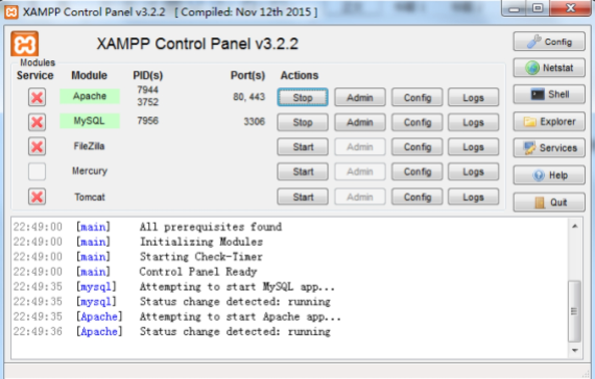 

 

 中间件 mysql

 1. cnpm install --save mysql

 链接数据库需要四个参数

```json
{
	host:"主机地址",
	user:"数据库的账号",
	password:"数据库密码",
	database:"数据库名字"
}
```


2.mysql 中间件也 提供了 一个方法 ： createConnection

```js
//链接数据库
var mysql=require('mysql');
var client=mysql.createConnection({
  host:'localhost',
  user:'root',
  password:'',
  database:'1906'
})

//sql语句
var sql="select * from userinfo";
//执行
client.query(sql,function(error,result){
if(error) return;
	console.log(result);
})
```


### 本章作业

1. 前后端访问数据 模拟数据接口

2. 链接数据库


## 获取数据库数据

### 查询数据库数据

1. 安装 cnpm install --save mysql express

2. 创建index.js文件 

```js
//数据库
var mysql=require('mysql');
var express=require('express');
var app=express();
var client =mysql.createConnection({
      host:'localhost',
      user:'root',
      password:'',
      database:'1906'
})
//进入页面展示数据
app.get('/list',function(req,res){
      var sql="select * from userinfo";
      client.query(sql,function(error,result){
            if(error){
                  console.log('操作错误')
                  return;
            }else{
                  res.send(result);
            }
      })
})
//添加内容  
app.get('/add',function(req,res){
      var sql="insert into userinfo values(null,'huahua',123456)";
      client.query(sql,function(error,result){
            if(error){
                  console.log('操作错误')
                  return;
            }
            res.send(result);
      })
})
//修改
app.get('/update',function(req,res){
      var sql="update userinfo set password='666' where id=2";
      client.query(sql,function(error,result){
            if(error){
                  console.log('操作错误');
                  return;
            }
            // res.send(result);//affectedRows
            if(result.affectedRows>0){
                  res.send('修改成功');
            }else{
                  res.send('修改失败');
            }
      })
})
//删除
app.get('/del',function(req,res){
      var sql="delete from userinfo where id=2";
      client.query(sql,function(error,result){
            if(error){
                  console.log('操作错误');
                  return;
            }
            if(result.affectedRows>0){
                  res.send('删除成功')
            }else{
                  res.send('删除失败')
            }
      })
})
app.listen(3000,function(){
      console.log(3000);
})
```


### 代码优化

```js
//代码处理
function sqlQuery(sql,callback){
      client.query(sql,function(error,result){
            if(error){
                  console.log('操作错误')
                  return;
            }
            callback(result)
      })
}
//查询
app.get('/select',function(req,res){
      var sql="select * from userinfo";
      sqlQuery(sql,function(data){
            res.send(data);
      })
})
//增加
app.get('/add',function(req,res){
      var sql="insert into userinfo values(null,'huahua',123456)";
      sqlQuery(sql,function(data){
            // res.send(data);
            if(data.affectedRows){
                  res.send({
                        msg:'添加成功'
                  })
            }else{
                  res.send({
                        msg:'添加失败'
                  })    
            }
      }) 
})
```


### 接受地址栏传递参数添加数据

```js
//增加
app.get('/add',function(req,res){
      var username=url.parse(req.url,true).query.username;
      var password=url.parse(req.url,true).query.password;
      if(username && password){
            var sql="insert into userinfo values(null,'"+username+"',"+password+")";
            sqlQuery(sql,function(data){
                  // res.send(data);
                  if(data.affectedRows){
                        res.send({
                              msg:'添加成功'
                        })
                  }else{
                        res.send({
                              msg:'添加失败'
                        })    
                  }
            }) 
      }else{
            res.send({
                  msg:'账号或者密码不存在'
            })
      }
})
```


### 本章作业

读取修改数据库表的数据


## 前后端交互

### 登录接口

思路：

1. 下载 express mysql

2. 文件配置 index.js router.js config.js sqlConnection.js

3. 链接操作数据库

 

SqlConnection.js

```js
//链接数据库
var mysql=require('mysql');
var config=require('./config.js');
var client=mysql.createConnection(config.sqlInfo);
//sql语句与结果
function sqlQuery(sql,callback){
      client.query(sql,function(error,result){
            if(error){
                  console.log('操作错误');
                  return;
            }
            callback(result);
      })
}
module.exports=sqlQuery;
```

Config.js

```js
module.exports={
      sqlInfo:{
            host:'localhost',
            user:'root',
            password:'',
            database:'1906'
      }
}
```

Router.js

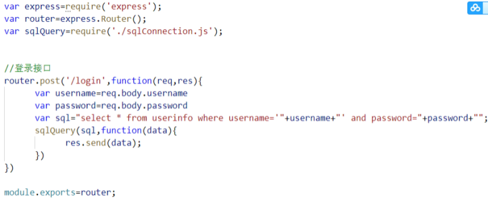 

Index.js

```js
var express=require('express');
var app=express();
var router=require('./router.js')
var bodyParser=require('body-parser');
app.use(bodyParser.urlencoded({
      extended:true
}))
app.use('/',router)
app.listen(3000,function(){
      console.log(3000);
})
```


### 接口实现

router.js

```js
var express=require('express');
var router=express.Router();
var sqlQuery=require('./sqlConnection.js');
//登录接口
router.post('/login',function(req,res){
      var username=req.body.username
      var password=req.body.password
      var sql="select * from userinfo where username='"+username+"' and password="+password+"";
      sqlQuery(sql,function(data){
            res.send(data);
      })
})
//注册接口
router.post('/register',function(req,res){
      var username=req.body.username
      var password=req.body.password
      var sql="insert into userinfo values(null,'"+username+"','"+password+"')";
      sqlQuery(sql,function(data){
            if(data.affectedRows){
                  res.send({
                        msg:'注册成功'
                  })
            }else{
                  res.send({
                        msg:'注册失败'
                  })
            }
      })    
})

//修改密码
router.post('/update',function(req,res){
      //先判断是否存在这个用户 再对应修改
      var username=req.body.username
      var password=req.body.password
      var newsPassword=req.body.newsPassword
      var selectSql="select * from userinfo where username='"+username+"' and password="+password+"";
      sqlQuery(selectSql,function(data){
            if(data.length>0){
                  //取出当前的id
                  var id=data[0].id;
                  //修改密码
                  var updateSql="update userinfo set password="+newsPassword+" where id="+id;
                  sqlQuery(updateSql,function(data){
                        if(data.affectedRows){
                              res.send({
                                    msg:'修改成功'
                              })  
                        }else{
                              res.send({
                                    msg:'修改失败'
                              })   
                        }
                  })
               
            }else{
                  res.send({
                        msg:'用户不存在'
                  })
            }
      })
})
//展示数据
router.get('/list',function(req,res){
      var sql='select * from userinfo';
      sqlQuery(sql,function(data){
            res.send(data)
      })
})
module.exports=router;
```


### msyql传递数据优化

```js
var mysql=require('mysql');
var config=require('./config.js');
var client=mysql.createConnection(config.sqlInfo);
/*
* client.query()
3个参数：
      第一个参数：sql语句
      第二个参数：array接受的数据
      第三个参数：function
*/
function sqlQuery(sql,arr,callback){
      client.query(sql,arr,function(error,result){
            if(error){
                  console.log('操作错误');
                  return;
            }
            callback(result);
      })
}
module.exports=sqlQuery; 
```

router.js

```js
//登录接口
router.post('/login',function(req,res){
      var username=req.body.username
      var password=req.body.password
      // var sql="select * from userinfo where username='"+username+"' and password="+password+"";
      var sql="select * from userinfo where username=? and password=?";
      var paramsArr=[username,password];
      sqlQuery(sql,paramsArr,function(data){
            // res.send(data)
            if(data[0]){
                  res.send(data[0])
            }else{
                  res.send({
                        msg:'登录失败'
                  })
            }
      })
})
//注册接口
router.post('/register',function(req,res){
      var username=req.body.username
      var password=req.body.password
      // var sql="insert into userinfo values(null,'"+username+"','"+password+"')";
      var sql="insert into userinfo values(null,?,?)";
      var params=[username,password]
      sqlQuery(sql,params,function(data){
            if(data.affectedRows){
                  res.send({
                        msg:'注册成功'
                  })
            }else{
                  res.send({
                        msg:'注册失败'
                  })
            }
      })    
})
//修改密码
router.post('/update',function(req,res){
      //先判断是否存在这个用户 再对应修改
      var username=req.body.username
      var password=req.body.password
      var newsPassword=req.body.newsPassword
      // var selectSql="select * from userinfo where username='"+username+"' and password="+password+"";
      var selectSql="select * from userinfo where username=? and password=?";
      var selectArr=[username,password]
      sqlQuery(selectSql,selectArr,function(data){
            if(data.length>0){
                  //取出当前的id
                  var id=data[0].id;
                  //修改密码
                  // var updateSql="update userinfo set password="+newsPassword+" where id="+id;
                  var updateSql="update userinfo set password=? where id="+id;
                  var updateArr=[newsPassword]
                  sqlQuery(updateSql,updateArr,function(data){
                        if(data.affectedRows){
                              res.send({
                                    msg:'修改成功'
                              })  
                        }else{
                              res.send({
                                    msg:'修改失败'
                              })   
                        }
                  })
               
            }else{
                  res.send({
                        msg:'用户不存在'
                  })
            }
      })
})
//展示数据
router.get('/list',function(req,res){
      var sql='select * from userinfo';
      sqlQuery(sql,null,function(data){
            res.send(data)
      })
})
module.exports=router;
```

### 前端请求接口

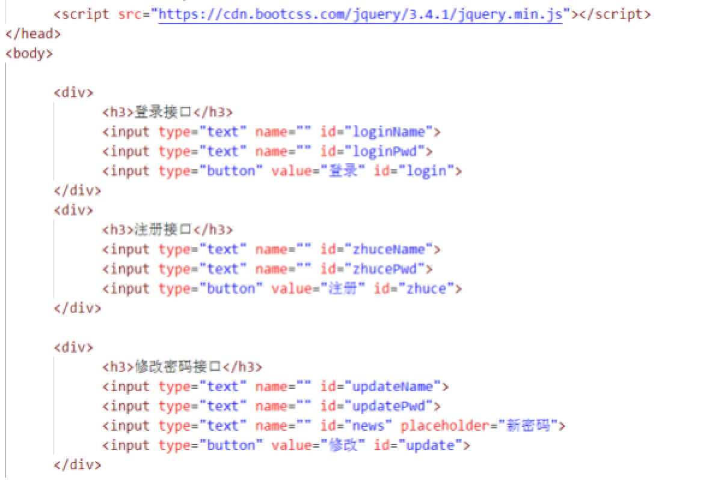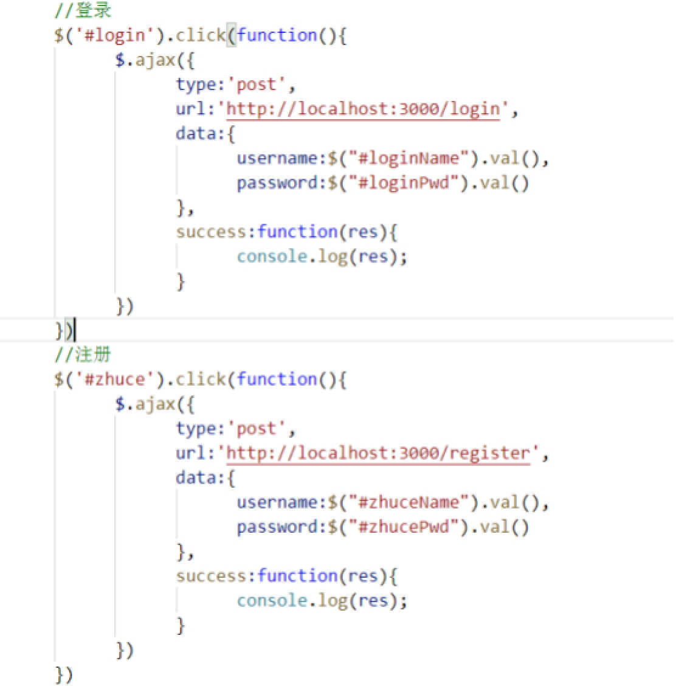 

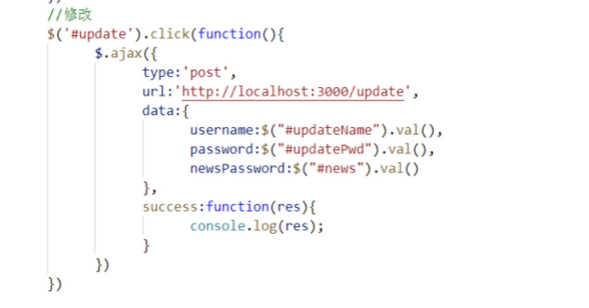 

### 本章作业

1.登录接口 注册接口 修改接口

2.前后端交互

 