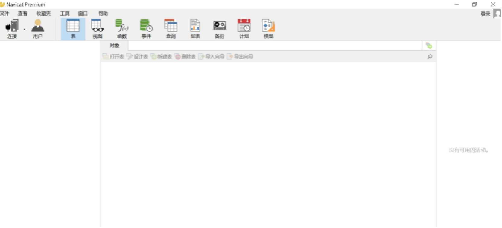
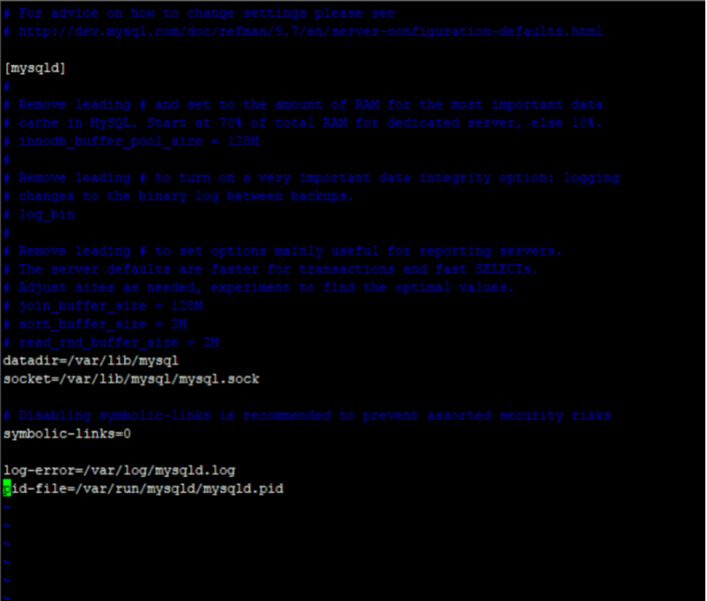
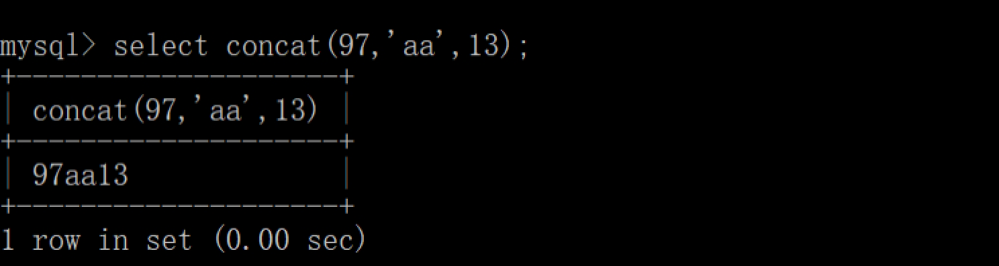
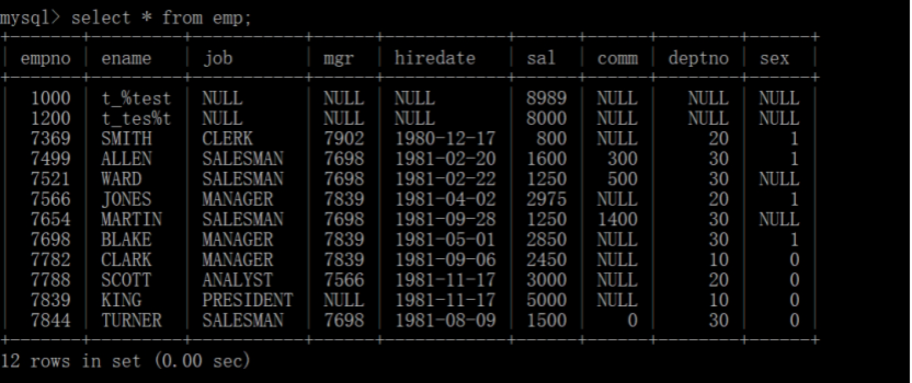

# MySQL数据库

数据库(Database)是按照数据结构来组织、存储和管理数据的建立在计算机存储设备上的仓库。简单来说是本身可视为电子化的文件柜——存储电子文件的处所，用户可以对文件中的数据进行新增、截取、更新、删除等操作。严格来说，数据库是长期储存在计算机内、有组织的、可共享的数据集合。数据库中的数据指的是以一定的数据模型组织、描述和储存在一起、具有尽可能小的冗余度、较高的数据独立性和易扩展性的特点并可在一定范围内为多个用户共享。这种数据集合具有如下特点：尽可能不重复，以最优方式为某个特定组织的多种应用服务，其数据结构独立于使用它的应用程序，对数据的增、删、改、查由统一软件进行管理和控制。从发展的历史看，数据库是数据管理的高级阶段，它是由文件管理系统发展起来的。


## 数据库发展

### 历史

​	使用计算机后，随着数据处理量的增长，产生了数据管理技术。数据管理技术的发展与计算机硬件（主要是外部存储器）系统软件及计算机应用的范围有着密切的联系。数据管理技术的发展经历了以下四个阶段：人工管理阶段、文件系统阶段、数据库阶段和高级数据库技术阶段。

​	数据库技术从诞生到现在，在不到半个世纪的时间里，形成了坚实的理论基础、成熟的商业产品和广泛的应用领域，吸引越来越多的研究者加入。数据库的诞生和发展给计算机信息管理带来了一场巨大的革命。三十多年来，国内外已经开发建设了成千上万个数据库，它已成为企业、部门乃至个人日常工作、生产和生活的基础设施。同时，随着应用的扩展与深入，数据库的数量和规模越来越大，数据库的研究领域也已经大大地拓广和深化了。30年间数据库领域获得了三次计算机图灵奖（C.W. Bachman,E.F.Codd, J.Gray），更加充分地说明了数据库是一个充满活力和创新精神的领域。就让我们沿着历史的轨迹，追溯一下数据库的发展历程。

#### 数据管理的诞生

​	大家都知道世界上第一台通用计算机“ENIAC”于1946年在美国宾夕法尼亚大学诞生，但是很多人不知道第一台商用电脑的名字叫UNIVAC，1951交付于当时的美国的人口普查局。我们来看下UNIVAC的样子：

 

那时的数据管理非常简单。通过大量的分类、比较和表格绘制的机器运行数百万穿孔卡片来进行数据的处理，其运行结果在纸上打印出来或者制成新的穿孔卡片。而数据管理就是对所有这些穿孔卡片进行物理的储存和处理。

 

直到1956年IBM生产出第一个磁盘驱动器，驱动器有50个盘片，每个盘片直径是2英尺，可以储存5MB的数据。穿孔卡片和磁带只能顺序存取数据，而使用磁盘最大的好处就是可以随机存取数据。如此一来，计算机终于可以跑实时交易的业务了。

​	于是，计算机开始广泛的应用于数据管理，人们对数据共享和处理的要求越来越高，传统的文件系统已经不能满足人们的需要。能够统一管理和共享数据的数据库管理系统（DBMS）应运而生。

 

​	在关系型数据库出现之前，主要是网状数据库（Network Databases）和层次数据库（Hierarchical Databases）。最早出现的是网状DBMS，是美国通用电气公司Bachman等人在1961年开发成功的IDS（Integrated DataStore），网状数据库模型对于层次和非层次结构的事物都能比较自然的模拟，当时网状DBMS要比层次DBMS用得更普遍。在数据库发展史上，网状数据库占有重要地位。

 

​	层次型数据库紧随网络型数据库出现。最著名最典型的层次数据库系统是IBM公司在1968年开发的IMS（Information Management System），一种适合其主机的层次数据库。这是IBM公司研制的最早的大型数据库系统程序。

 

 

#### 关系数据库的由来

​	1970 年，IBM研究员E.F.Codd博士在刊物Communication of the ACM上发表了一篇名为“A Relational Model of Data for Large Shared Data Banks”的论文，提出了关系模型的概念，奠定了关系模型的理论基础。

 

​	1970年关系模型建立之后，IBM公司在San Jose实验室增加了更多的研究人员研究这个项目，这个项目就是著名的System R，目标是论证一个全功能关系DBMS的可行性。（该项目结束于1979年，完成了第一个实现SQL的DBMS）。

​	1973年加州大学伯克利分校的Michael Stonebraker 和EugeneWong利用System R已发布的信息开始开发自己的关系数据库系统Ingres（ORACLE数据库的雏形）。

​	由于当时IBM实验室的体制（IBM的研究人员大多是学术出身，他们最感兴趣的是理论和学术成果，而非推向市场的产品），以及当时IBM对IMS的承诺，IBM并不是第一个发布商用关系型数据库的公司。第一个商用关系型数据库是由霍尼韦尔公司在1976年发布Multics Relational Data Store（非SQL标准语句）。

​	1978年Ellison在为中央情报局做一个数据项目时，仔细阅读了codd发表的“R系统:数据库关系理论”，这个论文主要介绍了关系数据库理论和查询语言SQL。Ellison看完后，敏锐意识到在这个研究基础上可以开发商用软件系统。而当时大多数人认为关系数据库不会有商业价值。而就在几个月后，Oracle 1.0诞生了，Oracle这个名字也来源于他们曾给中央情报局做过的项目名。

​	直到1985年IBM才发布了关系数据库DB2，那时oracle已经占有了很大的市场，Ellision已经成了千万富翁。1989年，微软发布了SQL Server 1.0版。三大商用关系型数据库的发布年份，也正好对应了市场占有率的排名。

#### 结构化查询语言 (SQL)和非结构化查询语言(NOSQL)

​	1974 年，IBM 的Ray Boyce和Don Chamberlin将Codd关系数据库的12条准则的数学定义以简单的关键字语法表现出来，里程碑式地提出了S Q L（Structured Query Language）语言。SQL语言的功能包括查询、操纵、定义和控制，是一个综合的、通用的关系数据库语言，同时又是一种高度非过程化的语言，只要求用户指出做什么而不需要指出怎么做。SQL集成实现了数据库生命周期中的全部操作。SQL提供了与关系数据库进行交互的方法，它可以与标准的编程语言一起工作。自产生之日起，SQL语言便成了检验关系数据库的试金石，而SQL语言标准的每一次变更都指导着关系数据库产品的发展方向。然而，直到二十世纪七十年代中期，关系理论才通过SQL在商业数据库Oracle和DB2中使用。1986年ANSI把SQL作为关系数据库语言的美国标准。基本SQL定义是ANSIX3135-89，一般叫做SQL-89。SQL-89 定义了模式定义、数据操作和事务处理。SQL-89 和随后的ANSIX3168-1989，“Database Language——Embedded SQL”构成了第一代SQL标准。ANSIX3135-1992[ANS92]描述了一种增强功能的SQL，现在叫做SQL-92标准。SQL-92 包括模式操作，动态创建和SQL语句动态执行、网络环境支持等增强特性。在完成SQL-92标准后，ANSI和ISO即开始合作开发SQL3标准。SQL3的主要特点在于抽象数据类型的支持，为新一代对象关系数据库提供了标准。接下来的标准又有SQL-96、SQL-99和SQL-2003。在没有出现SQL语言之前当时的查询语言依赖于复杂的数学逻辑和符号，查询语言成为关系型数据库发展的一个主要瓶颈，SQL的出现使没有接受过数学和计算机编程正规训练的用户也能简便的使用。

 

​	谷歌发布的 MapReduce （2004年）和 Bigtable（2006年），以及亚马逊发布的Dynamo，这些开创性的论文促使了更多非关系数据库的出现，包括 Hadoop、Cassandra和 MongoDB。这些新系统基本上都是从零开始编写的，他们并没有使用SQL而是都开发了自己的语言，这也就导致了 NoSQL 运动的兴起。

​	但是很快人们发现，没有SQL实际上是非常受限的。每个 NoSQL 数据库都提供了自己独特的查询语言，这意味着：学习更多的语言 (并在同事之间传播知识)；增加了将数据库连接到应用程序的难度，导致代码之间有很强的耦合性；缺乏第三方生态系统，需要公司开发自己的操作和可视化工具。在这些种种原因下，SQL正在上演英勇回归，Hadoop 上的 SQL 接口蓬勃发展 (Spark 之后也是)， 谷歌的Spanner论文提出spanner数据库成为一个SQL系统。

​	在当前数据库及数据库语言百花齐放的时代，更好地了解数据库的历史，摸清来龙去脉，能促进我们对数据库现状的理解。唯有知根知底，方能有的放矢。


## MySQL入门

### 介绍

https://www.mysql.com/cn/

​	MySQL（官方发音为/maiˌɛskjuːˈɛl/“My S-Q-L”，但也经常读作/maɪ’siːkwəl/“My Sequel”）原本是一个开放源代码的关系数据库管理系统，原开发者为瑞典的MySQL AB公司，该公司于2008年被升阳公司（Sun Microsystems）收购。2009年，甲骨文公司（Oracle）收购升阳公司公司，MySQL成为Oracle旗下产品。

​	MySQL在过去由于性能高、成本低、可靠性好，已经成为最流行的开源数据库，因此被广泛地应用在Internet上的中小型网站中。随着MySQL的不断成熟，它也逐渐用于更多大规模网站和应用，比如维基百科、Google和Facebook等网站。非常流行的开源软件组合LAMP（Linux + Apache + MySQL + PHP）中的“M”指的就是MySQL。

​	但被甲骨文公司收购后，Oracle大幅调涨MySQL商业版的售价，且甲骨文公司不再支持另一个自由软件项目OpenSolaris的发展，因此导致自由软件社区们对于Oracle是否还会持续支持MySQL社区版（MySQL之中唯一的免费版本）有所隐忧，MySQL的创始人麦克尔·维德纽斯以MySQL为基础，成立分支计划MariaDB。而原先一些使用MySQL的开源软件逐渐转向MariaDB或其它的数据库。例如维基百科已于2013年正式宣布将从MySQL迁移到MariaDB数据库。

### 安装

下载：https://dev.mysql.com/downloads/ 下载社区版的 

 

#### Windows版本

**下载**

 

 

 

 

 

**安装**

点击安装程序然后按照默认提示 下一步即可完成

1、双击安装程序

 

2、选择默认安装

 

 

 

3、点击Excute，检测系统要求

 

 

 

 

4、点击Excute执行安装

 

 

 

 

5、点击Next进入下一步

 

6、设置mysql端口，使用默认3306即可,其余默认

 

 

7、设置数据库密码和添加账号，如果没有添加就使用root账号，点击Next

 

8、默认，点击Next

		

9、完成Finished

 

##### 3、配置

​	MySQL装完后我们可以对它进行一些配置，比如端口，数据库的存放位置，编码格式等。在安装目录下的server目录下，比如

 

复制一个修改名字为my.ini,然后进行修改,下面给出一个简单配置，一般情况下都会使用默认配置，除非是要对mysql进行优化，才会改动

```tex
[mysqld]  
basedir=C:/Program Files/MySql     # 设置mysql的安装目录  
datadir=C:/Program Files/MySql/data    # 设置mysql数据库的数据的存放目录，必须是data，或者是//xxx/data  
  
*************************分割线*******************  
port = 3306  
socket = /tmp/mysql.sock  
default-character-set=gbk   # 设置mysql服务器的字符集  
skip-locking  
key_buffer = 16K  
max_allowed_packet = 1M  
table_cache = 4  
sort_buffer_size = 64K  
read_buffer_size = 256K  
read_rnd_buffer_size = 256K  
net_buffer_length = 2K  
thread_stack = 64K  
  
[client]   
#password = your_password  
port = 3306  
socket = /tmp/mysql.sock  
default-character-set=gbk   
*************************分割线*******************  
```


 

参数说明

```
[client] 
#password = your_password
port = 3306
socket  = /tmp/mysql.sock
default-character-set=utf-8
 
[mysqld]
port = 3306
basedir="C:/Program Files/Mysql"
# 设置mysql的安装目录
datadir="C:/Program Files/Mysql/data"
# 设置mysql数据库的数据的存放目录，必须是data，或者是//xxx/data
default-storage-engine=INNODB
# 创建新表时将使用的默认存储引擎
 
socket = /tmp/mysql.sock
 
sql-mode="STRICT_TRANS_TABLES,NO_AUTO_CREATE_USER,NO_ENGINE_SUBSTITUTION" 
# SQL模式为strict模式
 
#default-character-set=utf-8
# 设置mysql服务器的字符集  
 
#character-set-server=utf-8 
# 服务端使用的字符集默认为8比特编码的latin1字符集
 
max_connections=100 
# mysql服务器支持的最大并发连接数（用户数）。但总会预留其中的一个连接给管理员使用超级权限登录，即使连接数目达到最大限制。如果设置得过小而用户比较多，会经常出现“Too many connections”错误。
 
query_cache_size=0 
# 查询缓存大小，用于缓存SELECT查询结果。如果有许多返回相同查询结果的SELECT查询，并且很少改变表，可以设置query_cache_size大于0，可以极大改善查询效率。而如果表数据频繁变化，就不要使用这个，会适得其反
 
#table_cache=256 
# 这个参数在5.1.3之后的版本中叫做table_open_cache，用于设置table高速缓存的数量。由于每个客户端连接都会至少访问一个表，因此此参数的值与       max_connections有关。当某一连接访问一个表时，MySQL会检查当前已缓存表的数量。如果该表已经在缓存中打开，则会直接访问缓存中的表已加快查询速度；如果该表未被缓存，则会将当前的表添加进缓存并进行查询。在执行缓存操作之前，table_cache用于限制缓存表的最大数目：如果当前已经缓存的表未达到table_cache，则会将新表添加进来；若已经达到此值，MySQL将根据缓存表的最后查询时间、查询率等规则释放之前的缓存。
 
tmp_table_size=34M 
# 内存中的每个临时表允许的最大大小。如果临时表大小超过该值，临时表将自动转为基于磁盘的表（Disk Based Table）。
 
thread_cache_size=8 
# 缓存的最大线程数。当客户端连接断开时，如果客户端总连接数小于该值，则处理客户端任务的线程放回缓存。在高并发情况下，如果该值设置得太小，就会有很多线程频繁创建，线程创建的开销会变大，查询效率也会下降。一般来说如果在应用端有良好的多线程处理，这个参数对性能不会有太大的提高。

#------------------------------MyISAM相关参数    begin------------------------------------------------
myisam_max_sort_file_size=100G
# mysql重建索引时允许使用的临时文件最大大小
 
myisam_sort_buffer_size=68M
 
key_buffer_size=54M 
# Key Buffer大小，用于缓存MyISAM表的索引块。决定数据库索引处理的速度（尤其是索引读）
 
read_buffer_size=64K 
# 用于对MyISAM表全表扫描时使用的缓冲区大小。针对每个线程进行分配（前提是进行了全表扫描）。进行排序查询时，MySql会首先扫描一遍该缓冲，以避免磁盘搜索，提高查询速度，如果需要排序大量数据，可适当调高该值。但MySql会为每个客户连接发放该缓冲空间，所以应尽量适当设置该值，以避免内存开销过大。
 
read_rnd_buffer_size=256K
 
sort_buffer_size=256K 
# connection级参数（为每个线程配置），500个线程将消耗500*256K的sort_buffer_size。

#------------------------------MyISAM相关参数    end------------------------------------------------

#-------------------------------# InnoDB相关参数  begin ---------------------------------------
 
innodb_additional_mem_pool_size=3M
# InnoDB用于存储元数据信息的内存池大小，一般不需修改
 
innodb_flush_log_at_trx_commit =1
# 事务相关参数，如果值为1，则InnoDB在每次commit都会将事务日志写入磁盘（磁盘IO消耗较大），这样保证了完全的ACID特性。而如果设置为0，则表示事务日志写入内存log和内存log写入磁盘的频率都为1次/秒。如果设为2则表示事务日志在每次commit都写入内存log，但内存log写入磁盘的频率为1次/秒。
 
innodb_log_buffer_size=2M
# InnoDB日志数据缓冲大小，如果缓冲满了，就会将缓冲中的日志数据写入磁盘（flush）。由于一般至少都1秒钟会写一次磁盘，所以没必要设置过大，即使是长事务。
 
innodb_buffer_pool_size=105M
# InnoDB使用缓冲池来缓存索引和行数据。该值设置的越大，则磁盘IO越少。一般将该值设为物理内存的80%。
 
innodb_log_file_size=53M
# 每一个InnoDB事务日志的大小。一般设为innodb_buffer_pool_size的25%到100%
 
 
innodb_thread_concurrency=9 
# InnoDB内核最大并发线程数
#-------------------------------# InnoDB相关参数  end ---------------------------------------
```


 

#### MySQL操作命令

##### 1、环境变量配置

​	目的是能在命令窗体中直接使用mysql相关的命令而不是要到mysql安装的bin目录下使用。安装完了以后进行mysql的安装目录下的bin目录，所有的mysql的操作命令都在此目录：C:Program FilesMySQLMySQL Server 5.7bin，然后配置一个环境变量，指向到此目录，就可以使用mysql命令了。右击此电脑（或者计算机）à控制面板-系统然后双击高级系统设置 à 选择“高级” à 环境变量 à 在系统变量下创建一个MySQL_HOME à然后找到path路径进行环境变量的添加

 

 

 

 

 

 

 

然后在确定->确定->即可

**使用mysql命令**

​	1、建立连接，基本命令mysql -h host -u user -p其中host默认是localhost本机，用root账号登录本机的mysql：mysql -uroot -p，密码就是安装时输入的密码123456

 

​	2、展示所有的数据库：show databases; 一定记得加分号结束（;）,一般默认会有mysql数据库

 

​	3、进入数据库 use mysql; 展示所有的表show tables;

 

​	4、对MySQL用户的操作

​	 https://dev.mysql.com/doc/refman/5.7/en/account-management-sql.html 

​		a)创建一个shsxt用户,密码是123456：create user ‘shsxt’identitied by ‘123456’;

 

​		b查看用户权限：

 

​		c)分配权限 grant all on *.* to ‘user’@’host’; 把所有的权限赋给user用户。 on后面的*.*代表的第一个*是所有的数据库，第二个*是所有的表，如果换成具体的比如mysql，那就是把mysql数据库的权限赋值给user账号

 

​		d)查看用户：use mysql; select * from user

 

​		e)删除用户

​			drop user 用户名

 

​		f)修改数据库远程连接

​			如果想要其他客户端（除本机外）访问到此mysql服务器时，需要修改把用户的host修改成’%’才能访问。

 

补充：

​	权限：权限分为系统权限和对象权限

​	系统权限：用户对数据库的相关权限，connect 、dba等系统权限，如建库、建表、建索引、建存储过程、登录数据库、修改密码等。

​	对象权限：用户对其他用户的数据对象操作的权限，insert、delete、update、select、all等对象权限，数据对象有很多，比如表、索引、视图、存储过程等。

#### 数据库管理工具（Navicat For MySQL）的使用介绍

**简介**

官网地址：http://www.navicat.com.cn/ ，Navicat Premium 是一套多连接数据库开发工具，让你在单一应用程序中同时连接多达六种数据库：MySQL、MariaDB、SQL Server、SQLite、Oracle 和 PostgreSQL，可一次快速方便地访问所有数据库。

**下载**

本身是收费版，不过可以去网上下一个破解版或者网上查找一个注册码即可使用。

 

**安装**

如果是绿色版，直接双击navicat.exe使用，如果是安装版，就双击安装程序，然后下一步直到完成即可。

**打开建立连接**

一般连接名使用ip地址或者数据库的用途命名

 

 

 

**测试通过后就点击确认**

 

双击此处打开连接就会看到所有的数据库

 

#### Linux版本

**安装环境：Linux Centos6.6**

**安装步骤：采用yum安装**

​	a) 使用yum list|grep mysql-community-server查看默认安装的版本，这里默认是5.7

 

​	b) 使用yum install -y mysql-community-server安装mysql

 

 

注意：如果需要安装特殊的版本，请查看：https://dev.mysql.com/doc/mysql-yum-repo-quick-guide/en/ 

 

​	c) service mysqld start启动mysql的server端，（如果是centos7的话需要采用 systemctl start mysqld.service）

 

​	d)使用service mysqld status查看mysql服务的状态，或者使用ps aux|grep mysql查看mysql进程是否存在

 

 

​	e)使用grep “password”/var/log/mysqld.log查看mysql默认生成的密码

 

​	f)使用mysql -uroot -p 然后输入密码jjfay5hmsl>M进行登录

	g)登录后进行密码修改 SET PASSWORD FOR ‘root’@’localhost’ = PASSWORD(‘123456’)

 

​	h) 然后使用mysql的基本命令进行操作mysql

​		1)展示所有的数据库，show databases;一定记得加分号(;)进行结束

​		2)进入数据库 use mysql;进入mysql数据库

 

​		3)展示所有的表：show tables;

​		 


 

​	4)修改user表中的信息，能够让外网访问mysql数据库

​		第一步：查询user表中user字段为root的账号信息

select * from user where user = ‘root’;

 

第二步：执行update user set host = ‘%’ where user = ‘root’ ;

 

第三步：退出并重启mysql

​	exit;退出mysql，service mysqld restart重启mysql服务器

 

 

**使用Navicat进行连接测试**

 

**配置**

mysql的配置文件在Windows下叫my.ini，然而在Linux环境下是叫my.cnf。一般默认会在/etc/my.cnf中，我们使用vim /etc/my.cnf进行修改

 

### 表操作

 

#### 概念

​	在关系数据库中，数据库表是一系列二维数组的集合，用来代表和储存数据对象之间的关系。它由纵向的列和横向的行组成。对于特定的数据库表，列的数目一般事先固定，各列之间可以由列名来识别。而行的数目可以随时、动态变化，每行通常都可以根据某个（或某几个）列中的数据来识别。比如上面的这一张dept部门表，每个列包含的是所有部门的某个特定类型的信息，比如“部门编号”，而每行则包含了某个特定部门的所有信息：编号、名称、地址等。

 

#### 表结构

表包含有：表名、字段(名称+类型+约束)、记录组成。与Python相对应：

| Table                                                        | Python                                                       |
| ------------------------------------------------------------ | ------------------------------------------------------------ |
| 表名                                                         | 类名                                                         |
| 字段名                                                       | 属性名                                                       |
| 字段类型: 主要由三种数字、字串和日期**l** tinyint、int、float、doubl、decimal**l** char、varchar、text、blob**l** date、datetime、timestamp | 数据类型：l Number: int、float、bool、complex等l Stringl time |
| 一条记录：一条数据       | 一个对象var dept = dept();                                   |

#### 查看数据库中表

命令：选择数据库：use user; 展示所有表：show tables;

 

注意：MySQL命令不区分大小写(SELECT与select)，但是默认表名是区分大小写的，表里的数据是不区分大小写。当然表名可以进行修改mysql的配置文件而不区分大小写。找到my.ini或者my.cnf进行修改，在mysql这一栏下面添加：lower_case_table_names=1（0=区分，1=不区分），写完后重启mysql，登入查看：show variables like '%case_table%';如果结果为1代表成功。

mysql> show variables like '%case_table%';+------------------------+-------+| Variable_name      | Value |+------------------------+-------+| lower_case_table_names | 1   |+------------------------+-------+1 row in set (0.00 sec)

 

#### 查看表结构

命令：desc emp; emp代表表名

 

 

#### 相关表说明

**dept部门表**

| 表名   | dept     |               |      |        |          |
| ------ | -------- | ------------- | ---- | ------ | -------- |
| 主键   | deptno   |               |      |        |          |
| 字段名 | 中文     | 类型          | 为空 | 默认值 | 其他说明 |
| deptno | 部门编号 | int(11)       | 否   |        | 主键     |
| dname  | 部门名称 | varchar (255) | 是   |        |          |
| loc    | 地址     | varchar2(255) | 是   |        |          |
| 备注   |          |               |      |        |          |

 **emp雇员信息表**

| 表名     | emp        |               |      |        |                          |
| -------- | ---------- | ------------- | ---- | ------ | ------------------------ |
| 主键     | empno      |               |      |        |                          |
| 字段名   | 中文       | 类型          | 为空 | 默认值 | 其他说明                 |
| empno    | 雇员编号   | int(11)       | 否   |        | 主键                     |
| ename    | 雇员名称   | varchar (255) | 是   |        |                          |
| job      | 岗位工种   | varchar(255)  | 是   |        |                          |
| mgr      | 上级       | int(11)       | 是   |        |                          |
| hiredate | 雇佣日期   | date          | 是   |        |                          |
| sal      | 工资       | decimal       | 是   |        |                          |
| comm     | 奖金\|津贴 | decimal       | 是   |        |                          |
| deptno   | 部门编号   | int(11)       | 是   |        | 外键，dept表的deptno关联 |
| 备注     |            |               |      |        |                          |

 

 **salgrade工资等级表**

| 表名   | salgrade |         |      |        |          |
| ------ | -------- | ------- | ---- | ------ | -------- |
| 主键   |          |         |      |        |          |
| 字段名 | 中文     | 类型    | 为空 | 默认值 | 其他说明 |
| grade  | 等级     | int(11) |      |        |          |
| losal  | 最低     | int(11) |      |        |          |
| hisal  | 最高     | int(11) |      |        |          |

 

### SELECT语法

#### 命令语法

SELECT [DISTINCT] {*,column alias,..}FROM table aliasWHERE 条件表达式ORDER BY 排序字段列表 [asc|desc]

 

#### 查询列(字段)

select distinct *|字段|表达式 as 别名 from 表 表别名

 

l SELECT * FROM 表名;  			à查询某个表中所有的记录的所有字段信息

l SELECT 列名 FROM 表名; 	à 查询某个表中所有的记录的指定字段信息

l SELECT 列名1,列名2 FROM 表名; 	à 查询某个表中所有的记录的字段1 字段2

l SELECT distinct 列名 FROM 表名;à去除重复记录

l SELECT 表达式 FROM 表名; 		à查询表达式

l SELECT xxx as 别名 FROM 表名 表别名  à使用别名

 

**部分列**

查询 部分字段，指定的字段名。

#1)、检索单个列select ename from emp;  #查询雇员姓名  #2)、检索多个列select deptno,dname,loc from dept; #查询部门表的deptno,dname, loc 字段的数据。#以下查询的数据顺序不同(查询的字段顺序代表数据顺序)select loc,dname,deptno from dept;select deptno,dname,loc from dept;

 

**所有列**

​	查询所有的字段通配符 * (书写方便、可以检索未知列;但是降低检索的性能)，数据的顺序跟定义表结构的顺序一致。

#1)、检索所有列select * from dept;  #查询部门的所有信息#2)、检索所有列指定列select deptno, dname, loc from dept;  #查询部门的所有信息

 

1. 查询emp所有列以及数据

   ```sql
   select  *  from emp;
   ```

   基本语法：select  [查询内容]  from [查询对象] ; 

 

2. 指定列查询

   ```sql
   SELECT ename, sal, job, deptno FROM emp;
   ```

   

3. 增加条件查询where

   ```SQL
   Select [column] from 表 where [条件]
   ```

   

e.g.查询SMITH所在部门，工作，薪水

```sql
select e.deptno, e.job, e.sal from emp e where e.ename = 'SMITH';
```


 

**去除重复**

使用distinct去重，确保查询结果的唯一性

 

```sql
select distinct deptno from emp; --去重
```


 

**别名**

使用别名便于操作识别 、隐藏底层信息。存在字段别名和表别名

```sql
select ename as "雇员 姓名" from emp;
select ename "雇员姓名" from emp;
select ename 雇员姓名 from emp;
select ename as 雇员姓名 from emp;
select ename as "Ename" from emp;
```


	1. as: 字段别名可以使用as;表别名不能使用as
 	2. "":原样输出，可以存在空格与区分大小写

 

**字符串**

使用’’或者””表示字符串(注意区分””)，拼接使用 ||

```sql
select 'my' from emp; 
```

**虚表**

用于计算表达式，显示单条记录的值。

```sql
select 1+1 from dual;
```

**null**

null遇到数字参与运算的结果为null,遇到字符串为空串

```sql
select 1 + null from dual;
select ename, sal*12+comm from emp;
--IFNULL内置函数，判断是否为null,如果为空，取默认值0，否则取字段实际值
select ename,sal*12 +  IFNULL(comm, 0) from emp;
```


#### 查询行(记录)

where 过滤行记录条件，条件有

a)、=、>、<、>=、<= 、!=、<>、between andb)、and or not  union  union all  intersect minusc)、null  :is null  is not null  not is nulld)、like :模糊查询 % _ escape('单个字符') f)、in  exists(难点) 及子查询

 

**比较条件**

=、>、<、>=、<= 、!=、<>、between and

```sql
#查出部门编号不为20的员工信息
select * from emp where deptno !=20;
select * from emp where deptno <>20;
#between and是成对出现的
select * from emp where sal between 800 and 950;   
#查询 员工的年薪大于20000的 员工名称、岗位 年薪
#1)、IFNULL 
select ename, job, 12*(IFNULL(comm,0)+sal) income  from emp; 
#2)、年薪大于20000
#错误不能使用别名: select ename,job,12*(IFNULL(comm,0)+sal) income  from emp where income>2000;
#a)、嵌套一个: 查询在前 过滤在后
select ename,job,income  from 
       (select ename,job,12*(IFNULL(comm,0)+sal) income  from emp) b where income>2000;
#b)、不使用别名 (推荐) :过滤在前，查询在后
select ename,job,12*(IFNULL(comm,0)+sal) income  from emp where 12*(IFNULL(comm,0)+sal) >2000  ;

#查询 工种 :SALESMAN信息
#检索 工资 大于 2000员工名称 岗位 工资
#检索 工资 小于 3000员工名称 岗位 工资
#检索 工资 2000, 3000员工名称 岗位 工资
#查询部门编号为20的员工名称
```


 

**且、或、非**

and、or、not

```sql
#查询薪水大于900小于3000的员工
select * from emp where sal>=900 and sal<=3000;
#查询岗位为CLERK且部门编号为20的员工名称，部门编号，工资
SELECT ename,deptno,sal FROM emp WHERE deptno = 20 AND job = 'CLERK';
#查询岗位为CLERK或部门编号为20的员工名称 部门编号，工资
SELECT ename,deptno,sal FROM emp WHERE deptno = 20 OR job = 'CLERK';
#查询岗位不是 CLERK员工名称，部门编号，工资
SELECT ename,deptno, sal FROM emp WHERE job != 'CLERK';
```

 

**null**

null不能使用条件判断，只能使用is

```sql
#存在佣金的员工名称
select * from emp where comm is null;
#不存在佣金的员工名称
select * from emp where comm is not null;
select * from emp where not comm is null;
```

 

**集合操作**

Union、Union All、Intersect、Minus 

- Union：并集(去重) 对两个结果集进行并集操作，不包括重复行同时进行默认规则的排序；

- Union All：全集(不去重) 对两个结果集进行并集操作，包括重复行，不进行排序 ；

```sql
#查询工资大于1500 或 含有佣金的人员姓名 
#union 去除重复行
select ename from emp where sal>1500
union
select ename from emp where comm is not null;
#union all 不去除重复行
select ename from emp where sal>1500
union  all
select ename from emp where comm is not null;
```


**like :模糊查询** 

模糊查询，使用通配符:

- %:零个及以上(任意个数的)的字符

- _:一个字符 

- 遇到内容中包含 % _ 使用指定转义符

```sql
#查询员工姓名中包含字符A的员工信息
select * from emp where ename like '%A%';
#查询员工姓名中包含第二个A的员工名称信息
select * from emp where ename like '_A%';

#数据中 员工姓名中 存在 _  %  ,如何查找： 
#1)、编写测试数据
insert into emp(empno,ename,sal) values(1000,'t_%test',8989);
insert into emp(empno,ename,sal) values(1200,'t_tes%t',8000);
#2)、查找
#查询员工姓名中包含字符%的员工名称 岗位 工资 部门编号
select ename,job,sal,deptno from emp where ename like '%\%%';
#查询员工姓名中包含第二个_的员工名称 岗位 工资 部门编号
select ename,job,sal,deptno from emp where ename like '_\_%';
```


 

**in 与exists**

​	in相当于使用or的多个等值，定值集合,如果存在子查询，确保类型相同、字段数为1，如果记录多，效率不高，用于一些少量定值判断上。

```sql
select * from emp where sal in(900,800);
#子查询(查询中再有查询)in 只能存在一个字段
select * from emp where sal in (select sal from emp e where deptno=10);
#10或30部门的雇员信息
select * from emp where deptno in(10,30);
#部门名称为 SALES  或 ACCOUNTING 的雇员信息
select deptno from dept where dname in('SALES','ACCOUNTING');
select * from emp where deptno in (select deptno from dept where dname in ('SALES', 'ACCOUNTING'));
```


​	exists条件为true,存在记录则返回结果，后续不再继续比较查询，与查询的字段无关，与记录有关。

```sql
#与无关列
SELECT
	*
FROM
	emp
WHERE
	EXISTS (
		SELECT
			deptno,
			dname
		FROM dname
			dept
		WHERE
			in ('SALES', 'ACCOUNTING')
);

#部门名称为 SALES  或 ACCOUNTING 的雇员信息 与无有列
SELECT
	*
FROM
	emp e
WHERE
	EXISTS (
		SELECT
			deptno,
			dname
		FROM
			dept d
		WHERE
			dname IN ('SALES', 'ACCOUNTING')
		AND e.deptno = d.deptno
	);

#分析一下
SELECT
	*
FROM
	emp e
WHERE
	EXISTS (
		SELECT
			deptno,
			dname
		FROM
			dept d
		WHERE
			dname IN ('SALES', 'ACCOUNTING')
		AND e.deptno != d.deptno
	);

SELECT
	empno,
	ename,
	sal
FROM
	emp e1
WHERE
	EXISTS (
		SELECT
			empno,
			ename,
			sal,
			comm
		FROM
			emp e2
		WHERE
			comm IS NOT NULL
		AND e1.empno = e2.empno
	);

SELECT
	empno,
	ename,
	sal
FROM
	emp e1
WHERE
	EXISTS (
		SELECT
			empno,
			ename,
			sal,
			comm
		FROM
			emp e2
		WHERE
			comm IS NOT NULL
		AND e1.deptno = e2.deptno
	);
```


**获取所有行的记录**

```sql
select * from emp;
select * from emp where  1=1  ;
select * from emp where ename like '%';
```

 

**排序**

使用ORDER BY排序，排序不是真实改变存储结构的顺序，而是获取的集合的顺序。

- 顺序：asc（默认），desc

- 多字段:  在前面字段相等时，使用后面的字段排序

- 空排序: 降序为desc，注意null为最后

```sql
#按工资降序
select * from emp order by sal desc;
#null问题
select * from emp order by comm desc;

#查询雇员姓名，年薪 按佣金排序 默认为升序(asc)，降序为desc，注意null为最后
select ename,(sal+IFNULL(comm,0))*12, comm total from emp  order by comm desc;

#对部门编号为 20 或30的雇员，工资+佣金 进行升序排序，如果相同，则按姓名降序。
#1、查询20、30 雇员
select * from emp where deptno in(20,30);
#2、工资+佣金排序
select ename,sal,comm,sal+IFNULL(comm,0) c from emp where deptno in(20,30) order by c;
#3、多个字段排序使用, 排序的字段可以使构建出来的虚拟的字段
select ename,sal,comm from emp where deptno in(20,30) order by sal+IFNULL(comm,0),ename desc;
```


 

#### 作业

1、使用基本查询语句。

  (1)查询DEPT表显示所有部门名称。

  (2)查询EMP表显示所有雇员名及其全年收入(月收入=工资+补助), 处理NULL行,并指定列别名为"年收入"。（IFNULL (comm,0) comm取空值时用0替代）

  (3)查询显示不存在雇员的所有部门号。

2、限制查询数据

  (1)查询EMP表显示工资超过2850的雇员姓名和工资。

  (2)查询EMP表显示工资不在1500～2850之间的所有雇员及工资。

  (3)查询EMP表显示主键为7566的雇员姓名及所在部门代码。

  (4)查询EMP表显示部门10和30中工资超过1500的雇员名及工资。

  (5)查询EMP表显示第2个字符为"A"的所有雇员名其工资。

  (6)查询EMP表显示补助非空的所有雇员名及其补助。

3、排序数据

  (1)查询EMP表显示所有雇员名、工资、雇佣日期，并以雇员名的升序进行排序。

  (2)查询EMP表显示在1981年2月1日到1981年5月1日之间雇佣的雇员名、岗位及雇佣日期，并以雇佣日期进行排序。

(3)查询 EMP表显示获得补助的所有雇员名、工资及补助，并以工资升序和补助降序排序。


## 内置函数

常用五大类：数字函数、字符串函数、日期时间函数、类型转换函数、流程控制

### 数字函数

select abs(n);求绝对值

 

select mod(m,n); 取余

 

select floor(n); 向下取整

 

select ceiling(n);向上取整

 

select round(n);四舍五入

 

select pow(x,y);x的y次方

 

select PI(); 获取圆周率

 

select rand(n); 随机数0-1.0 n是用来存产生的随机数

 

### 字符串函数

select ascii(str); 字符转ascii码

 

select char(n); ascii码转字符

 

select concat(n,m,p); 会先转成字符串然后拼接

 

select length(str); 字符串长度

 

select left(str,len)/right(str,len)/substring(str,pos,len) ;字符串截取，注意：str是从下标1开始截取

 

select ltrim()/rtrim()/trim()/trim(both/leading/trailing re_str from str);两边删除特定的默认空格。

 

select space(n); 产生n个空格的字符

 

select replace(str,from_str,to_from); 替换

 

select upper(str)/lower(str);大小写切换

 

### 日期时间函数

select current_date()/curdate();获取当前日期

 

select current_time()/curtime();获取当前时间

 

select now(); 获取当前时间日期

 

获取特定的值

year()/month()/day()/hour()/minute()/second()

 

date_format(date,format) 格式化输出

format格式有

%y 年 17

%m 月

%d 天

%h 小时 12制

%i 分

%s 秒

%Y 完整年 2017

%H 24制

 

 

date_add(date, interval expr  type); 给日期添加指定的时间间隔，

​	expr 表时间间隔，type参数可以是下列值：

​		MICROSECOND/SECOND/MINUTE/HOUR/DAY/WEEK/MONTH/QUARTER(季度)/YEAR/

 		SECOND_MICROSECOND/MINUTE_MICROSECOND/MINUTE_SECOND/

 		/HOUR_MICROSECOND/HOUR_SECOND/HOUR_MINUTE/DAY_MICROSECOND

 		DAY_SECOND/DAY_MINUTE/DAY_HOUR/YEAR_MONTH

 

date_sub(date, interval expr type);  从日期送去指定的时间间隔。expr 参数是您希望添加的时间间隔， type参数同DATE_ADD()。

 

datediff (date1, date2 ); 返回两个日期之间的天数，只有值的日期部分参与计算。

是date1 – date2

 

timediff(time1,time2)：两个日期相减 time1 time2，返回 time 差值。

 

### 转类型函数（不重要）

cast(value as type)

convert(value,type)

type有 binary 二进制、char 字符、decimal 浮点、date 日期、time 时间、datetime 日期时间、unsigned 无符号整数、signed 有符号整数

 

### 流程控制

case 有两种：一种等值、一种值比较

case 值 when 比较值 then 值 .... else 值 end值

| SELECT	empno, ename,	CASE #如果WHEN sex = 1 THEN	'男' #sex=1，则返回值'男'WHEN sex = 0 THEN	'女' #sex=0，则返回值'女'  ELSE	'其他' #其他的返回'其他’END as sex #结束FROM	emp #整体理解： 在emp表中如果sex1，则返回值'男'如果sex=0，则返回值'女' 否则返回'其他’ |
| ------------------------------------------------------------ |
|                          |

 

比较利用比较运算符case when 比较过程 then 值 .... else 值 end

| SELECT 	empno,ename, CASE WHEN sal <= 1000 THEN 1    WHEN sal > 1000 AND sal <= 3000  THEN 2     WHEN sal > 3000 AND sal <= 5000  THEN 3     WHEN sal > 5000 THEN 4 ELSE NULL END sal_classFROM emp |
| ------------------------------------------------------------ |
|                          |

 

if(func, a, b) 等价于三目运算 func 为真 返回a 为假返回 b

 

ifnull(a,b) 判断a是否为null 是返回b不是返回a

 

nullif(a,b) 判断a，b是否相等 是就null 不是就a

 

### 组函数

 

组函数|多行函数|聚合函数 即多条记录 返回一个结果。我们需要掌握如下几个组函数：avg 、sum、 min、 max、 count

1)、count :统计记录数  count()  -->* 或一个列名

2)、max/min: 最大值/最小值

3)、sum：求和

4)、avg:平均值

注意:

 1、组函数仅在选择列表和having子句中有效

 2、出现组函数，select 只能有组函数或分组字段

说明：

l	a）组信息 与单条记录不能同时查询

l	b）组函数 不能用在 where中，能使用的地方 select  having

l	c）null 不参与运算

1)、count :统计记录数  count()  -->* 或一个列名

#1、count统计所有的员工数#1)、*#2)、主键#3)、推荐select ename,1 from emp;select count(1) from emp where 1=1; #2、null不参与运算#存在佣金的员工数#不推荐/不需要select count(comm) from emp where comm is not null;#推荐。comm自己处理null问题select count(comm) from emp; #统计 部门编号30的员工数select count(1) from emp where deptno=30;#统计数量过程中 ，可能处理重复#统计存在员工的部门数量select count(distinct(deptno)) from emp;#统计10和20部门一共有多少人select count(1) from emp where deptno in(10,20);

 

2)、max/min: 最大值/最小值

#查询所有员工的 最高薪水 ，最低薪水，员工总数 #>组信息select max(sal) maxSal , min(sal) minSal , count(1) from emp;#查询 最高薪水的员工名称 及薪水#组信息 与单条记录不能同时查询select max(sal), ename, sal from emp; #错误select ename, sal from emp where sal=(select max(sal) from emp );

 

3)、sum：求和

#查询10部门的所有员工的工资总和select sum(sal) from emp where deptno=10;

 

4)、avg:平均值

# 查询工资低于平均工资的员工编号，姓名及工资select empno, ename,sal from emp where sal<(select avg(sal)from emp);#查看高于本部门平均薪水员工姓名select * from emp e1 where sal>(select avg(sal) from emp e2 where e1.deptno=e2.deptno );

 

### 分组

#### 分组: group by  , 将符合条件的记录 进一步的分组

 

#### 过滤组：having，过滤组信息 ，表达式同where 一致

 

#### 现在的结构如下(重点)

select distinct * | 字段 | 表达式 | 函数 as 别名 from 表 表别名 where 过滤行记录条件 group by 分组字段列表having 过滤组 order by 字段列表 asc | desc

解析步骤

1)、from 2)、where 3)、group 4)、having 5)、select  6)、order by

 

group by:分组

​	1)、select 出现分组函数,就不能使用 非分组信息，可以使用group by字段

​	2)、group by字段可以不出现select中 ，反之select 除组函数外的，其他字段必		须出现在group by 中

过滤组 having :

where :过滤行记录，不能使用组函数， having:过滤组可以使用组函数

#### 例子

| #按 部门 查询 平均工资select avg(sal),deptno from emp group by deptno;#按 部门岗位 查询 平均工资select avg(sal),deptno,job from emp group by deptno,job; |
| ------------------------------------------------------------ |
| #按部门查询平均工资，且平均工资大于2000的部门编号#1、先分组 后过滤 (不推荐)select * from (select deptno, avg(sal) avsal from emp where 1 = 1 group by deptno) temp where avsal > 2000; #2、过滤组 ,分组同时 过滤select avg(sal), deptno from emp group by deptno having avg(sal)>2000; |
| #查询最低平均工资的部门编号select deptno,avg(sal) avg from emp group by deptno HAVINGavg=(select min(asal) from (select avg(sal) asal from emp group by deptno) t); |

 

## 多表查询

​	多表查询是指基于两张表或者是两个视图以及以上的查询操作。在实际开发工作往往单表操作不能满足业务需求。

### 多表查询的笛卡尔积现象

​	笛卡尔积是指在数学中，两个集合X和Y的笛卡尓积（Cartesian product），又称直积，表示为X×Y，第一个对象是X的成员而第二个对象是Y的所有可能有序对的其中一个成员。

假设集合A={a, b}，集合B={0, 1, 2}，则两个集合的笛卡尔积为{(a, 0), (a, 1), (a, 2), (b, 0), (b, 1), (b, 2)}。

#### 等值连接

在笛卡尔积基础上取条件列相同的值。

问题1. 显示雇员名，雇员工资及所在部门的名字

SQL语句：SELECT e.ename, e.sal, d.dname FROM emp e, dept d;

结果分析: 查询结果计数 emp的记录数*dept表的记录数;

原因：产生的笛卡尔积效应，这种查询方式就是交叉连接

 

解决方法： 增加两张的限制条件 

SELECT e.ename, e.sal, d.dname FROM emp e, dept d WHERE e.deptno = d.deptno;

这种连接方式叫内连接

 

问题2. 显示部门号为10的部门名、员工名和工资

SQL语句： SELECT d.dname, e.ename, e.sal FROM emp e, dept d WHERE e.deptno = d.deptno and e.deptno = 10;

 

问题3：显示雇员名，雇员工资及所在部门的名字，并按部门排序

select e.ename, e.sal, d.dname ,e.deptno from emp e, dept d where e.deptno = d.deptno order by e.deptno ;

 

#### 非等值连接(>、<、!=、<>、between and)

#查询员工姓名，工资及等级#900  属于哪个等级select grade from salgrade where 900 >losal and 900<hisal;select grade from salgrade where 900 between losal and hisal; #查询员工姓名，工资及等级# 数据源：emp e, salgrade s# 字段：ename, grade, sal# 条件：sal between losal and hisalselect ename, grade, sal from salgrade s, emp e where sal between losal and hisal;

 

#### 自连接

所谓自链接，是指在同一张表操作查询。是一种特殊的等值连接（来源于同一张表）

 

问题1：显示'SCOTT' 的上级领导是谁

select e.ename, b.ename from emp e, emp b where e.mgr = b.empno  and e.ename = 'scott';

 

 

#### 子查询

子查询是指嵌入在其它sql语句中的select语句,也叫嵌套查询

**单行子查询**

单行子查询是指只返回一行数据的子查询语句

| **-- 如何显示与SMITH同一部门的所有员工?****/******分析**  **1.查询 SMITH 所在的部门编号**  **2.根据编号查询出来 部门所有的人员*****/**select * from emp e where e.deptno = (select d.deptno from emp d where d.ename = 'SMITH'); |      |
| ------------------------------------------------------------ | ---- |
|                                                              |      |

 

**多行子查询**

返回多行子查询的数据

比如：**如何查询和部门10的工作相同的雇员的名字、岗位、工资、部门号**

**/****  **分析 1.查询部门编号为10的员工工作种类   select distinct e.job from emp e where e.deptno = 10;**    **2. 根据工作种类 查询 job相同的员工*****/**select s.ename, s.job, s.sal, s.deptno from emp s where s.job in (select distinct e.job from emp e where e.deptno = 10);

 

#### 连接查询方式

MySQL中的连接方式除了上面提到的交叉连接、内连接外，还有外链接包括：左连接、右连接以及联合查询。

**交叉连接 cross join 了解**

就是刚刚讲到等值连接时，如果不对两张表进行限制时，得到的结果是线性代数中的笛卡尔积，这种情况就是交叉连接。

语法：select 字段… from table1 cross join table2;或者是select 字段 from table1, table2;

 

Demo

 

 

 

 

**内连接 inner join 重要**

“内连接”理解成"两张表中同时符合某种条件的数据记录的组合"。内连接就包含了等值连接、非等值连接和自连接

语法：

1、select 字段… from table1, table2 where table1.id = table2.table1ID (不推荐)

2、select 字段… from table1 inner join table2 on table1.id = table2.tableID (推荐，同时inner可以省略)

 

DEMO:select e.name, e.sal, d.name from emp e inner join dept d on e.deptno = d.deptno;

 

 

 

**外链接 outer join 重要**

外连接包括两种一种叫左外连接(left outer join)或左连接(left join)，另外一种就是右外连接(right outer join)或右连接(right join)，一般情况下会把外省略。

 

1、左连接（left outer join或left join）

语法：

select 字段… from table1 left outer join table2 on table1.id = table2.tableID (推荐，同时outer可以省略)

DEMO:

 

 

SQL:select e.ename,e.sal,e.deptno,d.dname from emp e left outer join dept d on e.deptno=d.deptno;

 

通过结果会发现：总记录数是12条，跟emp表中的记录数一致，而且emp中如果记录没有deptno的值时，这些记录会保留，但是值会为null。

 

2、右连接(right outer join 或 right join) 

语法：select 字段… from table1 right outer join table2 on table1.id = table2.tableID (推荐，同时outer可以省略)

 

DEMO：select e.ename,e.sal,e.deptno,d.dname from emp e right outer join dept d on e.deptno=d.deptno;

 

通过结果会发现：总记录数是11条，是同时满足记录数的条数（即内联的条数）10条 + DEPT表中的1条。

 

 

**联合查询 了解**

语法：select 字段… from table1 union select 字段… from table2

而且两个表的记录数必须要一致

DEMO：select * from salarygrade union select * from dept;

 

 

 

如果两表记录不一致时：

 

## 分页(重点)

### 为什么需要分页？

​	随着表数据量的不断增大，我们客户端数据的展示不可能一次性把所有的数据全部展示出来，即便全部展示，数据库把所有的数据查询出来时也需要很长时间甚至会造成数据库奔溃，因此我们只能一次查询出来多少条即可，这就是分页查询

### 分页种类

物理分页：在数据库执行查询时（实现分页查询），查询需要的数据 -- 依赖数据库SQL	语句，属于后台分页。（一般推荐使用）

逻辑分页：先查询所有数据到内存，再从内存截取需要数据 -- 采用程序内部逻辑，属于前台分页。

### MySQL分页

MySQL数据库分页查询时，使用关键字limit。

limit语法：select .... limit 开始记录索引,记录条数。

比如：select * from emp limit 0,10; 就是分页查询从0开始查询10条记录。如果是从0开始还可以把0省略即：select * from emp limit 10;

 

## 作业

1.	找出30部门的员工名称及部门名称。

2.	查询员工姓名，工资及等级

3.	列出所有员工的姓名以及其直接上级的姓名

4.	列出所有“CLERK”的姓名及其部门名称，部门的人数

5.	列出最低薪金大于1500的各种工作及此从事此工作的全部雇员人数

6.	列出在部门“sales”（销售部）工作的员工的姓名，假定不知道销售部的部门编号

7.	列出与“scott”从事相同工作的所有员工及部门名称

8.	列出薪金等于部门30中员工的薪金的所有员工的姓名和薪金

9.	列出在每个部门工作的员工数量、平均工资

10.	列出所有员工的姓名、部门名称和工资

11.	查出某个员工的上级主管，并要求出这些主管中的薪水超过3000

12.	求出部门名称中，带'S'字符的部门员工的工资总和 、部门人数。

 

## 视图

视图:建立在表|结果集|视图上的虚拟表，有以下作用

​	1、简化:select 查询语句

​	2、重用:封装select语句 命名

​	3、隐藏:内部细节

​	4、区分:相同数据不同查询

不是所有的用户都有创建视图的权限，需要授权。语法如下：

 

create or replace view  视图名 as select语句;

要求:所有列必须存在名称。 

对视图的删除不会删除原有表的数据

drop view 视图名;

 

求部门经理人中平均薪水最低的部门名称

#1)、部门经理人 #>mgrCREATEOR REPLACE VIEW vw_emp_mgr AS SELECT DISTINCT	mgrFROM	empWHERE	mgr IS NOT NULL; #2)、部门经理人的薪水CREATEOR REPLACE VIEW vw_emp_mgr_sal AS SELECT	*FROM	empWHERE	empno IN (SELECT mgr FROM vw_emp_mgr); #3)、 按部门平均CREATEOR REPLACE VIEW vw_emp_sal_group AS SELECT	deptno,	avg(sal) avgsalFROM	vw_emp_mgr_salGROUP BY	deptno; #4)、过滤组#找出最低的平均薪水#1)、 使用第三个视图SELECT	min(avgsal)FROM	vw_emp_sal_group; #部门名称           SELECT	dnameFROM	vw_emp_sal_group vw,	dept dWHERE	vw.deptno = d.deptnoAND avgsal = (	SELECT		min(avgsal) minsal	FROM		vw_emp_sal_group);

 

## 索引

l	索引是数据库对象之一，用于加快数据的检索，类似于书籍的索引。在数据库中索引可以减少数据库程序查询结果时需要读取的数据量，类似于在书籍中我们利用索引可以不用翻阅整本书即可找到想要的信息。

l	1、索引是建立在表上的可选对象；索引的关键在于通过一组排序后的索引键来取代默认的全表扫描检索方式，从而提高检索效率

l	2、索引在逻辑上和物理上都与相关的表和数据无关，当创建或者删除一个索引时，不会影响基本的表；

l	3、索引一旦建立，在表上进行DML操作时（例如在执行插入、修改或者删除相关操作时），oracle会自动管理索引，索引删除，不会对表产生影响

l	4、索引对用户是透明的，无论表上是否有索引，sql语句的用法不变

l	5、MySQL创建主键时会自动在该列上创建索引

 

索引: 提高查询速度的一种手段 -->目录

1、唯一性较好字段适合建立索引

2、大数据量才有效果

3、主键|唯一: 唯一索引

 

create index 索引名 on表名 (字段列表...)

drop  index 索引名 on 表名

 

create index idx_emp on emp(sal,ename);

drop index idx_emp on emp;

select * from emp order by sal,ename;


## 数据库操纵语言DML（Data Manipulation Language）

数据操纵语言DML主要有三种形式：插入：INSERT、更新：UPDATE、删除：DELETE

数据库操纵语言主要是对数据库中表的记录进行操作即添加、修改和删除。

### 插入：INSERT

格式：insert into table [(*column\**\*** [*, column...\**\***]) ] values(value [, value....]);

示例操作：

emp表中插入一条数据如：insert into emp(empno, ename, job, hiredate) values(7789, 'TONY', 'CLERK','2017-01-05');

 

如果emp后面的括号没有的话，那values后的值必须要与字段的表中字段的顺序要一一对应，不推荐这样做。

 

批量插入：在执行insert语言时，后面的字段值，可以根据()以逗号分隔进行多个添加。

insert into table [(*column\**\*** [*, column...\**\***]) ] values(value [, value....]), (value [, value....]), (value [, value....]);

 

注意事项：

1.插入的数据应与字段的数据类型相同。2.数据的大小应在列的规定范围内，例如：不能将一个长度为80的字符串加入到长度为  40的列中。3.在values中列出的数据位置必须与被加入的列的排列位置相对应。4.字符和日期型数据应包含在单引号中，当然日期也可以是日期对象的数据。

 

### 更新：UPDATE

格式：update table set col_name =exp(..) [where _definition];

示例：update emp set ename='TONYGOGO',comm=1000 where empno=7790; 

注意：如果是更新多个字段，则以逗号进行分隔

 

 

1、更新所有记录update bonus  set comm=100; 2、更新带条件的记录update bonus  set sal=sal+sal*0.15 where sal=800; 3、更新多个字段的记录，使用,隔开update BONUS set job = null,sal=0 where ename='SCOTT'; 4、从已有表更新部分数据（一条）**--****从****emp** **表中更新****SCOTT****人员的** **姓名、工资、佣金**update bonus set(ename,sal,comm)=(select ename,sal,comm from emp where ename='SCOTT')where bonus.ename='SCOTT';

 

### 删除：DELETE

格式：delete from tbname [where_definition];

示例：按条件删除 delete from emp where empno=7788;

注意：一般在企业中我们不会或者尽力避免直接把数据用DELETE删除，DELETE语句这种删除称为物理删除，防止删错的情况，数据不好恢复问题，而会采用逻辑删除即有一个字段标记此记录的状态比如is_valid（0代表删除，1代表有效）。读取时只读取is_valid为1的数据即可。

 

 

## 数据库模式定义语言DDL(Data Definition Language)

### 定义

​	DDL: 是用于描述数据库中要存储的现实世界实体的语言, 这些定义包括结构定义、操作方法定义等。简单理解就是针对数据库、表的创建、删除、修改等操作

 

### 创建数据库

语法：create database DB_NAME default character set utf8mb4 collate utf8mb4_general_ci;

DEMO：create database db_shsxt default character set utf8mb4 collate utf8mb4_general_ci;

注意：utf8mb4这个字符集是mysql 5.5.3以后才会有，mb4就是most bytes 4的意思，专门用来兼容四字节的unicode。好在utf8mb4是utf8的超集，除了将编码改为utf8mb4外不需要做其他转换。当然，为了节省空间，一般情况下使用utf8也就够了。但是如果是现在的移动互联网，比如果你想要存储Emoji表情的话，就必须是utf8mb4。因为utf8的话最多只能存贮3个字节，而mb4可以存储4个字节，而emoji表情的话会有4个字节的，因此需要utf8mb4。

 

### 删除数据库

语法：drop database DB_NAME;

DEMO：drop database db_shsxt;

 

 

### 创建表

语法：create table “表名” (

​	字段名 类型 是否为null DEFAULT 默认值,

​	字段名 类型 是否为null DEFAULT 默认值,

​	…

​	PRIMARY KEY(主键) 

) ENGINE=InnoDB DEFAULT CHARSET=utf8mb4;

 

例如：创建一个”t_user”表。

CREATE TABLE `t_user` ( `id` int(11) NOT NULL AUTO_INCREMENT, `user_name` varchar(9) DEFAULT NULL, `sex` int(11) DEFAULT NULL, `create_time` datetime DEFAULT NULL,	`is_valid` int(11) DEFAULT 1,	PRIMARY KEY(id)) ENGINE=InnoDB DEFAULT CHARSET=utf8mb4;

 

### 复制表

create table 表名 as select 字段列表 from 已有表

比如 create table emp_his as select ename, sale from emp

注意如果只需要拷贝表字段，则需要在后面加上where 1 != 1这种恒不等式即可

 

### 删除表

1、drop table table_name

例如：drop table t_user

 

 

2、truncate table_name

删除表中的所有行，但表结构及其列、约束、索引等保持不变，如果主键自增的话清空数据后会从1重新开始。

### 修改表结构

1、修改表名 :rename to2、修改列名: ALTER TABLE 表名 change 原字段名 新字段名 字段类型 约束条件3、修改类型: alter table 表名 modify 字段名称 字段类型 [完整性约束条件]4、修改约束: 先删除 后添加5、添加列: alter table  表名 add 字段 类型6、删除列:alter table  表名 drop column 字段 #修改表名rename t_user to user; #修改列名alter table user change id uid int(11) not null auto_increment; #修改类型alter table user modify user_name varchar(100); #添加列alter table user add real_name varchar(30); #删除列alter table user drop column real_name; 

 

### 约束

约束是一种限制，它通过对表的行或列的数据做出限制，来确保表的数据的完整性、唯一性。

MYSQL中，常用的几种约束：

| 约束类型： | 主键        | 默认值  | 唯一   | 外键        | 非空     |
| ---------- | ----------- | ------- | ------ | ----------- | -------- |
| 关键字：   | PRIMARY KEY | DEFAULT | UNIQUE | FOREIGN KEY | NOT NULL |

 

1、主键(PRIMARY KEY)是用于约束表中的一行，作为这一行的标识符，在一张表中通过主键就能准确定位到一行，因此主键十分重要。主键要求这一行的数据不能有重复且不能为空。

还有一种特殊的主键——复合主键。主键不仅可以是表中的一列，也可以由表中的两列或多列来共同标识。

 

 

2、默认值约束(DEFAULT)规定，当有DEFAULT约束的列，插入数据为空时该怎么办。

​	DEFAULT约束只会在使用INSERT语句（上一实验介绍过）时体现出来，INSERT语句中，如果被DEFAULT约束的位置没有值，那么这个位置将会被DEFAULT的值填充

 

3、唯一约束(UNIQUE)比较简单，它规定一张表中指定的一列的值必须不能有重复值，即这一列每个值都是唯一的。

当INSERT语句新插入的数据和已有数据重复的时候，如果有UNIQUE约束，则INSERT失败.

 

4、外键(FOREIGN KEY)既能确保数据完整性，也能表现表之间的关系。

​	一个表可以有多个外键，每个外键必须REFERENCES(参考)另一个表的主键，被外键约束的列，取值必须在它参考的列中有对应值。

在INSERT时，如果被外键约束的值没有在参考列中有对应，比如以下命令，参考列(department表的dpt_name)中没有dpt3，则INSERT失败

 

5、非空约束(NOT NULL),听名字就能理解，被非空约束的列，在插入值时必须非空。

 

比如：创建表时可以指定约束。

CREATE TABLE department( dpt_name  CHAR(20) NOT NULL, people_num INT(10) DEFAULT '10', CONSTRAINT dpt_pk PRIMARY KEY (dpt_name) ); CREATE TABLE employee( id    INT(10) PRIMARY KEY, name   CHAR(20), age   INT(10), salary  INT(10) NOT NULL, phone  INT(12) NOT NULL, in_dpt  CHAR(20) NOT NULL, UNIQUE  (phone), CONSTRAINT emp_fk FOREIGN KEY (in_dpt) REFERENCES department(dpt_name) ); CREATE TABLE project( proj_num  INT(10) NOT NULL, proj_name  CHAR(20) NOT NULL, start_date DATE NOT NULL, end_date  DATE DEFAULT '2015-04-01', of_dpt   CHAR(20) REFERENCES department(dpt_name), CONSTRAINT proj_pk PRIMARY KEY (proj_num,proj_name) );

 

### 序列

​	一般使用序列(Sequence)来处理主键字段，在MySQL中是没有序列的，但是MySQL有提供了自增长(increment)来实现类似的目的，而不能设置步长而且一张表只能由一个字段使用自增。

 

## 事务

### 定义及特性

​	事物官方解释就是: 数据库管理系统执行过程中的一个逻辑单位，由一个有限的数据库操作序列构成, 通俗理解就是要么不做要么全做完, 也就是说它是一个不可分割的总体. 这就有点类似于我们化学里面所学到的原子, 它是构成物质的基本单位. 因此人们就归纳出事物的第一个特性: 原子性（Atomicity）。

​	事物在数据库中占有很重要的地位, 所以它除了原子性还有一个极其重要的特性一致性（Consistency）.也就是说，执行完数据库操作后，数据不会被破坏。打个比方，如果从 A 账户转账到 B 账户，不可能因为 A 账户扣了钱，而 B 账户没有加钱吧。如果出现了这类事情，大家一定会非常气愤！

​	当我们编写了一条 update 语句，提交到数据库的一刹那间，有可能别人也提交了一条 delete 语句到数据库中。也许我们都是对同一条记录进行操作，可以想象，如果不稍加控制，就会出大麻烦来。我们必须保证数据库操作之间是“隔离”的（线程之间有时也要做到隔离），彼此之间没有任何干扰。这就是：隔离性（Isolation）。要想真正的做到操作之间完全没有任何干扰是很难的，于是每天上班打酱油的数据库专家们，开始动脑筋了，“我们要制定一个规范，让各个数据库厂商都支持我们的规范！”，这个规范就是：事务隔离级别（Transaction Isolation Level）。能定义出这样牛逼的规范真的挺不容易的，其实就四个级别：

​	1. READ_UNCOMMITTED

​	2. READ_COMMITTED

​	3. REPEATABLE_READ

​	4. SERIALIZABLE

千万不要去翻译，那只是一个代号而已。从上往下，级别越来越高，并发性越来越差，安全性越来越高，反之则反。不同的数据库之间默认隔离级别不一致。

​	当我们执行一条 insert 语句后，数据库必须要保证有一条数据永久地存放在磁盘中，这个也算事务的一条特性， 它就是：持久性（Durability）。

​	归纳一下，以上一共提到了事务的 4 条特性，把它们的英文单词首字母合起来就是：ACID，这个就是传说中的“事务 ACID 特性”！

​	这 4 条特性，是事务管理的基石，一定要透彻理解。此外还要明确，这四个当中，谁才是老大呢？

​	其实：原子性是基础，隔离性是手段，持久性是目的，真正的老大就是一致性。数据不一致了，其他都不用谈了。所以说，这三个小弟都是跟着“一致性”这个老大混，为他全心全意服务。

​	这四个家伙当中，其实最难理解的反倒不是一致性，而是隔离性。因为它是保证一致性的重要手段，是工具，使用它不能有半点差池，否则后果很严重！因此就出来事务隔离级别了。其实，定义这四个级别就是为了解决数据在高并发下所产生的问题，那又有哪些问题呢？

 

1、 Dirty Read（脏读）

2、Unrepeatable Read（不可重复读）

3、Phantom Read（幻读）

 

首先看看“脏读”，看到“脏”这个字，就是恶心、肮脏。数据怎么可能脏呢？其实也就是我们经常说的“垃圾数据”了。比如说，有两个事务，它们在并发执行（也就是竞争）。看看以下这个表格，您一定会明白我在说什么：

 

| 时间 | 事务 A（存款）             | 事务 B（取款）                 |
| ---- | -------------------------- | ------------------------------ |
| T1   | 开始事务                   |                                |
| T2   |                            | 开始事务                       |
| T3   |                            | 查询余额（1000 元）            |
| T4   |                            | 取出 1000 元（余额 0 元）      |
| T5   | 查询余额（0 元）           |                                |
| T6   |                            | 撤销事务（余额恢复为 1000 元） |
| T7   | 存入 500 元（余额 500 元） |                                |
| T8   | 提交事务                   |                                |

 

余额应该为 1500 元才对！请看 T5 时间点，事务 A 此时查询余额为 0 元，这个数据就是脏数据，它是事务 B 造成的，明显事务没有进行隔离，渗过来了，乱套了。

 

那第 2 条，不可重复读又怎么解释呢？还是用类似的例子来说明：

| 时间 | 事务 A（存款）      | 事务 B（取款）            |
| ---- | ------------------- | ------------------------- |
| T1   | 开始事务            |                           |
| T2   |                     | 开始事务                  |
| T3   |                     | 查询余额（1000 元）       |
| T4   | 查询余额（1000 元） |                           |
| T5   |                     | 取出 1000 元（余额 0 元） |
| T6   |                     | 提交事务                  |
| T7   | 查询余额（0 元）    |                           |

 

事务 A 其实除了查询了两次以外，其他什么事情都没有做，结果钱就从 1000 变成 0 了，这就是重复读了。可想而知，这是别人干的，不是我干的。其实这样也是合理的，毕竟事务 B 提交了事务，数据库将结果进行了持久化，所以事务 A 再次读取自然就发生了变化。

 

这种现象基本上是可以理解的，但在有些变态的场景下却是不允许的。毕竟这种现象也是事务之间没有隔离所造成的，但我们对于这种问题，似乎可以忽略。

 

最后一条，幻读。Phantom 这个单词不就是“幽灵、鬼魂”吗？其实意义就是鬼在读，不是人在读，或者说搞不清楚为什么，它就变了。用一个示例来说话吧：

| 时间 | 事务 A（统计总存款）   | 事务 B（存款） |
| ---- | ---------------------- | -------------- |
| T1   | 开始事务               |                |
| T2   |                        | 开始事务       |
| T3   | 统计总存款（10000 元） |                |
| T4   |                        | 存入 100 元    |
| T5   |                        | 提交事务       |
| T6   | 统计总存款（10100 元） |                |

 

银行工作人员，每次统计总存款，都看到不一样的结果。不过这也确实也挺正常的，总存款增多了，肯定是这个时候有人在存钱。但是如果银行系统真的这样设计，那算是玩完了。这同样也是事务没有隔离所造成的，但对于大多数应用系统而言，这似乎也是正常的，可以理解，也是允许的。银行里那些恶心的那些系统，要求非常严密，统计的时候，甚至会将所有的其他操作给隔离开，这种隔离级别就算非常高了（估计要到 SERIALIZABLE 级别了）。

 

归纳一下，以上提到了事务并发所引起的跟读取数据有关的问题，各用一句话来描述一下：

**1.** 脏读：事务 A 读取了事务 B 未提交的数据，并在这个基础上又做了其他操作。

**2.** 不可重复读：事务 A 读取了事务 B 已提交的更改数据。

**3.** 幻读：事务 A 读取了事务 B 已提交的新增数据。

第一条是坚决抵制的，后两条在大多数情况下可不作考虑。

 

这就是为什么必须要有事务隔离级别这个东西了，它就像一面墙一样，隔离不同的事务。看下面这个表格，您就清楚了不同的事务隔离级别能处理怎样的事务并发问题：

| 事务隔离级别     | 脏读 | 不可重复读 | 幻读 |
| ---------------- | ---- | ---------- | ---- |
| READ_UNCOMMITTED | 允许 | 允许       | 允许 |
| READ_COMMITTED   | 禁止 | 允许       | 允许 |
| REPEATABLE_READ  | 禁止 | 禁止       | 允许 |
| SERIALIZABLE     | 禁止 | 禁止       | 禁止 |

### MySQL事务

MySQL默认的事务隔离级别为REPEATABLE_READ。

#### MySQL引擎

​	讲MySQL事务之前得先介绍一下MySQL数据库的引擎。数据库中的存储引擎其实是对使用了该引擎的表进行某种设置，数据库中的表设定了什么存储引擎，那么该表在数据存储方式、数据更新方式、数据查询性能以及是否支持索引等方面就会有不同的“效果”。在MySQL数据库中存在着多种引擎（不同版本的MySQL数据库支持的引擎不同），熟悉各种引擎才能在软件开发中应用引擎，从而开发出高性能的软件，MySQL数据库中的引擎有哪些呢？一般来说，MySQL有以下几种引擎：ISAM、MyISAM、HEAP（也称为MEMORY）、CSV、BLACKHOLE、ARCHIVE、PERFORMANCE_SCHEMA、InnoDB、 Berkeley、Merge、Federated和Cluster/NDB等。现在公司用户的比较多的就两种一种是MyISAM另外一种叫InnoDB。

在创建表的时候就可以选择表的引擎。

1、使用命令创建时，在创建语句后面添加：

 

2、使用Navicat工具时，会在选项中选择。

 

 

#### ISAM

​    该引擎在读取数据方面速度很快，而且不占用大量的内存和存储资源；但是ISAM不支持事务处理、不支持外来键、不能够容错、也不支持索引。该引擎在包括MySQL 5.1及其以上版本的数据库中不再支持。

 

#### MyISAM

​    该引擎基于ISAM数据库引擎，除了提供ISAM里所没有的索引和字段管理等大量功能，MyISAM还使用一种表格锁定的机制来优化多个并发的读写操作，但是需要经常运行OPTIMIZE TABLE命令，来恢复被更新机制所浪费的空间，否则碎片也会随之增加，最终影响数据访问性能。MyISAM还有一些有用的扩展，例如用来修复数据库文件的MyISAMChk工具和用来恢复浪费空间的 MyISAMPack工具。MyISAM强调了快速读取操作，主要用于高负载的select，这可能也是MySQL深受Web开发的主要原因：在Web开发中进行的大量数据操作都是读取操作，所以大多数虚拟主机提供商和Internet平台提供商（Internet Presence Provider，IPP）只允许使用MyISAM格式。

MyISAM类型的表支持三种不同的存储结构：静态型、动态型、压缩型。

  静态型：指定义的表列的大小是固定（即不含有：xblob、xtext、varchar等长度可变的数据类型），这样MySQL就会自动使用静态MyISAM格式。使用静态格式的表的性能比较高，因为在维护和访问以预定格式存储数据时需要的开销很低；但这种高性能是以空间为代价换来的，因为在定义的时候是固定的，所以不管列中的值有多大，都会以最大值为准，占据了整个空间。

  动态型：如果列（即使只有一列）定义为动态的（xblob, xtext, varchar等数据类型），这时MyISAM就自动使用动态型，虽然动态型的表占用了比静态型表较少的空间，但带来了性能的降低，因为如果某个字段的内容发生改变则其位置很可能需要移动，这样就会导致碎片的产生，随着数据变化的增多，碎片也随之增加，数据访问性能会随之降低。

​    对于因碎片增加而降低数据访问性这个问题，有两种解决办法：

​    a、尽可能使用静态数据类型；

​    b、经常使用optimize table table_name语句整理表的碎片，恢复由于表数据的更新和删除导致的空间丢失。如果存储引擎不支持 optimize table table_name则可以转储并     重新加载数据，这样也可以减少碎片；

  压缩型：如果在数据库中创建在整个生命周期内只读的表，则应该使用MyISAM的压缩型表来减少空间的占用。

 

#### InnoDB

​    该存储引擎为MySQL表提供了ACID事务支持、系统崩溃修复能力和多版本并发控制（即MVCC Multi-Version Concurrency Control）的行级锁;该引擎支持自增长列（auto_increment）,自增长列的值不能为空，如果在使用的时候为空则自动从现有值开始增值，如果有但是比现在的还大，则直接保存这个值; 该引擎存储引擎支持外键（foreign key） ,外键所在的表称为子表而所依赖的表称为父表。该引擎在5.5后的MySQL数据库中为默认存储引擎。

#### MyISAM与InnoDB的区别（面试）

两种类型最主要的差别就是Innodb 支持事务处理与外键和行级锁，MyISAM的查询速度会比InnoDB快。

 

#### MySql中的事务

​	事务的实现是基于数据库的存储引擎。不同的存储引擎对事务的支持程度不一样。mysql中支持事务的存储引擎有innoDB和NDB。innoDB是mysql默认的存储引擎，默认的隔离级别是repeatable-read，并且在repeatable-read的隔离级别下更进一步，通过多版本并发控制（MVCC，Multiversion Concurrency Control ）解决不可重复读问题，加上间隙锁（也就是并发控制）解决幻读问题。因此innoDB的repeatable-read隔离级别其实实现了串行化级别的效果，而且保留了比较好的并发性能。

​	事务的隔离性是通过锁实现，而事务的原子性、一致性和持久性则是通过事务日志实现。说到事务日志，不得不说的就是redo和undo。

 

#### redo log

 

​	在innoDB的存储引擎中，事务日志通过重做(redo)日志和innoDB存储引擎的日志缓冲(InnoDB Log Buffer)实现。事务开启时，事务中的操作，都会先写入存储引擎的日志缓冲中，在事务提交之前，这些缓冲的日志都需要提前刷新到磁盘上持久化，这就是DBA们口中常说的“日志先行”(Write-Ahead Logging)。当事务提交之后，在Buffer Pool中映射的数据文件才会慢慢刷新到磁盘。此时如果数据库崩溃或者宕机，那么当系统重启进行恢复时，就可以根据redo log中记录的日志，把数据库恢复到崩溃前的一个状态。未完成的事务，可以继续提交，也可以选择回滚，这基于恢复的策略而定。

 

在系统启动的时候，就已经为redo log分配了一块连续的存储空间,以顺序追加的方式记录Redo Log,通过顺序IO来改善性能。所有的事务共享redo log的存储空间，它们的Redo Log按语句的执行顺序，依次交替的记录在一起。如下一个简单示例：

```tex
记录1：<trx1, insert...>
记录2：<trx2, delete...>
记录3：<trx3, update...>
记录4：<trx1, update...>
记录5：<trx3, insert...>
```


  

#### undo log

undo log主要为事务的回滚服务。在事务执行的过程中，除了记录redo log，还会记录一定量的undo log。undo log记录了数据在每个操作前的状态，如果事务执行过程中需要回滚，就可以根据undo log进行回滚操作。单个事务的回滚，只会回滚当前事务做的操作，并不会影响到其他的事务做的操作。

 

以下是undo+redo事务的简化过程

 

假设有2个数值，分别为A和B,值为1，2

```tex
1. start transaction;
2. 记录 A=1 到undo log;
3. update A = 3；
4. 记录 A=3 到redo log；
5. 记录 B=2 到undo log；
6. update B = 4；
7. 记录B = 4 到redo log；
8. 将redo log刷新到磁盘
9. commit
```

 

在1-8的任意一步系统宕机，事务未提交，该事务就不会对磁盘上的数据做任何影响。如果在8-9之间宕机，恢复之后可以选择回滚，也可以选择继续完成事务提交，因为此时redo log已经持久化。若在9之后系统宕机，内存映射中变更的数据还来不及刷回磁盘，那么系统恢复之后，可以根据redo log把数据刷回磁盘。

所以，redo log其实保障的是事务的持久性和一致性，而undo log则保障了事务的原子性。

#### 命令

​	在 MySQL 命令行的默认设置下，事务都是自动提交的，即执行 SQL 语句后就会马上执行 COMMIT 操作。因此要显式地开启一个事务务须使用命令 BEGIN 或 START TRANSACTION，或者执行命令 SET AUTOCOMMIT=0，用来禁止使用当前会话的自动提交。

- BEGIN或START TRANSACTION；显式地开启一个事务；

- COMMIT；也可以使用COMMIT WORK，不过二者是等价的。COMMIT会提交事务，并使已对数据库进行的所有修改称为永久性的；

- ROLLBACK；有可以使用ROLLBACK WORK，不过二者是等价的。回滚会结束用户的事务，并撤销正在进行的所有未提交的修改；

- SAVEPOINT identifier；SAVEPOINT允许在事务中创建一个保存点，一个事务中可以有多个SAVEPOINT；

- RELEASE SAVEPOINT identifier；删除一个事务的保存点，当没有指定的保存点时，执行该语句会抛出一个异常；

- ROLLBACK TO identifier；把事务回滚到标记点；

- SET TRANSACTION；用来设置事务的隔离级别。InnoDB存储引擎提供事务的隔离级别有READ UNCOMMITTED、READ COMMITTED、REPEATABLE READ和SERIALIZABLE。

  

#### DEMO

```sql
#显式开启事务
mysql> begin;
Query OK, 0 rows affected (0.00 sec)
#执行操作
mysql> insert into user (user_name, sex, create_time,is_valid) values('shsxt',1,now(),1);
Query OK, 1 row affected (0.00 sec)
#事务提交
mysql> commit;
Query OK, 0 rows affected (0.00 sec)
#查询结果
mysql> select * from user;
+-----+-----------+------+---------------------+----------+
| uid | user_name | sex  | create_time         | is_valid |
+-----+-----------+------+---------------------+----------+
|   3 | shsxt     |    1 | 2018-01-04 17:54:08 |        1 |
+-----+-----------+------+---------------------+----------+

#显式开启事务
mysql> begin;
Query OK, 0 rows affected (0.00 sec)
#执行插入SQL
mysql> insert into user (user_name, sex, create_time,is_valid) values('shsxt2',1,now(),1);
Query OK, 1 row affected (0.00 sec)
#事务回滚
mysql> rollback;
Query OK, 0 rows affected (0.00 sec)
#查看结果发现并没有出现shsxt2这条记录
mysql> select * from user;
+-----+-----------+------+---------------------+----------+
| uid | user_name | sex  | create_time         | is_valid |
+-----+-----------+------+---------------------+----------+
|   3 | shsxt     |    1 | 2018-01-04 17:54:08 |        1 |
+-----+-----------+------+---------------------+----------+
```

 

 

 

 

## 作业

访问开源中国网的注册网址：https://www.oschina.net/home/reg，设计一个用户注册的表。